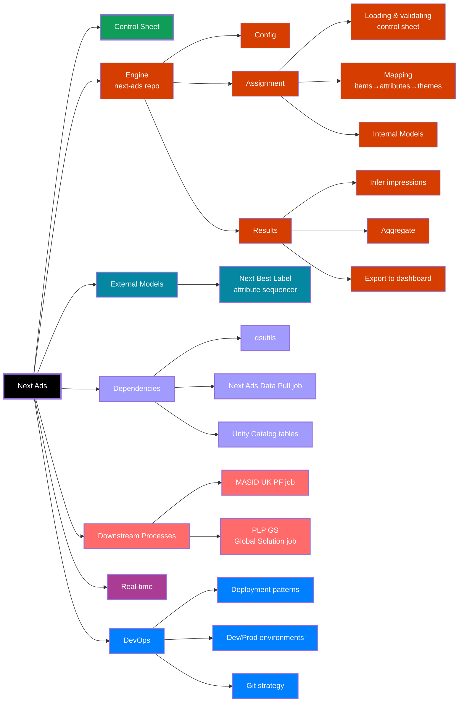

# Next Ads
> *Up to date as of v2.12*  

## Table of Contents

- [Introduction](#introduction)
- [Control Sheet](#control-sheet)
- [Engine](#engine) (next-ads repo)
    - Configuration
    - Assignment
        - Loading and validating the control sheet
        - Mapping items -> attributes -> themes
        - Internal Models
    - Results
        - Map ad/MASID assignments to page views and infer impressions and clicks
        - Aggregate and export results for the Next Ads 2.0 dashboard
- [External Models](#external-models)
    - Next Best Label
- [Dependencies](#dependencies)
    - dsutils
    - Next Ads Data Pull job
    - Unity Catalog tables
- [Downstream Processes](#downstream-processes)
    - MASID (UK PF) job
    - PLP GS (Global Solution) job
- [Real-Time](#real-time)
- [DevOps](#devops)
    - Deployment patterns
    - Dev/Prod "environments"
    - Git strategy
- [Testing, Monitoring and QA](#testing-monitoring-and-qa)  
</br>
- [_Appendix_](#appendix)
    - _Other useful resources_
    - _Diagram of Next Ads components_
    - _Examples of location configurations_


## Introduction
`next-ads` is a process that assigns relevant adverts to customers browsing the NEXT website. The code enclosed within this repo - often referred to as the "Next Ads engine" - uses predictive model scores to determine which ad is 'best' for each customer. The code within this repo also builds the control cells and results tables to measure performance of these personalised ads.

The model score input to the 'engine' can occur internally, which is suitable if the model is relatively lightweight, and built only/primarily for the purpose of being applied to ads. More complex modelling processes, or models that serve applications outside of ads are better suited to being set up as an external modelling process; the engine has the capability to either:
- Ingest a table of scores and perform the ranking within the engine (e.g propensity scores)
- Ingest a table of pre-ranked ads (e.g. Next Best Label rankings)


## Control Sheet
The control sheet [Google Sheet](https://docs.google.com/spreadsheets/d/1ZVZxP6pms8t0THY7BLoFHh4INQwfhxGWcuLEXsPX2JI/edit?gid=0#gid=0) is used to control the ads that are input into the engine. This includes details such as:
- The UniqueAdID for each ad
- Which pages/locations it is eligible for
- Metadata/labels pertaining to the algorithm (e.g. AlgoDivision, AudienceOnly, Theme)
- Metadata/labels pertaining to reporting (e.g. TradeDivison)
- Tags
> N.B. Tags are primarily used for reporting, but those prefaced with square brackets will be ignored by the reporting scripts and can therefore be used to inform the algorithm of something, e.g. `AdBrandName` tells the reporting to produce a cut of the results for all ads tagged as this, while something like `[TestGroup]NewAlgoOnly` could be used to make ads eligible for a specific variant of the algorithm only, and would not automatically generate a cut within the results.

### Responsibilities
- Trade/OSA (On-site Advertising) team: Ensuring input to the sheet is complete and accurate
- Data team: Managing the file itself (tabs, columns/table schema, input validation etc.)


## Engine
### Configuration
The engine is built around a central config that aims to make management of the algorithm much easier via:
- Providing a single source of truth for algorithm parameters (that is version controlled)
- Facilitating easy changes to the way ads are assigned accross each location
- Making data sources used throughout the process clear and visible

The idea is that parameters and resources are _defined_ in the config, and the code _applies_ what has been defined in the config.

#### Client-wise structure
Configs are kept as JSON in the `config/` directory, with the file being named after the client (e.g. `config/next_uk.json`). The intent is that this client-wise config structure will enable easier horizontal scaling of the process to other countries/TP clients in future, however the process of personalising ads is currently only active for Next UK. 

Tasks use `CLIENT` to control which config to retrieve and map parameterised process table names (check out the `['tables']['write']` section of the config).
`CLIENT` is inferred from the job name when run as a job (via the job parser in `dsutils.argparser`) but can be passed manually to the script when running interactively. 

#### Configuring assignments for locations
Examples of various assignment configurations for different locations have been provided in the Appendix.

### Assignments
The production assignments job is: [mktg_next_uk_nextads](https://adb-6188831950334199.19.azuredatabricks.net/jobs/851069914792732?o=6188831950334199)

This job:
- Reads, validates and loads the control sheet from google sheets into Databricks
- Parses and maps the item:attribute and attribute:theme lookups defined in the control sheet
- Performs inferencing using the lightweight model
- Applies the ad feedback loop (if enabled)
- Assigns ads to customers for each location, depending on model scores, config and customer cells
- Performs QA checks on the assignments and tables (e.g. Primary Key validity)

__NOTE__: This job is currently (2025-11-21) split into two jobs, with the control sheet load, item-theme parsing and lightweight modelling having been moved to [mktg_next_uk_nextads_load_control_sheet](https://adb-6188831950334199.19.azuredatabricks.net/jobs/35962584101213?o=6188831950334199). This is done to accommodate external modelling - i.e. the Next Best Label model - which takes several hours to run. The ad assignment and QA tasks remain in the original job.

#### Ad feedback loop
The ad feedback loop centres around the function `Assignment.get_ad_feedback_scores()`, which is applied to the base relevance scores provided by whichever internal or extenal model is being used. The function boosts/penalises ads in the final ranking based on the ad's current commercial performance. There is a [wiki page](https://dev.azure.com/Next-Technology/DirectoryMarketing.Personalisation/_wiki/wikis/Directory%20Marketing%20Platform/50090/Ad-Feedback-Loop) that runs through how the loop works, with a number of worked examples.

#### Assignments - Dev
There is an equivalent 'dev' assignments job [dev_mktg_next_uk_nextads](https://adb-6188831950334199.19.azuredatabricks.net/jobs/518755454712672?o=6188831950334199) that can be used for end-to-end testing. The differences between this and the 'prod' version of the job is that the 'dev' job is:
- Not scheduled
- Writes all data to copies of the process tables in the `ds_sandbox` schema instead of the `warehouse` schema (which contains the production tables). This happens automatically at the start of each task via the argument parser (`dsutils.argparser`), which defines the `job_env`, which in turn defines the write schema at the start of each task.

NOTE: When running scripts interactively, the process will default to 'dev' at runtime, via the same `dsutils.argparser`.

For more on the specifics of this dev/prod delineation, see the [DevOps](#devops) section below.

### Results
The production results job is: [mktg_next_uk_nextads_results](https://adb-6188831950334199.19.azuredatabricks.net/jobs/876285369413830?o=6188831950334199)

This job:
- Maps ad/MASID assignments to browsing data and infers impressions (Next Ads doesn't currently have a functional GA tagging setup)
- Aggregates the results and exports them to the [Next Ads 2.0](https://lookerstudio.google.com/u/0/reporting/f3dace74-791a-413d-b0e7-9d5a350b1c3a/page/p_0wnaekamod) dashboard

A high-level explanation of the results methodology and associated caveats are outlined in the following document: [Next Ads Dashboard - Diagrams for Interpretation](https://drive.google.com/file/d/1JEYtwoAYEdMHqSeTY7w3u5OwkJLx31eq/view). There is also a 'Guidance' page at the back of the Looker dashboard linked above that is intended to be a more stakeholder-friendly summary of the these diagrams.

#### Results - Dev
There is no 'dev' results job because:
- The process is less complex and requires fewer intermediate tables.
- Using upstream next ads 'dev' tables as inputs into the dev results is problematic as the dev tables typically contain incomplete historical assingments, which may not be based on the same treatment cells that are defined in prod. 
- Results can always be recalculated for dates in the past, therefore operational failures can be remediated after the fact.

### External Models
#### Next Best Label
The incumbent targeting algorithm is the 'Next Best Label' algorithm, written by Philippe Dagher (contractor, 2025).
- The code for this model is kept in the [next-ads-incrementality](https://dev.azure.com/Next-Technology/DirectoryMarketing.Personalisation/_git/next-ads-incrementality) repo
- The jobs assocaited with this model are defined in the `resources/` directory of the repo.
- The version that is currently deployed to production is v0.2.5
    - The repo employs release branches, so the production release can be found on the `release/v0.2.5` branch, not `main` (which contains subsequent developments)

#### Deprecated External Models
##### Propensity Models
There are various propensity modelling jobs external to Next Ads, but these no longer serve as inputs to the engine.

When they were utilised as the targeting scores for Next Ads:
- The "Models" column of the control sheet contained a reference to the model(s) to be used for targeting that ad
- The task `task_build_targeting_scores.py` would take these model references in the control sheet and generate the necessary scores using the view [next_uk_nextads_model_scores_latest](https://adb-6188831950334199.19.azuredatabricks.net/explore/data/marketingdata_prod/warehouse/next_uk_nextads_model_scores_latest?o=6188831950334199) (in which the column names match to the options in the control sheet) and output them to the `targeting_scores_latest` table, which would then be picked up by the `task_build_page.py` script for each location build.

##### ALS
The ALS model was part of the [mktg_next_ads_data_pull](https://adb-6188831950334199.19.azuredatabricks.net/jobs/201505739615907?o=6188831950334199) job, but it's output is no longer used.

> __NOTE__: The 'data pull' part of this job, which scrapes the items from the linked URL of each ad is still required by the Next Best Label model.

##### GRU
The GRU model ran via the [mktg_nextAds_UK_GRU](https://adb-6188831950334199.19.azuredatabricks.net/jobs/228092093223614?o=6188831950334199) job, but it's output is no longer used.

## Dependencies
### dsutils
- `dsutils` is an internal Python library that centralises and standardises a number of utility functions that are essential to Data Science projects.
- `next-ads` v2.12 is compatible with `dsutils` v0.1.8  
- The source code for the dsutils library can be found in the [dsutils repo](https://dev.azure.com/Next-Technology/DirectoryMarketing.Personalisation/_git/dsutils)

#### Installation
- A repository of `dsutils` verisons can be found at the following location in Volumes in Databricks:
[/Volumes/marketingdata_prod/ds_sandbox/ds_volume/dslib/dsutils/](https://adb-6188831950334199.19.azuredatabricks.net/explore/data/volumes/marketingdata_prod/ds_sandbox/ds_volume?o=6188831950334199&volumePath=%2FVolumes%2Fmarketingdata_prod%2Fds_sandbox%2Fds_volume%2Fdslib%2Fdsutils%2F)
    - The library can be specified for any Databricks job tasks using the libraries option and specifying the path above
- For local development, the `dsutils` .whl must be installed manually in your local development environment. To do this, download the relevant .whl file from the location in Volumes above, move it to the root directory of your local `next-ads` repo, activate the virtual environment and run:
```sh
pip install dsutils-0.1.8-py3-none-any.whl 
```

> NOTE: Adding this package to the artefacts repository in Azure DevOps would be a more robust solution to this package management and installation process, and would enable use of formal conventions (e.g. `pyproject.toml` files) to specify this library as a dependency of this project. However, given the current frequency of updates to the `dsutils` library, and relatively small user base, manually building and uploading to Volumes is an adequate and proportionate solution.

### Next Ads Data Pull
The [mktg_next_ads_data_pull](https://adb-6188831950334199.19.azuredatabricks.net/jobs/201505739615907?o=6188831950334199) job generates the following tables:
- [marketingdata_prod.warehouse.next_ads_sort_order_latest](https://adb-6188831950334199.19.azuredatabricks.net/explore/data/marketingdata_prod/warehouse/next_ads_sort_order_latest?o=6188831950334199)
- [marketingdata_prod.warehouse.next_ads_sort_order](https://adb-6188831950334199.19.azuredatabricks.net/explore/data/marketingdata_prod/warehouse/next_ads_sort_order?o=6188831950334199) (history of the above)

These tables contain the items 'associated' with each ad, i.e. the items presented in the PLP (with position informaton) that a user is directed to after clicking on the ad.

> NOTE: Not all ads will have assocated items, as not all links direct to a PLP (some may link to a landing page for a category or brand).

These tables served as inputs to various external models used for Next Ads:
- Next Best Label
- ALS (now deprecated)
- GRU (now deprecated)


### Unity Catalog tables
Numerous Unity Catalog tables serve as inputs to the engine's assignments and results process. For complete and up-to-date details of these tables, see the relevant config file (i.e. `config/next_uk.json` for the tables used as inputs to Next UK Next Ads).

## Downstream Processes
### MASID job
The assignments output by the engine are picked up by the MASID/preference framework job: [mktg_pf_masid_v2](https://adb-6188831950334199.19.azuredatabricks.net/jobs/753137801628438?o=6188831950334199) 

### Global Solution job
The Global Solution (GS) job: [mktg_nextads_plp_gs](https://adb-6188831950334199.19.azuredatabricks.net/jobs/1073338107374443?o=6188831950334199) picks up the ad-location-URL mapping from the Next Ads Control Sheet and passes assignmetns to the Global Solution, which is a new process for delivering these mappings to site (currently only used for PLP assignments, but planned to extend to other locations).

## Real-Time
TODO

## DevOps
### Deployment patterns
The project is structured as a Databricks Asset Bundle. The bundle is currently only utilised to deploy the code; the jobs referenced in the [Engine](#engine) section point to the relevant deployment, i.e. the prod job points to the code in the deployed 'prod' directory, and the 'dev' job points to the 'preprod' directory.

> NOTE: The dev target is a default target in Databricks Asset Bundles and is designed for users to be able to deploy code to their own user space, for experimentation and testing in a like-for-like way with a production deployment. The 'dev' next ads jobs are intended as a shared space, hence use of the preprod target for 'dev' jobs.

To deploy code to the 'prod' target (which is picked up by the prod jobs, i.e. those not prefixed with dev), checkout the version of the code you want to deploy, and run the following command:

```sh
databricks bundle deploy -t prod
```

To deploy code to the 'preprod' target (which is picked up by the dev jobs, i.e. those prefixed with 'dev_'), checkout the version of the code you want to deploy, and run the following command:
```sh
databricks bundle deploy -t preprod
```
Being able to deploy the code to the preprod target, and run the dev job enables like-for-like end-to-end testing before deploying the code to production.

The 'dev' jobs are manually kept in a like-for-like state with the 'prod' jobs above. A better solution to this would be to make the job definitions part of the Databricks Asset Bundle, and deploy them with the code. However, because the 'prod' job writes to tables in the `warehouse` schema, this requires the job to run as the correct Service Principal (SP), and users (understandably) cannot deploy Databricks Asset Bundles with jobs that run as the SP.

__RECOMMENDATION__
Set up job definitions as part of the Asset Bundle and a CICD pipeline to automatically deploy to prod (with run as SP) when certain conditions are met. This would ensure job parity between what was tested in dev and what is deployed to prod.

### Job environments
#### Job environments and schema mapping
>__IMPORTANT__
The scripts know that the job is running in 'dev' via the job name prefix. This is automatically parsed to the tasks within the job via the job parser in `dsutils.argparser`. Any job not starting with the 'dev_' prefix will be considered a 'prod' run.

This projects employs a `job_env:schema` convention for tables that the process can write to. As such `job_env` is a returned from of parsing the name of the Databricks workflow from which the code is being run.
- When the code is being run via a Databricks workflow that starts with "dev_*", or the code is being run interactively, the `job_env` is _dev_
- When the code is being run via a Databricks workflow that does not start with "dev_*", the `job_env` is _prod_

The config file contains the `job_env:schema` mapping. This maps the process' "write" tables - also specified in the config - to identical tables in different schemas depending on whether the process is running in the _dev_ or _prod_ `job_env`.

The process' "read" tables are always "prod" data, regardless of `job_env`, which enables the process to be run interactively, or end-to-end via the _dev_ workflow in a way that is maximally identical to the _prod_ workflow, enabling more thorough development and testing before changes are "productionised".

### Environment and Dependency Management
Users can optionally use either the built in `venv` module or Poetry for environment and dependency management of this project. Guidance on how to install Poetry and install project dependencies into a local environment can be found on the [Poetry website](https://python-poetry.org/).
> __Note__  
> Users should be sure to use Poetry v2.*, as the structure of the `pyproject.toml` changed between versions 1 and 2.

</br>

#### Table/Schema definitions (`sql/` directory)

The `sql/` directory contains parameterised SQL queries for tables. If tables are added to the process, their definition should be added to this directory. The parameterised nature of these table definitions enables identical tables to be created in multiple schemas (useful for pseudo dev/prod mirroring, i.e. having an identical table schema in dev and prod).

`{schema}` in these table definitions is designed to follow the [job_env to schema mapping pattern](#job-environments-and-schema-mapping).

#### Primary Keys
Primary keys are specified in table definitions. While primary keys are not currently enforced in Unity Catalog (i.e. if you try to insert rows that result in duplicates or null values in the primary key columns, the insertion will not be rejected), labelling the primary key columns serves two benefits:
1. It tells the user what should be true about the table (i.e. these columns are unique (in combination, in the case of multiple columns), and do not contain null values).
2. It enables programmatic validation of the primary key constraint for all of the projects tables, guaranteeing that these conditions are met and therefore the integrity of the processes tables.

### Git Strategy
- Two approvers of all PRs to main branch (including at least one repo owner: currently Tom Corke and Ted Taylor)
- New versions are tagged with an incremented version number after squashing to main, before deployment


### Testing, Monitoring and QA
#### Unit and Integration Tests
Existing tests can be contained in `tests/`. These are largely designed to test things like the existence of tables and the validity of the supplied config file(s), such that necessary schemas and implicit requirements of the config structure can be checked before running end-to-end tests.

These tests can be run using `pytest` directly,
```bash
python -m pytest tests
```
or via the integrated test runner in VS Code (see __View: Show Testing__ and __Test: Run All Tests__ in the VS Code command palette).

</br>  

#### Webhook warning messages
Various webhook messages are triggered by certain conditions throughout the engine when there is an issue, but not one that warrants failing the run. Details of these webhooks can be found at the "webhooks" entry in the config.

<br/>

## Appendix
### Other useful resources
[Next Ads Whitepaper - August 2025](https://docs.google.com/document/d/1Bxve39oUx_6hdqVHPIdkW5lhKERalN8KGAmh5zk6Kcs/edit?tab=t.0#heading=h.ormk6jw0wrj6)  
Paper provides an overview of how the Next Ads system worked at the time. It sought to define clearer ownership and responsibilities across Next Ads, and highlighted a number of strategic decisions that needed to be made in order to progress the project and align stakeholders, trade teams and data teams.

### Diagram of Next Ads components


### Examples of location configurations
#### Example 1 - Typical location config
- Configure Shopping Bag (SB1) assignments.
- SB1 relates to "SB_slot_1" in the `uk_pf` tables
- Basic targeting is performed within AlgoDivision - a customer labelled as 'Basic' under `ShoppingBagTest1` in the `customer_cells_latest` table will be assigned a random ad from within their `AlgoDivision` (see `customer_cells_latest` for `AlgoDivision` assignments).
- For customers who's `ShoppingBagTest1` equals ('eq'\*) 'Basic' in the `customer_cells_latest` table, assign them the Ad that is in the column "UniqueAdIDBasic" in the `assignments_latest` table.
- Assign the equivalent for "Best"  
> Note: This when-then dictionary structure is parsed into the equivalent "case when" SQL statement via `dsutils.etl.chain_when_thens`. The dictionary structure is applied in sequence, therefore mappings entered fist in the dictionary will be applied first.

\*See [Standard operators as functions](https://docs.python.org/3/library/operator.html) in Python 

```json
"locations": {
    ...
    "SB1": {
            "pf_col": "SB_slot_1",
            "basic_within": "AlgoDivision",
            "map": [
                {
                    "when": [
                        {
                            "col": "ShoppingBagTest1",
                            "op": "eq",
                            "val": "Basic"
                        }
                    ],
                    "then": {"col": "UniqueAdIDBasic"}
                },
                {
                    "when": [
                        {
                            "col": "ShoppingBagTest1",
                            "op": "eq",
                            "val": "Best"
                        }
                    ],
                    "then": {"col": "UniqueAdIDBest"}
                }
            ]
        },
    ...
}
```

#### Example 2 - Removing 'within division' basic constraint
- Configure Womens Landing Page (LP1) assignments.
- LP1 relates to "LP_slot_1" in the `uk_pf` tables
- Basic targeting is performed 'globally' - a customer labelled as 'Basic' under `ShoppingBagTest1` in the `customer_cells_latest` table will be assigned a random ad from those that are eligible for LP1, irrespective of AlgoDivision (this is common for Landing Pages as the eligbile ads are typically from a single division anyway)
- The same Basic/Best assignment as example 1 is performed
> All locations now use `ShoppingBag1` for "Basic" and "Best" treatment groupings; previously there were separate assignments for different page groups (e.g. Homepage, Landing Pages...) however this opened the possibility for customers to receive different algorithms on different pages. This was deemed unnecessary and likely to cloud measurement, therefore a single field was used to make site-wide treatment consistent. 

```json
"locations": {
    ...
    "LP1": {
            "pf_col": "LP_slot_1",
            "basic_within": "global",
            "map": [
                {
                    "when": [
                        {"col": "ShoppingBagTest1", "op": "eq", "val": "Basic"}
                    ],
                    "then": {"col": "UniqueAdIDBasic"}
                },
                {
                    "when": [
                        {"col": "ShoppingBagTest1", "op": "eq", "val": "Best"}
                    ],
                    "then": {"col": "UniqueAdIDBest"}
                }
            ]
        },
    ...
}
```

#### Example 3 - Mapping in pre-defined audiences
This example is the same as the Example 1, with an additional pre-defined audience assignment taking precedence.

- To pass a pre-defined audience to the engine the table must be specified as a ["tables"]["read"] entry in the config.
- WARNING: This table must contain two columns (one with account number and one with the label/group given to the account) and must not contain duplicates, i.e. its primary key should be the account and label columns.

```json
    "tables": {
        "read": {
            ...
            "video_audiences": "marketingdata_prod.ds_sandbox.ads_video_groups_2024",
            ...
        },
```

- The table key must also be specified in the ["transient_cells"]["Audiences"] entry in the config, with a refernces to the columns that contain the customer's account number and label (i.e. in the example below the column "test_group" would contain either "Video Ad Test - A" or "Video Ad Test - B" for each customer).

```json
    "transient_cells": {
        ...
        "Audiences": [
                "video_audiences": {
                    "account_col": "account_number",
                    "label_col": "test_group"
                }
            ]
        }
    }

```
> NOTE: Multiple audiences can be passed to the algorithm at once, although this is not recommended as customers can only belong to one audience. Customers will be assigned to audiences in the order that they are provided, so in the example above, if another audience of "seasons" customers was provided subsequently in the list, only customers not assigned a "video_audiences" label would be avialble for "seasons" audience labels.

- In terms of the subsequent location mapping, these audiences end up in the `Audience` column in the `customer_cells_latest` table

- If a customer is in the "Video Ad Test - A/B" in this `Audience` column, and in `ShoppingBagTest1` 'Basic' or 'Best', the when-then mapping is parsed in sequence, so entries appearing first take precedence (in this case the Video Test customers are assigned first).
- __IMPORTANT__
    - Note that the key in the then clause is "lit", not "col". Specifying "lit" as the key means that the value is assigned as a literal (i.e. whatever string is provided should be the ad associated with this audience). When "col" is specified, it takes the value from the column in the `assignments_latest` table of the same name (i.e. one of the algorithmically assigned columns).
    - When assigning ads using predefined audiences the `AudienceOnly` column in the control sheet should likely also be selected.
        - If `AudienceOnly` _is_ selected for an ad, it will be removed from algorithmic targeting, and can __only be assigned to customers via pre-defined audiences__, as per the example below. This is useful if you want to guarantee volumes, or hard-code ads to certain customers based on some external targeting, but is limited to 1:1 customer-to-ad  mappings.
        - If `AudienceOnly` _wasn't_ selected for "VideoAdA" in the control sheet, __it would be eligible for algorithmic targeting too__. Therefore if could be assigned to customers outside of the "Video Ad Test - A" audience, which may or may not be desired behaviour (it could be used to force a minimum assignment volume for an ad, but this is not recommended).  
 

```json
"locations": {
    ...
    "SB1": {
            "pf_col": "SB_slot_1",
            "basic_within": "AlgoDivision",
            "map": [
                {
                    "when": [
                        {
                            "col": "Audience",
                            "op": "eq",
                            "val": "Vido Ad Test - A"
                        }
                    ],
                    "then": {"lit": "P123_C123_VideoAdA_Womens"},
                    "when": [
                        {
                            "col": "Audience",
                            "op": "eq",
                            "val": "Vido Ad Test - B"
                        }
                    ],
                    "then": {"lit": "P123_C123_VideoAdB_Womens"},
                    "when": [
                        {
                            "col": "ShoppingBagTest1",
                            "op": "eq",
                            "val": "Basic"
                        }
                    ],
                    "then": {"col": "UniqueAdIDBasic"}
                },
                {
                    "when": [
                        {
                            "col": "ShoppingBagTest1",
                            "op": "eq",
                            "val": "Best"
                        }
                    ],
                    "then": {"col": "UniqueAdIDBest"}
                }
            ]
        },
    ...
}
```

#### Example 4 - Multiple when conditions and algo A/B test
This is the same a example 1 with the addition of setting up an A/B test for two algos.
- If Algo A is set up in the `task_build_page.py` script to output assignments to the "UniqueAdIDBest" column in the `assignments_latest` table, and Algo B is set up in the same script to output to the "UniqueAdIDBestChallenger" column of the same table, splitting Shopping Bag assignments 50/50 between these two algorithms can be achieved as shown below.
- NOTE: The list of when conditions are applied as a series of operations joined by logical `&` operators, therefore the below config will assign whatever ad is in the "UniqueAdIDBest" column of the `assignments_latest` table to any customer where `col("ShoppingBagTest1") == "Best"`  AND `col("AdHocABTest1") == "A"` (in the `customer_cells_latest` table) evaluate to `True`.

> There are multiple pre-defined random AB splits in the `customer_cells_latest` table; these should be rotated to avoid the same random splits being applied repeatedly to successive tests.

```json
"locations": {
    ...
    "SB1": {
            "pf_col": "SB_slot_1",
            "basic_within": "AlgoDivision",
            "map": [
                {
                    "when": [
                        {
                            "col": "ShoppingBagTest1",
                            "op": "eq",
                            "val": "Basic"
                        }
                    ],
                    "then": {"col": "UniqueAdIDBasic"}
                },
                {
                    "when": [
                        {
                            "col": "ShoppingBagTest1",
                            "op": "eq",
                            "val": "Best"
                        },
                        {
                            "col": "AdHocABTest1",
                            "op": "eq",
                            "val": "A"
                        }
                    ],
                    "then": {"col": "UniqueAdIDBest"}
                },
                {
                    "when": [
                        {
                            "col": "ShoppingBagTest1",
                            "op": "eq",
                            "val": "Best"
                        },
                        {
                            "col": "AdHocABTest1",
                            "op": "eq",
                            "val": "B"
                        }
                    ],
                    "then": {"col": "UniqueAdIDBestChallenger"}
                }
            ]
        },
    ...
}
```


### Attribute and Theme Item-Mapping
The following scripts have been created to parse and create the following mappings:
- `item:attribute` (one-to-many)
- `theme:attribute` (one-to-many)
- `item:theme` (one-to-many*)

* one-to-one can be achieved by using ranking mode `adtype-themefreq` and selecting the top ranked theme per item.

#### `task_parse_attributes.py`

Purpose:
- Parse and clean selected attributes from `warehouse.product_catalog`, and produce a mapping of `item:attribute`.
    - The attributes to parse are specified in the `"attributes"` config key, along with other parameters (e.g. lookback period, frequency cutoffs based on item counts, or counts of orders featuring those items).

Process:
- An "attribute set" is a fixed set of attributes and values to be included in all downstream mappings and are stored in the `attribute_set[_latest]` table.
    - To invoke creating a new "attribute "set", `task_parse_attributes.py` must be run with the `--set` flag.
- Running without the `--set` flag will take the latest "attribute set" and and apply this mapping to the items (`pid`) in `warehouse.product_catalog` (going as far back as the lookback period), outputting the item-attribute mapping to `item_attributes[_latest]` table.

#### `task_parse_theme_mapping.py`

Purpose:
- Parse and clean theme mapping defined by trade in the Next Ads Control Sheet, and product a mapping of `item:theme`.

Process:
- A "theme mapping" is a fixed set of themes and its corresponding attributes. This is defined in the Next Ads Control Sheet Google Sheet (see `"theme_mapping"` config key for details).
    - To invoke reading and setting a new theme mapping, use the `--set` flag. This will cause the script to output a new theme mapping to the `theme_mappping[_latest]` table.
- The script then maps themes to items and outputs to `item_themes[_latest]`, via the cleaned attributes in the `item_attributes_latest` table.
- A given item might have multiple themes, as such, themes are ranked within-item. There are currently two options for ranking:
    - `--theme-ranking-mode adtype-themefreq` results in the themes being ranked by AdType (column specified in the theme mapping tab of the Next Ads Control Sheet Google Sheet) followed by theme frequency. Ranking by theme frequency means that the theme with the smaller number of matching items will take precedence, the idea being that this will naturally rank niche themes higher, resulting in less overall convergence around the most common themes.
    - `--theme-ranking-mode adtype-themetype` results in the themes being ranked by AdType, then ThemeType, which are both specified manually by the trade team in the theme mapping tab of the Next Ads Control Sheet Google Sheet.

#### `task_markov_chain.py`

Purpose:
- Lightweight directional graph of theme associations.
- Simply model that models each theme as a 'node' or 'state' and the probability of buying one theme after another as directional state transition or 'edge weights'.
- The probability of transferring from one theme to another is calculated via global frequencies of transitioning from one state to another, i.e. customer A buys 'womens jeans', and 'womens casualwear' is in their next basket, this would be a count for the 'womens jeans' to 'womens casualwear' transition. These frequencies are calculated globally, and form theme transition probabilities. Fractional counting is utilised to account for the fact that multiple themes may exist per basket.

Process:
- To "train" the markov chain, run the script with the `--train` flag. This will take baskets from the specified history period and calculate these theme transition probabilities, outputting these probabilities to the `theme_transitions[_latest]` table.
- Running the script without the `--train` flag, runs it in 'scoring' mode, which looks at the customer's last N baskets (defined by `--score-last-n-baskets`). This will output "next theme scores" for each customer into the `next_theme_scores[_latest]` table, featuring a global next theme probability and the raw score rebased to this global average for each customer.

Diagnostics:
- The basket item and theme history along with predictions can be obtained from this script by running it with the `--test-account` argument (if the account of interest was ABC123, you would pass `--test-account ABC123`).

#### WIP - Greedy Assignment to give minimum volume to niche themes
- A function `Assignmet.greedy_batch_assignment()` is in development. The idea is that this would rank themes from least to most common and assignment of N customers would occur for themes sequentially. This would prevent customers with high scores across all themes being assigned the most common theme, and guarantee niche themes a minimum volume. Due to its sequential nature, this greedy assignment approach is currently slow, but offers a pragmatic solution to minimum volumes, when full optimisation (i.e. MIP or CP) might be overkill due to its computational expense.


#### Summary: Attribute and Theme parsing

`python task_parse_attributes.py --set` refreshes `{schema}.{client}_nextads_attribute_set[_latest]`  
`python task_parse_attributes.py` refreshes `{schema}.{client}_nextads_item_attributes[_latest]`  

`python task_parse_theme_mapping.py --set` refreshes `{schema}.{client}_nextads_theme_mapping[_latest]` and `{schema}.{client}_nextads_item_themes[_latest]`  
`python task_parse_theme_mapping.py` refreshes `{schema}.{client}_nextads_item_themes[_latest]` (N.B. this refresh will respect any changes to the theme hierarchy in the Next Ads Control Sheet Google Sheet)  

`python task_build_markov_chain.py --train` refreshes `{schema}.{client}_nextads_theme_transitions[_latest]`  
`python task_build_markov_chain.py` refreshes `{schema}.{client}_nextads_item_next_theme_scores[_latest]`  
`python task_build_markov_chain.py --test-account ########` logs diagnostics for that account to the console  
