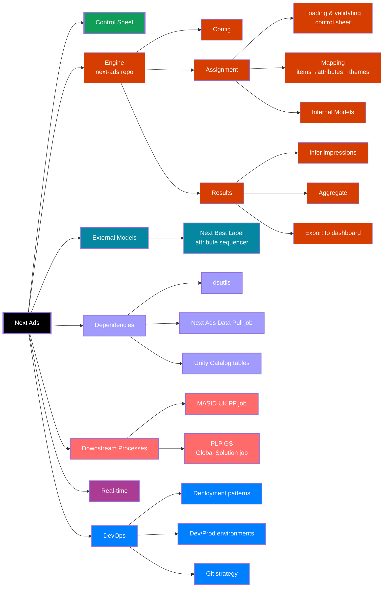

# Next Ads
> *Up to date as of v2.15*  

## Table of Contents

- [Introduction](#introduction)
- [Control Sheet](#control-sheet)
- [Engine](#engine) (next-ads repo)
    - Configuration
    - Assignment
        - Loading and validating the control sheet
        - Mapping items -> attributes -> themes
        - Internal Models
    - Results
        - Map ad/MASID assignments to page views and infer impressions and clicks
        - Aggregate and export results for the Next Ads 2.0 dashboard
        - Refreshing the control group
- [External Models](#external-models)
    - Next Best Label
- [Dependencies](#dependencies)
    - dsutils
    - Next Ads Data Pull job
    - Unity Catalog tables
- [Downstream Processes](#downstream-processes)
    - MASID (UK PF) job
    - PLP GS (Global Solution) job
- [Real-Time](#real-time)
- [DevOps](#devops)
    - Deployment patterns
    - Git strategy
- [Testing, Monitoring and QA](#testing-monitoring-and-qa)  
</br>
- [_Appendix_](#appendix)
    - _Other useful resources_
    - _Diagram of Next Ads components_
    - _Examples of location configurations_


## Introduction
`next-ads` is a process that assigns relevant adverts to customers browsing the NEXT website. The code enclosed within this repo uses predictive model scores to determine which ad is 'best' for each customer. There are also processes to build control cells of customers, results tables to measure performance, and supporting processes for real time ad applications.

The model score input to the 'engine' can occur internally, which is suitable if the model is relatively lightweight, and built only/primarily for the purpose of being applied to ads. More complex modelling processes, or models that serve applications outside of ads are better suited to being set up as an external modelling process; the engine has the capability to either:
- Ingest a table of scores and perform the ranking within the engine (e.g propensity scores)
- Ingest a table of pre-ranked ads (e.g. Next Best Label rankings)


## Control Sheet
The control sheet [Google Sheet](https://docs.google.com/spreadsheets/d/1ZVZxP6pms8t0THY7BLoFHh4INQwfhxGWcuLEXsPX2JI/edit?gid=0#gid=0) is used to control the ads that are input into the engine. This includes details such as:
- The UniqueAdID for each ad
- Which pages/locations it is eligible for
- Metadata/labels pertaining to the algorithm (e.g. AlgoDivision, AudienceOnly, Theme)
- Metadata/labels pertaining to reporting (e.g. TradeDivison)
- Tags
> N.B. Tags are primarily used for reporting, however those starting with an opening square bracket will be ignored by the tag-specific aggregates in the reporting scripts, which enables them to be used to inform the algorithm of something. For example, `AdBrandName` tells the reporting to produce a cut of the results for all ads with this tag, whereas `[TestGroup]NewAlgoOnly` could be used to specify ads that are eligible for the 'new algorithm' only (N.B. filtering on such a tag must be configured in the 'build page' task). This might be useful if A/B testing a new algorithm that is able to target types of ad that the incumbent algorithm is not designed to, for example.

### Responsibilities
- Trade/OSA (On-site Advertising) team: Ensuring input to the sheet is complete and accurate
- Data team: Managing the file itself (tabs, columns/table schema, input validation etc.)


## Engine
### Configuration
The engine is built around a central config that aims to make management of the algorithm much easier via:
- Providing a single source of truth for algorithm parameters (that is version controlled)
- Facilitating easy changes to the way ads are assigned accross each location
- Making data sources used throughout the process clear and visible

The idea is that parameters and resources are _defined_ in the config, and the code _applies_ what has been defined in the config.

#### Client-wise structure
Client configs are kept as JSON in `configs/clients/`, with the file being named after the client (e.g. `configs/clients/next_uk.json`). The intent is that this client-wise config structure will enable easier horizontal scaling of the process to other countries/TP clients in future, however the process of personalising ads is currently only active for Next UK.

It is worth noting that the current structure is predicated on the idea that the control sheet and all tables will be mirrored for each new client. This may be feasible for a few clients, however consideration should be given to scaling beyond this, as managing such large numbers of tables may become difficult.

Tasks use `CLIENT` to control which config to retrieve and map parameterised process table names (see the `['tables']['write']` section of the config).
Prior to 1st Jan 2026, `CLIENT` was inferred from the job name when run as a job (via the job parser in `dsutils.argparser`). Post 1st Jan 2026, client was no longer inferred from the job name, and must be passed explicitly to job tasks (this change was made as part of restructuring the project as a Databricks Asset Bundle). When running the code interactively, `CLIENT` will default to 'next_uk', but other clients can be specified by the user.

#### Configuring assignments for locations
Examples of various assignment configurations for different locations have been provided in the Appendix.

### Assignments
The production assignments job is: [mktg_next_uk_nextads_cicd](https://adb-6188831950334199.19.azuredatabricks.net/jobs/423717571222490?o=6188831950334199) and is defined in the `resources/jobs/` directory of this repo, which is included in the Asset Bundle.

This job:
- Reads, validates and loads the control sheet from google sheets into Databricks
- Parses and maps the item:attribute and attribute:theme lookups defined in the control sheet
- Performs inferencing using the lightweight model
- Applies the ad feedback loop (if enabled)
- Assigns ads to customers for each location, depending on model scores, config and customer cells
- Performs QA checks on the assignments and tables (e.g. Primary Key validity)

#### Time constraints
The final `assignments` and `assignments_latest` tables **must be written to before midnight** (i.e. all iterations of the `build_page` task must finish before 00:00). This is because the write functions that are currently implemented (using `dsutils`) append a `rundate` column that reflects the date of the write operation.

If the `assignments` tables are populated after midnight, the `rundate` will be the following date, which will cause the assignments data to be out of sync when joining to the browsing data during results processing. The results assume `SessionDate` (browsing data) aligns with `rundate` from the `assignments` table *plus one day*

There is a check in the QA script that will raise an assertion error if there are multiple dates in the `assignments_latest` table (this also flags instances of the `assignments_latest` table not having been cleared properly from the previous day's run). Multiple dates in this table would therefore flag the case where the `build_page` task has bridged midnight (i.e. some locations were written with `rundate` as one date, and other locations with `rundate` as the next date). It is important to note that there are currently no checks to flag severe overrunning of an upstream task, i.e. where all locations are written to the assignments table after midnight.

At the time of writing (Jan 2026), the [mktg_next_uk_nextads_cicd](https://adb-6188831950334199.19.azuredatabricks.net/jobs/423717571222490?o=6188831950334199) job runs from 6pm-8:30pm, therefore comfortably finishing before midnight, but it is important to be aware of this requirement.   

#### "Switching off" ad assignments
To effectively "switch off" ad assignments, the following steps should be performed.
1. Pause the schedule of the `mktg_next_uk_nextads_cicd` job - this will stop assignments from being updated.
2. Pausing the job will mean that assignments in customers' MASID ad slots will stop updating, but without any additional action they will stay as the assignments from the last time the job was run. The easiest way to set all ad-related MASID assignments to `_Z` (which means no ad will show), is to truncate `warehouse.next_uk_nextads_assignments_latest`, which can be done conveniently by running the associated task manually in the `mktg_next_uk_nextads_cicd` job. This table being empty means that the `mktg_pf_masid_v2` job will have no "current" ads to pick up for any customer for any location, and will default to `_Z` assignments for all ad slots.  

To restart assignments, simply unpause the `mktg_next_uk_nextads_cicd` job.

#### Ad feedback loop
The ad feedback loop centres around the function `Assignment.get_ad_feedback_scores()`, which is applied to the base relevance scores provided by whichever internal or extenal model is being used. The function boosts/penalises ads in the final ranking based on the ad's current commercial performance. There is a [wiki page](https://dev.azure.com/Next-Technology/DirectoryMarketing.Personalisation/_wiki/wikis/Directory%20Marketing%20Platform/50090/Ad-Feedback-Loop) that runs through how the loop works, with a number of worked examples.

#### Deploying the jobs to different bundle targets
The next-ads jobs can be deployed to different targets, i.e. DEV/PREPROD/PROD (see `databricks.yml`), using the [next-uk-nextads-ci-cd](https://dev.azure.com/Next-Technology/DirectoryMarketing.Personalisation/_build?definitionId=23267) pipeline, which is defined in the `azure-pipelines.yml` file in this repo. It is also possible to deploy to non-prod targets using the Databricks CLI. These non-prod deployments are very useful for end-to-end testing of the next-ads proces in a way that does not affect prod. This is achieved by parameterised schema mapping, where deployed prod runs will write data to `warehouse`, and non-prod deployments will automatically switch to writing to the `ds_sandbox` schema. `JOB_ENV` is defined at the start of each script, which in turn dictates the write schema, as mapped in the associated `config/*.json` file.

NOTE: When running scripts interactively, the process will default to 'dev' at runtime, via the same `dsutils.argparser`.

For more on the specifics of this dev/prod delineation, see the [DevOps](#devops) section below.

### Results
The production results job is: [mktg_next_uk_nextads_results_cicd](https://adb-6188831950334199.19.azuredatabricks.net/jobs/350665639525302?o=6188831950334199) and is defined in the `resources/jobs/` directory of this repo, which is included in the Asset Bundle.

This job:
- Maps ad/MASID assignments to browsing data and infers impressions (Next Ads doesn't currently have a functional GA tagging setup)
- Aggregates the results and exports them to the [Next Ads 2.0](https://lookerstudio.google.com/u/0/reporting/f3dace74-791a-413d-b0e7-9d5a350b1c3a/page/p_0wnaekamod) dashboard

A high-level explanation of the results methodology and associated caveats are outlined in the following document: [Next Ads Dashboard - Diagrams for Interpretation](https://drive.google.com/file/d/1JEYtwoAYEdMHqSeTY7w3u5OwkJLx31eq/view). There is also a 'Guidance' page at the back of the Looker dashboard linked above that is intended to be a more stakeholder-friendly summary of the these diagrams.

#### Refreshing the control group
The "fallow" (long-term) control group for ads is refreshed periodically as part of good measurement practice. Refreshing the control group can be invoked by passing today's date (fmt: "YYYY-mm-dd") to the named argument `--refresh_control_date` of the `assign_customer_cells.py` script. For example, to refresh the control group on 8th Jan 2026:

```sh
python scripts/assign_customer_cells.py --refresh_control_date "2026-01-08"
```

- When refreshing the control group is invoked, the current control cell assignments (`fixed_cells_latest` table) are archived to the `fixed_cells_history` table, the `fixed_cells_latest` table is truncated, and all customers are assigned new fixed cells. Given that refreshing the control group enables customers to be in and out of the control group at different points in time, it is important to capture this so that we know which cells a given customer was in on a given date (i.e. was a customer in the control group or not). This enables us to retain the ability to recalculate/backcalculate results, if necessary. 
- When refreshing the control group is *not* invoked, the `fixed_cells_latest` table behaves in an append-only fashion. If a customer has already been assigned fixed cells, they will be ingored by the script. New customers will be assigned new cells and appended to the `fixed_cells_latest` table.

> IMPORTANT: The control group should not be refreshed while tests are active.

#### Forcing staff customers into the test group (and excluding them from the results)

Starting 1st Jan 2026, all staff customers (identified by `warehouse.svoccust_hist.specialaccountindicator == 'S'`) are automatically forced into the 'Ads' (i.e. not the fallow control), 'Best' and 'Challenger' fixed cells to ensure that all those working on the ads project can see ads on site. This blanket rule obviously applies to many more staff customers than just those that are directly involved in the project, but is much cleaner and easier to maintain than managing smaller bespoke lists of staff that work directly on ads.

Forcing staff customers to not be in the control group would bias results without correction (staff are typically higher-value customers, and would not be represented in the control group). Therefore customers marked as staff during the `scripts/assign_customer_cells.py` script are subsequently excluded from results processing in `scripts/results.py`.

It should be noted that staff status is captured at the time the customer is 'new' to the `assign_customer_cells.py` script, so this customer status reflects that a customer "has been staff" moreso than this customer "is staff". If a customer was staff and is no longer staff, this change in staff status will be reflected when the control group is next refreshed. Additionally, when back calculating results, ensuring that the correct version of `fixed_cells_latest` or `fixed_cells_history` is used is important for ensuring the integrity of this staff customer measurement exclusion.

### External Models
There are currently no 'external models' being utilised for ads. 

#### Deprecated External Models
##### Propensity Models
There are various propensity modelling jobs external to Next Ads, but these no longer serve as inputs to the engine.

When they were utilised as the targeting scores for Next Ads:
- The "Models" column of the control sheet contained a reference to the model(s) to be used for targeting that ad
- The task `scripts/build_targeting_scores.py` would take these model references in the control sheet and generate the necessary scores using the view [next_uk_nextads_model_scores_latest](https://adb-6188831950334199.19.azuredatabricks.net/explore/data/marketingdata_prod/warehouse/next_uk_nextads_model_scores_latest?o=6188831950334199) (in which the column names match to the options in the control sheet) and output them to the `targeting_scores_latest` table, which would then be picked up by the `scripts/build_page.py` script for each location build.

##### ALS
The ALS model was part of the [mktg_next_ads_data_pull](https://adb-6188831950334199.19.azuredatabricks.net/jobs/201505739615907?o=6188831950334199) job, but it's output is no longer used.

> __NOTE__: The 'data pull' part of this job, which scrapes the items from the linked URL of each ad is still required by the Next Best Label model.

##### GRU
The GRU model ran via the [mktg_nextAds_UK_GRU](https://adb-6188831950334199.19.azuredatabricks.net/jobs/228092093223614?o=6188831950334199) job, but it's output is no longer used.

#### Next Best Label
The 'Next Best Label' algorithm (also known as the 'attribute sequencer'), was written by Philippe Dagher (contractor, 2025).
- The code for this model is kept in the [next-ads-incrementality](https://dev.azure.com/Next-Technology/DirectoryMarketing.Personalisation/_git/next-ads-incrementality) repo
- The jobs assocaited with this model are defined in the `resources/` directory of that repo.
- The version that was last deployed to production was v0.2.5
    - The repo employs release branches, so the production release can be found on the `release/v0.2.5` branch, not `main` (which contains subsequent developments)
- The model was decommissioned in Dec 2025.

## Dependencies
### dsutils
- `dsutils` is an internal Python library that centralises and standardises a number of utility functions essential to Data Science projects.
- `next-ads` v2.12 is compatible with `dsutils` v0.1.8  
- Source code and documentation for the `dsutils` library can be found in the [dsutils repo](https://dev.azure.com/Next-Technology/DirectoryMarketing.Personalisation/_git/dsutils)

### Next Ads Data Pull
The [mktg_next_ads_data_pull](https://adb-6188831950334199.19.azuredatabricks.net/jobs/201505739615907?o=6188831950334199) job generates the following tables:
- [marketingdata_prod.warehouse.next_ads_sort_order_latest](https://adb-6188831950334199.19.azuredatabricks.net/explore/data/marketingdata_prod/warehouse/next_ads_sort_order_latest?o=6188831950334199)
- [marketingdata_prod.warehouse.next_ads_sort_order](https://adb-6188831950334199.19.azuredatabricks.net/explore/data/marketingdata_prod/warehouse/next_ads_sort_order?o=6188831950334199) (history of the above)

These tables contain the items 'associated' with each ad, i.e. the items presented in the PLP (with position informaton) that a user is directed to after clicking on the ad.

> NOTE: Not all ads will have assocated items, as not all links direct to a PLP (some may link to a landing page for a category or brand).

These tables served as inputs to various external models used for Next Ads:
- Next Best Label
- ALS (now deprecated)
- GRU (now deprecated)


### Unity Catalog tables
Numerous Unity Catalog tables serve as inputs to the engine's assignments and results process. For complete and up-to-date details of these tables, see the relevant config file (i.e. `config/*.json` for the tables used as inputs to Next UK Next Ads).

## Downstream Processes
### MASID job
The assignments output by the engine are picked up by the MASID/preference framework job: [mktg_pf_masid_v2](https://adb-6188831950334199.19.azuredatabricks.net/jobs/753137801628438?o=6188831950334199) 

### Global Solution job
The Global Solution (GS) job: [mktg_nextads_plp_gs](https://adb-6188831950334199.19.azuredatabricks.net/jobs/1073338107374443?o=6188831950334199) picks up the ad-location-URL mapping from the Next Ads Control Sheet and passes assignments to the Global Solution, which is a new process for delivering these mappings to site (currently only used for PLP assignments, but planned to extend to other locations).

## Real-Time

The Next Ads real-time personalisation system extends the batch ads recommendation process (known as the Next-Ads engine) through tracking in-session actions to update ad recommendations in real-time.

### Overview: Real-Time Unknown vs Known

**Real-Time Unknown (Live)** provides ad recommendations to users who have accepted cookies but are not logged into an account. Non-logged-in sessions currently account for around 55% of all sessions (see split below), so even showing ads to these users (irrespective of personalisation quality) is considered high value.

```
Known/unknown sessions split (180 days)
+---------+-----------+
|pct_known|pct_unknown|
+---------+-----------+
|    43.84|      56.16|
+---------+-----------+
```

The initial implementation of real-time unknown (Part 1) was primarily a test of the viability of updating real-time MASID values and uses a viewed-bought lift approach. The process looks at in-stream session-level views and joins on the `warehouse.ir_vb` table (Intel Recs viewed-bought relationships). The bought-side items from this relationship are joined back to the `warehouse.next_ads_sort_order_latest` table (created in the `mktg_next_ads_data_pull` job). For each location, the ad with the bought-side item showing the maximum lift is selected.


**Real-Time Part 3: Known Customers** (in development) operates on live sessions where the user is logged into an account and has accepted cookies. Real-time known can be considered an extension of batch recommendations, as it applies to the same customer groups but adjusts recommendations based on real-time session actions.

Three solutions for real-time known were initially proposed: 
1. Comparing batch customer-ad-theme affinity embeddings with real-time session-level affinities
2. Re-ordering pre-computed batch recommendations using session actions ("smart shuffling")
3. Bloomreach scenarios conditional logic approach to tweaking live MASID values

Solution 2 ("smart shuffling") was chosen as the most pragmatic approach to getting something live for real-time, while retaining flexibility to adapt to new requirements. This approach boosts theme scores based on in-session views and add-to-bag actions, then re-ranks batch recommendations accordingly. See `realtime-p3.py` for the current implementation.

### Databricks Structured Streaming

Structured streaming jobs are unlike standard Databricks jobs - they are continuously running processes which use micro-batches to divide live streaming data into manageable chunks that can then go through a recommendation process. Processing time is an important factor to consider when developing streaming processes; if it takes 2 minutes to process each batch of live sessions but the average session length is 1 minute, the approach would be unsuitable.

Since streaming jobs operate on continuous data (datasets that never end), Databricks restricts the use of many standard data operations. The following operations are not permitted: left/right/cross joins, `orderBy`, `row_number`, `rank`, and `sort`.

In the current implementation of real-time ads, the Data Engineering (DE) team has taken ownership of the structured streaming jobs which process the live streaming data. The Data Science (DS) team passes the recommendation logic to DE, and they work in conjunction to test its suitability for structured streaming. DE ultimately deploys the job and provides DS with a tracking table (e.g., `warehouse.rtp_exponea_tracking`) which contains a record of all live MASID (ad recommendation) updates. The structured streaming job currently lives at `databricks\notebooks\resources\azure_DABs\mktgdata_platform_dab\src\real_time_personalisation\real_time_ads.py`.

### Real-Time Reporting

#### Real-Time Unknown Reporting

`warehouse.rtp_exponea_tracking` provides a record of real-time unknown MASID changes for given anonymous `rpid` (alongside metadata like timestamp). Eligible sessions are randomly split into Control/Treatment using an 85/15 split, with control sessions indicated by having `PS1_Z` in their MASID. This information can be combined with the BQ tables (actions and sessions) available in the Unity Catalog to get a top-line read of CVR, AOV, and PRV for Control/Treatment sessions. The results script `scripts/realtime_results_topline.py` handles this analysis.

#### Real-Time Known Reporting

*Currently in early development*


See [NextAds Real Time - Project Charter](https://docs.google.com/document/d/1wnl7BQ2zs3f-LoPSbD1yPiIzFSIMfyHnibupwaOIwfU/edit?tab=t.0) for full project background and [NextAds Realtime - Part 3 Known Customers Solutions](https://docs.google.com/document/d/1403KFCB0qA0xrJwY87CuX00Yjiu0q0vZD3elO3C-ZUU/edit?tab=t.0) for known customer implementation options.

## DevOps

See [cicd_pipeline_guide](/docs/cicd_pipeline_guide.md).

### Project Structure Setup

```md
next-ads/
├── azure-pipelines.yml          # Main pipeline
├── databricks.yml               # DAB configuration
├── devops/                      # DevOps resources
│   ├── scripts/
│   ├── templates/
│   └── variables/
├── resources/                   # DAB resources
│   └── jobs/
```

### Environment and Dependency Management
Users can optionally use either the built in `venv` module or Poetry for environment and dependency management of this project. Guidance on how to install Poetry and install project dependencies into a local environment can be found on the [Poetry website](https://python-poetry.org/).
> __Note__  
> Users should be sure to use Poetry v2.*, as the structure of the `pyproject.toml` changed between versions 1 and 2.

</br>

#### Table/Schema definitions (`sql/` directory)

The `sql/` directory contains parameterised SQL queries for tables. If tables are added to the process, their definition should be added to this directory. The parameterised nature of these table definitions enables identical tables to be created in multiple schemas (useful for pseudo dev/prod mirroring, i.e. having an identical table schema in dev and prod).

`{schema}` in these table definitions is designed to follow the [job_env to schema mapping pattern](#job-environments-and-schema-mapping).

#### Primary Keys
Primary keys are specified in table definitions. While primary keys are not currently enforced in Unity Catalog (i.e. if you try to insert rows that result in duplicates or null values in the primary key columns, the insertion will not be rejected), labelling the primary key columns serves two benefits:
1. It tells the user what should be true about the table (i.e. these columns are unique (in combination, in the case of multiple columns), and do not contain null values).
2. It enables programmatic validation of the primary key constraint for all of the projects tables, guaranteeing that these conditions are met and therefore the integrity of the processes tables.

### Git Strategy
- Two approvers of all PRs to main branch
- Commits that are deployed from main should be tagged with an appropriately incremented version number.

### Testing, Monitoring and QA
#### Unit and Integration Tests
Existing tests can be contained in `tests/`. These are largely designed to test things like the existence of tables and the validity of the supplied config file(s), such that necessary schemas and implicit requirements of the config structure can be checked before running end-to-end tests.

These tests can be run using `pytest` directly,
```bash
python -m pytest tests
```
or via the integrated test runner in VS Code (see __View: Show Testing__ and __Test: Run All Tests__ in the VS Code command palette).

</br>  

#### Webhook warning messages
Various webhook messages are triggered by certain conditions throughout the engine when there is an issue, but not one that warrants failing the run. Details of these webhooks can be found at the "webhooks" entry in the config.

<br/>

## Appendix
### Other useful resources
[Next Ads Whitepaper - August 2025](https://docs.google.com/document/d/1Bxve39oUx_6hdqVHPIdkW5lhKERalN8KGAmh5zk6Kcs/edit?tab=t.0#heading=h.ormk6jw0wrj6)  
Paper provides an overview of how the Next Ads system worked at the time. It sought to define clearer ownership and responsibilities across Next Ads, and highlighted a number of strategic decisions that needed to be made in order to progress the project and align stakeholders, trade teams and data teams.

### Diagram of Next Ads components


### Examples of location configurations
#### Example 1 - Typical location config
- Configure Shopping Bag (SB1) assignments.
- SB1 relates to "SB_slot_1" in the `uk_pf` tables
- Basic targeting is performed within AlgoDivision - a customer labelled as 'Basic' under `ShoppingBagTest1` in the `customer_cells_latest` table will be assigned a random ad from within their `AlgoDivision` (see `customer_cells_latest` for `AlgoDivision` assignments).
- For customers who's `ShoppingBagTest1` equals ('eq'\*) 'Basic' in the `customer_cells_latest` table, assign them the Ad that is in the column "UniqueAdIDBasic" in the `assignments_latest` table.
- Assign the equivalent for "Best"  
> Note: This when-then dictionary structure is parsed into the equivalent "case when" SQL statement via `dsutils.etl.chain_when_thens`. The dictionary structure is applied in sequence, therefore mappings entered fist in the dictionary will be applied first.

\*See [Standard operators as functions](https://docs.python.org/3/library/operator.html) in Python 

```json
"locations": {
    ...
    "SB1": {
            "pf_col": "SB_slot_1",
            "basic_within": "AlgoDivision",
            "map": [
                {
                    "when": [
                        {
                            "col": "ShoppingBagTest1",
                            "op": "eq",
                            "val": "Basic"
                        }
                    ],
                    "then": {"col": "UniqueAdIDBasic"}
                },
                {
                    "when": [
                        {
                            "col": "ShoppingBagTest1",
                            "op": "eq",
                            "val": "Best"
                        }
                    ],
                    "then": {"col": "UniqueAdIDBest"}
                }
            ]
        },
    ...
}
```

#### Example 2 - Removing 'within division' basic constraint
- Configure Womens Landing Page (LP1) assignments.
- LP1 relates to "LP_slot_1" in the `uk_pf` tables
- Basic targeting is performed 'globally' - a customer labelled as 'Basic' under `ShoppingBagTest1` in the `customer_cells_latest` table will be assigned a random ad from those that are eligible for LP1, irrespective of AlgoDivision (this is common for Landing Pages as the eligbile ads are typically from a single division anyway)
- The same Basic/Best assignment as example 1 is performed
> All locations now use `ShoppingBag1` for "Basic" and "Best" treatment groupings; previously there were separate assignments for different page groups (e.g. Homepage, Landing Pages...) however this opened the possibility for customers to receive different algorithms on different pages. This was deemed unnecessary and likely to cloud measurement, therefore a single field was used to make site-wide treatment consistent. 

```json
"locations": {
    ...
    "LP1": {
            "pf_col": "LP_slot_1",
            "basic_within": "global",
            "map": [
                {
                    "when": [
                        {"col": "ShoppingBagTest1", "op": "eq", "val": "Basic"}
                    ],
                    "then": {"col": "UniqueAdIDBasic"}
                },
                {
                    "when": [
                        {"col": "ShoppingBagTest1", "op": "eq", "val": "Best"}
                    ],
                    "then": {"col": "UniqueAdIDBest"}
                }
            ]
        },
    ...
}
```

#### Example 3 - Mapping in pre-defined audiences
This example is the same as the Example 1, with an additional pre-defined audience assignment taking precedence.

- To pass a pre-defined audience to the engine the table must be specified as a ["tables"]["read"] entry in the config.
- WARNING: This table must contain two columns (one with account number and one with the label/group given to the account) and must not contain duplicates, i.e. its primary key should be the account and label columns.

```json
    "tables": {
        "read": {
            ...
            "video_audiences": "marketingdata_prod.ds_sandbox.ads_video_groups_2024",
            ...
        },
```

- The table key must also be specified in the ["transient_cells"]["Audiences"] entry in the config, with a refernces to the columns that contain the customer's account number and label (i.e. in the example below the column "test_group" would contain either "Video Ad Test - A" or "Video Ad Test - B" for each customer).

```json
    "transient_cells": {
        ...
        "Audiences": [
                [
                    "video_audiences",
                    {"account_col": "account_number", "label_col": "test_group"}
                ]
            ]
        }
    }

```
It is important to note that the structure of the "Audiences" entry, is `list[list[str, dict]]`, i.e. a list of audiences (each audience is a list of two elements), where the first element is the audience table key (specified in the 'tables' entry in the config), and the second element is a dict mapping the names of the account and label columns.

Multiple predefined audiences can be provided and used to map hardcoded assignments, as shown below where an additional 'seasonal_audience' has been specified (note, 'seasonal_audience' must also be a key in the 'tables' section of the config).
```json
    "transient_cells": {
        ...
        "Audiences": [
                [
                    "video_audiences",
                    {"account_col": "account_number", "label_col": "test_group"}
                ],
                [
                    "seasons_audience",
                    {"account_col": "AccountNumber", "label_col": "SeasonsGrp"}
                ]
            ]
        }
    }
```
**It is important to note that customers can only belong to one audience**, therefore multiple predefined audiences should be used with caution. Mutually exclusive audiences are likely to lead to the most transparent use of this feature, as the first audience in the list will take precedence in cases where a customer is in multiple audiences. For example, if a customer was labeled 'Video Test - A' in the `video_audiences` table, and was labelled 'SeasonsPremium' in the `seasons_audience` table, their 'Audience' in the customer_cells table would be 'Video Test - A'. 

- This prioritisation of predefined audiences happens in the `assign_customer_cells` script and each customer's final audience is written to the `Audience` column in the `customer_cells_latest` table.

- A similar order of precedence is applied to the location configuration. In the example below, if a customer has been assigned "Video Ad Test - A/B" in their `Audience` column, and is in `ShoppingBagTest1` 'Basic' or 'Best', the when-then mapping is parsed in sequence, so entries appearing first take precedence (in this case the Video Test customers are assigned first).
```json
"locations": {
    ...
    "SB1": {
            "pf_col": "SB_slot_1",
            "basic_within": "AlgoDivision",
            "map": [
                {
                    "when": [
                        {
                            "col": "Audience",
                            "op": "eq",
                            "val": "Video Ad Test - A"
                        }
                    ],
                    "then": {"lit": "P123_C123_VideoAdA_Womens"},
                    "when": [
                        {
                            "col": "Audience",
                            "op": "eq",
                            "val": "Video Ad Test - B"
                        }
                    ],
                    "then": {"lit": "P123_C123_VideoAdB_Womens"},
                    "when": [
                        {
                            "col": "ShoppingBagTest1",
                            "op": "eq",
                            "val": "Basic"
                        }
                    ],
                    "then": {"col": "UniqueAdIDBasic"}
                },
                {
                    "when": [
                        {
                            "col": "ShoppingBagTest1",
                            "op": "eq",
                            "val": "Best"
                        }
                    ],
                    "then": {"col": "UniqueAdIDBest"}
                }
            ]
        },
    ...
}
```
- __IMPORTANT__
    - Note that the key in the then clause is "lit", not "col". Specifying "lit" as the key means that the value is assigned as a literal (i.e. whatever string is provided should be the ad associated with this audience). When "col" is specified, it takes the value from the column in the `assignments_latest` table of the same name (i.e. one of the algorithmically assigned columns).
    - When assigning ads using predefined audiences the `AudienceOnly` column in the control sheet should likely also be selected.
        - If `AudienceOnly` _is_ selected for an ad, it will be removed from algorithmic targeting, and can __only be assigned to customers via pre-defined audiences__, as per the example below. This is useful if you want to guarantee volumes, or hard-code ads to certain customers based on some external targeting, but is limited to 1:1 customer-to-ad  mappings.
        - If `AudienceOnly` _wasn't_ selected for "VideoAdA" in the control sheet, __it would be eligible for algorithmic targeting too__. Therefore if could be assigned to customers outside of the "Video Ad Test - A" audience, which may or may not be desired behaviour (it could be used to force a minimum assignment volume for an ad, but this is not recommended).  

#### Example 4 - Multiple when conditions and algo A/B test
This is the same a example 1 with the addition of setting up an A/B test for two algos.
- If Algo A is set up in the `scripts/build_page.py` script to output assignments to the "UniqueAdIDBest" column in the `assignments_latest` table, and Algo B is set up in the same script to output to the "UniqueAdIDBestChallenger" column of the same table, splitting Shopping Bag assignments 50/50 between these two algorithms can be achieved as shown below.
- NOTE: The list of when conditions are applied as a series of operations joined by logical `&` operators, therefore the below config will assign whatever ad is in the "UniqueAdIDBest" column of the `assignments_latest` table to any customer where `col("ShoppingBagTest1") == "Best"`  AND `col("AdHocABTest1") == "A"` (in the `customer_cells_latest` table) evaluate to `True`.

> There are multiple pre-defined random AB splits in the `customer_cells_latest` table; these should be rotated to avoid the same random splits being applied repeatedly to successive tests.

```json
"locations": {
    ...
    "SB1": {
            "pf_col": "SB_slot_1",
            "basic_within": "AlgoDivision",
            "map": [
                {
                    "when": [
                        {
                            "col": "ShoppingBagTest1",
                            "op": "eq",
                            "val": "Basic"
                        }
                    ],
                    "then": {"col": "UniqueAdIDBasic"}
                },
                {
                    "when": [
                        {
                            "col": "ShoppingBagTest1",
                            "op": "eq",
                            "val": "Best"
                        },
                        {
                            "col": "AdHocABTest1",
                            "op": "eq",
                            "val": "A"
                        }
                    ],
                    "then": {"col": "UniqueAdIDBest"}
                },
                {
                    "when": [
                        {
                            "col": "ShoppingBagTest1",
                            "op": "eq",
                            "val": "Best"
                        },
                        {
                            "col": "AdHocABTest1",
                            "op": "eq",
                            "val": "B"
                        }
                    ],
                    "then": {"col": "UniqueAdIDBestChallenger"}
                }
            ]
        },
    ...
}
```


### Attribute and Theme Item-Mapping
The following scripts have been created to parse and create the following mappings:
- `item:attribute` (one-to-many)
- `theme:attribute` (one-to-many)
- `item:theme` (one-to-many*)

*one-to-one can be achieved by using ranking mode `adtype-themefreq` and selecting the top ranked theme per item. For caveats that surround this one-to-one relationship when using `adtype-themetype` as the ranking mode, see the note in the [scripts/theme_mapping.py](#scriptsparse_theme_mappingpy) section below.

#### `scripts/parse_attributes.py`

Purpose:
- Parse and clean selected attributes from `warehouse.product_catalog`, and produce a mapping of `item:attribute`.
    - The attributes to parse are specified in the `"attributes"` config key, along with other parameters (e.g. lookback period, frequency cutoffs based on item counts, or counts of orders featuring those items).

Process:
- An "attribute set" is a fixed set of attributes and values to be included in all downstream theme mappings and are stored in the `attribute_set[_latest]` table. Creation of a new "attribute set", `scripts/parse_attributes.py` will be invoked when the script is run with today's date as the named argument `--refresh_attribute_date`. The below example would refresh the attribute set on 8th Jan 2026.

```sh
python scripts/parse_attributes.py --refresh_attribute_date "2026-01-08" 
```

- When refreshing the attribute set is invoked, the new "attribute set" will then be mapped to all the items (`pid`) in `warehouse.product_catalog` (going as far back as the lookback period), outputting the item-attribute mapping to `item_attributes[_latest]` table.
- When refreshing the attribute set is *not* invoked (or when the refresh date is specified, but today's date is not the refresh date), the script will map the *existing* "attribute set" (i.e. that in the `_latest` attribute set table) to all items (`pid`) in `warehouse.product_catalog` (going as far back as the lookback period), outputting the item-attribute mapping to `item_attributes[_latest]` table.

#### `scripts/parse_theme_mapping.py`

Purpose:
- Parse and clean theme mapping defined by trade in the Next Ads Control Sheet, and product a mapping of `item:theme`.

Process:
- A "theme mapping" is a fixed set of themes and its corresponding attributes. This mapping is defined in the Next Ads Control Sheet Google Sheet (see `"theme_mapping"` config key for details). Creation of a new "theme mapping" will be invoked when the script is run with today's date as the named argument `--refresh_themes_date`. This will cause the script to output a new "theme mapping" to the `theme_mappping[_latest]` table. The below example would refresh the theme mapping on 8th Jan 2026.

```sh
python scripts/parse_theme_mapping.py --refresh_themes_date "2026-01-08" 
```

- When refreshing the theme mapping is invoked, the new theme mapping will be used to create the theme-item mapping (using attributes as the "connective tissue") and outputs this mapping to `item_themes[_latest]`.
- When refreshing the theme mapping is *not* invoked, the *existing* theme mapping (i.e. the data in the `theme_mapping_latest` table) will be used to generate the theme-item mapping.
- It should be noted that, a given item might have multiple themes, as such, themes are ranked within-item. There are currently two options for ranking:
    - `--theme-ranking-mode adtype-themefreq` results in the themes being ranked by AdType (column specified in the theme mapping tab of the Next Ads Control Sheet Google Sheet) followed by theme frequency. Ranking by theme frequency means that the theme with the smaller number of matching items will take precedence, the idea being that this will naturally rank niche themes higher, resulting in less overall convergence around the most common themes.
    - `--theme-ranking-mode adtype-themetype` results in the themes being ranked by AdType, then ThemeType, which are both specified manually by the trade team in the theme mapping tab of the Next Ads Control Sheet Google Sheet.

> **NOTE:** Using mode `adtype-themetype` applies manually defined precedence of themes for items that match multiple themes. There are cases (e.g. a unisex childrens sportswear ad) where an item may deliberately have tied top-ranked themes (e.g. 'boys sports' and 'girls sports' may be the tied top-ranked themes for the unisex sports ad and related items, because unisex themes do not yet exist).

#### `scripts/build_markov_chain.py`

Purpose:
- Lightweight directional graph of theme associations.
- Simply model that models each theme as a 'node' or 'state' and the probability of buying one theme after another as directional state transition or 'edge weights'.
- The probability of transferring from one theme to another is calculated via global frequencies of transitioning from one state to another, i.e. customer A buys 'womens jeans', and 'womens casualwear' is in their next basket, this would be a count for the 'womens jeans' to 'womens casualwear' transition. These frequencies are calculated globally, and form theme transition probabilities. Fractional counting is utilised to account for the fact that multiple themes may exist per basket.

Process:
- To "refresh" (i.e. re-train) the markov chain, run the script with today's date as the `--refresh_model_date` flag. The below example would refresh the theme mapping on 8th Jan 2026.

```sh
python scripts/build_markov_chain.py --refresh_model_date "2026-01-08" 
```

- When the model is refreshed (re-trained), the script will take baskets from the specified history period and calculate new theme transition probabilities, outputting these probabilities to the `theme_transitions[_latest]` table.
- When model refresh is invoked, the new theme transition probabilities will be used for scoring.
- When model refresh is *not* invoked, the *existing* theme transition probabilities (i.e. the data in the `theme_transitions_latest` table) will be used for scoring.
- Scoring involves retrieving the customer's last N baskets (defined by `--score-last-n-baskets`), and using the theme transition probabilities to output "next theme scores" for each customer to the `next_theme_scores[_latest]` table, which include a global next theme probability, the probability of each theme for each customer (for which a probability could be calculated), the average probability for each theme (across all customers) and the customer-level probability rebased to this theme-wise average (i.e. the 'rebased' score).

Diagnostics:
- The basket item and theme history along with predictions can be obtained from this script by running it with the `--test-account` argument (if the account of interest was ABC123, you would pass `--test-account ABC123`).

### Greedy Assignment of Themes
Greedy assignment of themes has been implemented to enable the specification of quotas for given themes. The quotas are a minimum number of customers that the algorithm will attempt to assign greedily, i.e. it will assign the themes with quotas the their 'best' customers (those with the highest scores) and remove those customers from selection by other themes, before the remainder of customers are assigned their best theme.

Example config:
```JSON
"greedy_themes": {
        "tiles": 4,
        "switch_tiles": true,
        "quotas": {
            "theme1": 1000,
            "theme2": 2000
        }
    }
```

In the example above theme1 and theme2 will be greedily assigned 1000 and 2000 distinct customers respectively, before the remaining customers are assigned to their best theme. The ordering of cases (i.e. each customer-theme score) for greedy assignment occurs in the `scripts/map_theme_scores_to_ads.py` script. This ordered dataframe is then passed to the `Assignment.greedy_assignment()` function for execution.

#### Enforcement of greedy assignments
- Greedily assigned themes take precedence by having 1 added to their `RelevanceScore` (after the relevance score has been scaled to [0,1)).

> __Note: This does not guarantee that a greedily assigned theme will take precedence after the ad feedback loop has been applied, although this is unlikely. Consideration should be given to the interaction betwen these two features, and the expected behaviour in various edge cases should be refined to align with expectations of the business.__

#### Theme ordering and options
Themes are currently hard-coded to assign the theme with the lowest global popularity (i.e. the most niche theme) first. Note that this ordering has less effect with increasing `"tiles"` and when `"switch_tiles"` is enabled.  

##### `tiles`
`"tiles"` can be specified in the config for the greedy theme assignment. This is an integer that instructs the number of tiles each theme's scores are split into, and consequently ordered by.
- `"tiles": 1` greedily assigns through all the customer-theme scores for the first theme* that has a quota before moving onto the next theme that has a quota.
- `"tiles": 2` greedily assigns the top 50% ranked customers for the first theme that has a quota before moving on to the top 50% ranked customers of the next theme. Once the top 50% of customers for each theme with a quota have been assigned, the algorithm continues the assignment (unless all quotas have been successfully filled) on the second 50% ranked customers for each theme that has a quota.
- `"tiles": 100` would yield percentiles and the same process as for 2 tiles is followed, however instead of evaluating the top 50% for each theme in turn, the algorithm runs through the top 1% of each theme, then the second %, then the third 3 etc.

##### `switch_tiles`
`"switch_tiles": true` alternates the order of themes over which the greedy assignment passes. For example, if there were two ads with quotas specified, `"tiles": 4`, and `"switch_tiles": true` the algorithm would pass over customer-theme scores in the following order:

1. First Quartile of scores for the most niche ranked theme
2. First Quartile of scores for the second most niche ranked theme
3. _Second Quartile of scores for the second most niche ranked theme_
4. _Second Quartile of scores for the most niche ranked theme_
5. Third Quartile of scores for the most niche ranked theme
6. Third Quartile of scores for the second most niche ranked theme
7. _Fourth Quartile of scores for the second most niche ranked theme_
8. _Fourth Quartile of scores for the most niche ranked theme_

> Note the even numbered tiles order themes in the opposite direction. When `"switch_tiles": false`, all tiles run from most to least niche theme.

### How many tiles to use and when to use `switch_tiles`
The design intent of tiling was to avoid all assigning all of the most universally engaged customers to the most niche theme (which would happen with 1 tile and `switch_tiles` off).
- Prioritising more niche themes may be desirable in some circumstances, in which case, fewer `tiles` without `switch_tiles` enabled would be advisable.
- For more a more balanced distribution of customers between the themes with quotas, more `tiles` and enabling `switch_themes` is advisable.


#### Summary: Attribute and Theme parsing

Running...
```sh
scripts/parse_attributes.py --refresh_attributes_date "2026-01-08"
```
...refreshes*...  
`{schema}.{client}_nextads_attribute_set[_latest]`  
`{schema}.{client}_nextads_item_attributes[_latest]`  
*\*on 2026-01-08*  

Running...
```sh
scripts/parse_attributes.py
```
...refreshes:  
`{schema}.{client}_nextads_item_attributes[_latest]` 

Running...
```sh
scripts/parse_theme_mapping.py --refresh_themes_date "2026-01-08"
```
...refreshes*...  
`{schema}.{client}_nextads_theme_mapping[_latest]`  
`{schema}.{client}_nextads_item_themes[_latest]`  
*\*on 2026-01-08*  

Running...
```sh
scripts/parse_theme_mapping.py
```
...refreshes:  
`{schema}.{client}_nextads_item_themes[_latest]` 

Running...
```sh
scripts/build_markov_chain.py --refresh_model_date "2026-01-08"
```
...refreshes*...  
`{schema}.{client}_nextads_theme_transitions[_latest]`  
`{schema}.{client}_nextads_next_theme_scores[_latest]`  
*\*on 2026-01-08*  

Running...
```sh
scripts/build_markov_chain.py
```
...refreshes:  
`{schema}.{client}_nextads_next_theme_scores[_latest]` 

Running...
```sh
scripts/build_markov_chain.py --test-account "{insert account number}"
```
...logs diagnostics for that account to the console.  
