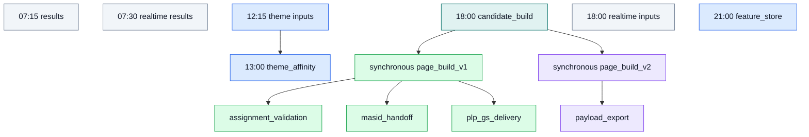
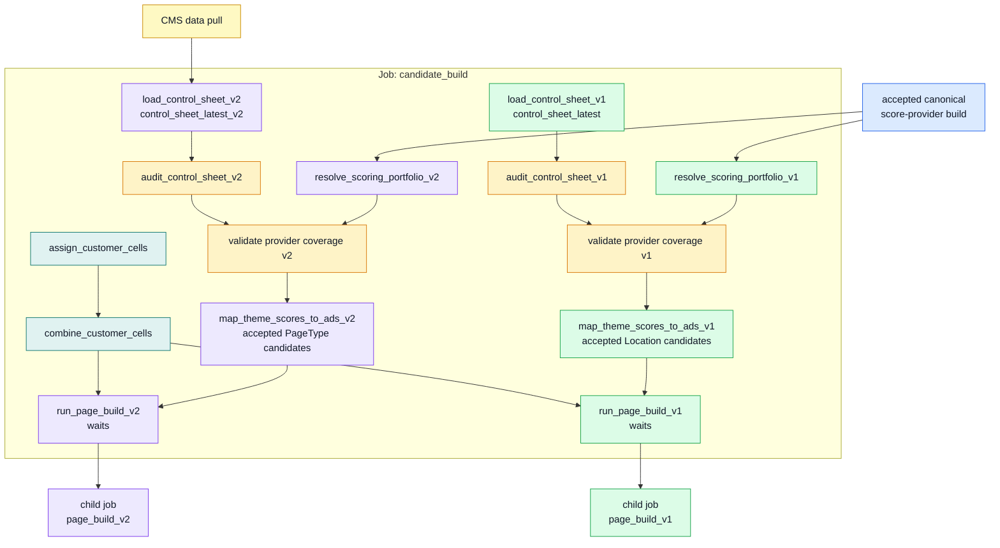
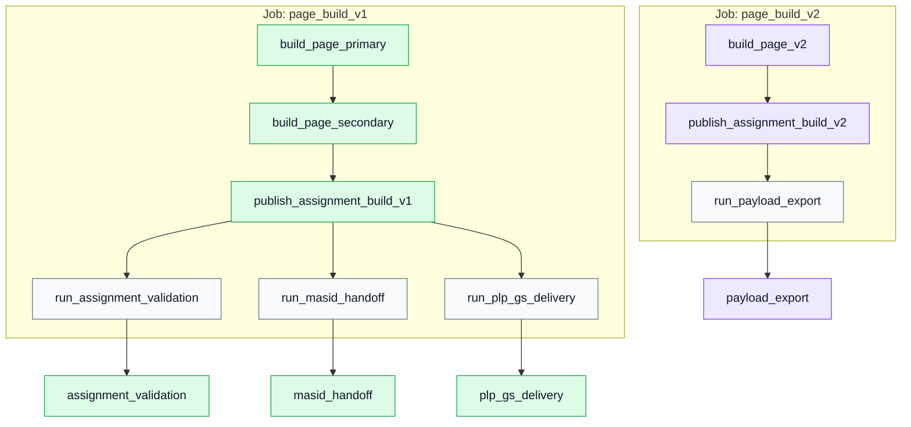
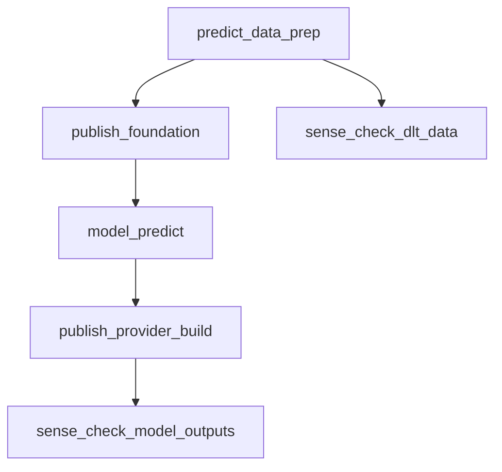
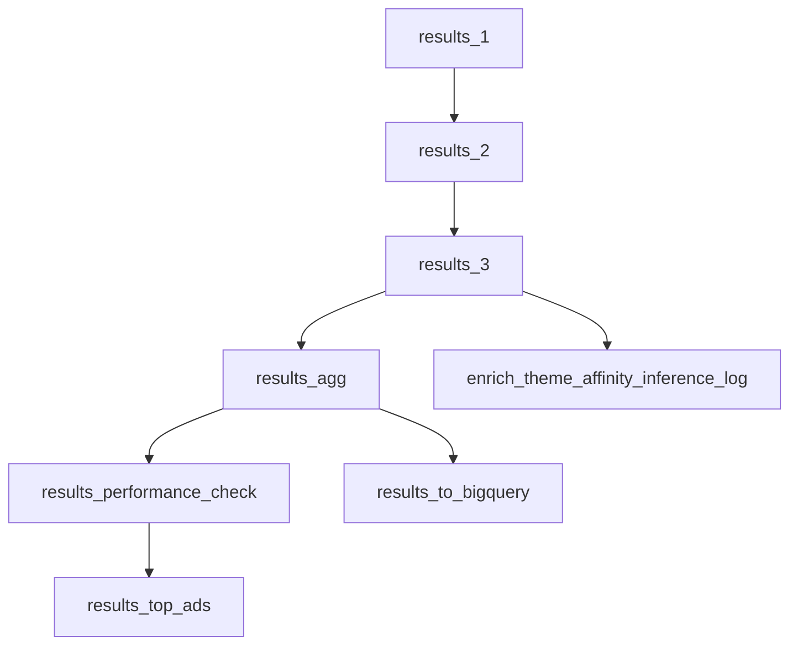
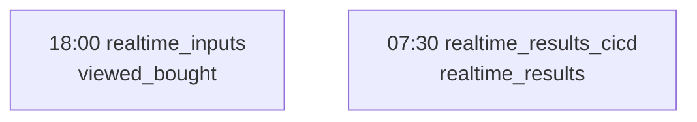
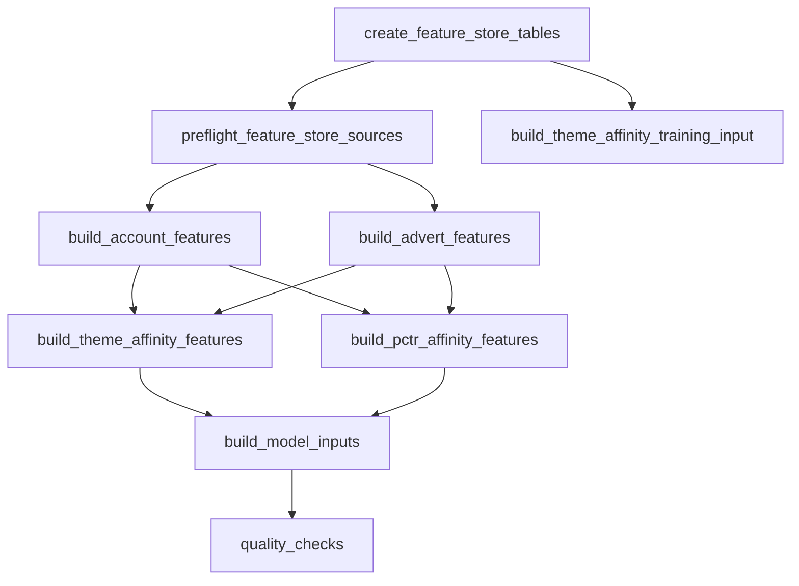

# NextAds Databricks Runtime Map

Status: Working note

Last refreshed from Databricks: 2026-07-03

This page describes the NextAds Databricks bundle shape from a data-science perspective: what runs, when it runs, which tasks it calls, which jobs wait for child jobs, and where reusable model-building routes sit alongside the operational delivery routes.

This is a runtime map, not a deployment policy. For target availability rules, see [nextads_databricks_job_environment_matrix.md](nextads_databricks_job_environment_matrix.md). For the wider model, Feature Store and MLflow architecture view, see [../architecture/nextads_model_feature_overview.md](../architecture/nextads_model_feature_overview.md).

## How to Read This

The diagrams below show the Databricks Asset Bundle job structure currently defined under `pipelines/databricks/jobs`. Schedules and recent runtimes were pulled from Databricks job runs, using PROD jobs unless the row explicitly says DEV. Child jobs do not have their own fixed schedule; the parent waits for their result.

Durations are recent observed successful run durations, not SLAs. They should be treated as a guide for debugging, planning model refreshes, and understanding where a new model, feature-store table, or challenger route would attach.

## Daily Runtime Shape

## Recent Observed Runtimes

| Route | Workspace/profile | Databricks job id | Schedule or trigger | Latest successful run id | Last three successful durations |
| --- | --- | --- | --- | --- | --- |
| Candidate build | PROD | `539075297323897` | 18:00 daily | `101421282112344` | 3h 50m 34s; 3h 40m 30s; 3h 21m 55s |
| Page build | PROD | `269306885845144` | Triggered by candidate build | `724497366216494` | 45m 46s; 50m 52s; 41m 29s |
| Assignment validation | PROD | `499074472587770` | Triggered by page build | `1001390743121428` | 12m 43s; 11m 55s; 12m 41s |
| MASID handoff | PROD | `61892626872113` | Triggered by page build | `493812673009118` | 9m 20s; 16m 1s; 8m 21s |
| Payload export | PROD | `1085437962619214` | Triggered by page build | `313359766451448` | 26m 16s; 24m 17s; 23m 54s |
| PLP Google Sheets delivery | PROD | `258720571842239` | Triggered by page build | `293773116584228` | 10m 27s; 10m 42s; 11m 41s |
| Results | PROD | `326879697801368` | 07:15 daily | `1016879679282989` | 2h 1m 6s; 2h 12m 17s; 2h 1m 37s |
| Realtime inputs | PROD | `510370009427574` | 18:00 daily | `384313899991554` | 20m 23s; 18m 26s; 19m 15s |
| Realtime results | PROD | `36753739041122` | 07:30 daily | `276035162295688` | 9m 21s; 11m 23s; 9m 2s |
| Theme Affinity | PROD | `27892907532455` | 09:00 daily | `11890698402594` | 3h 14m 33s; 3h 41m 37s; 4h 2m 16s |
| Feature store | DEV | `643939878851484` | 21:00 daily in `DEV_FEATURE_STORE` | None found in recent successful runs | No recent successful durations found |

## Candidate Build Task Graph

This is the main evening operational route. It keeps accepted customer cells shared, while v1 and v2 independently capture their control inputs, resolve a declared scoring portfolio and publish an accepted candidate attempt from its serving entries. Product Theme Mapping, Theme Affinity and Markov scoring are upstream jobs rather than candidate-task dependencies.

Each route audit and coverage task reports business findings without hiding technical failures. Missing themes are surfaced for follow-up and naturally cannot produce theme-matched candidates; an unreadable control or pinned provider snapshot stops only the affected route before mapping.

Colour key: blue = accepted score-provider output; teal = shared candidate tasks; green = v1 route; purple = v2 route; amber = guardrail; yellow = external CMS dependency.

Observed latest successful candidate-build task timing, from run `101421282112344`, with task names normalised to the target route. New guardrail tasks have no observed PROD baseline yet, so their durations are listed as new rather than historical measurements:

| Task | Starts after run start | Duration | Depends on |
| --- | ---: | ---: | --- |
| `assign_customer_cells` | 0m | 38m 52s historical baseline | None |
| `combine_customer_cells` | After cell assignment | 2m 43s historical baseline | `assign_customer_cells` |
| `load_control_sheet_v1` | 0m | 12m 43s historical baseline | None |
| `audit_control_sheet_v1` | After v1 control | New route guard | `load_control_sheet_v1` |
| `trigger_data_pull_for_CMS_pull` | 0m | Child-job runtime | None |
| `load_control_sheet_v2` | After CMS acquisition | 11m 52s historical loader baseline | `trigger_data_pull_for_CMS_pull` |
| `audit_control_sheet_v2` | After v2 control | New route guard | `load_control_sheet_v2` |
| `resolve_scoring_portfolio_v1` | 0m | Ready immediately or required serving entry waits to 18:30 | None |
| `resolve_scoring_portfolio_v2` | 0m | Ready immediately or required serving entry waits to 18:30 | None |
| `validate_score_provider_theme_coverage_v1` | After v1 audit and portfolio resolution | New route guard | `audit_control_sheet_v1`, `resolve_scoring_portfolio_v1` |
| `validate_score_provider_theme_coverage_v2` | After v2 audit and portfolio resolution | New route guard | `audit_control_sheet_v2`, `resolve_scoring_portfolio_v2` |
| `map_theme_scores_to_ads_v1` | After cells and v1 checks | 1h 22m 55s historical mapping baseline | Builds every serving entry, writes ad sets and top-20 candidate rows, then publishes the accepted attempt. |
| `map_theme_scores_to_ads_v2` | After cells and v2 checks | 43m 36s historical mapping baseline | Applies the same manifest-last candidate publication at page-type grain. |
| `run_page_build_v1` | After v1 mapping | Full child-job runtime | `combine_customer_cells`, `map_theme_scores_to_ads_v1` |
| `run_page_build_v2` | After v2 mapping | Full child-job runtime | `combine_customer_cells`, `map_theme_scores_to_ads_v2` |

The prior trigger-task durations are no longer comparable: `run_page_build_v1`
and `run_page_build_v2` now remain active until their child jobs finish. Capture a
new three-run DEV baseline before using this table for end-to-end timing targets.

The candidate tasks retain the current preranked tables as compatibility
outputs. Page-build child jobs also receive `candidate_build_attempt_id`; the
next assignment checkpoint switches their reads from compatibility tables to
that accepted attempt.

## Page Build And Delivery Fan-Out

The v1 and v2 page-build jobs are not normally scheduled by themselves in PROD.
They are run as synchronous child jobs after their respective mapping tables and
shared customer cells are ready. The v1 page-build job remains
location-based and continues to fan out to QA, MASID handoff, and PLP delivery.
The v2 page-build job is page-type based and fans out to payload export.

Observed latest successful page-build task timing, from run `724497366216494`:

| Task | Starts after run start | Duration | Depends on |
| --- | ---: | ---: | --- |
| `build_page_primary` | 0m | 31m 50s | None |
| `build_page_v2` | 0m | 22m 30s | None |
| `build_page_secondary` | 31m | 14m 58s | `build_page_primary` |
| `publish_assignment_build_v1` | After secondary scopes | New complete-build publisher | `build_page_secondary` |
| `publish_assignment_build_v2` | After v2 scopes | New complete-build publisher | `build_page_v2` |
| `run_plp_gs_delivery` | After v1 publication | Full child-job runtime | `publish_assignment_build_v1` |
| `run_assignment_validation` | After v1 publication | Full child-job runtime | `publish_assignment_build_v1` |
| `run_masid_handoff` | After v1 publication | Full child-job runtime | `publish_assignment_build_v1` |
| `run_payload_export` | After v2 publication | Full child-job runtime | `publish_assignment_build_v2` |

The delivery jobs remain single-purpose and independently runnable, but the
nightly page route waits for their result: `assignment_validation`,
`masid_handoff_check`, `Export_for_Bloomreach`, and `nextads_plp_gs`.

## Theme Affinity Route

Theme Affinity is its own scheduled production model route. It is not part of the feature-store refresh and it is not triggered by candidate build. Its outputs can become inputs to later operational or model-building work, but the current job remains a standalone scheduled route.

Observed latest successful Theme Affinity task timing, from run `11890698402594`:

| Task | Starts after run start | Duration | Depends on |
| --- | ---: | ---: | --- |
| `predict_data_prep` | 0m | 2h 16m 28s | None |
| `sense_check_dlt_data` | 2h 16m | 34m 24s | `predict_data_prep` |
| `publish_foundation` | 2h 16m | 36m 12s | `predict_data_prep` |
| `model_predict` | 2h 53m | 9m 17s | `publish_foundation` |
| `publish_provider_build` | Not yet measured | Not yet measured | `model_predict` |
| `sense_check_model_outputs` | 3h 9m | 6m 38s | `publish_provider_build` |

## Results Route

The results job is a scheduled reporting and labelling route. It is where production outcome data, performance checks, BigQuery output, top-ad reporting, and Theme Affinity inference-log enrichment are assembled after delivery has happened.

## Realtime Routes

Realtime inputs and realtime results are scheduled jobs, not part of the candidate-build fan-out.

## Feature Store Route

The feature-store job is deliberately separate from the operational PROD delivery routes. It currently exists in the `DEV_FEATURE_STORE` target only, writing reusable model-building tables in `marketingdata_dev.nextads_feature_store`. Its purpose is to publish reusable features and model inputs, not final assignment, ranking, delivery, or production scoring output.

For future challenger work, this means the feature store should be treated as a reusable input layer. A challenger model can consume feature-store tables, Theme Affinity outputs, operational candidate tables, or experiment-specific joins, but its final scores, rankings, assignment decisions, and delivery outputs should remain in model output or decisioning tables rather than being hidden inside feature creation.

## Where New Model Work Fits

New NextAds model work should decide which layer it belongs to before adding a job or table:

| Layer | Use it for | Do not use it for |
| --- | --- | --- |
| Source or operational preparation | Stable inputs and existing operational pipeline steps. | Reusable model feature contracts unless they are intentionally feature-store owned. |
| Feature store | Reusable account, advert, candidate, label, and model-input features that can be rebuilt point-in-time and shared across models. | Final scores, rankings, assignment decisions, delivery payloads, or one-off experiment outputs. |
| Model scoring/challenger output | Model-specific scores, probabilities, candidate rankings, and challenger evidence. | General reusable features unless they are promoted into a feature-store contract. |
| Decisioning/assignment adapter | Selection between champion/challenger outputs and conversion into the current delivery shape. | Feature engineering or training-set assembly. |
| Delivery/reporting | Page build, exports, QA, handoff checks, results, and external/reporting outputs. | Model-training features or hidden scoring logic. |

