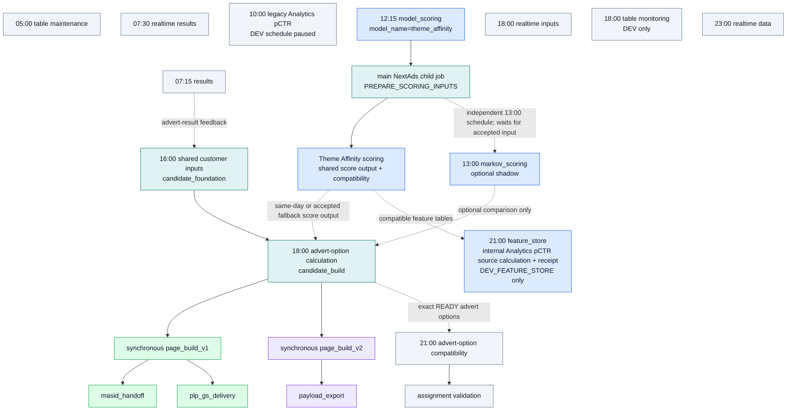
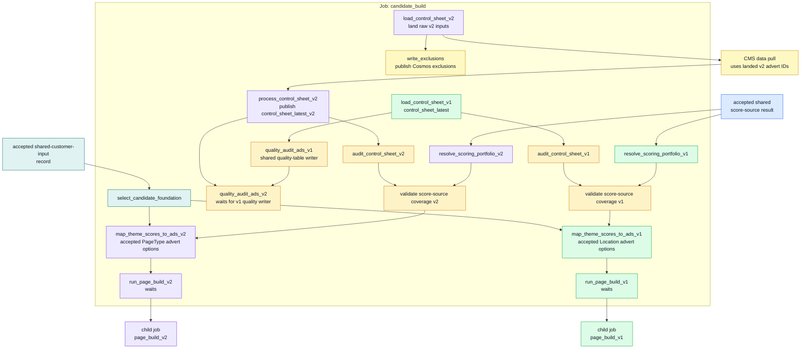
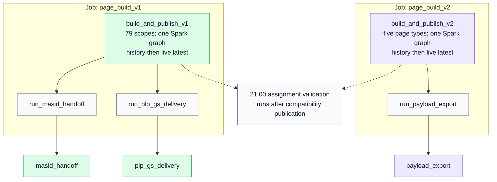
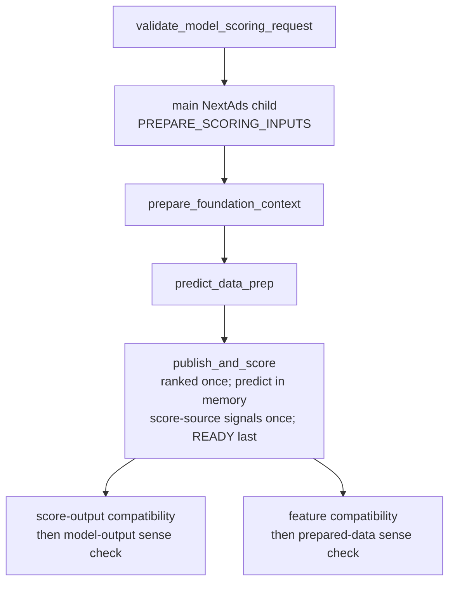
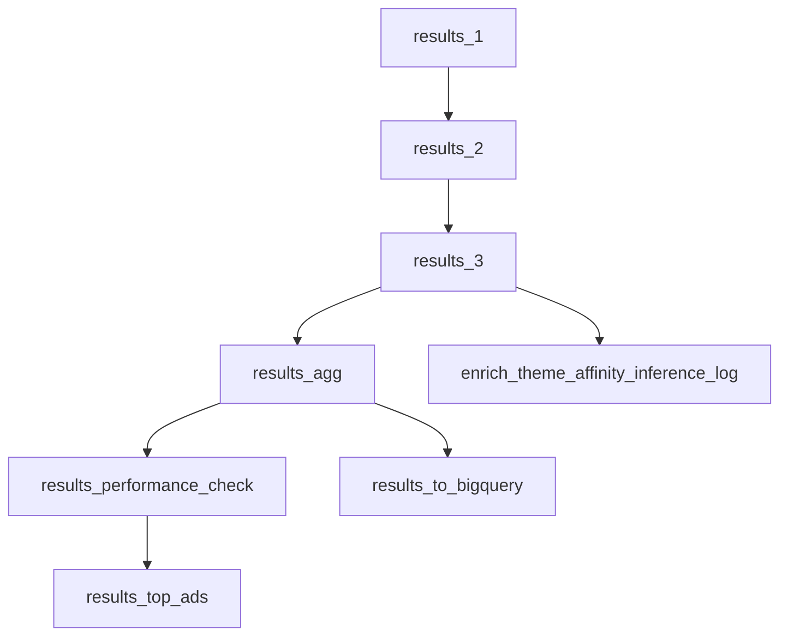
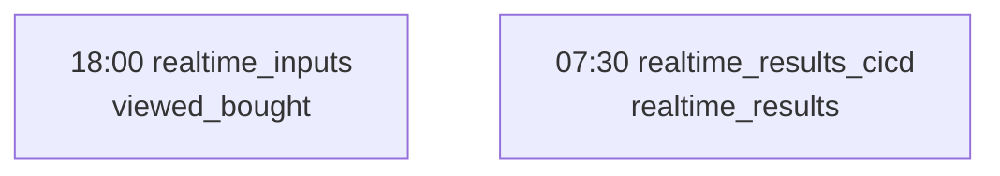
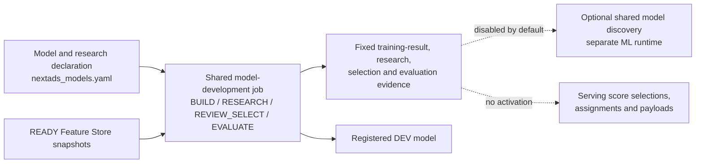

# NextAds Databricks Runtime Map

Status: Working note

- **Current declared graph and schedules:** repository definitions refreshed 2026-08-21.
- **Observed duration evidence:** Databricks runs captured 2026-07-03 against the earlier graph.

This page describes the NextAds Databricks bundle shape from a data-science perspective: what runs, when it runs, which tasks it calls, which jobs wait for child jobs, and where reusable model-building routes sit alongside the operational delivery routes.

This is a runtime map, not a deployment policy. For target availability rules, see [nextads_databricks_job_environment_matrix.md](nextads_databricks_job_environment_matrix.md). For the wider job and table data-flow view, see [../architecture/nextads_job_table_flow.md](../architecture/nextads_job_table_flow.md).

## Evidence Boundaries

The diagrams and declared schedule inventory show the job structure currently defined under `pipelines/databricks/jobs`. A child-job arrow means the caller waits for that run to finish. A called job may also have its own schedule: notably, the main NextAds resource is called at 12:15 for input preparation and independently runs its scheduled 18:00 advert-option operation.

Every duration appears under a heading that says **Historical observed runtime**. Those measurements came from successful runs captured on 2026-07-03 against an earlier task graph; they are not current timings or SLAs. Do not combine them with the current declared schedules when estimating completion time.

## Plain Terms Used In The Diagrams

- A **score source** is a method such as Theme Affinity or Markov. Task and table identifiers call it a `provider`.
- A **score-selection list** chooses the exact ready score output for each serving or comparison role. Identifiers call it a `portfolio`.
- **Shared customer inputs** are customer cells, recent advert exposure and advert feedback recorded together. Both routes select that record and use cells and exposure; only V1 applies advert feedback. The job and stored record are named `candidate_foundation` and Candidate Foundation.
- An **advert option** is an eligible scored advert, called a `candidate` in task and table identifiers. It is not yet a final assignment.
- A **recorded result** ties fixed inputs to exact output table versions. Identifiers often call this a `build`.

## End-To-End Operational Route

This is the single-page view of the operational change. The coloured backgrounds show which system responsibility owns each job or boundary. Solid arrows are direct task or child-job dependencies. Dotted arrows show data hand-offs between independently scheduled jobs, optional score-source participation or independent retention work; their labels state which case applies.

```mermaid
flowchart LR
  classDef input fill:#ecfeff,stroke:#0891b2,color:#111827
  classDef scoring fill:#dbeafe,stroke:#2563eb,color:#111827
  classDef ranking fill:#f3e8ff,stroke:#9333ea,color:#111827
  classDef decision fill:#dcfce7,stroke:#16a34a,color:#111827
  classDef delivery fill:#fff7ed,stroke:#ea580c,color:#111827
  classDef state fill:#ffffff,stroke:#334155,stroke-width:3px,color:#111827
  classDef retained fill:#fef2f2,stroke:#dc2626,color:#111827
  classDef operations fill:#f1f5f9,stroke:#64748b,color:#111827

  subgraph INPUTS["PREPARED INPUTS"]
    direction TB
    theme_inputs["main NextAds job<br/>PREPARE_SCORING_INPUTS<br/>mapping + attributes"]:::input
    input_snapshot[("READY scoring input<br/>exact source Delta versions<br/>schema receipts + Git identity")]:::state
    candidate_foundation["shared customer inputs<br/>candidate_foundation job"]:::input
    foundation_snapshot[("READY shared-customer-input record<br/>exact source and output versions")]:::state
    control["audited v1 and v2 control versions"]:::input

    theme_inputs -->|write once; READY last| input_snapshot
    candidate_foundation -->|write once; READY last| foundation_snapshot
  end

  subgraph SCORING["SCORE SOURCES"]
    direction TB
    ranked["shared model_scoring<br/>theme_affinity implementation<br/>publish and predict from one exact version"]:::scoring
    markov["Markov single calculate-and-publish task<br/>shadow; independently runnable"]:::scoring
    challenger["Any themed or non-themed model<br/>calculate output, then use<br/>the same score-source adapter"]:::scoring
    provider_boundary[("Shared score-source signals<br/>one distributed Delta write per result<br/>exact commit receipt; READY last")]:::state
    provider_compat["legacy score-output compatibility<br/>and model-output sense check"]:::operations
    feature_compat["feature compatibility tables<br/>and prepared-data sense check"]:::operations

    ranked --> provider_boundary
    provider_boundary --> provider_compat
    provider_boundary --> feature_compat
    ranked -. same-date source relations .-> feature_compat
    markov -. optional shadow .-> provider_boundary
    challenger -. configured score source .-> provider_boundary
  end

  subgraph RANKING["SCORE SELECTION AND ADVERT-OPTION RANKING"]
    direction TB
    portfolio_v1["Resolve configured v1 score selection<br/>bind exact scoring result + Delta version<br/>same score source calculated once when reused"]:::ranking
    portfolio_v2["Resolve configured v2 score selection<br/>bind exact scoring result + Delta version<br/>same score source calculated once when reused"]:::ranking
    candidate_v1["v1 advert-option graph<br/>all serving entries and locations"]:::ranking
    candidate_v2["v2 advert-option graph<br/>all serving entries and page types"]:::ranking
    candidate_attempt_v1[("READY v1 advert-option attempt<br/>one ad-set write + one score write<br/>exact receipts; manifest last")]:::state
    candidate_attempt_v2[("READY v2 advert-option attempt<br/>one ad-set write + one score write<br/>exact receipts; manifest last")]:::state

    portfolio_v1 -->|exact PortfolioAttemptID| candidate_v1
    candidate_v1 --> candidate_attempt_v1
    portfolio_v2 -->|exact PortfolioAttemptID| candidate_v2
    candidate_v2 --> candidate_attempt_v2
  end

  subgraph DECISIONING["DECISIONING AND PUBLICATION"]
    direction TB
    build_v1["v1 bulk Spark graph<br/>load cells, advert options and control once<br/>shared customer ordering twice<br/>all 79 locations calculated together"]:::decision
    gate_v1{"one grouped key and scope check<br/>for the complete v1 frame"}:::decision
    publish_v1["distributed history transaction<br/>then distributed live-latest transaction<br/>live latest is the final operation"]:::decision
    keep_v1["failure before live latest<br/>keeps yesterday's complete v1 snapshot"]:::retained
    build_v2["v2 bulk Spark graph<br/>load shared inputs once<br/>all five page types calculated together"]:::decision
    gate_v2{"one grouped key and scope check<br/>for the complete v2 frame"}:::decision
    publish_v2["distributed history transaction<br/>then distributed live-latest transaction<br/>live latest is the final operation"]:::decision
    keep_v2["failure before live latest<br/>keeps yesterday's complete v2 snapshot"]:::retained

    build_v1 --> gate_v1 --> publish_v1
    gate_v1 -- invalid --> keep_v1
    publish_v1 -. live commit fails .-> keep_v1
    build_v2 --> gate_v2 --> publish_v2
    gate_v2 -- invalid --> keep_v2
    publish_v2 -. live commit fails .-> keep_v2
  end

  subgraph DELIVERY["DELIVERY"]
    direction TB
    v1_delivery["V1 after successful publication<br/>MASID handoff check + PLP delivery"]:::delivery
    v2_delivery["V2 after successful publication<br/>payload export"]:::delivery
  end

  subgraph OPERATIONS["ASYNCHRONOUS COMPATIBILITY, VALIDATION AND RETENTION"]
    candidate_compat["21:00 advert-option compatibility<br/>and assignment validation<br/>read exact READY advert options"]:::operations
    maintenance["05:00 retention<br/>not a calculation dependency"]:::operations
  end

  style INPUTS fill:#f0fdff,stroke:#0891b2,stroke-width:2px
  style SCORING fill:#eff6ff,stroke:#2563eb,stroke-width:2px
  style RANKING fill:#faf5ff,stroke:#9333ea,stroke-width:2px
  style DECISIONING fill:#f0fdf4,stroke:#16a34a,stroke-width:2px
  style DELIVERY fill:#fffaf5,stroke:#ea580c,stroke-width:2px
  style OPERATIONS fill:#f8fafc,stroke:#64748b,stroke-width:2px

  input_snapshot -->|exact InputSnapshotID| ranked
  input_snapshot -->|same exact InputSnapshotID| markov
  provider_boundary -->|exact score-source attempts| portfolio_v1
  provider_boundary -->|exact score-source attempts| portfolio_v2
  foundation_snapshot -->|exact FoundationSnapshotID| candidate_v1
  foundation_snapshot -->|same exact FoundationSnapshotID| candidate_v2
  control --> candidate_v1
  control --> candidate_v2
  candidate_attempt_v1 -->|exact accepted attempt only| build_v1
  candidate_attempt_v2 -->|exact accepted attempt only| build_v2
  candidate_v1 -. no ready manifest .-> keep_v1
  candidate_v2 -. no ready manifest .-> keep_v2
  publish_v1 --> v1_delivery
  publish_v2 --> v2_delivery
  candidate_attempt_v1 -. exact READY version .-> candidate_compat
  candidate_attempt_v2 -. exact READY version .-> candidate_compat
  maintenance -. retention only .-> candidate_attempt_v1
  maintenance -. retention only .-> candidate_attempt_v2
```

The thick-bordered cylinders are acceptance boundaries: downstream work reads the exact identifier and Delta version shown on the connecting arrow, rather than asking for whichever data is latest at execution time. Stable JSON identities, stable ordering and exact Delta versions make a repeat of those accepted inputs select the same rows without nightly whole-table hashing.

All model-specific code ends at the shared score-source boundary. Theme Affinity, optional Markov and any later themed or non-themed comparison model publish the same keys, scores, ranks and ready manifest. From that point onward v1 and v2 independently select their configured score outputs, then use the same advert-option, decisioning and delivery contracts.

Data is written before its READY manifest. Assignment is calculated as one distributed Spark graph per route, checked once at the final public key, and written as one history transaction followed by one live-latest transaction. There is no scope-by-scope public chain to leave a mixed Shopping Bag snapshot. If the live transaction does not complete, the previous accepted snapshot remains active; a repair can publish it from the exact history version without recalculating assignments. V1 and v2 make that decision independently.

## Current Declared Job Schedule And Child-Job Triggers

Everything in this section comes from the current bundle definitions. It does not report observed start or completion times.

The diagram includes every schedule declared by the current job YAML. It does not imply that target-specific schedules coexist in one workspace: the legacy Analytics pCTR schedule is paused, table monitoring is DEV-only, and the shared Feature Store schedule exists only in `DEV_FEATURE_STORE`.

### Declared Schedule Inventory

| Time | Job | Declared targets | Repository schedule state |
| --- | --- | --- | --- |
| 05:00 | `mktg_next_uk_nextads_table_maintenance` | `SANDBOX`, `DEV`, `DEV_INTEGRATION`, `PREPROD`, `PROD` | Declared |
| 07:15 | `mktg_next_uk_nextads_results_cicd` | `SANDBOX`, `DEV`, `DEV_INTEGRATION`, `PREPROD`, `PROD` | Declared |
| 07:30 | `mktg_next_uk_nextads_realtime_results_cicd` | `SANDBOX`, `DEV`, `DEV_INTEGRATION`, `PREPROD`, `PROD` | Declared |
| 10:00 | `mktg_next_uk_nextads_analytics_pctr` | `DEV` | Paused |
| 12:15 | `mktg_next_uk_nextads_model_scoring` | `SANDBOX`, `DEV`, `DEV_INTEGRATION`, `PREPROD`, `PROD` | Declared; currently `model_name=theme_affinity`, with a synchronous same-date call to the main NextAds `PREPARE_SCORING_INPUTS` operation before scoring and compatibility publication |
| 13:00 | `mktg_next_uk_nextads_markov_scoring` | `SANDBOX`, `DEV`, `DEV_INTEGRATION`, `PREPROD`, `PROD` | Declared |
| 16:00 | `mktg_next_uk_nextads_candidate_foundation` | `SANDBOX`, `DEV`, `DEV_INTEGRATION`, `PREPROD`, `PROD` | Declared |
| 18:00 | `mktg_next_uk_nextads_candidate_build` | `SANDBOX`, `DEV`, `DEV_INTEGRATION`, `PREPROD`, `PROD` | Declared with default `operation=CANDIDATE_BUILD`; its `PREPARE_SCORING_INPUTS` operation is invoked earlier as a child run rather than separately scheduled |
| 18:00 | `mktg_next_uk_nextads_realtime_inputs` | `SANDBOX`, `DEV`, `DEV_INTEGRATION`, `PREPROD`, `PROD` | Declared |
| 18:00 | `mktg_next_uk_nextads_table_monitoring` | `DEV` | Declared |
| 21:00 | `mktg_next_uk_nextads_candidate_compatibility` | `SANDBOX`, `DEV`, `DEV_INTEGRATION`, `PREPROD`, `PROD` | Declared |
| 21:00 | `mktg_next_uk_nextads_feature_store` | `DEV_FEATURE_STORE` | Unpaused |
| 23:00 | `mktg_next_uk_nextads_realtime_data` | `SANDBOX`, `DEV`, `DEV_INTEGRATION`, `PREPROD`, `PROD` | Declared |

## Historical Observed Runtime Evidence — Captured 2026-07-03

These measurements were captured on 2026-07-03 against the earlier job graph. They are retained only as a pre-change comparison and do not describe the runtime of the current bulk publication jobs.

| Route | Workspace/profile | Databricks job id | Schedule or trigger | Latest successful run id | Last three successful durations |
| --- | --- | --- | --- | --- | --- |
| Advert-option job (then called Candidate build) | PROD | `539075297323897` | 18:00 daily | `101421282112344` | 3h 50m 34s; 3h 40m 30s; 3h 21m 55s |
| Assignment page build | PROD | `269306885845144` | Triggered by the advert-option job | `724497366216494` | 45m 46s; 50m 52s; 41m 29s |
| Assignment validation | PROD | `499074472587770` | Triggered by page build | `1001390743121428` | 12m 43s; 11m 55s; 12m 41s |
| MASID handoff | PROD | `61892626872113` | Triggered by page build | `493812673009118` | 9m 20s; 16m 1s; 8m 21s |
| Payload export | PROD | `1085437962619214` | Triggered by page build | `313359766451448` | 26m 16s; 24m 17s; 23m 54s |
| PLP Google Sheets delivery | PROD | `258720571842239` | Triggered by page build | `293773116584228` | 10m 27s; 10m 42s; 11m 41s |
| Results | PROD | `326879697801368` | 07:15 daily | `1016879679282989` | 2h 1m 6s; 2h 12m 17s; 2h 1m 37s |
| Realtime inputs | PROD | `510370009427574` | 18:00 daily | `384313899991554` | 20m 23s; 18m 26s; 19m 15s |
| Realtime results | PROD | `36753739041122` | 07:30 daily | `276035162295688` | 9m 21s; 11m 23s; 9m 2s |
| Historical Theme Affinity job | PROD | `27892907532455` | 09:00 at the observation date; replaced in the current bundle by 12:15 shared model scoring | `11890698402594` | 3h 14m 33s; 3h 41m 37s; 4h 2m 16s |
| Feature store | DEV | `643939878851484` | 21:00 daily in `DEV_FEATURE_STORE` | None found in recent successful runs | No recent successful durations found |

## Current Declared `CANDIDATE_BUILD` Task Graph

This is the main NextAds job's scheduled `CANDIDATE_BUILD` operation. It selects one accepted shared-customer-input record for v1 and v2, while each route independently captures its control input, resolves a declared score-selection list and publishes accepted advert options from its serving entries. The same job's `PREPARE_SCORING_INPUTS` operation is an earlier child run of shared model scoring. The shared-customer-input job, model scoring and Markov scoring remain upstream of the evening advert-option branch.

Each route audit and coverage task reports business findings without hiding technical failures. Missing themes are surfaced for follow-up and naturally cannot produce theme-matched advert options; an unreadable control or pinned score output stops only the affected route before mapping. The separate advert-quality tasks measure the loaded adverts and write shared quality tables; their writes are serialised by making `quality_audit_ads_v2` wait for `quality_audit_ads_v1`.

Colour key: blue = accepted score-source output; teal = shared advert-option tasks; green = v1 route; purple = v2 route; amber = guardrail; yellow = external CMS dependency.

### Current Declared Task Order

This table comes from the current bundle and contains no measured durations.

| Task | Current start and dependency rule |
| --- | --- |
| `select_candidate_foundation` | Starts with the `CANDIDATE_BUILD` branch. It returns immediately when the same-date shared-customer-input record is ready or waits for up to 30 minutes. |
| `load_control_sheet_v1` | Starts with the `CANDIDATE_BUILD` branch. |
| `audit_control_sheet_v1` | Starts after `load_control_sheet_v1`. |
| `quality_audit_ads_v1` | Starts after `load_control_sheet_v1`; writes v1 advert-quality measurements to the shared quality tables. |
| `load_control_sheet_v2` | Starts with the `CANDIDATE_BUILD` branch. |
| `write_exclusions` | Starts after `load_control_sheet_v2` and publishes the landed exclusions to Cosmos without gating the remaining V2 route. |
| `trigger_data_pull_for_CMS_pull` | Starts after `load_control_sheet_v2` lands the raw v2 control input. |
| `process_control_sheet_v2` | Starts after `trigger_data_pull_for_CMS_pull` completes. |
| `audit_control_sheet_v2` | Starts after `process_control_sheet_v2`. |
| `quality_audit_ads_v2` | Starts after both `process_control_sheet_v2` and `quality_audit_ads_v1`; the v1 dependency prevents concurrent writes to the shared quality tables. |
| `resolve_scoring_portfolio_v1` | Starts with the `CANDIDATE_BUILD` branch; a required serving score may wait until 18:30. |
| `resolve_scoring_portfolio_v2` | Starts with the `CANDIDATE_BUILD` branch; a required serving score may wait until 18:30. |
| `validate_score_provider_theme_coverage_v1` | Starts after `audit_control_sheet_v1` and `resolve_scoring_portfolio_v1`. |
| `validate_score_provider_theme_coverage_v2` | Starts after `audit_control_sheet_v2` and `resolve_scoring_portfolio_v2`. |
| `map_theme_scores_to_ads_v1` | Starts after `select_candidate_foundation` and the v1 coverage check; writes advert sets and top-20 advert-option rows before accepting the attempt. |
| `map_theme_scores_to_ads_v2` | Starts after `select_candidate_foundation` and the v2 coverage check; applies the same manifest-last publication at page-type grain. |
| `run_page_build_v1` | Starts after `map_theme_scores_to_ads_v1` and remains active until the v1 child job finishes. |
| `run_page_build_v2` | Starts after `map_theme_scores_to_ads_v2` and remains active until the v2 child job finishes. |

### Historical Observed Task Timings — Captured 2026-07-03

These PROD measurements came from run `101421282112344` on the earlier graph. They are comparison points only; they are not measurements of the current tasks.

| Earlier work represented | Observed duration | Relevance to the current graph |
| --- | ---: | --- |
| v1 control loading | 12m 43s | Earlier baseline for `load_control_sheet_v1`. |
| Combined v2 control loader | 11m 52s | Cannot be split reliably between current `load_control_sheet_v2` and `process_control_sheet_v2`. |
| v1 theme-score-to-advert mapping | 1h 22m 55s | Earlier baseline for the work now performed by `map_theme_scores_to_ads_v1`. |
| v2 theme-score-to-advert mapping | 43m 36s | Earlier baseline for the work now performed by `map_theme_scores_to_ads_v2`. |

The current control audits, coverage checks, score-selection tasks and `quality_audit_ads_v1/v2` have no comparable observed PROD baseline. The previous page-build trigger durations are also not comparable because `run_page_build_v1` and `run_page_build_v2` now remain active until their child jobs finish. Capture a new three-run DEV baseline before setting end-to-end timing expectations.

The critical advert-option tasks publish only the standard advert-set and score tables. The 21:00 compatibility job derives the legacy preranked tables from an exact READY advert-option attempt. Each page-build child loads its exact `candidate_build_attempt_id`, resolves separate `best` and `best_challenger` score-selection entries, and carries the accepted score-selection and shared-customer-input identifiers into the Delta commit metadata.

## Current Declared Bulk Page-Build And Delivery Fan-Out

The v1 and v2 page-build jobs are not normally scheduled by themselves in PROD. They are run as synchronous child jobs after their respective mapping tables and shared customer cells are ready. V1 builds its 77 primary locations in one task with its two inherited secondary locations in the same Spark graph. V2 builds all five page types in one graph. Each graph validates and publishes its route before returning. This removes per-scope cluster starts and intermediate write tasks while keeping the public assignment grain unchanged. After publication, v1 fans out to a read-only MASID handoff check and PLP delivery, while v2 fans out to payload export. Assignment validation runs independently at 21:00.

### Historical Observed Page-Build Timings — Captured 2026-07-03

The following timings are the pre-bulk baseline from successful run `724497366216494`. They describe the earlier graph; capture new DEV evidence before treating any duration as current:

| Task | Starts after run start | Duration | Depends on |
| --- | ---: | ---: | --- |
| Prior v1 primary scopes | 0m | 31m 50s | Pre-rewrite baseline |
| Prior v2 page types | 0m | 22m 30s | Pre-rewrite baseline |
| Prior v1 secondary scopes | 31m | 14m 58s | Pre-rewrite baseline |
| `build_and_publish_v1` | 0m | Capture three-run DEV median | None |
| `build_and_publish_v2` | 0m | Capture three-run DEV median | None |
| `run_plp_gs_delivery` | After v1 live commit | Full child-job runtime | `build_and_publish_v1` |
| `run_masid_handoff` | After v1 live commit | Full child-job runtime | `build_and_publish_v1` |
| `run_payload_export` | After v2 live commit | Full child-job runtime | `build_and_publish_v2` |

The delivery jobs remain single-purpose and independently runnable, but the nightly page route waits for `masid_handoff_check`, `Export_for_Bloomreach`, and `nextads_plp_gs`. Compatibility and quality alerts no longer delay or revoke an accepted READY assignment result.

## Current Declared Scheduled Model-Scoring Route

`mktg_next_uk_nextads_model_scoring` is the scheduled operational scoring route and is parameterised by `model_name`. The current implementation is `theme_affinity`. It starts at 12:15, validates the declared score source, synchronously calls the main NextAds job with `operation=PREPARE_SCORING_INPUTS` for the same date, then scores and publishes both compatibility branches and their sense checks. It is separate from Feature Store source preparation and from the main job's 18:00 `CANDIDATE_BUILD` operation.

### Historical Observed Theme Affinity Timings — Captured 2026-07-03

The following is the pre-rewrite timing from run `11890698402594`; it describes the earlier graph, not the current tasks above:

| Task | Starts after run start | Duration | Depends on |
| --- | ---: | ---: | --- |
| `predict_data_prep` | 0m | 2h 16m 28s | None |
| `sense_check_dlt_data` | 2h 16m | 34m 24s | `predict_data_prep` |
| Prior prepared-data copy | 2h 16m | 36m 12s | `predict_data_prep` |
| Prior model prediction | 2h 53m | 9m 17s | Prior prepared-data copy |
| `publish_and_score` | After Lakeflow | Capture three-run DEV median | `predict_data_prep` |
| Compatibility publication and sense checks | After `publish_and_score` | Capture three-run DEV median | Exact READY score output and matching Lakeflow feature relations |

## Results Route

The results job is a scheduled reporting and labelling route. It is where production outcome data, performance checks, BigQuery output, top-ad reporting, and Theme Affinity inference-log enrichment are assembled after delivery has happened.

## Realtime Routes

Realtime inputs and realtime results are scheduled jobs, not part of the advert-option job's fan-out.

## Feature Store Route

The Feature Store job is deliberately separate from operational model scoring and PROD delivery. It is scheduled at 21:00 only in `DEV_FEATURE_STORE`, runs the retained Analytics pCTR source-building notebooks and exact receipt inside its own task graph, writes reusable model-building tables in `marketingdata_dev.nextads_feature_store`, and does not publish assignments, delivery payloads or production scores. Its complete task graph is maintained once in [`feature_store_flow.md`](../architecture/feature_store_flow.md); its job and table inputs and outputs are in [`nextads_job_table_flow.md`](../architecture/nextads_job_table_flow.md).

## Manual DEV Declared Model Route

The centrally owned model-lifecycle and model-discovery jobs are unscheduled and declared only in the personal `DEV` target. A data scientist supplies a declared `model_name` and selects the supported operation rather than adding a saved job for the model, feature theme or experiment. Both routes use exact READY snapshots and remain separate from the operational scoring and assignment graph.

`BUILD` receives observation dates, feature dates and `label_end`; `RESEARCH` receives `label_end` and takes train, validation, test, feature-date and selection-policy rules from the model declaration. `REVIEW_SELECT` receives the exact research result, selected model option (`candidate`), reviewer and reason. `EVALUATE` receives the exact model-training result and run date plus optional bounded evaluation overrides. The job derives DEV namespaces, registered-model names, control tables and MLflow paths and has no promotion, alias or environment-copy capability. The separately deployed shared discovery job requires a declared model and exact research result, never receives the research test period and never registers or activates a model.

## Job And Table Ownership Boundaries

New NextAds model work should first extend the repository declaration and the appropriate centrally owned route. Add a saved job only for a stable operational responsibility with distinct ownership, scheduling or runtime needs that the shared contract cannot represent:

| Layer | Use it for | Do not use it for |
| --- | --- | --- |
| Source or operational preparation | Stable inputs and existing operational pipeline steps. | Reusable model feature contracts unless they are intentionally feature-store owned. |
| Feature store | Reusable account, advert, advert-option (`candidate`), label, and model-input features that can be recreated point-in-time and shared across models. | Final scores, rankings, assignment decisions, delivery payloads, or one-off experiment outputs. |
| Model scoring/comparison output | Model-specific scores, probabilities, ranked options, and comparison-model evidence. | General reusable features unless they are promoted into a feature-store contract. |
| Decisioning/assignment adapter | Selection between primary and comparison score outputs and conversion into the current delivery shape. | Feature engineering or training-set assembly. |
| Delivery/reporting | Page build, exports, assignment validation, handoff checks, results and external/reporting outputs. | Model-training features or hidden scoring logic. |
