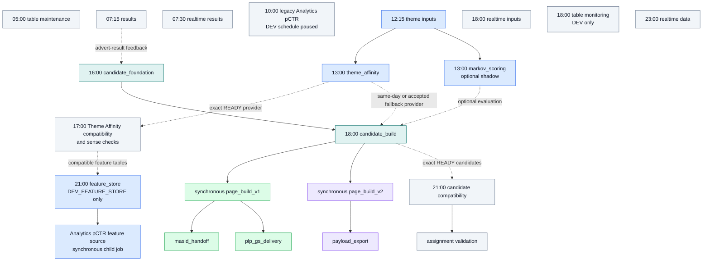
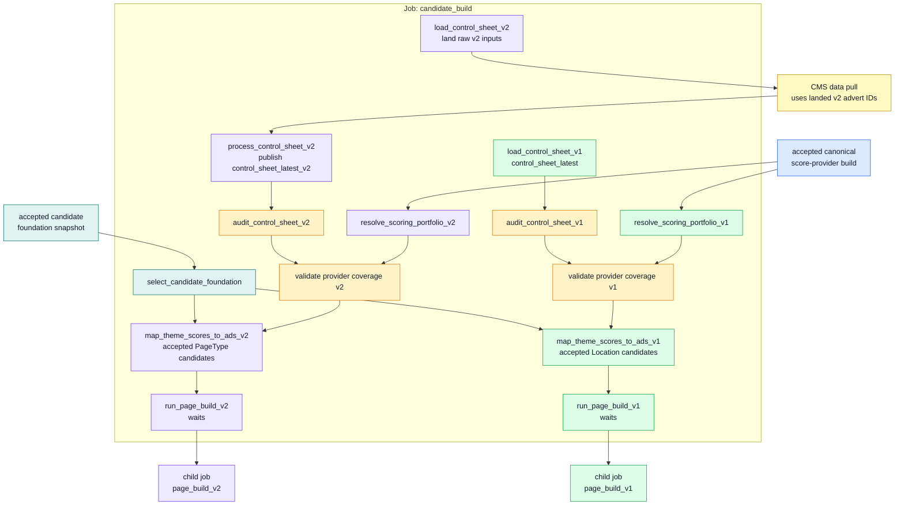
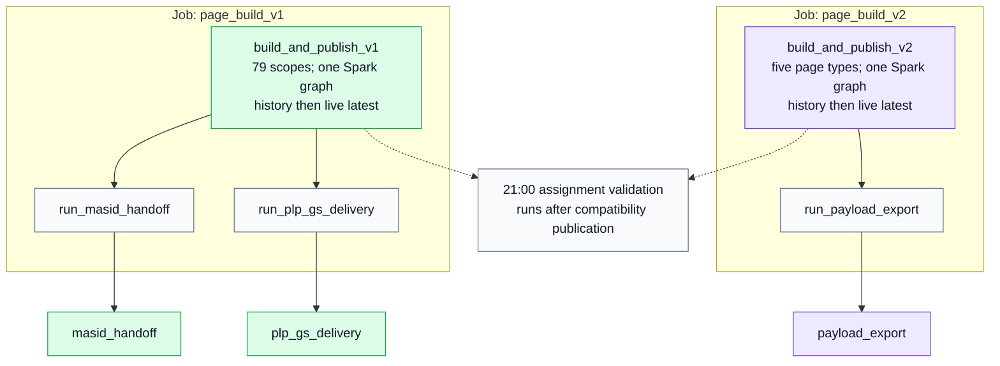
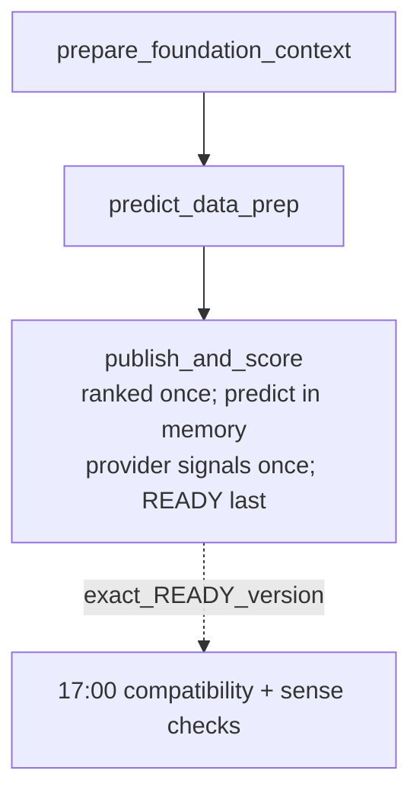
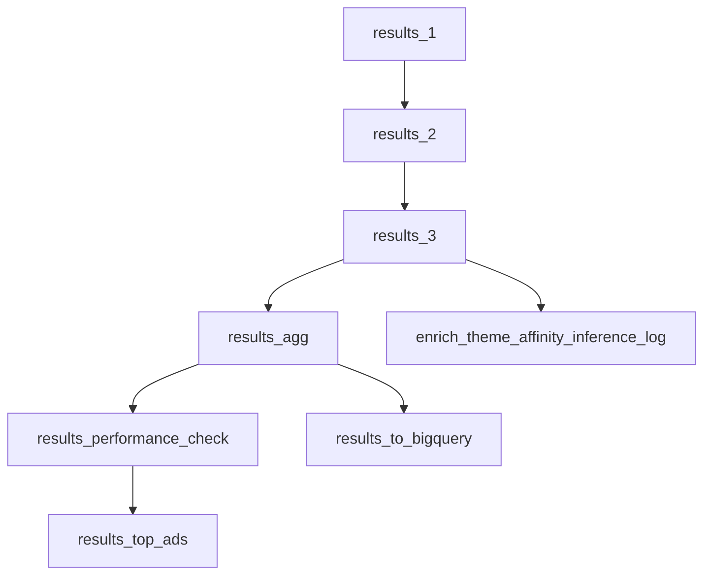
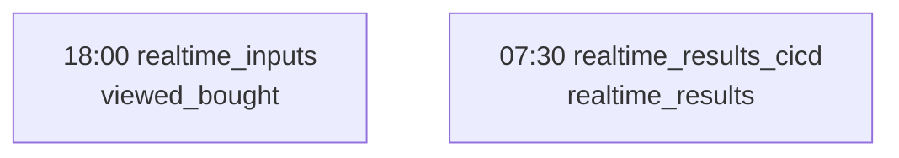

# NextAds Databricks Runtime Map

Status: Working note

Architecture view refreshed: 2026-08-18. Observed runtime evidence last refreshed from Databricks: 2026-07-03.

This page describes the NextAds Databricks bundle shape from a data-science perspective: what runs, when it runs, which tasks it calls, which jobs wait for child jobs, and where reusable model-building routes sit alongside the operational delivery routes.

This is a runtime map, not a deployment policy. For target availability rules, see [nextads_databricks_job_environment_matrix.md](nextads_databricks_job_environment_matrix.md). For the wider job and table data-flow view, see [../architecture/nextads_job_table_flow.md](../architecture/nextads_job_table_flow.md).

## Scope, Schedules And Runtime Evidence

The diagrams below show the Databricks Asset Bundle job structure currently defined under `pipelines/databricks/jobs`. The schedules in the diagrams come from the current bundle. The runtime table is retained as historical pre-change evidence from Databricks job runs, using PROD jobs unless the row explicitly says DEV. Child jobs do not have their own fixed schedule; the parent waits for their result.

Durations are recent observed successful run durations, not SLAs. They should be treated as a guide for debugging, planning model refreshes, and understanding where a new model, feature-store table, or challenger route would attach.

## End-To-End Operational Route

This is the single-page view of the operational change. The coloured backgrounds show which system responsibility owns each job or boundary. Solid arrows are required dependencies; dotted arrows show optional provider participation or independent retention work.

```mermaid
flowchart LR
  classDef input fill:#ecfeff,stroke:#0891b2,color:#111827
  classDef scoring fill:#dbeafe,stroke:#2563eb,color:#111827
  classDef ranking fill:#f3e8ff,stroke:#9333ea,color:#111827
  classDef decision fill:#dcfce7,stroke:#16a34a,color:#111827
  classDef delivery fill:#fff7ed,stroke:#ea580c,color:#111827
  classDef state fill:#ffffff,stroke:#334155,stroke-width:3px,color:#111827
  classDef retained fill:#fef2f2,stroke:#dc2626,color:#111827
  classDef operations fill:#f1f5f9,stroke:#64748b,color:#111827

  subgraph INPUTS["INPUTS AND FOUNDATIONS"]
    direction TB
    theme_inputs["theme_inputs<br/>mapping + attributes"]:::input
    input_snapshot[("READY scoring input<br/>exact source Delta versions<br/>schema receipts + Git identity")]:::state
    candidate_foundation["candidate_foundation<br/>cells + exposure + feedback"]:::input
    foundation_snapshot[("READY candidate foundation<br/>exact source and output versions")]:::state
    control["audited v1 and v2 control versions"]:::input

    theme_inputs -->|write once; READY last| input_snapshot
    candidate_foundation -->|write once; READY last| foundation_snapshot
  end

  subgraph SCORING["SCORING PROVIDERS"]
    direction TB
    ranked["Theme Affinity shared compute<br/>publish ranked foundation once<br/>predict from that exact version"]:::scoring
    markov["Markov single build-and-publish task<br/>shadow; independently runnable"]:::scoring
    challenger["Any themed or non-themed model<br/>calculate output, then use<br/>the same provider adapter"]:::scoring
    provider_boundary[("Canonical provider signals<br/>one distributed Delta write per build<br/>exact commit receipt; READY last")]:::state

    ranked --> provider_boundary
    markov -. optional shadow .-> provider_boundary
    challenger -. configured provider .-> provider_boundary
  end

  subgraph RANKING["PORTFOLIO AND CANDIDATE RANKING"]
    direction TB
    portfolio_v1["Resolve configured v1 selection<br/>bind exact provider build + Delta version<br/>same provider calculated once when reused"]:::ranking
    portfolio_v2["Resolve configured v2 selection<br/>bind exact provider build + Delta version<br/>same provider calculated once when reused"]:::ranking
    candidate_v1["v1 candidate graph<br/>all serving entries and locations"]:::ranking
    candidate_v2["v2 candidate graph<br/>all serving entries and page types"]:::ranking
    candidate_attempt_v1[("READY v1 candidate attempt<br/>one ad-set write + one score write<br/>exact receipts; manifest last")]:::state
    candidate_attempt_v2[("READY v2 candidate attempt<br/>one ad-set write + one score write<br/>exact receipts; manifest last")]:::state

    portfolio_v1 -->|exact PortfolioAttemptID| candidate_v1
    candidate_v1 --> candidate_attempt_v1
    portfolio_v2 -->|exact PortfolioAttemptID| candidate_v2
    candidate_v2 --> candidate_attempt_v2
  end

  subgraph DECISIONING["DECISIONING AND PUBLICATION"]
    direction TB
    build_v1["v1 bulk Spark graph<br/>load cells, candidates and control once<br/>shared customer ordering twice<br/>all 79 locations calculated together"]:::decision
    gate_v1{"one grouped key and scope check<br/>for the complete v1 frame"}:::decision
    publish_v1["distributed history transaction<br/>then distributed live-latest transaction<br/>live latest is the final operation"]:::decision
    keep_v1["failure before live latest<br/>keeps yesterday's complete v1 snapshot"]:::retained
    build_v2["v2 bulk Spark graph<br/>load shared inputs once<br/>all five page types calculated together"]:::decision
    gate_v2{"one grouped key and scope check<br/>for the complete v2 frame"}:::decision
    publish_v2["distributed history transaction<br/>then distributed live-latest transaction<br/>live latest is the final operation"]:::decision
    keep_v2["failure before live latest<br/>keeps yesterday's complete v2 snapshot"]:::retained

    build_v1 --> gate_v1 --> publish_v1
    gate_v1 -- invalid --> keep_v1
    publish_v1 -. live commit fails .-> keep_v1
    build_v2 --> gate_v2 --> publish_v2
    gate_v2 -- invalid --> keep_v2
    publish_v2 -. live commit fails .-> keep_v2
  end

  subgraph DELIVERY["DELIVERY"]
    direction TB
    v1_delivery["V1 after successful publication<br/>MASID + PLP"]:::delivery
    v2_delivery["V2 after successful publication<br/>payload export"]:::delivery
  end

  subgraph OPERATIONS["ASYNCHRONOUS COMPATIBILITY, VALIDATION AND RETENTION"]
    theme_compat["17:00 Theme Affinity compatibility<br/>legacy provider and feature tables<br/>plus independent sense checks"]:::operations
    candidate_compat["21:00 candidate compatibility<br/>and assignment validation<br/>read exact READY candidates"]:::operations
    maintenance["05:00 retention<br/>not a build dependency"]:::operations
  end

  style INPUTS fill:#f0fdff,stroke:#0891b2,stroke-width:2px
  style SCORING fill:#eff6ff,stroke:#2563eb,stroke-width:2px
  style RANKING fill:#faf5ff,stroke:#9333ea,stroke-width:2px
  style DECISIONING fill:#f0fdf4,stroke:#16a34a,stroke-width:2px
  style DELIVERY fill:#fffaf5,stroke:#ea580c,stroke-width:2px
  style OPERATIONS fill:#f8fafc,stroke:#64748b,stroke-width:2px

  input_snapshot -->|exact InputSnapshotID| ranked
  input_snapshot -->|same exact InputSnapshotID| markov
  provider_boundary -->|exact provider attempts| portfolio_v1
  provider_boundary -->|exact provider attempts| portfolio_v2
  foundation_snapshot -->|exact FoundationSnapshotID| candidate_v1
  foundation_snapshot -->|same exact FoundationSnapshotID| candidate_v2
  control --> candidate_v1
  control --> candidate_v2
  candidate_attempt_v1 -->|exact accepted attempt only| build_v1
  candidate_attempt_v2 -->|exact accepted attempt only| build_v2
  candidate_v1 -. no ready manifest .-> keep_v1
  candidate_v2 -. no ready manifest .-> keep_v2
  publish_v1 --> v1_delivery
  publish_v2 --> v2_delivery
  provider_boundary -. exact READY version .-> theme_compat
  candidate_attempt_v1 -. exact READY version .-> candidate_compat
  candidate_attempt_v2 -. exact READY version .-> candidate_compat
  maintenance -. retention only .-> candidate_attempt_v1
  maintenance -. retention only .-> candidate_attempt_v2
```

The thick-bordered cylinders are acceptance boundaries: downstream work reads the exact identifier and Delta version shown on the connecting arrow, rather than asking for whichever data is latest at execution time. Canonical JSON identities, stable ordering and exact Delta versions make a repeat of those accepted inputs select the same rows without nightly whole-table hashing.

All model-specific code ends at the canonical provider boundary. Theme Affinity, optional Markov and any later themed or non-themed challenger publish the same keys, scores, ranks and ready manifest. From that point onward v1 and v2 independently select their configured provider outputs, then use the same candidate, decisioning and delivery contracts.

Data is written before its READY manifest. Assignment is calculated as one distributed Spark graph per route, checked once at the final public key, and written as one history transaction followed by one live-latest transaction. There is no scope-by-scope public chain to leave a mixed Shopping Bag snapshot. If the live transaction does not complete, the previous accepted snapshot remains active; a repair can publish it from the exact history version without recalculating assignments. V1 and v2 make that decision independently.

## Daily Job Schedule And Child-Job Triggers

The diagram includes every schedule declared by the current job YAML. It does
not imply that target-specific schedules coexist in one workspace: the legacy
Analytics pCTR schedule is paused, table monitoring is DEV-only, and the shared
Feature Store schedule exists only in `DEV_FEATURE_STORE`.

### Declared Schedule Inventory

| Time | Job | Declared targets | Repository schedule state |
| --- | --- | --- | --- |
| 05:00 | `mktg_next_uk_nextads_table_maintenance` | `SANDBOX`, `DEV`, `DEV_INTEGRATION`, `PREPROD`, `PROD` | Declared |
| 07:15 | `mktg_next_uk_nextads_results_cicd` | `SANDBOX`, `DEV`, `DEV_INTEGRATION`, `PREPROD`, `PROD` | Declared |
| 07:30 | `mktg_next_uk_nextads_realtime_results_cicd` | `SANDBOX`, `DEV`, `DEV_INTEGRATION`, `PREPROD`, `PROD` | Declared |
| 10:00 | `mktg_next_uk_nextads_analytics_pctr` | `DEV` | Paused |
| 12:15 | `mktg_next_uk_nextads_theme_inputs` | `SANDBOX`, `DEV`, `DEV_INTEGRATION`, `PREPROD`, `PROD` | Declared |
| 13:00 | `mktg_next_uk_nextads_theme_affinity` | `SANDBOX`, `DEV`, `DEV_INTEGRATION`, `PREPROD`, `PROD` | Declared |
| 13:00 | `mktg_next_uk_nextads_markov_scoring` | `SANDBOX`, `DEV`, `DEV_INTEGRATION`, `PREPROD`, `PROD` | Declared |
| 16:00 | `mktg_next_uk_nextads_candidate_foundation` | `SANDBOX`, `DEV`, `DEV_INTEGRATION`, `PREPROD`, `PROD` | Declared |
| 17:00 | `mktg_next_uk_nextads_theme_feature_compatibility` | `SANDBOX`, `DEV`, `DEV_INTEGRATION`, `PREPROD`, `PROD` | Declared |
| 18:00 | `mktg_next_uk_nextads_candidate_build` | `SANDBOX`, `DEV`, `DEV_INTEGRATION`, `PREPROD`, `PROD` | Declared |
| 18:00 | `mktg_next_uk_nextads_realtime_inputs` | `SANDBOX`, `DEV`, `DEV_INTEGRATION`, `PREPROD`, `PROD` | Declared |
| 18:00 | `mktg_next_uk_nextads_table_monitoring` | `DEV` | Declared |
| 21:00 | `mktg_next_uk_nextads_candidate_compatibility` | `SANDBOX`, `DEV`, `DEV_INTEGRATION`, `PREPROD`, `PROD` | Declared |
| 21:00 | `mktg_next_uk_nextads_feature_store` | `DEV_FEATURE_STORE` | Unpaused |
| 23:00 | `mktg_next_uk_nextads_realtime_data` | `SANDBOX`, `DEV`, `DEV_INTEGRATION`, `PREPROD`, `PROD` | Declared |

## Historical Observed Runtimes

These measurements were captured on 2026-07-03 against the earlier job graph. They are retained only as a pre-change comparison and do not describe the runtime of the current bulk publication jobs.

| Route | Workspace/profile | Databricks job id | Schedule or trigger | Latest successful run id | Last three successful durations |
| --- | --- | --- | --- | --- | --- |
| Candidate build | PROD | `539075297323897` | 18:00 daily | `101421282112344` | 3h 50m 34s; 3h 40m 30s; 3h 21m 55s |
| Page build | PROD | `269306885845144` | Triggered by candidate build | `724497366216494` | 45m 46s; 50m 52s; 41m 29s |
| Assignment validation | PROD | `499074472587770` | Triggered by page build | `1001390743121428` | 12m 43s; 11m 55s; 12m 41s |
| MASID handoff | PROD | `61892626872113` | Triggered by page build | `493812673009118` | 9m 20s; 16m 1s; 8m 21s |
| Payload export | PROD | `1085437962619214` | Triggered by page build | `313359766451448` | 26m 16s; 24m 17s; 23m 54s |
| PLP Google Sheets delivery | PROD | `258720571842239` | Triggered by page build | `293773116584228` | 10m 27s; 10m 42s; 11m 41s |
| Results | PROD | `326879697801368` | 07:15 daily | `1016879679282989` | 2h 1m 6s; 2h 12m 17s; 2h 1m 37s |
| Realtime inputs | PROD | `510370009427574` | 18:00 daily | `384313899991554` | 20m 23s; 18m 26s; 19m 15s |
| Realtime results | PROD | `36753739041122` | 07:30 daily | `276035162295688` | 9m 21s; 11m 23s; 9m 2s |
| Theme Affinity | PROD | `27892907532455` | 09:00 at the observation date; current bundle 13:00 | `11890698402594` | 3h 14m 33s; 3h 41m 37s; 4h 2m 16s |
| Feature store | DEV | `643939878851484` | 21:00 daily in `DEV_FEATURE_STORE` | None found in recent successful runs | No recent successful durations found |

## Candidate Build Task Graph

This is the evening candidate route. It selects one accepted candidate foundation shared by v1 and v2, while each route independently captures its control input, resolves a declared scoring portfolio and publishes an accepted candidate attempt from its serving entries. Theme Inputs, Candidate Foundation, Theme Affinity and Markov scoring are upstream jobs rather than candidate-task implementations.

Each route audit and coverage task reports business findings without hiding technical failures. Missing themes are surfaced for follow-up and naturally cannot produce theme-matched candidates; an unreadable control or pinned provider snapshot stops only the affected route before mapping.

Colour key: blue = accepted score-provider output; teal = shared candidate tasks; green = v1 route; purple = v2 route; amber = guardrail; yellow = external CMS dependency.

Observed latest successful candidate-build task timing, from run `101421282112344`, with task names normalised to the target route. New guardrail tasks have no observed PROD baseline yet, so their durations are listed as new rather than historical measurements:

| Task | Starts after run start | Duration | Depends on |
| --- | ---: | ---: | --- |
| `select_candidate_foundation` | 0m | Ready immediately or waits up to 30 minutes for the accepted same-day foundation | None |
| `load_control_sheet_v1` | 0m | 12m 43s historical baseline | None |
| `audit_control_sheet_v1` | After v1 control | New route guard | `load_control_sheet_v1` |
| `load_control_sheet_v2` | 0m | The landing portion of the 11m 52s historical loader baseline; capture a new split-task baseline in DEV | None |
| `trigger_data_pull_for_CMS_pull` | After raw v2 control landing | Child-job runtime | `load_control_sheet_v2` |
| `process_control_sheet_v2` | After CMS acquisition | The processing portion of the 11m 52s historical loader baseline; capture a new split-task baseline in DEV | `trigger_data_pull_for_CMS_pull` |
| `audit_control_sheet_v2` | After processed v2 control publication | New route guard | `process_control_sheet_v2` |
| `resolve_scoring_portfolio_v1` | 0m | Ready immediately or required serving entry waits to 18:30 | None |
| `resolve_scoring_portfolio_v2` | 0m | Ready immediately or required serving entry waits to 18:30 | None |
| `validate_score_provider_theme_coverage_v1` | After v1 audit and portfolio resolution | New route guard | `audit_control_sheet_v1`, `resolve_scoring_portfolio_v1` |
| `validate_score_provider_theme_coverage_v2` | After v2 audit and portfolio resolution | New route guard | `audit_control_sheet_v2`, `resolve_scoring_portfolio_v2` |
| `map_theme_scores_to_ads_v1` | After the accepted foundation and v1 checks | 1h 22m 55s historical mapping baseline | Builds every serving entry, writes ad sets and top-20 candidate rows, then publishes the accepted attempt. |
| `map_theme_scores_to_ads_v2` | After the accepted foundation and v2 checks | 43m 36s historical mapping baseline | Applies the same manifest-last candidate publication at page-type grain. |
| `run_page_build_v1` | After v1 mapping | Full child-job runtime | `map_theme_scores_to_ads_v1` |
| `run_page_build_v2` | After v2 mapping | Full child-job runtime | `map_theme_scores_to_ads_v2` |

The prior trigger-task durations are no longer comparable: `run_page_build_v1` and `run_page_build_v2` now remain active until their child jobs finish. Capture a new three-run DEV baseline before using this table for end-to-end timing targets.

The critical candidate tasks publish only the canonical ad-set and score tables. The 21:00 compatibility job derives the legacy preranked tables from an exact READY candidate attempt. Each page-build child loads its exact `candidate_build_attempt_id`, resolves separate `best` and `best_challenger` portfolio entries, and carries the accepted portfolio and foundation provenance into the Delta commit metadata.

## Bulk Page Build And Delivery Fan-Out

The v1 and v2 page-build jobs are not normally scheduled by themselves in PROD. They are run as synchronous child jobs after their respective mapping tables and shared customer cells are ready. V1 builds its 77 primary locations in one task with its two inherited secondary locations in the same Spark graph. V2 builds all five page types in one graph. Each graph validates and publishes its route before returning. This removes per-scope cluster starts and intermediate write tasks while keeping the public assignment grain unchanged. After publication, v1 fans out to MASID handoff and PLP delivery, while v2 fans out to payload export. Assignment validation runs independently at 21:00.

The following timings are the pre-bulk baseline from successful run `724497366216494`; capture new DEV evidence before treating them as current:

| Task | Starts after run start | Duration | Depends on |
| --- | ---: | ---: | --- |
| Prior v1 primary scopes | 0m | 31m 50s | Pre-rewrite baseline |
| Prior v2 page types | 0m | 22m 30s | Pre-rewrite baseline |
| Prior v1 secondary scopes | 31m | 14m 58s | Pre-rewrite baseline |
| `build_and_publish_v1` | 0m | Capture three-run DEV median | None |
| `build_and_publish_v2` | 0m | Capture three-run DEV median | None |
| `run_plp_gs_delivery` | After v1 live commit | Full child-job runtime | `build_and_publish_v1` |
| `run_masid_handoff` | After v1 live commit | Full child-job runtime | `build_and_publish_v1` |
| `run_payload_export` | After v2 live commit | Full child-job runtime | `build_and_publish_v2` |

The delivery jobs remain single-purpose and independently runnable, but the nightly page route waits for `masid_handoff_check`, `Export_for_Bloomreach`, and `nextads_plp_gs`. Compatibility and quality alerts no longer delay or revoke a canonical READY build.

## Theme Affinity Route

Theme Affinity is its own scheduled production model route. It is not part of the feature-store refresh and it is not triggered by candidate build. Its outputs can become inputs to later operational or model-building work, but the current job remains a standalone scheduled route.

The following is the pre-rewrite timing from run `11890698402594`; it is a baseline, not the current task graph:

| Task | Starts after run start | Duration | Depends on |
| --- | ---: | ---: | --- |
| `predict_data_prep` | 0m | 2h 16m 28s | None |
| `sense_check_dlt_data` | 2h 16m | 34m 24s | `predict_data_prep` |
| Prior foundation copy | 2h 16m | 36m 12s | `predict_data_prep` |
| Prior model prediction | 2h 53m | 9m 17s | Prior foundation copy |
| `publish_and_score` | After Lakeflow | Capture three-run DEV median | `predict_data_prep` |
| Async compatibility and sense checks | 17:00 | Independently monitored | Exact READY provider |

## Results Route

The results job is a scheduled reporting and labelling route. It is where production outcome data, performance checks, BigQuery output, top-ad reporting, and Theme Affinity inference-log enrichment are assembled after delivery has happened.

## Realtime Routes

Realtime inputs and realtime results are scheduled jobs, not part of the candidate-build fan-out.

## Feature Store Route

The Feature Store job is deliberately separate from the operational PROD
delivery routes. It is scheduled at 21:00 only in `DEV_FEATURE_STORE`, writes
reusable model-building tables in
`marketingdata_dev.nextads_feature_store`, and does not publish assignments,
delivery payloads or production scores. Its complete task graph is maintained
once in
[`feature_store_flow.md`](../architecture/feature_store_flow.md); its job and
table inputs and outputs are in
[`nextads_job_table_flow.md`](../architecture/nextads_job_table_flow.md).

## Job And Table Ownership Boundaries

New NextAds model work should decide which layer it belongs to before adding a job or table:

| Layer | Use it for | Do not use it for |
| --- | --- | --- |
| Source or operational preparation | Stable inputs and existing operational pipeline steps. | Reusable model feature contracts unless they are intentionally feature-store owned. |
| Feature store | Reusable account, advert, candidate, label, and model-input features that can be rebuilt point-in-time and shared across models. | Final scores, rankings, assignment decisions, delivery payloads, or one-off experiment outputs. |
| Model scoring/challenger output | Model-specific scores, probabilities, candidate rankings, and challenger evidence. | General reusable features unless they are promoted into a feature-store contract. |
| Decisioning/assignment adapter | Selection between champion/challenger outputs and conversion into the current delivery shape. | Feature engineering or training-set assembly. |
| Delivery/reporting | Page build, exports, assignment validation, handoff checks, results and external/reporting outputs. | Model-training features or hidden scoring logic. |
