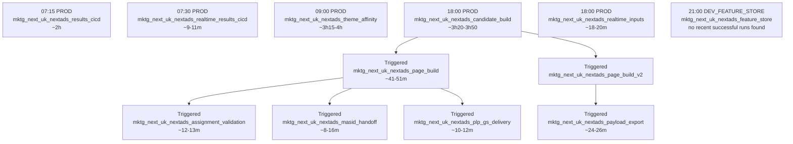
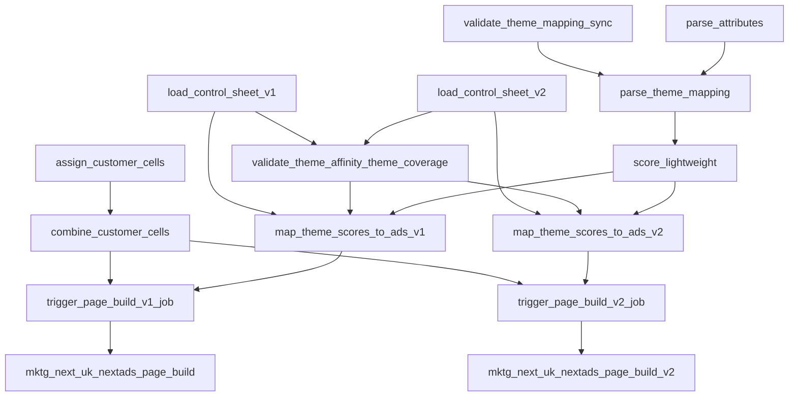
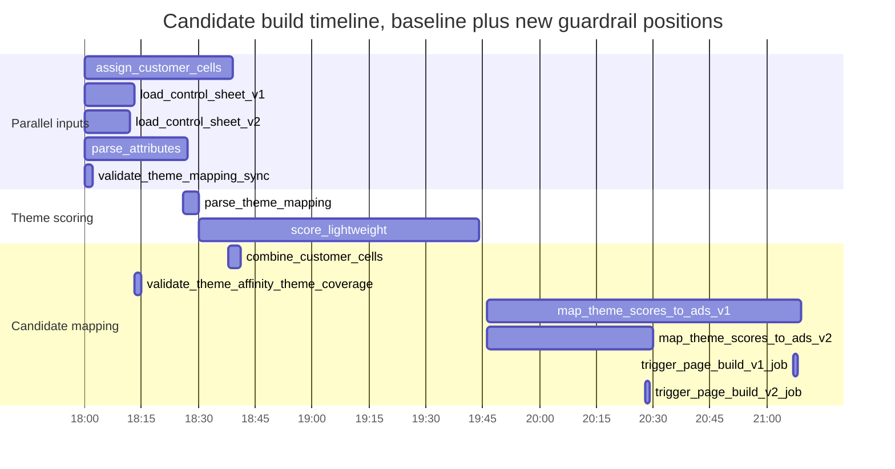
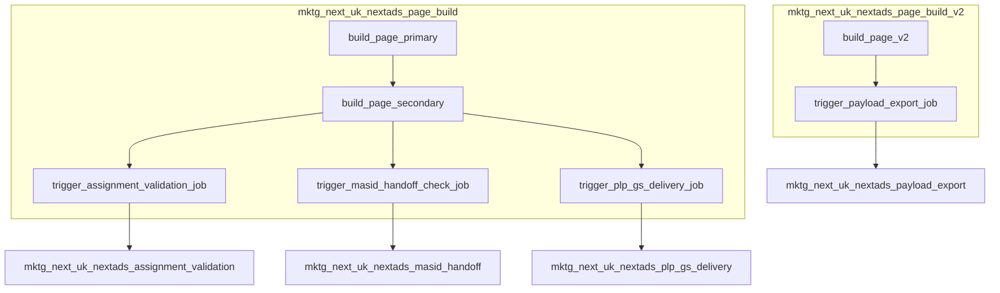
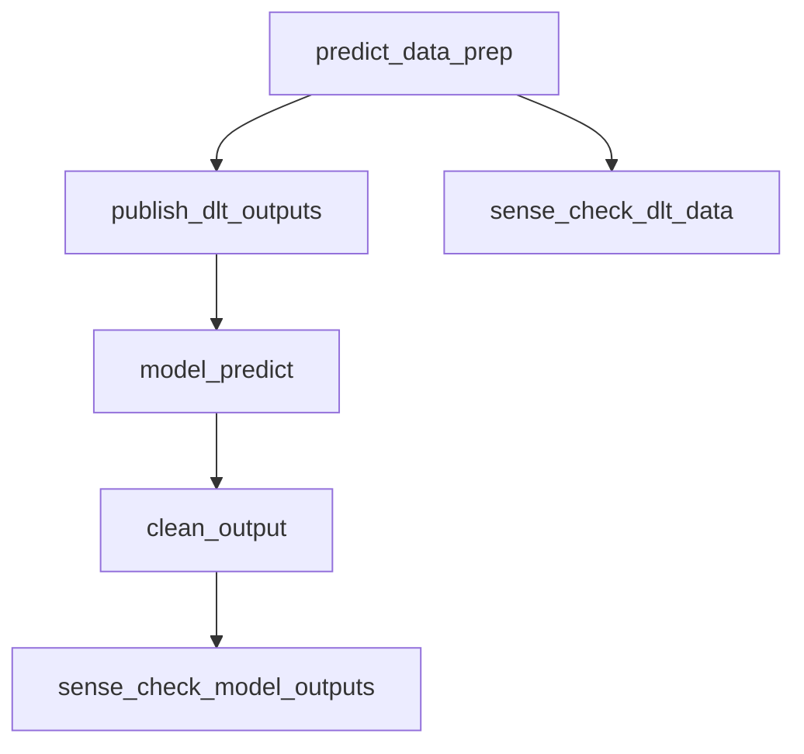
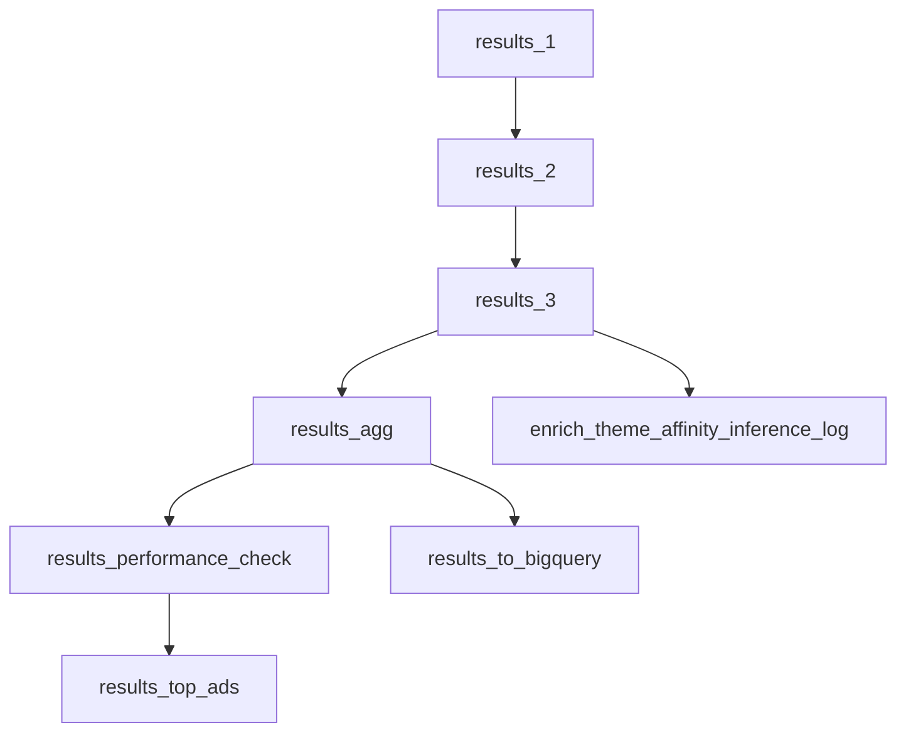
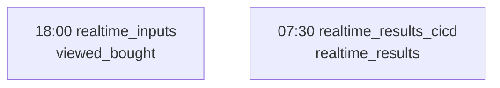
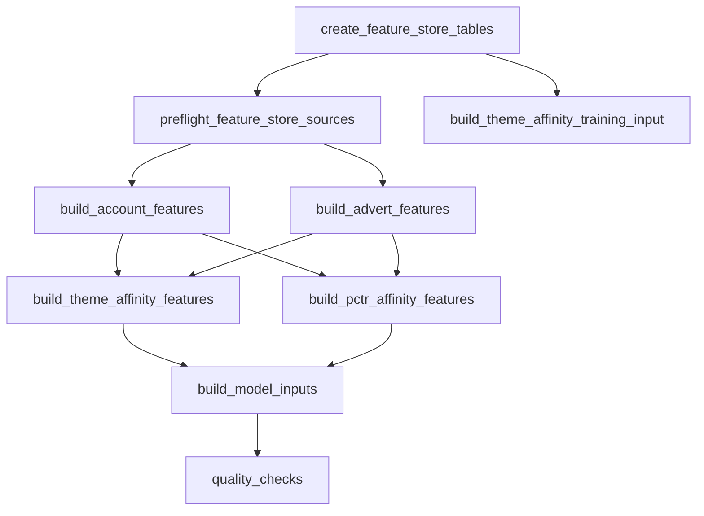

# NextAds Databricks Runtime Map

Status: Working note

Last refreshed from Databricks: 2026-07-03

This page describes the deployed NextAds Databricks job shape from a data-science perspective: what runs, when it runs, which tasks it calls, which jobs trigger other jobs, and where reusable model-building routes such as the feature store sit alongside the operational delivery routes.

This is a runtime map, not a deployment policy. For target availability rules, see [nextads_databricks_job_environment_matrix.md](nextads_databricks_job_environment_matrix.md). For the wider model, Feature Store and MLflow architecture view, see [../architecture/nextads_model_feature_overview.md](../architecture/nextads_model_feature_overview.md).

## How to Read This

The diagrams below show the Databricks Asset Bundle job structure currently defined under `pipelines/databricks/jobs`. Schedules and recent runtimes were pulled from Databricks job runs, using PROD jobs unless the row explicitly says DEV. Triggered jobs do not have their own fixed schedule; they are launched by an upstream task.

Durations are recent observed successful run durations, not SLAs. They should be treated as a guide for debugging, planning model refreshes, and understanding where a new model, feature-store table, or challenger route would attach.

## Daily Runtime Shape

## Recent Observed Runtimes

| Route | Workspace/profile | Databricks job id | Schedule or trigger | Latest successful run id | Last three successful durations |
| --- | --- | --- | --- | --- | --- |
| Candidate build | PROD | `539075297323897` | 18:00 daily | `101421282112344` | 3h 50m 34s; 3h 40m 30s; 3h 21m 55s |
| Page build | PROD | `269306885845144` | Triggered by candidate build | `724497366216494` | 45m 46s; 50m 52s; 41m 29s |
| Assignment validation | PROD | `499074472587770` | Triggered by page build | `1001390743121428` | 12m 43s; 11m 55s; 12m 41s |
| MASID handoff | PROD | `61892626872113` | Triggered by page build | `493812673009118` | 9m 20s; 16m 1s; 8m 21s |
| Payload export | PROD | `1085437962619214` | Triggered by page build | `313359766451448` | 26m 16s; 24m 17s; 23m 54s |
| PLP Google Sheets delivery | PROD | `258720571842239` | Triggered by page build | `293773116584228` | 10m 27s; 10m 42s; 11m 41s |
| Results | PROD | `326879697801368` | 07:15 daily | `1016879679282989` | 2h 1m 6s; 2h 12m 17s; 2h 1m 37s |
| Realtime inputs | PROD | `510370009427574` | 18:00 daily | `384313899991554` | 20m 23s; 18m 26s; 19m 15s |
| Realtime results | PROD | `36753739041122` | 07:30 daily | `276035162295688` | 9m 21s; 11m 23s; 9m 2s |
| Theme Affinity | PROD | `27892907532455` | 09:00 daily | `11890698402594` | 3h 14m 33s; 3h 41m 37s; 4h 2m 16s |
| Feature store | DEV | `643939878851484` | 21:00 daily in `DEV_FEATURE_STORE` | None found in recent successful runs | No recent successful durations found |

## Candidate Build Task Graph

This is the main evening operational route. It keeps customer cells, item attributes, product Theme Mapping, and lightweight theme scoring shared. Both page-build routes remain active, and the v1/v2 split happens when shared customer-theme scores are joined to each route's loaded control sheet. `score_lightweight` is still a task dependency in the YAML, but `run_theme_score_mapping` reads Theme Affinity model latest for customer-theme scores.

The v2 workbook owns the `Theme Mapping` tab. A Google Sheets Apps Script copies it into the v1 workbook, and `validate_theme_mapping_sync` checks that copy before the shared parser runs. `validate_theme_affinity_theme_coverage` then checks that active ad `Themes` from both loaded route control sheets exist in the shared Theme Affinity `NextTheme` output before either mapper runs.

Observed latest successful candidate-build task timing, from run `101421282112344`, with task names normalised to the target route. New guardrail tasks have no observed PROD baseline yet, so their durations are listed as new rather than historical measurements:

| Task | Starts after run start | Duration | Depends on |
| --- | ---: | ---: | --- |
| `assign_customer_cells` | 0m | 38m 52s | None |
| `load_control_sheet_v1` | 0m | 12m 43s | None |
| `load_control_sheet_v2` | 0m | 11m 52s | None |
| `parse_attributes` | 0m | 26m 51s | None |
| `validate_theme_mapping_sync` | 0m | New guardrail | None |
| `parse_theme_mapping` | After attributes and Theme Mapping sync | 4m 22s baseline | `parse_attributes`, `validate_theme_mapping_sync` |
| `score_lightweight` | After Theme Mapping parse | 1h 14m 1s baseline | `parse_theme_mapping` |
| `combine_customer_cells` | 38m | 2m 43s | `assign_customer_cells` |
| `validate_theme_affinity_theme_coverage` | After both control sheets | New guardrail | `load_control_sheet_v1`, `load_control_sheet_v2` |
| `map_theme_scores_to_ads_v1` | After shared scoring and coverage validation | 1h 22m 55s baseline | `score_lightweight`, `load_control_sheet_v1`, `validate_theme_affinity_theme_coverage` |
| `map_theme_scores_to_ads_v2` | After shared scoring and coverage validation | Prior baseline 43m 36s | `score_lightweight`, `load_control_sheet_v2`, `validate_theme_affinity_theme_coverage` |
| `trigger_page_build_v1_job` | After v1 mapping and cells | Prior trigger 45s | `combine_customer_cells`, `map_theme_scores_to_ads_v1` |
| `trigger_page_build_v2_job` | After v2 mapping and cells | Prior trigger 45s | `combine_customer_cells`, `map_theme_scores_to_ads_v2` |

## Page Build And Delivery Fan-Out

The v1 and v2 page-build jobs are not normally scheduled by themselves in PROD.
They are submitted by the candidate-build route after their respective mapping
tables and shared customer cells are ready. The v1 page-build job remains
location-based and continues to fan out to QA, MASID handoff, and PLP delivery.
The v2 page-build job is page-type based and fans out to payload export.

Observed latest successful page-build task timing, from run `724497366216494`:

| Task | Starts after run start | Duration | Depends on |
| --- | ---: | ---: | --- |
| `build_page_primary` | 0m | 31m 50s | None |
| `build_page_v2` | 0m | 22m 30s | None |
| `trigger_payload_export_job` | 21m | 8m 47s | `build_page_v2` |
| `build_page_secondary` | 31m | 14m 58s | `build_page_primary` |
| `trigger_plp_gs_delivery_job` | 45m | 52s | `build_page_secondary` |
| `trigger_qa_job` | 45m | 55s | `build_page_secondary` |
| `trigger_masid_handoff_check_job` | 45m | 48s | `build_page_secondary` |

The triggered delivery jobs are currently single-purpose jobs: `QA`, `masid_handoff_check`, `Export_for_Bloomreach`, and `nextads_plp_gs`.

## Theme Affinity Route

Theme Affinity is its own scheduled production model route. It is not part of the feature-store refresh and it is not triggered by candidate build. Its outputs can become inputs to later operational or model-building work, but the current job remains a standalone scheduled route.

Observed latest successful Theme Affinity task timing, from run `11890698402594`:

| Task | Starts after run start | Duration | Depends on |
| --- | ---: | ---: | --- |
| `predict_data_prep` | 0m | 2h 16m 28s | None |
| `sense_check_dlt_data` | 2h 16m | 34m 24s | `predict_data_prep` |
| `publish_dlt_outputs` | 2h 16m | 36m 12s | `predict_data_prep` |
| `model_predict` | 2h 53m | 9m 17s | `publish_dlt_outputs` |
| `clean_output` | 3h 2m | 7m 54s | `model_predict` |
| `sense_check_model_outputs` | 3h 9m | 6m 38s | `clean_output` |

## Results Route

The results job is a scheduled reporting and labelling route. It is where production outcome data, performance checks, BigQuery output, top-ad reporting, and Theme Affinity inference-log enrichment are assembled after delivery has happened.

## Realtime Routes

Realtime inputs and realtime results are scheduled jobs, not part of the candidate-build fan-out.

## Feature Store Route

The feature-store job is deliberately separate from the operational PROD delivery routes. It currently exists in the `DEV_FEATURE_STORE` target only, writing reusable model-building tables in `marketingdata_dev.nextads_feature_store`. Its purpose is to publish reusable features and model inputs, not final assignment, ranking, delivery, or production scoring output.

For future challenger work, this means the feature store should be treated as a reusable input layer. A challenger model can consume feature-store tables, Theme Affinity outputs, operational candidate tables, or experiment-specific joins, but its final scores, rankings, assignment decisions, and delivery outputs should remain in model output or decisioning tables rather than being hidden inside feature creation.

## Where New Model Work Fits

New NextAds model work should decide which layer it belongs to before adding a job or table:

| Layer | Use it for | Do not use it for |
| --- | --- | --- |
| Source or operational preparation | Stable inputs and existing operational pipeline steps. | Reusable model feature contracts unless they are intentionally feature-store owned. |
| Feature store | Reusable account, advert, candidate, label, and model-input features that can be rebuilt point-in-time and shared across models. | Final scores, rankings, assignment decisions, delivery payloads, or one-off experiment outputs. |
| Model scoring/challenger output | Model-specific scores, probabilities, candidate rankings, and challenger evidence. | General reusable features unless they are promoted into a feature-store contract. |
| Decisioning/assignment adapter | Selection between champion/challenger outputs and conversion into the current delivery shape. | Feature engineering or training-set assembly. |
| Delivery/reporting | Page build, exports, QA, handoff checks, results, and external/reporting outputs. | Model-training features or hidden scoring logic. |

