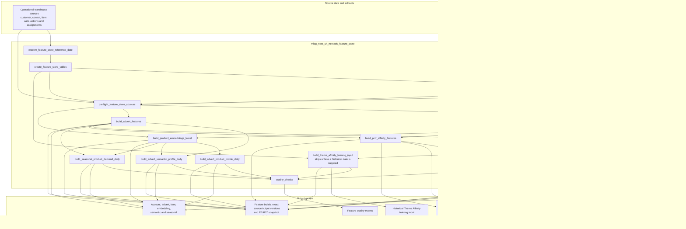

# Feature Store Job Flow

This page shows the dependency order inside
`mktg_next_uk_nextads_feature_store`. For the inclusive inputs-and-outputs guide
covering all 48 NextAds jobs declared in this checkout, start with
[`nextads_job_table_flow.md`](nextads_job_table_flow.md).

The shared route runs in the `DEV_FEATURE_STORE` target and writes to
`marketingdata_dev.nextads_feature_store`. It is a model-building layer, not
part of live production delivery.

The job keeps reusable feature creation separate from final scoring and
decisioning. It does not create production rankings, assignments or delivery
payloads.

Use the following documents for detail rather than repeating it here:

- [Feature Store README](../feature_store/README.md) for delivery gates and
  current evidence.
- [`feature_store_table_design.md`](../feature_store/feature_store_table_design.md) for
  table grain, keys, dates, ownership and refresh expectations.
- [`migration_backlog.md`](../feature_store/migration_backlog.md) for remaining
  migration and environment gates.
- [`building_a_challenger_model.md`](../feature_store/building_a_challenger_model.md)
  for the model-author route that consumes READY snapshots.
