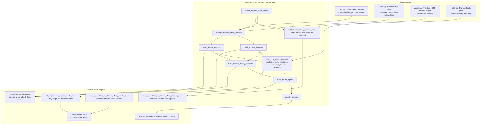

# Feature Store Flow

The shared Feature Store route runs in the `DEV_FEATURE_STORE` target and writes
to `marketingdata_dev.nextads_feature_store`. It is a model-building layer, not
part of live production delivery.

`next_uk_nextads_fs_theme_affinity_model_input` is the daily/latest model-input
contract. `next_uk_nextads_fs_theme_affinity_training_input` is historical
labelled training data and requires an explicit historical training reference
date.

Feature Store creates reusable features and model inputs. It does not create
final assignment, ranking, delivery or production scoring decisions.
