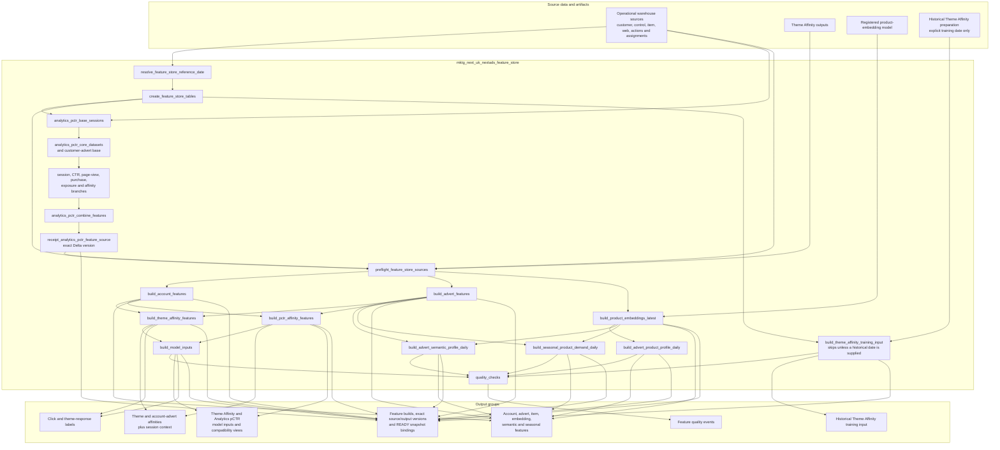

# Feature Store Job Flow

This page shows the dependency order inside `mktg_next_uk_nextads_feature_store`. For the inclusive inputs-and-outputs guide covering all 40 NextAds jobs declared in this checkout, start with [`nextads_job_table_flow.md`](nextads_job_table_flow.md).

The shared route runs in the `DEV_FEATURE_STORE` target and writes to `marketingdata_dev.nextads_feature_store`. It is a model-building layer, not part of live production delivery.

The retained Analytics pCTR SQL now runs as source-building tasks inside this job. The receipt task pins the combined source before preflight and publication, so there is no separate Analytics pCTR source saved job or child-job dependency.

The job keeps reusable source and feature creation separate from final model scoring and decisioning. It does not create production rankings, assignments or delivery payloads.

## Declared Model Consumption And Research Boundary

Models supported by the shared lifecycle use the same declaration and accepted-snapshot contract. Shopping Bag is currently the only model supported through that full route:

```mermaid
flowchart LR
  declaration["Model and research declaration<br/>nextads_models.yaml"]
  builders["Accepted reusable or on-demand<br/>Feature Store builders"]
  snapshots["READY Feature Store snapshots"]
  lifecycle["Centrally owned model-development job<br/>build, research, select or evaluate"]
  receipt["Point-in-time TrainingSetReceipt"]
  model["Registered DEV model"]
  frame["Immutable PII-reduced research frame<br/>at one exact Delta version"]
  parent["MLflow parent research run"]
  candidates_run["Declared nested candidate runs"]
  evidence["Comparable validation evidence<br/>and readable explanations"]
  recommendation["Automatic recommendation"]
  selection["AUTO or durable reviewed selection"]
  selected_test["Selected candidate only<br/>untouched test evidence"]
  selected_model["Selected registered DEV model"]
  automl["Optional bounded AutoML discovery"]
  candidates["Accepted SB1 and SB2 candidate build"]
  evaluation["Isolated evaluation scores"]
  serving["Serving portfolios, assignments and payloads"]

  declaration --> lifecycle
  builders --> snapshots --> lifecycle
  lifecycle --> receipt
  receipt --> model
  receipt --> frame --> parent --> candidates_run --> evidence --> recommendation
  recommendation --> selection --> selected_test --> selected_model
  frame -. "disabled by default" .-> automl
  model --> evaluation
  selected_model --> evaluation
  snapshots --> evaluation
  candidates --> evaluation
  evaluation -. "no write" .-> serving
```

The lifecycle job reads the exact Delta versions recorded by READY Feature Store snapshots and saves those bindings before training. Point-in-time joins prevent later information from leaking into earlier observations. Shopping Bag's account-activity and label builders remain on-demand Python entry points; the scheduled Feature Store job does not rebuild those two inputs.

`BUILD` trains the existing declared route. `RESEARCH` compares model options on the same fixed data and keeps the final test period hidden. `REVIEW_SELECT` records the chosen model and tests only that choice. `EVALUATE` pins an exact registered model, READY features and an accepted advert-candidate attempt, then writes isolated comparison scores. None of these operations changes serving score selection, assignments or payloads.

AutoML remains a separate, manually enabled DEV discovery route. It cannot register or activate a winner. Analytics pCTR is declared for compatibility but is not currently supported end to end through these shared operations.

Use the following documents for detail rather than repeating it here:

- [Feature Store README](../feature_store/README.md) for delivery gates and current evidence.
- [`feature_store_table_design.md`](../feature_store/feature_store_table_design.md) for table grain, keys, dates, ownership and refresh expectations.
- [`migration_backlog.md`](../feature_store/migration_backlog.md) for remaining migration and environment gates.
- [Model research: data scientist guide](../model_research_walkthrough.md) for model declarations, comparison rules, evidence, retries and the worked Shopping Bag example.
