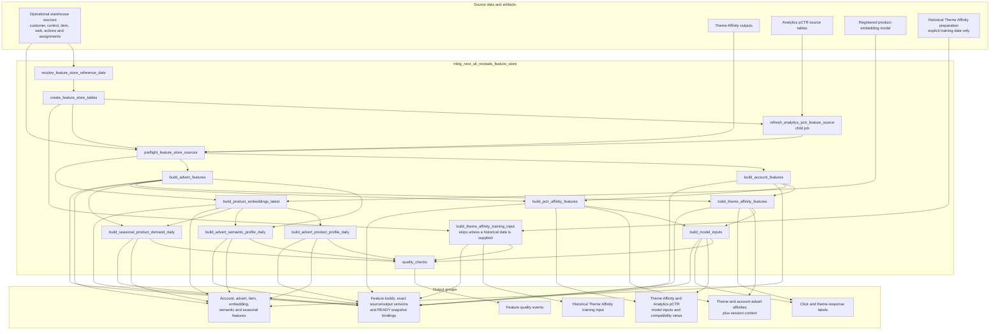

# Feature Store Job Flow

This page shows the dependency order inside
`mktg_next_uk_nextads_feature_store`. For the inclusive inputs-and-outputs guide
covering all 51 NextAds jobs declared in this checkout, start with
[`nextads_job_table_flow.md`](nextads_job_table_flow.md).

The shared route runs in the `DEV_FEATURE_STORE` target and writes to
`marketingdata_dev.nextads_feature_store`. It is a model-building layer, not
part of live production delivery.

The job keeps reusable feature creation separate from final scoring and
decisioning. It does not create production rankings, assignments or delivery
payloads.

## Current Model Consumption And Research Boundary

The Shopping Bag model route uses the same accepted-snapshot contract without
running the complete shared job:

```mermaid
flowchart LR
  observed["Observed Shopping Bag impressions and clicks"]
  preparation["Manual Shopping Bag feature preparation"]
  snapshots["READY label, account-activity and advert snapshots"]
  receipt["Point-in-time TrainingSetReceipt"]
  model["Compatible model-development run<br/>and registered DEV model"]
  frame["Immutable PII-reduced research frame<br/>at one exact Delta version"]
  parent["MLflow parent research run"]
  candidates_run["Four nested candidate runs"]
  evidence["Comparable validation evidence<br/>and readable explanations"]
  recommendation["Automatic recommendation"]
  selection["AUTO or durable reviewed selection"]
  selected_test["Selected candidate only<br/>untouched test evidence"]
  selected_model["Selected registered DEV model"]
  automl["Optional bounded AutoML discovery"]
  candidates["Accepted SB1 and SB2 candidate build"]
  evaluation["Isolated evaluation scores"]
  serving["Serving portfolios, assignments and payloads"]

  observed --> preparation --> snapshots --> receipt
  receipt --> model
  receipt --> frame --> parent --> candidates_run --> evidence --> recommendation
  recommendation --> selection --> selected_test --> selected_model
  frame -. "disabled by default" .-> automl
  model --> evaluation
  selected_model --> evaluation
  snapshots --> evaluation
  candidates --> evaluation
  evaluation -. "no write" .-> serving
```

The training job opens the exact Delta versions recorded by the READY snapshot
bindings. Feature timestamps must be valid for the observation time, including
the declared one-day availability lag for Shopping Bag account activity. The
receipt records those bindings before training starts.

Shopping Bag label snapshots use `session_date` as their daily snapshot scope,
while `exposure_timestamp` remains the Feature Store time-series key and exact
point-in-time observation timestamp. The model declaration also uses
`session_date` for the training receipt window and research split date. Feature
joins continue to use `exposure_timestamp`, so a session that crosses a calendar
boundary stays in its declared snapshot and split without weakening the
point-in-time join.

The compatible model-development job compares logistic regression and
gradient-boosted trees inside one MLflow run, registers the selected DEV
version and reuses that exact build on an identical retry.

The separate DEV research job uses an optional research declaration from
`nextads_models.yaml`. It packs the declared train, validation and test dates
into an immutable research frame containing a hashed row identity, label,
model features and allowed reporting slices. Raw observation keys are not
retained in that frame. Candidate fitting and recommendation use train and
validation only; the test split remains unread until an exact selection
decision has been persisted.

The Shopping Bag declaration compares logistic regression, random forest,
gradient-boosted trees and Spark XGBoost. Each candidate has its own nested
MLflow run with its parameters, seed, train and validation metrics, fitted
model and the same evidence set: precision-recall, ROC, calibration, lift and
cumulative gain, score distributions, top-fraction confusion, slice results,
missing/default coverage and named feature importance. The parent run holds
the exact definition, plan, training receipt and feature versions, prevalence
baseline, candidate comparison, automatic recommendation and hashed artifact
manifest.

The automatic recommendation orders selectable candidates by validation
PR-AUC, then validation log loss, then candidate ID. The current Shopping Bag
plan requires a separate reviewed selection with the exact research build,
candidate, reviewer and reason; `AUTO` is also supported by the same contract.
Only the selected child receives untouched test evidence, deterministic test
confidence intervals and Unity Catalog registration. The registered pipeline
signature contains exactly the declared model inputs and exposes `prediction`
and positive-class `score` as scalar doubles. No model alias is set.

The optional AutoML job is a separate, manually enabled DEV discovery route.
It runs on its own no-library DBR 15.4 ML cluster, reads the exact research
frame, exposes only its train and validation periods, records its experiment
and recipe associations, and does not register or activate a winner.

Supplied candidate aliases and reviewed classes under `next_ads.*` implement
fitting and standard prediction only. Candidate plug-ins do not own data
splits, evidence gates, selection, registration or provider publication. Extra
evidence producers receive bounded aggregate evidence; the standard evidence
remains mandatory.

The separate ongoing-evaluation job pins the registered model, READY features
and accepted candidate attempt before writing only
`next_uk_nextads_model_evaluation_scoring_builds` and
`next_uk_nextads_model_evaluation_scores`.

Use the following documents for detail rather than repeating it here:

- [Feature Store README](../feature_store/README.md) for delivery gates and
  current evidence.
- [`feature_store_table_design.md`](../feature_store/feature_store_table_design.md) for
  table grain, keys, dates, ownership and refresh expectations.
- [`migration_backlog.md`](../feature_store/migration_backlog.md) for remaining
  migration and environment gates.
