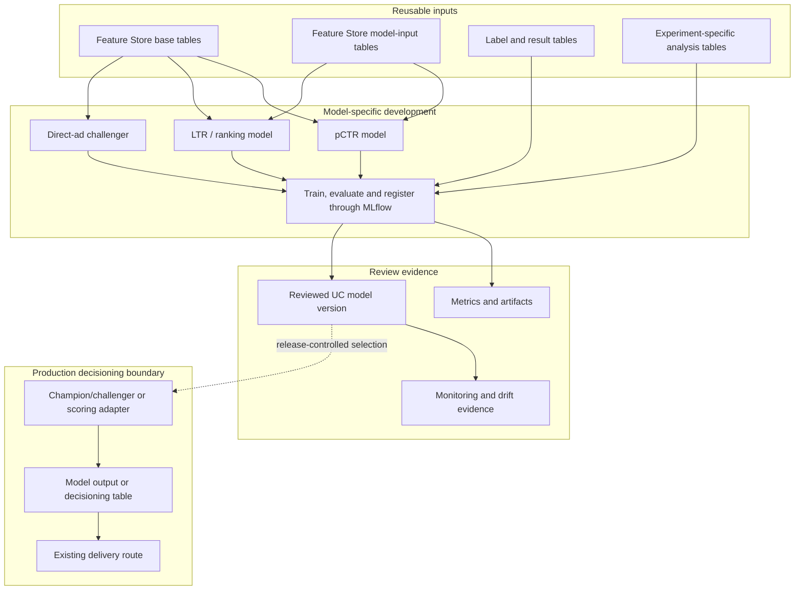

# Future Model Adoption

Future pCTR, LTR and direct-ad challenger work should reuse feature contracts
and the shared MLflow lifecycle without changing production decisioning by
default.

Feature creation should stay in reusable feature contracts when the signal is
shared across models. Final scores, rankings, assignment choices and delivery
payloads should stay in model output, decisioning or delivery contracts.
