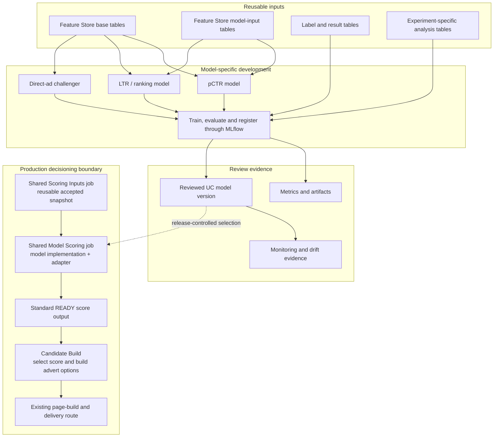

# Connecting A Future Model To NextAds

Future pCTR, LTR and direct-ad challenger work should reuse feature contracts and the shared MLflow lifecycle without changing production decisioning by default.

Researching or registering a model does not make it affect customers. A model becomes operational only after it publishes scores in the standard shape, is added to the reviewed score-selection configuration, passes route checks and is released through the normal environment path. Start with [NextAds job and table flow](nextads_job_table_flow.md) for the difference between scores, advert options, assignments and delivery.

Feature creation should stay in reusable feature contracts when the signal is shared across models. Operational input preparation belongs in the separate shared scoring-inputs job only when its accepted snapshot is genuinely reusable by score sources; model-specific preparation stays inside that model's shared scoring implementation. Final scores, advert rankings, assignment choices and delivery payloads stay in scoring, Candidate Build or delivery contracts. A new model does not move its inputs into Candidate Build.

## Operational connection steps

A future score source follows the same route whether it scores a theme, an advert or another supported entity:

1. Register its name, capability, entity type and source-column mapping in `configs/scoring/scoring_settings.yaml`.
2. Build the model-specific calculation so it emits one row per account and entity with raw and final scores.
3. Use `adapt_configured_provider_scores` to convert those columns into the shared score shape, then use `stage_provider_signals` to write one exact score-output attempt.
4. Complete the shared publication checks and write the READY record last.
5. Add the score source to the reviewed score-selection list in a non-serving `SHADOW` or `EVALUATE` role first.
6. Review the output and failure behavior before a separate configuration and release change assigns it to `best` or `best_challenger`.

The code calls each source a `provider` and calls the score-selection list a `portfolio`. The list binds a route and role to an exact accepted output; it does not train the model or calculate the scores.

When two serving roles use the same score output, advert-option scoring is calculated once and recorded for both role identities. A different compatible source uses the same adapter without adding source-specific logic to the shared candidate or assignment code.

No model-specific code belongs in the shared adapter or publisher. Add a compatibility publisher only when an existing consumer still requires an older table shape. The consuming route must support the source's capability: the current theme-ranking route consumes `account_theme`; accepting `account_ad` in the publication contract does not by itself create an advert-score serving route.

## Current configuration

- Theme Affinity supplies both current serving positions, `best` and `best_challenger`.
- Markov is shadow-only and does not block advert-option publication.
- Operational model scoring currently accepts only `theme_affinity`.
- Analytics pCTR is not supported end to end through the shared model lifecycle.

See [job settings](../CICD/nextads_databricks_job_settings.md) for current parameters and [the runtime map](../CICD/nextads_databricks_runtime_map.md) for declared schedules and hand-offs.
