# MLflow Model Lifecycle

The model lifecycle moves exact reviewed Unity Catalog model versions through
controlled namespaces. Promotion/registering a model is separate from selecting
that model for production scoring.

```mermaid
flowchart LR
  subgraph dev["Personal DEV proof"]
    input["Labelled training table"]
    train["Model train job<br/>Spark or GPU route"]
    experiment["MLflow experiment run"]
    dev_model["Personal DEV UC model version"]
    pr["PR evidence<br/>run id, model version, metrics, artifacts"]
  end

  subgraph integration["DEV Integration"]
    merge["Code merged to develop"]
    copy_dev["Copy reviewed DEV version"]
    integration_model["marketingdata_dev.nextads_integration<br/>registered model version"]
  end

  subgraph preprod["PREPROD release validation"]
    import_preprod["Import exact DEV Integration version"]
    preprod_model["PREPROD registered model version"]
    preprod_run["Run consuming workflow with explicit model URI"]
    preprod_evidence["Validation evidence"]
  end

  subgraph prod["PROD controlled movement"]
    promote_prod["Promote exact PREPROD version"]
    prod_model["PROD registered model version and alias"]
    select_uri["Select production model URI or alias<br/>separate operational change"]
    monitoring["MLflow drift evidence<br/>Databricks quality monitor where applicable"]
  end

  input --> train --> experiment --> dev_model --> pr
  pr --> merge --> copy_dev --> integration_model
  integration_model --> import_preprod --> preprod_model --> preprod_run --> preprod_evidence
  preprod_evidence --> promote_prod --> prod_model
  prod_model -. "does not automatically change scoring" .-> select_uri
  select_uri --> monitoring
```

The lifecycle is version-based. PREPROD and PROD should receive the exact model
version reviewed earlier, not a retrained approximation.
