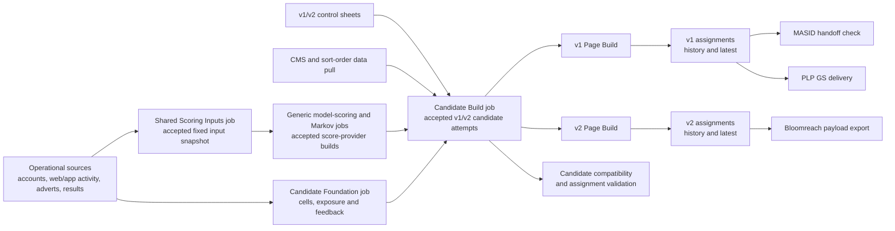
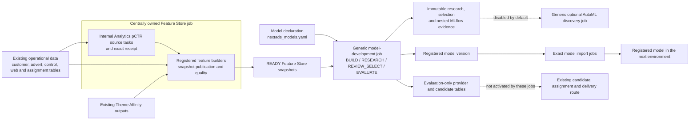

# NextAds Job And Table Data Flow

Start here for the complete NextAds flow. This page first explains what the system does and defines the terms used by its jobs. It then inventories every NextAds job declared under `pipelines/databricks/jobs`: 41 jobs across 37 YAML definition files in this checkout. It covers assignment and delivery, reporting, realtime data, Feature Store, model development and research, model movement, validation and table operations. Each inventory row shows what a job consumes and what it produces.

The page stays at a human-readable route level. Linked documents own detailed keys, schemas, schedules, runtime evidence and operating instructions. Physical catalogs and schemas vary by bundle target; table names below are logical names. An in-flight job being declared on a feature branch does not prove that it is deployed, scheduled or proven in a shared environment.

## What NextAds Does

NextAds turns three kinds of information into adverts that can be delivered to customers:

1. **Advert controls** say which adverts are active and where they are allowed to appear.
2. **Model scores** estimate which themes or adverts are relevant to each account.
3. **Customer information** supplies the customer's assignment group, recent advert exposure and advert-performance feedback.

The system combines those inputs to create eligible, scored advert options. A later page-build step chooses the final adverts for each account and placement. V1 writes location-based assignments for downstream MASID use, checks that handoff and delivers the PLP export. V2 writes page-type-and-rank assignments and delivers a Bloomreach payload.

The route deliberately separates three responsibilities. The unscheduled `mktg_next_uk_nextads_scoring_inputs` job prepares reusable fixed theme and item inputs. The scheduled `mktg_next_uk_nextads_model_scoring` job calls it and then publishes a standard score output. The independently scheduled `mktg_next_uk_nextads_candidate_build` job selects accepted score and customer inputs, builds V1 and V2 advert options, and invokes the page-build jobs. It does not prepare scoring inputs, train models or calculate customer cells.

## The Daily Assignment And Delivery Flow

The times below are the declared Europe/London schedules. A declared schedule describes the bundle configuration; it is not evidence that a particular environment ran successfully on a particular date.

| Time | What happens | What it means |
| --- | --- | --- |
| **12:15** | `mktg_next_uk_nextads_model_scoring` starts with `model_name=theme_affinity`. It synchronously calls the unscheduled `mktg_next_uk_nextads_scoring_inputs` job for the same date. | The child run refreshes the authoritative theme mapping, item attributes and item-to-theme data, records their exact accepted versions, and stops. The scoring job then prepares Theme Affinity model inputs, calculates account-to-theme scores, records a READY score output, publishes the older compatibility tables and runs its checks. |
| **13:00** | `mktg_next_uk_nextads_markov_scoring` calculates Markov scores from an accepted scoring-input snapshot. | Markov uses the same standard score shape, but the current configuration keeps it as a shadow comparison. Its scores do not affect delivered adverts unless a future reviewed configuration explicitly selects them. |
| **16:00** | `mktg_next_uk_nextads_candidate_foundation` prepares customer cells, repeat-ad exposure and advert feedback, then records the exact accepted versions together. | Both routes select this accepted record. Customer cells and repeat-ad exposure affect V1 and V2; advert feedback is applied only by V1. This is not model training or model scoring. |
| **18:00** | `mktg_next_uk_nextads_candidate_build` runs independently. | It selects one accepted set of customer information, loads and audits V1 and V2 controls, refreshes V2 CMS/sort-order inputs, chooses the exact score output assigned to each route role, checks theme coverage, and maps account-theme scores to adverts that are eligible under each control. Separate V1/V2 advert-quality audits publish diagnostic metrics without gating the mapping tasks. |
| **After the 18:00 mapping** | The main job synchronously calls the V1 and V2 page-build jobs with the exact accepted advert-option attempts. | V1 chooses and publishes location-based assignments, then calls the read-only MASID handoff check and PLP delivery. V2 chooses and publishes page-type-and-rank assignments, then calls the Bloomreach payload export. A child failure is returned to the calling route rather than being treated as an unrelated run. |
| **21:00** | `mktg_next_uk_nextads_candidate_compatibility` reads the exact READY V1 and V2 advert-option attempts. | It derives the older preranked table shapes for existing consumers and then invokes assignment validation. The 18:00 mapping tasks do not write those legacy tables directly. |

The current score-selection configuration assigns Theme Affinity to both the `best` and `best_challenger` roles. Those are two selected roles, not two different scoring methods at present. Markov remains shadow-only.

## Terms Used In This Guide

Plain descriptions come first below. The exact internal name follows only when it is needed to find configuration, tasks or tables.

| Plain term | Meaning | Internal wording you may see |
| --- | --- | --- |
| **Scoring** | Giving an account/theme or account/advert pair a numeric relevance or likelihood value. A score informs the later choice; it is not the final advert assignment. | Model scoring, provider scoring |
| **Score source** | A method that calculates scores, such as Theme Affinity or Markov, and publishes them in the same standard shape so later jobs do not need model-specific logic. | Score provider, provider |
| **Score-selection list** | Reviewed configuration that assigns exact READY score outputs to serving or comparison roles for V1 and V2. It selects previously calculated scores; it does not calculate them. | Scoring portfolio, portfolio entries |
| **Fixed scoring inputs** | The exact versions of theme mapping, item attributes and item-to-theme data used by a scoring run. Pinning the versions prevents a retry from silently reading different data. | Scoring-input snapshot |
| **Prepared model-input data** | Theme Affinity's account-to-theme features prepared for one fixed scoring-input snapshot before prediction. This is the first use of “foundation” in implementation names. | Scoring foundation |
| **Scoring work record** | A temporary record connecting one scoring execution to its exact inputs, output attempt, owner and expiry. It protects retries and concurrent runs. This is the second use of “foundation”. | Foundation context, scoring-foundation run context |
| **Shared customer information** | Customer cells, recent repeat-ad exposure and advert feedback accepted together for the evening run. Both routes select the record and use the first two inputs; only V1 applies advert feedback. This is the third, separate use of “foundation”. | Candidate Foundation |
| **Model option** | One algorithm or parameter configuration compared during research. | Model candidate, research candidate |
| **Advert option** | An eligible, scored advert that might be selected for an account and placement. It is not yet the advert that will be delivered. | Advert candidate, candidate row |
| **Build** | A recorded logical result for fixed inputs, such as a feature build, score build, advert-option build or assignment build. The surrounding noun must be stated because “build” alone is ambiguous. | Build record |
| **Attempt** | One execution or retry that tries to create or publish a build. Several attempts can relate to the same logical result without making them different inputs. | Build attempt, run context |
| **READY** | The output and its checks completed sufficiently for an allowed downstream reader to select the recorded versions. It does not mean a model has been activated for serving. | READY build or snapshot |
| **Assignment** | A final advert choice written for an account and V1 location, or for an account, V2 page type and rank. | Assignment history/latest tables |
| **Delivery** | Making accepted assignments available to a serving destination: the V1 assignment table is consumed downstream by MASID, the V1 route exports PLP data, and V2 exports a Bloomreach payload. The MASID child job in this repository checks the handoff but does not write delivery data. | Handoff, export, payload publication |

“Candidate” and “foundation” are therefore not safe shorthand. This guide uses “model option” or “advert option”, and describes which of the three foundation records it means before giving the internal identifier.

## Research Is Separate From Live Assignment

The Feature Store and model-development jobs support reusable data, model research, reviewed selection, registration and isolated evaluation. They do not change delivered adverts merely because a model was researched or registered:

- `BUILD` runs the existing declared training route.
- `RESEARCH` compares declared model options using the same fixed data splits while keeping the final test split hidden from that comparison.
- `REVIEW_SELECT` records the human-reviewed choice, evaluates only that option on the held-out test split and registers the selected DEV model version.
- `EVALUATE` applies an exact registered model to accepted historical advert options and writes isolated comparison evidence, not live assignments.
- The separate AutoML discovery job is manual, DEV-only and disabled by default. Its output is research evidence, not registration or activation.

Registration saves a numbered model version. Moving that exact version to another environment copies the reviewed artifact. Activation is a further serving change that makes a score source influence advert options, assignments and delivery. None should be inferred from another.

## Where The Former Model-Specific Saved Jobs Went

The consolidation did not place every removed saved job behind a new generic job. The status must be read literally: **absorbed** means the responsibility runs inside a current shared job; **on-demand code only** means an entry point remains but no saved bundle job invokes it; **retired without a shared replacement** means the saved job was removed and the shared route does not currently provide that complete operation.

| Former saved job | Status | Current position |
| --- | --- | --- |
| `mktg_next_uk_nextads_theme_inputs` | **Absorbed into a shared input job** | The mapping, attribute and accepted-input work now runs in `mktg_next_uk_nextads_scoring_inputs`, called by shared model scoring for the same date. The new name reflects that the accepted snapshot is reusable and not owned by Theme Affinity or Candidate Build. |
| `mktg_next_uk_nextads_theme_affinity` | **Absorbed and expanded** | Its bundle resource identity and Databricks job history are retained by `mktg_next_uk_nextads_model_scoring`. The combined job is parameterised by `model_name`, currently supports operational `theme_affinity`, and moves the old 13:00 Theme Affinity start to the former Theme Inputs time of 12:15. |
| `mktg_next_uk_nextads_theme_feature_compatibility` | **Absorbed** | Compatibility publication and its checks now run at the end of the shared model-scoring route. |
| `mktg_next_uk_nextads_analytics_pctr_feature_source` | **Absorbed** | The retained Analytics pCTR SQL source tasks, validation and exact source receipt now run inside the Feature Store job before publication. |
| `mktg_next_uk_nextads_analytics_pctr_snapshot_verification` | **Partly absorbed; focused verification retired** | pCTR table preparation, publication and general feature-quality checks now belong to Feature Store. The former failure-injection and read-back proof was not moved into that job: `verify_pctr_feature_snapshot.py` remains as code with no saved-job caller. |
| `mktg_next_uk_nextads_shopping_bag_ongoing_evaluation` | **Absorbed for the declared Shopping Bag route** | Its evaluation responsibility is available through the model-development job's `EVALUATE` operation. |
| `mktg_next_uk_nextads_shopping_bag_feature_preparation` | **Partly absorbed; Shopping Bag input remains on demand** | Its shared advert-feature calculation now runs inside Feature Store. The Shopping Bag account-activity builder remains a Python entry point with no saved-job caller. |
| `mktg_next_uk_nextads_shopping_bag_label_publication` | **On-demand code only** | The Shopping Bag click-label builder remains a Python entry point with no saved-job caller. |
| `mktg_next_uk_nextads_analytics_pctr_prediction_verification` | **Retired without a shared replacement** | The saved verification job is gone. The retained paused Analytics pCTR job still contains its legacy prediction task, but no shared lifecycle operation owns this proof. |
| `mktg_next_uk_nextads_analytics_pctr_adoption` | **Retired without a shared replacement** | Analytics pCTR remains compatibility-only in the shared model declaration and is not supported end to end for adoption or activation. |
| `mktg_next_uk_nextads_model_development_runtime_smoke` | **Retired without a saved-job replacement** | The runtime-smoke script remains for code/test use, but no non-test bundle job calls it. |

Adding a supported invocation for a code-only builder or implementing a missing Analytics pCTR lifecycle operation is new orchestration work. It should not be presented as something this consolidation already provides.

## Finding A Run's Outputs

Run outputs expose their destinations in one of two ways. Repository-owned modern table writes and previously implicit external sinks use a compact `NEXTADS_OUTPUT=` JSON line; Delta outputs also include the committed version, row count and receipt when those values are available. Established jobs whose existing success message already contains the exact resolved table or file path keep that message. Registered-model and MLflow outputs remain named in their operation-specific evidence marker. SQL and Lakeflow tasks expose their declared output tables in the task statement or pipeline graph.

Read-only validation and smoke tasks do not emit an output destination. A reused table reference may be logged with `reused=true`; operation-specific evidence markers identify reused receipts, runs, versions and artifacts that were not rewritten.

## Assignment And Delivery Route

### Assignment And Delivery Job Inputs And Outputs

| Job | Consumes | Produces |
| --- | --- | --- |
| [`mktg_next_uk_nextads_scoring_inputs`](../../pipelines/databricks/jobs/mktg_next_uk_nextads_scoring_inputs.yml) | Authoritative theme mapping, item attributes and product/control inputs for one `run_date` | Physical theme inputs plus `next_uk_nextads_scoring_input_theme_mapping_raw`, `next_uk_nextads_scoring_input_item_themes`, `next_uk_nextads_scoring_input_snapshots` and `next_uk_nextads_scoring_input_snapshot_sources`; it has no schedule and is called by shared model scoring |
| [`mktg_next_uk_nextads_model_scoring`](../../pipelines/databricks/jobs/mktg_next_uk_nextads_model_scoring.yml) | A declared `model_name`; the current `theme_affinity` implementation calls the shared scoring-inputs job for the same `run_date`, then consumes the accepted snapshot and Theme Affinity preparation sources | Ranked account-theme foundation, `next_uk_nextads_scoring_foundation_builds`, `next_uk_nextads_scoring_foundation_outputs`, `next_uk_nextads_scoring_foundation_run_contexts`, `next_uk_nextads_score_provider_signals`, `next_uk_nextads_score_provider_builds`, `next_uk_nextads_score_provider_run_contexts`, legacy provider/feature compatibility outputs and both sense-check summaries |
| [`mktg_next_uk_nextads_markov_scoring`](../../pipelines/databricks/jobs/mktg_next_uk_nextads_markov_scoring.yml) | One accepted scoring-input snapshot plus web/app activity, views and baskets | An optional shadow build in the same score-provider tables, plus Markov compatibility outputs such as theme transitions and next-theme scores |
| [`mktg_next_uk_nextads_candidate_foundation`](../../pipelines/databricks/jobs/mktg_next_uk_nextads_candidate_foundation.yml) | Account populations, existing cell assignments, web/app activity and advert-result history | `next_uk_nextads_customer_cells_fixed_latest`, fixed-cell history, transient/latest cells, `next_uk_nextads_customer_cells_latest`, `next_uk_nextads_candidate_repeat_ad_exposure`, `next_uk_nextads_candidate_ad_feedback`, `next_uk_nextads_candidate_foundation_builds` and `next_uk_nextads_candidate_foundation_sources` |
| [`mktg_next_uk_nextads_data_pull`](../../pipelines/databricks/jobs/mktg_next_uk_nextads_data_pull.yaml) | Landed v2 advert IDs plus CMS and sort-order sources | `nextads_sort_order_v2_latest`, `nextads_sort_order_v2`, `next_uk_nextads_cms_content_latest` and `next_uk_nextads_cms_content` |
| [`mktg_next_uk_nextads_candidate_build`](../../pipelines/databricks/jobs/mktg_next_uk_nextads.yml) | V1/v2 control sheets, one accepted Candidate Foundation, accepted scoring snapshots/provider builds, CMS and sort order | Versioned control/exclusion tables, scoring portfolios/entries, `next_uk_nextads_candidate_builds`, `next_uk_nextads_candidate_scores`, `next_uk_nextads_candidate_ad_sets` and the exclusions Cosmos container, then both page-build jobs |
| [`mktg_next_uk_nextads_page_build`](../../pipelines/databricks/jobs/mktg_next_uk_nextads_page_build.yml) | One accepted v1 candidate attempt, pinned customer cells, v1 control, NextGen assignments and advert results | `next_uk_nextads_assignments_build_staging`, `next_uk_nextads_assignments`, `next_uk_nextads_assignments_latest` and assignment-build events; then the MASID handoff-check and PLP-delivery child jobs |
| [`mktg_next_uk_nextads_masid_handoff`](../../pipelines/databricks/jobs/mktg_next_uk_nextads_masid_handoff.yml) | `next_uk_nextads_assignments_latest` | Validation/alert result only; no table write |
| [`mktg_next_uk_nextads_plp_gs_delivery`](../../pipelines/databricks/jobs/mktg_next_uk_nextads_plp_gs_delivery.yml) | v1 raw/latest control, PLP placement and multipage-location tables | `next_uk_nextads_plp_gs_latest`, the territory-specific latest table and the configured delivery file |
| [`mktg_next_uk_nextads_page_build_v2`](../../pipelines/databricks/jobs/mktg_next_uk_nextads_page_build_v2.yml) | One accepted v2 candidate attempt, pinned customer cells, v2 control and NextGen assignments | `next_uk_nextads_assignments_v2_build_staging`, `next_uk_nextads_assignments_v2`, `next_uk_nextads_assignments_v2_latest` and assignment-build events; then the payload child job |
| [`mktg_next_uk_nextads_payload_export`](../../pipelines/databricks/jobs/mktg_next_uk_nextads_payload_export.yml) | v2 latest assignments, fixed/latest customer cells, v2 latest control and account/RPID mapping | `next_uk_nextads_payload`, `next_uk_nextads_payload_latest` and the configured Bloomreach CSV output |
| [`mktg_next_uk_nextads_candidate_compatibility`](../../pipelines/databricks/jobs/mktg_next_uk_nextads_candidate_compatibility.yml) | Accepted v1/v2 candidate builds, scores and advert sets | Legacy v1/v2 preranked candidate snapshots; then the independent assignment-validation job |

### Shared Scoring Inputs And Candidate Build Task Boundaries

The unscheduled shared scoring-inputs job owns only the theme-mapping, item-attribute and accepted-snapshot tasks. The generic model-scoring job calls it for the same logical date. The separately scheduled 18:00 Candidate Build owns only the V1 and V2 candidate routes and does not call or contain scoring-input preparation.

| Stage and tasks | Consumes | Produces or triggers |
| --- | --- | --- |
| Shared Scoring Inputs: `land_authoritative_theme_mapping`, `refresh_item_attributes`, `build_authoritative_item_themes` and `accept_scoring_inputs` | Authoritative theme mapping, item attributes, product/control inputs, exact landing identity and `run_date` | Physical theme inputs plus `next_uk_nextads_scoring_input_theme_mapping_raw`, `next_uk_nextads_scoring_input_item_themes`, `next_uk_nextads_scoring_input_snapshots` and `next_uk_nextads_scoring_input_snapshot_sources` |
| `select_candidate_foundation` | `next_uk_nextads_candidate_foundation_builds` and `next_uk_nextads_candidate_foundation_sources` | Pinned customer-cell, exposure and feedback table versions in task values; no table write |
| `load_control_sheet_v1` and `audit_control_sheet_v1` | v1 Google control, PLP placement and multipage inputs | v1 raw/history/latest control tables, PLP raw/history/latest tables, `next_uk_nextads_control_sheet`, `next_uk_nextads_control_sheet_latest`, `next_uk_nextads_multipage_locations` and `next_uk_nextads_multipage_locations_latest`; audit is read-only |
| `load_control_sheet_v2`, `trigger_data_pull_for_CMS_pull`, `process_control_sheet_v2` and `audit_control_sheet_v2` | v2 Google control/exclusions, refreshed CMS content, sort order and product catalog | v2 raw/history/latest control tables, `next_uk_nextads_exclusions`, `next_uk_nextads_exclusions_latest`, `next_uk_nextads_control_sheet_v2` and `next_uk_nextads_control_sheet_latest_v2`; audit is read-only |
| `quality_audit_ads_v1` and `quality_audit_ads_v2` | The loaded route control plus advert items, image items and theme evidence | `next_uk_nextads_advert_quality_metrics` and `next_uk_nextads_advert_quality_metrics_latest`; V2 waits for V1 so the two routes do not update the shared latest table concurrently |
| `write_exclusions` | `next_uk_nextads_exclusions_latest` | Azure Cosmos DB exclusions container |
| `resolve_scoring_portfolio_v1` and `resolve_scoring_portfolio_v2` | `next_uk_nextads_scoring_input_snapshots`, provider builds/signals and configured portfolio policy | `next_uk_nextads_scoring_portfolios` and `next_uk_nextads_scoring_portfolio_entries`, plus exact selected IDs/versions in task values |
| `validate_score_provider_theme_coverage_v1` and `validate_score_provider_theme_coverage_v2` | Selected provider signals, accepted item-theme snapshot and the matching v1/v2 latest control | Validation result only; no table write |
| `map_theme_scores_to_ads_v1` | Selected provider signals, V1 control, pinned customer cells, repeat exposure and advert feedback | Accepted V1 attempt in `next_uk_nextads_candidate_builds`, `next_uk_nextads_candidate_scores` and `next_uk_nextads_candidate_ad_sets` |
| `map_theme_scores_to_ads_v2` | Selected provider signals, V2 control, pinned customer cells and repeat exposure; advert feedback is deliberately disabled | Accepted V2 attempt in `next_uk_nextads_candidate_builds`, `next_uk_nextads_candidate_scores` and `next_uk_nextads_candidate_ad_sets` |
| `run_page_build_v1` and `run_page_build_v2` | Exact candidate, provider, scoring-input and Candidate Foundation identities from the preceding tasks | Synchronous v1/v2 page-build child jobs and their delivery children |

The exact task dependencies and failure boundaries are kept in [`v1_v2_parallel_route.md`](v1_v2_parallel_route.md), while the time-based operational hand-offs are in [`nextads_databricks_runtime_map.md`](../CICD/nextads_databricks_runtime_map.md).

## Reporting, Validation, Realtime And Retention Job Inputs And Outputs

These jobs support the assignment route. They either measure what was delivered, prepare realtime inputs, validate accepted outputs or retain the bounded history needed by the route.

| Job | Consumes | Produces |
| --- | --- | --- |
| [`mktg_next_uk_nextads_assignment_validation`](../../pipelines/databricks/jobs/mktg_next_uk_nextads_assignment_validation.yml) | Latest v1 assignments and cells, CMS content, v1/v2 controls, sort order, item themes and product catalog | Validation findings and warning notifications only; no table write |
| [`mktg_next_uk_nextads_results_cicd`](../../pipelines/databricks/jobs/mktg_next_uk_nextads_results.yml) | Assignment history, control and multipage data, cells, web/app sessions, pages, screens, account mappings and outcome data | NextAds topline, aggregate, A/B, advert, location, page, targeting and advert-metadata result tables; underperforming/top-ad tables; BigQuery exports; enriched Theme Affinity inference-log labels |
| [`mktg_next_uk_nextads_realtime_results_cicd`](../../pipelines/databricks/jobs/mktg_next_uk_nextads_realtime_results.yml) | Web/app actions and transactions plus realtime tracking | `next_uk_nextads_realtime_results` and `next_uk_nextads_realtime_results_latest` |
| [`mktg_next_uk_nextads_realtime_inputs`](../../pipelines/databricks/jobs/mktg_next_uk_nextads_realtime_inputs.yml) | Product catalog, baskets and web/app sessions and views | `next_uk_nextads_viewed_bought_latest` |
| [`mktg_next_uk_nextads_realtime_data`](../../pipelines/databricks/jobs/mktg_next_uk_nextads_realtime_data.yml) | Product, advert, control, browsing, basket and existing preranked data used by the realtime builders | Item/category and advert-affinity tables plus realtime rules, product features, advert features, preranked-ad features and item-weighting rules |
| [`mktg_next_uk_nextads_table_maintenance`](../../pipelines/databricks/jobs/mktg_next_uk_nextads_table_maintenance.yml) | The explicitly allowlisted scoring-input, provider, candidate, assignment and delivery history/state tables | Retention deletes and Delta vacuum maintenance on those same tables; no new data product |

## Feature Store And Model Development Route

The hard boundary is intentional: these in-flight jobs can build features, run declared model lifecycle operations and write evaluation evidence. They do not add a provider to a serving portfolio and do not write live assignments or delivery payloads. A data scientist changes `nextads_models.yaml` and runs the centrally owned manual DEV lifecycle job rather than adding a saved job for each model or experiment. AutoML remains a separate centrally owned manual DEV job because it needs a different runtime. A selected research model has no connection to the model-import path in this route.

### Feature Store And Model Development Job Inputs And Outputs

| Route | Job | Consumes | Produces |
| --- | --- | --- | --- |
| Legacy Analytics pCTR | [`mktg_next_uk_nextads_analytics_pctr`](../../pipelines/databricks/jobs/mktg_next_uk_nextads_analytics_pctr.yml) | Operational web/session, purchase, assignment, control and item-theme data plus two registered pCTR models | The legacy `next_uk_nextAds_analytics_pctr_features`, predictions and latest-predictions tables; the job is currently paused |
| Full feature refresh | [`mktg_next_uk_nextads_feature_store`](../../pipelines/databricks/jobs/mktg_next_uk_nextads_feature_store.yml) | Operational warehouse sources and Theme Affinity outputs; its internal Analytics pCTR source tasks build and receipt the exact same-run source version before preflight | `next_uk_nextads_analytics_pctr_features`, `next_uk_nextads_analytics_pctr_feature_source_receipts`, the registered Feature Store tables, compatibility views, build/snapshot metadata and quality events described below |
| Generic model lifecycle | [`mktg_next_uk_nextads_model_development`](../../pipelines/databricks/jobs/mktg_next_uk_nextads_model_development.yml) | An `operation`, a `model_name` declared in [`nextads_models.yaml`](../../configs/models/nextads_models.yaml), READY Feature Store snapshots and only the identifiers required by that operation | `BUILD` creates a training receipt, model build, registered model version and evaluation candidates; `RESEARCH` creates the immutable research frame, candidate evidence and recommendation; `REVIEW_SELECT` records the reviewed decision, evaluates the selected candidate on the held-out test split and registers it; `EVALUATE` writes isolated scoring evidence |
| Optional generic model discovery | [`mktg_next_uk_nextads_model_discovery`](../../pipelines/databricks/jobs/mktg_next_uk_nextads_model_research_automl.yml) | A declared `model_name`, one exact research build and its immutable research-frame version | Bounded AutoML experiment, trials, leaderboard/recipe associations and a discovery receipt; no model registration or activation |
| Embedding runtime proof | [`mktg_next_uk_nextads_product_embedding_runtime_smoke`](../../pipelines/databricks/jobs/mktg_next_uk_nextads_product_embedding_runtime_smoke.yml) | Synthetic advert-item frames, the approved embedding contract/runtime and one exact registered embedding model | Two read-only smoke manifests; no table or model-alias write |
| Exact model movement | [`mktg_next_uk_nextads_model_import_dev_integration`](../../pipelines/databricks/jobs/mktg_next_uk_nextads_model_import_dev_integration.yml) and [`mktg_next_uk_nextads_model_import_preprod`](../../pipelines/databricks/jobs/mktg_next_uk_nextads_model_import_preprod.yml) | One exact source model version or alias | A digest-checked copy of that registered model in the next environment; no data tables |

## Theme Affinity Model And Monitoring Job Inputs And Outputs

The generic model-scoring job in the assignment route owns operational Theme Affinity scoring and both compatibility-publication branches when `model_name=theme_affinity`. The additional jobs below train, compare, move or monitor its models. They are retained because they own established environment-movement or monitoring responsibilities; they are not the template for a new data-science model, which uses the generic declared lifecycle and generic scoring route.

| Job | Consumes | Produces |
| --- | --- | --- |
| [`mktg_next_uk_nextads_theme_affinity_model_train`](../../pipelines/databricks/jobs/mktg_next_uk_nextads_theme_affinity_model_train.yml) | A configured labelled training table | GPU XGBoost MLflow run and registered Theme Affinity model version; no data table |
| [`mktg_next_uk_nextads_theme_affinity_model_train_spark`](../../pipelines/databricks/jobs/mktg_next_uk_nextads_theme_affinity_model_train_spark.yml) | A configured labelled training table | Spark XGBoost MLflow run and registered Theme Affinity model version; no data table |
| [`mktg_next_uk_nextads_theme_affinity_model_import_dev`](../../pipelines/databricks/jobs/mktg_next_uk_nextads_theme_affinity_model_import_dev.yml) | One reviewed DEV Integration model version or alias | The matching registered model version in the PREPROD namespace; no data table |
| [`mktg_next_uk_nextads_theme_affinity_model_promote`](../../pipelines/databricks/jobs/mktg_next_uk_nextads_theme_affinity_model_promote.yml) | One reviewed PREPROD model version or alias | The matching registered model version in the PROD namespace; no data table and no automatic scoring selection |
| [`mktg_next_uk_nextads_theme_affinity_model_monitor`](../../pipelines/databricks/jobs/mktg_next_uk_nextads_theme_affinity_model_monitor.yml) | Configured baseline and candidate model-output tables | Comparison metrics and run evidence; no table write |
| [`mktg_next_uk_nextads_theme_affinity_quality_monitor_setup`](../../pipelines/databricks/jobs/mktg_next_uk_nextads_theme_affinity_quality_monitor_setup.yml) | One configured model-output table and monitor settings | A Databricks quality-monitor definition and its managed profile/drift assets |

The exact publication and compatibility boundary is described in [`theme_affinity_operational_flow.md`](theme_affinity_operational_flow.md), and the environment movement boundary is described in [`mlflow_model_lifecycle.md`](mlflow_model_lifecycle.md).

## Environment And Table Operations Job Inputs And Outputs

These jobs support the data routes but do not represent another modelling or assignment path. Table-operation jobs act only on the target and table set selected for that run.

| Job | Consumes | Produces |
| --- | --- | --- |
| [`mktg_next_uk_nextads_dev_setup`](../../pipelines/databricks/jobs/dev_setup.yml) | Repository SQL contracts and, only in seed mode, the approved small PROD reference/latest set | Missing personal DEV tables and optional seeded reference/latest data |
| [`mktg_next_uk_nextads_table_operations`](../../pipelines/databricks/jobs/table_operations.yml) | Repository SQL contracts plus the explicit operation, namespace and table selection | A dry-run plan by default, or deliberately created, altered, recreated, dropped or PROD-to-DEV-copied tables after the required confirmation |
| [`mktg_next_uk_nextads_sp_owned_table_access`](../../pipelines/databricks/jobs/mktg_next_uk_nextads_sp_owned_table_access.yml) | Unity Catalog relation metadata in a fixed DEV or PROD scope, the expected executing service principal, and a fixed recipient list held in source | A dry-run grant plan by default, or confirmed object-level `ALL PRIVILEGES` and `MANAGE` grants on qualifying service-principal-owned tables and views; no data-table write and no catalog/schema-use grant |
| [`mktg_next_uk_nextads_dev_integration_setup`](../../pipelines/databricks/jobs/table_operations.yml) | Repository SQL contracts and the shared DEV Integration namespace | Missing shared DEV Integration tables |
| [`mktg_next_uk_nextads_dev_integration_alter`](../../pipelines/databricks/jobs/table_operations.yml) | Existing shared DEV Integration tables and repository SQL contracts | Supported additive schema repairs in shared DEV Integration |
| [`mktg_next_uk_nextads_dev_integration_migrate`](../../pipelines/databricks/jobs/table_operations.yml) | The explicit shared DEV Integration migration table set and repository SQL contracts | Deliberately recreated shared DEV Integration tables; existing selected data is replaced |
| [`mktg_next_uk_nextads_preprod_setup`](../../pipelines/databricks/jobs/table_operations.yml) | Repository SQL contracts and the PREPROD validation namespace | Missing PREPROD validation tables |
| [`mktg_next_uk_nextads_preprod_dependency_smoke`](../../pipelines/databricks/jobs/preprod_dependency_smoke.yml) | PREPROD dependency metadata and optionally bounded sample reads | Read-only dependency validation evidence; no table write |
| [`mktg_next_uk_nextads_prod_table_contract_smoke`](../../pipelines/databricks/jobs/prod_table_contract_smoke.yml) | PROD table schemas and repository contracts | Read-only contract validation evidence; no table write |
| [`mktg_next_uk_nextads_table_monitoring`](../../pipelines/databricks/jobs/table_size_monitoring.yml) | Configured NextAds table metadata and storage statistics | `nextads_table_sizes` monitoring rows |

## Feature Store Builder Inputs And Output Tables

The Feature Store job groups related builders so that downstream models consume named data products rather than reimplementing source joins. Exact grain, keys, date columns, ownership and refresh expectations remain in [`feature_store_table_design.md`](../feature_store/feature_store_table_design.md) and the executable registry [`nextads_feature_store.yaml`](../../configs/features/nextads_feature_store.yaml).

| Builder group | Primary inputs | Output tables |
| --- | --- | --- |
| Account | Theme Affinity customer features, segments, ranks and advanced features | `next_uk_nextads_fs_account_profile`; `next_uk_nextads_fs_account_web_activity_90d` |
| Advert and item | v1/v2 control sheets, advert items, item attributes and multipage locations | `next_uk_nextads_fs_item_attributes_latest`; `next_uk_nextads_fs_advert_core_daily`; `next_uk_nextads_fs_advert_attribute_profile_daily` |
| Product and advert semantics | Item attributes, the exact product-embedding model, advert core and product embeddings | `next_uk_nextads_fs_product_embeddings_latest`; `next_uk_nextads_fs_advert_semantic_profile_daily`; `next_uk_nextads_fs_advert_product_profile_daily`; `next_uk_nextads_fs_seasonal_product_demand_daily` |
| Theme Affinity | Account/advert features plus Theme Affinity ranks, popularity and model outputs | `next_uk_nextads_fs_account_theme_interactions_daily`; `next_uk_nextads_fs_account_theme_affinity_daily`; `next_uk_nextads_fs_theme_popularity_daily` |
| Analytics pCTR | Exact receipted Analytics pCTR features plus session, action, control-sheet and assignment sources | `next_uk_nextads_fs_account_advert_affinity_daily`; `next_uk_nextads_fs_session_context_daily`; `next_uk_nextads_fs_pctr_model_input` |
| Model assembly and labels | Theme/advert affinities and observed click/response sources | `next_uk_nextads_fs_theme_affinity_model_input`; `next_uk_nextads_fs_labels_clicks`; `next_uk_nextads_fs_labels_theme_response` |
| Historical Theme Affinity training | Historical Theme Affinity preparation tables and future-window basket targets; only when an explicit historical date is supplied | `next_uk_nextads_fs_theme_affinity_training_input` |
| Quality | Every registered physical feature table and compatibility view | `next_uk_nextads_fs_feature_quality_events` |

The job also maintains the read-only compatibility views `next_uk_nextads_theme_affinity_features_latest` and `next_uk_nextads_pctr_features_latest`. The detailed task order and parallel branches are shown once in [`feature_store_flow.md`](feature_store_flow.md).

## On-Demand Feature Builder Inputs And Output Tables

The repository retains focused builder entrypoints for on-demand feature contracts. They are implementation units, not separately deployed model-specific saved jobs; accepted reusable work should be incorporated into the centrally owned Feature Store route.

| Builder | Primary inputs | Output tables |
| --- | --- | --- |
| `build_shopping_bag_account_activity` | Web sessions, actions and account-linked views | `next_uk_nextads_fs_shopping_bag_account_activity_90d` |
| `build_advert_features` | Control sheets, advert items, item attributes and locations | `next_uk_nextads_fs_item_attributes_latest`; `next_uk_nextads_fs_advert_core_daily`; `next_uk_nextads_fs_advert_attribute_profile_daily` |
| `build_shopping_bag_click_labels` | Web/app sessions and actions, account identity, v1/v2 assignments, control sheets and locations | `next_uk_nextads_fs_shopping_bag_click_labels` |

## Cross-Job Control, Evidence And Evaluation Tables

These are control, evidence and evaluation tables rather than reusable model features. They make the handoff between jobs reproducible.

| Data contract | Written by | Read by / purpose |
| --- | --- | --- |
| `next_uk_nextads_analytics_pctr_feature_source_receipts` | Internal `receipt_analytics_pctr_feature_source` task in the Feature Store job | Pins the source table, Delta version, date, schema and producing Feature Store run before publication |
| `next_uk_nextads_feature_builds`, `next_uk_nextads_feature_build_sources`, `next_uk_nextads_feature_build_outputs` | Feature builders | Records each build attempt and its exact input/output Delta versions |
| `next_uk_nextads_feature_snapshots`, `next_uk_nextads_feature_snapshot_bindings` | Successful feature publication | Lets model jobs resolve only complete READY groups instead of moving latest tables |
| `next_uk_nextads_training_set_receipts` | Generic model lifecycle | Reproduces the exact feature bindings, observation dates and label boundary used for training |
| `next_uk_nextads_model_research_claims`, `next_uk_nextads_automl_discovery_claims` | Generic model lifecycle and model discovery | Fences concurrent retries and records recoverable lease/checkpoint state; these are control tables rather than immutable evidence |
| `next_uk_nextads_model_research_frames` | Generic model lifecycle `RESEARCH` operation | Stores the PII-reduced train/validation/test frame under an exact Delta version, checksum and hashed row identity |
| `next_uk_nextads_model_research_builds`, `next_uk_nextads_candidate_evaluations` | Generic model lifecycle `RESEARCH` operation | Records the immutable experiment identity, parent/child MLflow runs, candidate metrics, evidence manifests and completion status |
| `next_uk_nextads_model_selection_decisions` | Generic model lifecycle `RESEARCH` and `REVIEW_SELECT` operations | Records the automatic recommendation, selected candidate, mode, reviewer/reason where applicable and selected model-build link |
| `next_uk_nextads_automl_discovery_receipts` | Optional generic model-discovery job | Pins the discovery request to the exact research-frame version and records its experiment, trials and leaderboard/recipe associations |
| `next_uk_nextads_model_builds` | Generic model lifecycle `BUILD` or selected-research route | Identifies the definition, training receipt, MLflow run, registered version and artifact digest; nullable research columns link selected builds to their research, decision and candidate receipts |
| `next_uk_nextads_external_score_receipts` | Explicit external-score adoption implementation | Proves the exact externally produced prediction table and model versions that were adopted |
| `next_uk_nextads_score_provider_signals`, `next_uk_nextads_score_provider_builds` | Operational Theme Affinity and Markov publishers, shared lifecycle evaluation, or an explicit external-score adoption implementation | Holds standard-shaped operational or evaluation scores and their exact result identity; the evening score-selection step can select accepted serving-capable results from these tables |
| `next_uk_nextads_model_evaluation_candidates` | Generic model lifecycle `BUILD` operation | Stores the deterministic historical challenger result for review |
| `next_uk_nextads_model_evaluation_scoring_builds`, `next_uk_nextads_model_evaluation_scores` | Generic model lifecycle `EVALUATE` operation | Records repeated scoring evidence against accepted candidate builds without publishing serving candidates |

## Where To Go Next

| Question | Document |
| --- | --- |
| How do the v1/v2 candidate, page-build and delivery routes fit together? | [`v1_v2_parallel_route.md`](v1_v2_parallel_route.md) |
| What runs when, and where are the operational table hand-offs? | [`nextads_databricks_runtime_map.md`](../CICD/nextads_databricks_runtime_map.md) |
| What are each job's parameters and operating settings? | [`nextads_databricks_job_settings.md`](../CICD/nextads_databricks_job_settings.md) |
| Which bundle targets declare each job? | [`nextads_databricks_job_environment_matrix.md`](../CICD/nextads_databricks_job_environment_matrix.md) |
| What order do the Feature Store tasks run in? | [`feature_store_flow.md`](feature_store_flow.md) |
| What is each feature table's grain, key and refresh expectation? | [`feature_store_table_design.md`](../feature_store/feature_store_table_design.md) |
| What is implemented, proven in DEV or still blocked? | [Feature Store README](../feature_store/README.md) and [`migration_backlog.md`](../feature_store/migration_backlog.md) |
| What does a data scientist select for declared research, AutoML, review and isolated evaluation, and why? | [Model research: data scientist guide](../model_research_walkthrough.md) |
| How do accepted features become comparable candidate evidence, a selected DEV model and isolated evaluation scores? | [`feature_store_flow.md`](feature_store_flow.md#declared-model-consumption-and-research-boundary) |
| How does Theme Affinity operate today? | [`theme_affinity_operational_flow.md`](theme_affinity_operational_flow.md) |
| How are exact model versions promoted? | [`mlflow_model_lifecycle.md`](mlflow_model_lifecycle.md) |

## References And Linkages

- Job definitions, parameters and target availability: [`pipelines/databricks/jobs/`](../../pipelines/databricks/jobs/).
- V1/v2 task dependencies and failure boundaries: [`v1_v2_parallel_route.md`](v1_v2_parallel_route.md).
- Scheduled job and table hand-offs: [`nextads_databricks_runtime_map.md`](../CICD/nextads_databricks_runtime_map.md).
- Feature names, builders, keys and compatibility-view links: [`configs/features/nextads_feature_store.yaml`](../../configs/features/nextads_feature_store.yaml).
- Model inputs, trainers, providers and evaluation links: [`configs/models/nextads_models.yaml`](../../configs/models/nextads_models.yaml).
- Physical Feature Store and model-evidence schema references: [`sql/features/nextads/`](../../sql/features/nextads/) and [`sql/model_development/`](../../sql/model_development/).
