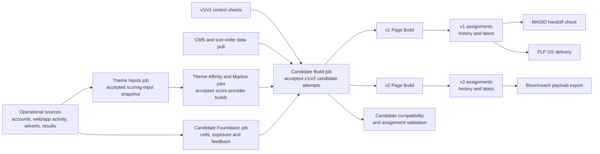
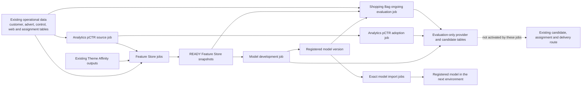

# NextAds Job And Table Data Flow

This is the inclusive entry point for every NextAds job declared under
`pipelines/databricks/jobs`: 48 jobs across 44 YAML definition files in this
checkout. It covers the operational assignment and delivery route, reporting,
realtime data, Feature Store and model development, model lifecycle, validation
and table operations. Each row shows what a job consumes and what tables,
external outputs, validation evidence or model artifacts it produces.

The page stays at a human-readable route level. Linked documents own detailed
keys, schemas, schedules, runtime evidence and operating instructions. Physical
catalogs and schemas vary by bundle target; table names below are logical names.
An in-flight job being declared on a feature branch does not prove that it is
deployed, scheduled or proven in a shared environment.

## Assignment And Delivery Route

### Assignment And Delivery Job Inputs And Outputs

| Job | Consumes | Produces |
| --- | --- | --- |
| [`mktg_next_uk_nextads_theme_inputs`](../../pipelines/databricks/jobs/mktg_next_uk_nextads_theme_inputs.yml) | Authoritative theme mapping, item attributes and product/control inputs | `next_uk_nextads_theme_mapping`, `next_uk_nextads_theme_mapping_latest`, `next_uk_nextads_attribute_set`, `next_uk_nextads_attribute_set_latest`, `next_uk_nextads_item_attributes_latest`, `next_uk_nextads_item_themes`, `next_uk_nextads_item_themes_latest`, `next_uk_nextads_scoring_input_theme_mapping_raw`, `next_uk_nextads_scoring_input_item_themes`, `next_uk_nextads_scoring_input_snapshots` and `next_uk_nextads_scoring_input_snapshot_sources` |
| [`mktg_next_uk_nextads_theme_affinity`](../../pipelines/databricks/jobs/mktg_next_uk_nextads_theme_affinity.yml) | One accepted scoring-input snapshot plus Theme Affinity preparation sources | Ranked account-theme foundation, `next_uk_nextads_scoring_foundation_builds`, `next_uk_nextads_scoring_foundation_outputs`, `next_uk_nextads_scoring_foundation_run_contexts`, `next_uk_nextads_score_provider_signals`, `next_uk_nextads_score_provider_builds` and `next_uk_nextads_score_provider_run_contexts` |
| [`mktg_next_uk_nextads_markov_scoring`](../../pipelines/databricks/jobs/mktg_next_uk_nextads_markov_scoring.yml) | One accepted scoring-input snapshot plus web/app activity, views and baskets | An optional shadow build in the same score-provider tables, plus Markov compatibility outputs such as theme transitions and next-theme scores |
| [`mktg_next_uk_nextads_candidate_foundation`](../../pipelines/databricks/jobs/mktg_next_uk_nextads_candidate_foundation.yml) | Account populations, existing cell assignments, web/app activity and advert-result history | `next_uk_nextads_customer_cells_fixed_latest`, fixed-cell history, transient/latest cells, `next_uk_nextads_customer_cells_latest`, `next_uk_nextads_candidate_repeat_ad_exposure`, `next_uk_nextads_candidate_ad_feedback`, `next_uk_nextads_candidate_foundation_builds` and `next_uk_nextads_candidate_foundation_sources` |
| [`mktg_next_uk_nextads_data_pull`](../../pipelines/databricks/jobs/mktg_next_uk_nextads_data_pull.yaml) | Landed v2 advert IDs plus CMS and sort-order sources | `nextads_sort_order_v2_latest`, `nextads_sort_order_v2`, `next_uk_nextads_cms_content_latest` and `next_uk_nextads_cms_content` |
| [`mktg_next_uk_nextads_candidate_build`](../../pipelines/databricks/jobs/mktg_next_uk_nextads.yml) | v1/v2 control sheets, one accepted Candidate Foundation, accepted scoring snapshots/provider builds, CMS and sort order | Versioned control/exclusion tables, scoring portfolios/entries, `next_uk_nextads_candidate_builds`, `next_uk_nextads_candidate_scores`, `next_uk_nextads_candidate_ad_sets`, and the exclusions Cosmos container; it then runs both page-build jobs |
| [`mktg_next_uk_nextads_page_build`](../../pipelines/databricks/jobs/mktg_next_uk_nextads_page_build.yml) | One accepted v1 candidate attempt, pinned customer cells, v1 control, NextGen assignments and advert results | `next_uk_nextads_assignments_build_staging`, `next_uk_nextads_assignments`, `next_uk_nextads_assignments_latest` and assignment-build events; then MASID and PLP child jobs |
| [`mktg_next_uk_nextads_masid_handoff`](../../pipelines/databricks/jobs/mktg_next_uk_nextads_masid_handoff.yml) | `next_uk_nextads_assignments_latest` | Validation/alert result only; no table write |
| [`mktg_next_uk_nextads_plp_gs_delivery`](../../pipelines/databricks/jobs/mktg_next_uk_nextads_plp_gs_delivery.yml) | v1 raw/latest control, PLP placement and multipage-location tables | `next_uk_nextads_plp_gs_latest`, the territory-specific latest table and the configured delivery file |
| [`mktg_next_uk_nextads_page_build_v2`](../../pipelines/databricks/jobs/mktg_next_uk_nextads_page_build_v2.yml) | One accepted v2 candidate attempt, pinned customer cells, v2 control and NextGen assignments | `next_uk_nextads_assignments_v2_build_staging`, `next_uk_nextads_assignments_v2`, `next_uk_nextads_assignments_v2_latest` and assignment-build events; then the payload child job |
| [`mktg_next_uk_nextads_payload_export`](../../pipelines/databricks/jobs/mktg_next_uk_nextads_payload_export.yml) | v2 latest assignments, fixed/latest customer cells, v2 latest control and account/RPID mapping | `next_uk_nextads_payload`, `next_uk_nextads_payload_latest` and the configured Bloomreach CSV output |
| [`mktg_next_uk_nextads_candidate_compatibility`](../../pipelines/databricks/jobs/mktg_next_uk_nextads_candidate_compatibility.yml) | Accepted v1/v2 candidate builds, scores and advert sets | Legacy v1/v2 preranked candidate snapshots; then the independent assignment-validation job |

### Candidate Build Task Inputs And Outputs

The candidate-build job orchestrates the v1 and v2 candidate routes. It does
not calculate customer cells or train a model; it selects accepted upstream
versions and keeps the v1 and v2 paths separate.

| Stage and tasks | Consumes | Produces or triggers |
| --- | --- | --- |
| `select_candidate_foundation` | `next_uk_nextads_candidate_foundation_builds` and `next_uk_nextads_candidate_foundation_sources` | Pinned customer-cell, exposure and feedback table versions in task values; no table write |
| `load_control_sheet_v1` and `audit_control_sheet_v1` | v1 Google control, PLP placement and multipage inputs | v1 raw/history/latest control tables, PLP raw/history/latest tables, `next_uk_nextads_control_sheet`, `next_uk_nextads_control_sheet_latest`, `next_uk_nextads_multipage_locations` and `next_uk_nextads_multipage_locations_latest`; audit is read-only |
| `load_control_sheet_v2`, `trigger_data_pull_for_CMS_pull`, `process_control_sheet_v2` and `audit_control_sheet_v2` | v2 Google control/exclusions, refreshed CMS content, sort order and product catalog | v2 raw/history/latest control tables, `next_uk_nextads_exclusions`, `next_uk_nextads_exclusions_latest`, `next_uk_nextads_control_sheet_v2` and `next_uk_nextads_control_sheet_latest_v2`; audit is read-only |
| `write_exclusions` | `next_uk_nextads_exclusions_latest` | Azure Cosmos DB exclusions container |
| `resolve_scoring_portfolio_v1` and `resolve_scoring_portfolio_v2` | `next_uk_nextads_scoring_input_snapshots`, provider builds/signals and configured portfolio policy | `next_uk_nextads_scoring_portfolios` and `next_uk_nextads_scoring_portfolio_entries`, plus exact selected IDs/versions in task values |
| `validate_score_provider_theme_coverage_v1` and `validate_score_provider_theme_coverage_v2` | Selected provider signals, accepted item-theme snapshot and the matching v1/v2 latest control | Validation result only; no table write |
| `map_theme_scores_to_ads_v1` and `map_theme_scores_to_ads_v2` | Selected provider signals, matching control, pinned customer cells, repeat exposure and advert feedback | Route-specific accepted attempts in `next_uk_nextads_candidate_builds`, `next_uk_nextads_candidate_scores` and `next_uk_nextads_candidate_ad_sets` |
| `run_page_build_v1` and `run_page_build_v2` | Exact candidate, provider, scoring-input and Candidate Foundation identities from the preceding tasks | Synchronous v1/v2 page-build child jobs and their delivery children |

The exact task dependencies and failure boundaries are kept in
[`v1_v2_parallel_route.md`](v1_v2_parallel_route.md), while the time-based
operational hand-offs are in
[`nextads_databricks_runtime_map.md`](../CICD/nextads_databricks_runtime_map.md).

## Reporting, Validation, Realtime And Retention Job Inputs And Outputs

These jobs support the assignment route. They either measure what was
delivered, prepare realtime inputs, validate accepted outputs or retain the
bounded history needed by the route.

| Job | Consumes | Produces |
| --- | --- | --- |
| [`mktg_next_uk_nextads_assignment_validation`](../../pipelines/databricks/jobs/mktg_next_uk_nextads_assignment_validation.yml) | Latest v1 assignments and cells, CMS content, v1/v2 controls, sort order, item themes and product catalog | Validation findings and warning notifications only; no table write |
| [`mktg_next_uk_nextads_results_cicd`](../../pipelines/databricks/jobs/mktg_next_uk_nextads_results.yml) | Assignment history, control and multipage data, cells, web/app sessions, pages, screens, account mappings and outcome data | NextAds topline, aggregate, A/B, advert, location, page, targeting and advert-metadata result tables; underperforming/top-ad tables; BigQuery exports; enriched Theme Affinity inference-log labels |
| [`mktg_next_uk_nextads_realtime_results_cicd`](../../pipelines/databricks/jobs/mktg_next_uk_nextads_realtime_results.yml) | Web/app actions and transactions plus realtime tracking | `next_uk_nextads_realtime_results` and `next_uk_nextads_realtime_results_latest` |
| [`mktg_next_uk_nextads_realtime_inputs`](../../pipelines/databricks/jobs/mktg_next_uk_nextads_realtime_inputs.yml) | Product catalog, baskets and web/app sessions and views | `next_uk_nextads_viewed_bought_latest` |
| [`mktg_next_uk_nextads_realtime_data`](../../pipelines/databricks/jobs/mktg_next_uk_nextads_realtime_data.yml) | Product, advert, control, browsing, basket and existing preranked data used by the realtime builders | Item/category and advert-affinity tables plus realtime rules, product features, advert features, preranked-ad features and item-weighting rules |
| [`mktg_next_uk_nextads_table_maintenance`](../../pipelines/databricks/jobs/mktg_next_uk_nextads_table_maintenance.yml) | The explicitly allowlisted scoring-input, provider, candidate, assignment and delivery history/state tables | Retention deletes and Delta vacuum maintenance on those same tables; no new data product |

## Feature Store And Model Development Route

The hard boundary is intentional: these in-flight jobs can build features,
train or adopt models, and write evaluation evidence. They do not add a provider
to a serving portfolio and do not write live assignments or delivery payloads.

### Feature Store And Model Development Job Inputs And Outputs

| Route | Job | Consumes | Produces |
| --- | --- | --- | --- |
| Legacy Analytics pCTR | [`mktg_next_uk_nextads_analytics_pctr`](../../pipelines/databricks/jobs/mktg_next_uk_nextads_analytics_pctr.yml) | Operational web/session, purchase, assignment, control and item-theme data plus two registered pCTR models | The legacy `next_uk_nextAds_analytics_pctr_features`, predictions and latest-predictions tables; the job is currently paused |
| Feature source | [`mktg_next_uk_nextads_analytics_pctr_feature_source`](../../pipelines/databricks/jobs/mktg_next_uk_nextads_analytics_pctr_feature_source.yml) | Web/session activity, account-linked browsing, purchases, current adverts and Theme Affinity sources | `next_uk_nextads_analytics_pctr_features` plus `next_uk_nextads_analytics_pctr_feature_source_receipts` |
| Full feature refresh | [`mktg_next_uk_nextads_feature_store`](../../pipelines/databricks/jobs/mktg_next_uk_nextads_feature_store.yml) | Operational warehouse sources, Theme Affinity outputs and the receipted Analytics pCTR feature source | The registered Feature Store tables, compatibility views, build/snapshot metadata and quality events described below |
| Bounded pCTR proof | [`mktg_next_uk_nextads_analytics_pctr_snapshot_verification`](../../pipelines/databricks/jobs/mktg_next_uk_nextads_analytics_pctr_snapshot_verification.yml) | One exact Analytics pCTR source receipt plus supporting operational sources | The three Analytics pCTR feature tables and one readable READY snapshot |
| Shopping Bag inputs | [`mktg_next_uk_nextads_shopping_bag_feature_preparation`](../../pipelines/databricks/jobs/mktg_next_uk_nextads_shopping_bag_feature_preparation.yml) | Web activity, advert/control data and observed assignment/click data | Shopping Bag account activity, advert features and observed click labels |
| Shopping Bag label proof | [`mktg_next_uk_nextads_shopping_bag_label_publication`](../../pipelines/databricks/jobs/mktg_next_uk_nextads_shopping_bag_label_publication.yml) | Observed browsing, assignment and click data for an explicit label window | `next_uk_nextads_fs_shopping_bag_click_labels` and its feature-build evidence |
| Existing pCTR scoring proof | [`mktg_next_uk_nextads_analytics_pctr_prediction_verification`](../../pipelines/databricks/jobs/mktg_next_uk_nextads_analytics_pctr_prediction_verification.yml) | `next_uk_nextAds_analytics_pctr_features` and two exact registered model versions | `next_uk_nextAds_analytics_pctr_predictions` and `next_uk_nextAds_analytics_pctr_predictions_latest` |
| Existing pCTR adoption | [`mktg_next_uk_nextads_analytics_pctr_adoption`](../../pipelines/databricks/jobs/mktg_next_uk_nextads_analytics_pctr_adoption.yml) | One exact Analytics pCTR prediction-table version and its two registered model versions | External-score receipt, canonical score-provider signals and an `EVALUATE` provider build |
| Generic model build | [`mktg_next_uk_nextads_model_development`](../../pipelines/databricks/jobs/mktg_next_uk_nextads_model_development.yml) | Declared READY Feature Store snapshots and labels from [`nextads_models.yaml`](../../configs/models/nextads_models.yaml) | Training receipt, model build, registered model version, evaluation candidates and `EVALUATE` provider signals/build |
| Runtime proof | [`mktg_next_uk_nextads_model_development_runtime_smoke`](../../pipelines/databricks/jobs/mktg_next_uk_nextads_model_development_runtime_smoke.yml) | Runtime libraries and a deliberately invalid future feature binding | Validation result only; it must not create a training receipt or model build |
| Embedding runtime proof | [`mktg_next_uk_nextads_product_embedding_runtime_smoke`](../../pipelines/databricks/jobs/mktg_next_uk_nextads_product_embedding_runtime_smoke.yml) | Synthetic advert-item frames, the approved embedding contract/runtime and one exact registered embedding model | Two read-only smoke manifests; no table or model-alias write |
| Ongoing Shopping Bag evaluation | [`mktg_next_uk_nextads_shopping_bag_ongoing_evaluation`](../../pipelines/databricks/jobs/mktg_next_uk_nextads_shopping_bag_ongoing_evaluation.yml) | One READY model build, READY feature snapshots and one accepted candidate build | Evaluation scoring-build and score tables; no serving candidate tables are changed |
| Exact model movement | [`mktg_next_uk_nextads_model_import_dev_integration`](../../pipelines/databricks/jobs/mktg_next_uk_nextads_model_import_dev_integration.yml) and [`mktg_next_uk_nextads_model_import_preprod`](../../pipelines/databricks/jobs/mktg_next_uk_nextads_model_import_preprod.yml) | One exact source model version or alias | A digest-checked copy of that registered model in the next environment; no data tables |

## Theme Affinity Model And Compatibility Job Inputs And Outputs

The operational Theme Affinity scoring job appears in the assignment route above.
These additional jobs train, compare, move or monitor its models, or publish
legacy table shapes for consumers that have not moved to the canonical provider
contract.

| Job | Consumes | Produces |
| --- | --- | --- |
| [`mktg_next_uk_nextads_theme_feature_compatibility`](../../pipelines/databricks/jobs/mktg_next_uk_nextads_theme_feature_compatibility.yml) | One exact READY Theme Affinity provider build and the matching Lakeflow feature relations | Legacy full/latest model tables, the inference log, four physical feature tables and two independent sense-check summaries |
| [`mktg_next_uk_nextads_theme_affinity_model_train`](../../pipelines/databricks/jobs/mktg_next_uk_nextads_theme_affinity_model_train.yml) | A configured labelled training table | GPU XGBoost MLflow run and registered Theme Affinity model version; no data table |
| [`mktg_next_uk_nextads_theme_affinity_model_train_spark`](../../pipelines/databricks/jobs/mktg_next_uk_nextads_theme_affinity_model_train_spark.yml) | A configured labelled training table | Spark XGBoost MLflow run and registered Theme Affinity model version; no data table |
| [`mktg_next_uk_nextads_theme_affinity_model_import_dev`](../../pipelines/databricks/jobs/mktg_next_uk_nextads_theme_affinity_model_import_dev.yml) | One reviewed DEV Integration model version or alias | The matching registered model version in the PREPROD namespace; no data table |
| [`mktg_next_uk_nextads_theme_affinity_model_promote`](../../pipelines/databricks/jobs/mktg_next_uk_nextads_theme_affinity_model_promote.yml) | One reviewed PREPROD model version or alias | The matching registered model version in the PROD namespace; no data table and no automatic scoring selection |
| [`mktg_next_uk_nextads_theme_affinity_model_monitor`](../../pipelines/databricks/jobs/mktg_next_uk_nextads_theme_affinity_model_monitor.yml) | Configured baseline and candidate model-output tables | Comparison metrics and run evidence; no table write |
| [`mktg_next_uk_nextads_theme_affinity_quality_monitor_setup`](../../pipelines/databricks/jobs/mktg_next_uk_nextads_theme_affinity_quality_monitor_setup.yml) | One configured model-output table and monitor settings | A Databricks quality-monitor definition and its managed profile/drift assets |

The exact publication and compatibility boundary is described in
[`theme_affinity_operational_flow.md`](theme_affinity_operational_flow.md), and
the environment movement boundary is described in
[`mlflow_model_lifecycle.md`](mlflow_model_lifecycle.md).

## Environment And Table Operations Job Inputs And Outputs

These jobs support the data routes but do not represent another modelling or
assignment path. Table-operation jobs act only on the target and table set
selected for that run.

| Job | Consumes | Produces |
| --- | --- | --- |
| [`mktg_next_uk_nextads_dev_setup`](../../pipelines/databricks/jobs/dev_setup.yml) | Repository SQL contracts and, only in seed mode, the approved small PROD reference/latest set | Missing personal DEV tables and optional seeded reference/latest data |
| [`mktg_next_uk_nextads_table_operations`](../../pipelines/databricks/jobs/table_operations.yml) | Repository SQL contracts plus the explicit operation, namespace and table selection | A dry-run plan by default, or deliberately created, altered, recreated, dropped or PROD-to-DEV-copied tables after the required confirmation |
| [`mktg_next_uk_nextads_dev_integration_setup`](../../pipelines/databricks/jobs/table_operations.yml) | Repository SQL contracts and the shared DEV Integration namespace | Missing shared DEV Integration tables |
| [`mktg_next_uk_nextads_dev_integration_alter`](../../pipelines/databricks/jobs/table_operations.yml) | Existing shared DEV Integration tables and repository SQL contracts | Supported additive schema repairs in shared DEV Integration |
| [`mktg_next_uk_nextads_dev_integration_migrate`](../../pipelines/databricks/jobs/table_operations.yml) | The explicit shared DEV Integration migration table set and repository SQL contracts | Deliberately recreated shared DEV Integration tables; existing selected data is replaced |
| [`mktg_next_uk_nextads_preprod_setup`](../../pipelines/databricks/jobs/table_operations.yml) | Repository SQL contracts and the PREPROD validation namespace | Missing PREPROD validation tables |
| [`mktg_next_uk_nextads_preprod_dependency_smoke`](../../pipelines/databricks/jobs/preprod_dependency_smoke.yml) | PREPROD dependency metadata and optionally bounded sample reads | Read-only dependency validation evidence; no table write |
| [`mktg_next_uk_nextads_prod_table_contract_smoke`](../../pipelines/databricks/jobs/prod_table_contract_smoke.yml) | PROD table schemas and repository contracts | Read-only contract validation evidence; no table write |
| [`mktg_next_uk_nextads_table_monitoring`](../../pipelines/databricks/jobs/table_size_monitoring.yml) | Configured NextAds table metadata and storage statistics | `nextads_table_sizes` monitoring rows |

## Feature Store Builder Inputs And Output Tables

The Feature Store job groups related builders so that downstream models consume
named data products rather than reimplementing source joins. Exact grain, keys,
date columns, ownership and refresh expectations remain in
[`feature_store_table_design.md`](../feature_store/feature_store_table_design.md) and the
executable registry
[`nextads_feature_store.yaml`](../../configs/features/nextads_feature_store.yaml).

| Builder group | Primary inputs | Output tables |
| --- | --- | --- |
| Account | Theme Affinity customer features, segments, ranks and advanced features | `next_uk_nextads_fs_account_profile`; `next_uk_nextads_fs_account_web_activity_90d` |
| Advert and item | v1/v2 control sheets, advert items, item attributes and multipage locations | `next_uk_nextads_fs_item_attributes_latest`; `next_uk_nextads_fs_advert_core_daily`; `next_uk_nextads_fs_advert_attribute_profile_daily` |
| Product and advert semantics | Item attributes, the exact product-embedding model, advert core and product embeddings | `next_uk_nextads_fs_product_embeddings_latest`; `next_uk_nextads_fs_advert_semantic_profile_daily`; `next_uk_nextads_fs_advert_product_profile_daily`; `next_uk_nextads_fs_seasonal_product_demand_daily` |
| Theme Affinity | Account/advert features plus Theme Affinity ranks, popularity and model outputs | `next_uk_nextads_fs_account_theme_interactions_daily`; `next_uk_nextads_fs_account_theme_affinity_daily`; `next_uk_nextads_fs_theme_popularity_daily` |
| Analytics pCTR | Exact receipted Analytics pCTR features plus session, action, control-sheet and assignment sources | `next_uk_nextads_fs_account_advert_affinity_daily`; `next_uk_nextads_fs_session_context_daily`; `next_uk_nextads_fs_pctr_model_input` |
| Model assembly and labels | Theme/advert affinities and observed click/response sources | `next_uk_nextads_fs_theme_affinity_model_input`; `next_uk_nextads_fs_labels_clicks`; `next_uk_nextads_fs_labels_theme_response` |
| Historical Theme Affinity training | Historical Theme Affinity preparation tables and future-window basket targets; only when an explicit historical date is supplied | `next_uk_nextads_fs_theme_affinity_training_input` |
| Quality | Every registered physical feature table and compatibility view | `next_uk_nextads_fs_feature_quality_events` |

The job also maintains the read-only compatibility views
`next_uk_nextads_theme_affinity_features_latest` and
`next_uk_nextads_pctr_features_latest`. The detailed task order and parallel
branches are shown once in [`feature_store_flow.md`](feature_store_flow.md).

## Shopping Bag Builder Inputs And Output Tables

The Shopping Bag preparation jobs are intentionally narrower than the complete
Feature Store refresh. They exist so a model author can prepare only the inputs
needed for the worked Shopping Bag challenger.

| Builder | Primary inputs | Output tables |
| --- | --- | --- |
| `build_shopping_bag_account_activity` | Web sessions, actions and account-linked views | `next_uk_nextads_fs_shopping_bag_account_activity_90d` |
| `build_advert_features` | Control sheets, advert items, item attributes and locations | `next_uk_nextads_fs_item_attributes_latest`; `next_uk_nextads_fs_advert_core_daily`; `next_uk_nextads_fs_advert_attribute_profile_daily` |
| `build_shopping_bag_click_labels` | Web/app sessions and actions, account identity, v1/v2 assignments, control sheets and locations | `next_uk_nextads_fs_shopping_bag_click_labels` |

## Cross-Job Control, Evidence And Evaluation Tables

These are control, evidence and evaluation tables rather than reusable model
features. They make the handoff between jobs reproducible.

| Data contract | Written by | Read by / purpose |
| --- | --- | --- |
| `next_uk_nextads_analytics_pctr_feature_source_receipts` | Analytics pCTR feature-source job | Pins the source table, Delta version, date, schema and producing run for Feature Store publication |
| `next_uk_nextads_feature_builds`, `next_uk_nextads_feature_build_sources`, `next_uk_nextads_feature_build_outputs` | Feature builders | Records each build attempt and its exact input/output Delta versions |
| `next_uk_nextads_feature_snapshots`, `next_uk_nextads_feature_snapshot_bindings` | Successful feature publication | Lets model jobs resolve only complete READY groups instead of moving latest tables |
| `next_uk_nextads_training_set_receipts` | Generic model-development job | Reproduces the exact feature bindings, observation dates and label boundary used for training |
| `next_uk_nextads_model_builds` | Generic model-development job | Identifies the definition, training receipt, MLflow run, registered version and artifact digest |
| `next_uk_nextads_external_score_receipts` | Analytics pCTR adoption job | Proves the exact externally produced prediction table and model versions that were adopted |
| `next_uk_nextads_score_provider_signals`, `next_uk_nextads_score_provider_builds` | Generic model-development or Analytics adoption job | Holds canonical evaluation-only scores and their selectable build identity |
| `next_uk_nextads_model_evaluation_candidates` | Generic model-development job | Stores the deterministic historical challenger result for review |
| `next_uk_nextads_model_evaluation_scoring_builds`, `next_uk_nextads_model_evaluation_scores` | Shopping Bag ongoing-evaluation job | Records repeated scoring evidence against accepted candidate builds without publishing serving candidates |

## Where To Go Next

| Question | Document |
| --- | --- |
| How do the v1/v2 candidate, page-build and delivery routes fit together? | [`v1_v2_parallel_route.md`](v1_v2_parallel_route.md) |
| What runs when, and where are the operational table hand-offs? | [`nextads_databricks_runtime_map.md`](../CICD/nextads_databricks_runtime_map.md) |
| What are each job's parameters and operating settings? | [`nextads_databricks_job_settings.md`](../CICD/nextads_databricks_job_settings.md) |
| Which bundle targets declare each job? | [`nextads_databricks_job_environment_matrix.md`](../CICD/nextads_databricks_job_environment_matrix.md) |
| What order do the Feature Store tasks run in? | [`feature_store_flow.md`](feature_store_flow.md) |
| What is each feature table's grain, key and refresh expectation? | [`feature_store_table_design.md`](../feature_store/feature_store_table_design.md) |
| What is implemented, proven in DEV or still blocked? | [Feature Store README](../feature_store/README.md) and [`migration_backlog.md`](../feature_store/migration_backlog.md) |
| How does an author build and evaluate a challenger? | [`building_a_challenger_model.md`](../feature_store/building_a_challenger_model.md) |
| How does Theme Affinity operate today? | [`theme_affinity_operational_flow.md`](theme_affinity_operational_flow.md) |
| How are exact model versions promoted? | [`mlflow_model_lifecycle.md`](mlflow_model_lifecycle.md) |
| How could a reviewed challenger later enter NextAds? | [`future_model_adoption.md`](future_model_adoption.md) |

## References And Linkages

- Job definitions, parameters and target availability:
  [`pipelines/databricks/jobs/`](../../pipelines/databricks/jobs/).
- V1/v2 task dependencies and failure boundaries:
  [`v1_v2_parallel_route.md`](v1_v2_parallel_route.md).
- Scheduled job and table hand-offs:
  [`nextads_databricks_runtime_map.md`](../CICD/nextads_databricks_runtime_map.md).
- Feature names, builders, keys and compatibility-view links:
  [`configs/features/nextads_feature_store.yaml`](../../configs/features/nextads_feature_store.yaml).
- Model inputs, trainers, providers and evaluation links:
  [`configs/models/nextads_models.yaml`](../../configs/models/nextads_models.yaml).
- Physical Feature Store and model-evidence schema references:
  [`sql/features/nextads/`](../../sql/features/nextads/) and
  [`sql/model_development/`](../../sql/model_development/).
