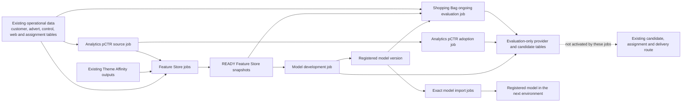

# NextAds Current And In-Flight Job Data Flow

This is the entry point for understanding which NextAds jobs are being added or
extended, the data they consume, and the data or model artifacts they produce.
It deliberately stays at a human-readable route level. The linked documents own
the detailed table keys, schemas, schedules, runtime evidence and operating
instructions.

"In flight" means declared on the current feature branch. It does not mean that
a job is deployed, scheduled or proven in a shared environment. Physical
catalogs and schemas vary by bundle target; table names below are logical names.

## End-To-End View

The hard boundary is intentional: these in-flight jobs can build features,
train or adopt models, and write evaluation evidence. They do not add a provider
to a serving portfolio and do not write live assignments or delivery payloads.

## Jobs At A Glance

| Route | Job | Consumes | Produces |
| --- | --- | --- | --- |
| Feature source | [`mktg_next_uk_nextads_analytics_pctr_feature_source`](../../pipelines/databricks/jobs/mktg_next_uk_nextads_analytics_pctr_feature_source.yml) | Web/session activity, account-linked browsing, purchases, current adverts and Theme Affinity sources | `next_uk_nextads_analytics_pctr_features` plus `next_uk_nextads_analytics_pctr_feature_source_receipts` |
| Full feature refresh | [`mktg_next_uk_nextads_feature_store`](../../pipelines/databricks/jobs/mktg_next_uk_nextads_feature_store.yml) | Operational warehouse sources, Theme Affinity outputs and the receipted Analytics pCTR feature source | The registered Feature Store tables, compatibility views, build/snapshot metadata and quality events described below |
| Bounded pCTR proof | [`mktg_next_uk_nextads_analytics_pctr_snapshot_verification`](../../pipelines/databricks/jobs/mktg_next_uk_nextads_analytics_pctr_snapshot_verification.yml) | One exact Analytics pCTR source receipt plus supporting operational sources | The three Analytics pCTR feature tables and one readable READY snapshot |
| Shopping Bag inputs | [`mktg_next_uk_nextads_shopping_bag_feature_preparation`](../../pipelines/databricks/jobs/mktg_next_uk_nextads_shopping_bag_feature_preparation.yml) | Web activity, advert/control data and observed assignment/click data | Shopping Bag account activity, advert features and observed click labels |
| Shopping Bag label proof | [`mktg_next_uk_nextads_shopping_bag_label_publication`](../../pipelines/databricks/jobs/mktg_next_uk_nextads_shopping_bag_label_publication.yml) | Observed browsing, assignment and click data for an explicit label window | `next_uk_nextads_fs_shopping_bag_click_labels` and its feature-build evidence |
| Existing pCTR scoring proof | [`mktg_next_uk_nextads_analytics_pctr_prediction_verification`](../../pipelines/databricks/jobs/mktg_next_uk_nextads_analytics_pctr_prediction_verification.yml) | `next_uk_nextAds_analytics_pctr_features` and two exact registered model versions | `next_uk_nextAds_analytics_pctr_predictions` and `next_uk_nextAds_analytics_pctr_predictions_latest` |
| Existing pCTR adoption | [`mktg_next_uk_nextads_analytics_pctr_adoption`](../../pipelines/databricks/jobs/mktg_next_uk_nextads_analytics_pctr_adoption.yml) | One exact Analytics pCTR prediction-table version and its two registered model versions | External-score receipt, canonical score-provider signals and an `EVALUATE` provider build |
| Generic model build | [`mktg_next_uk_nextads_model_development`](../../pipelines/databricks/jobs/mktg_next_uk_nextads_model_development.yml) | Declared READY Feature Store snapshots and labels from [`nextads_models.yaml`](../../configs/models/nextads_models.yaml) | Training receipt, model build, registered model version, evaluation candidates and `EVALUATE` provider signals/build |
| Runtime proof | [`mktg_next_uk_nextads_model_development_runtime_smoke`](../../pipelines/databricks/jobs/mktg_next_uk_nextads_model_development_runtime_smoke.yml) | Runtime libraries and a deliberately invalid future feature binding | Validation result only; it must not create a training receipt or model build |
| Ongoing Shopping Bag evaluation | [`mktg_next_uk_nextads_shopping_bag_ongoing_evaluation`](../../pipelines/databricks/jobs/mktg_next_uk_nextads_shopping_bag_ongoing_evaluation.yml) | One READY model build, READY feature snapshots and one accepted candidate build | Evaluation scoring-build and score tables; no serving candidate tables are changed |
| Exact model movement | [`mktg_next_uk_nextads_model_import_dev_integration`](../../pipelines/databricks/jobs/mktg_next_uk_nextads_model_import_dev_integration.yml) and [`mktg_next_uk_nextads_model_import_preprod`](../../pipelines/databricks/jobs/mktg_next_uk_nextads_model_import_preprod.yml) | One exact source model version or alias | A digest-checked copy of that registered model in the next environment; no data tables |

The existing production candidate, page-build, assignment and delivery jobs are
context rather than part of this in-flight model-building slice. Their shared
v1/v2 route is documented in
[`v1_v2_parallel_route.md`](v1_v2_parallel_route.md).

## What The Full Feature Store Job Builds

The Feature Store job groups related builders so that downstream models consume
named data products rather than reimplementing source joins. Exact grain, keys,
date columns, ownership and refresh expectations remain in
[`initial_table_design.md`](../feature_store/initial_table_design.md) and the
executable registry
[`nextads_feature_store.yaml`](../../configs/features/nextads_feature_store.yaml).

| Builder group | Main inputs | Output tables |
| --- | --- | --- |
| Account | Theme Affinity customer features, segments, ranks and advanced features | `next_uk_nextads_fs_account_profile`; `next_uk_nextads_fs_account_web_activity_90d` |
| Advert and item | v1/v2 control sheets, advert items, item attributes and multipage locations | `next_uk_nextads_fs_item_attributes_latest`; `next_uk_nextads_fs_advert_core_daily`; `next_uk_nextads_fs_advert_attribute_profile_daily` |
| Product and advert semantics | Item attributes, the exact product-embedding model, advert core and product embeddings | `next_uk_nextads_fs_product_embeddings_latest`; `next_uk_nextads_fs_advert_semantic_profile_daily`; `next_uk_nextads_fs_advert_product_profile_daily`; `next_uk_nextads_fs_seasonal_product_demand_daily` |
| Theme Affinity | Account/advert features plus Theme Affinity ranks, popularity and model outputs | `next_uk_nextads_fs_account_theme_interactions_daily`; `next_uk_nextads_fs_account_theme_affinity_daily`; `next_uk_nextads_fs_theme_popularity_daily` |
| Analytics pCTR | Exact receipted Analytics pCTR features plus session, action, control-sheet and assignment sources | `next_uk_nextads_fs_account_advert_affinity_daily`; `next_uk_nextads_fs_session_context_daily`; `next_uk_nextads_fs_pctr_model_input` |
| Model assembly and labels | Theme/advert affinities and observed click/response sources | `next_uk_nextads_fs_theme_affinity_model_input`; `next_uk_nextads_fs_labels_clicks`; `next_uk_nextads_fs_labels_theme_response` |
| Historical Theme Affinity training | Historical Theme Affinity preparation tables and future-window basket targets; only when an explicit historical date is supplied | `next_uk_nextads_fs_theme_affinity_training_input` |
| Quality | Every registered physical feature table and compatibility view | `next_uk_nextads_fs_feature_quality_events` |

The job also maintains the read-only compatibility views
`next_uk_nextads_theme_affinity_features_latest` and
`next_uk_nextads_pctr_features_latest`. The detailed task order and parallel
branches are shown once in [`feature_store_flow.md`](feature_store_flow.md).

## Separate Shopping Bag Feature Outputs

The Shopping Bag preparation jobs are intentionally narrower than the complete
Feature Store refresh. They exist so a model author can prepare only the inputs
needed for the worked Shopping Bag challenger.

| Builder | Main inputs | Output tables |
| --- | --- | --- |
| `build_shopping_bag_account_activity` | Web sessions, actions and account-linked views | `next_uk_nextads_fs_shopping_bag_account_activity_90d` |
| `build_advert_features` | Control sheets, advert items, item attributes and locations | `next_uk_nextads_fs_item_attributes_latest`; `next_uk_nextads_fs_advert_core_daily`; `next_uk_nextads_fs_advert_attribute_profile_daily` |
| `build_shopping_bag_click_labels` | Web/app sessions and actions, account identity, v1/v2 assignments, control sheets and locations | `next_uk_nextads_fs_shopping_bag_click_labels` |

## Tables That Join The Jobs Together

These are control, evidence and evaluation tables rather than reusable model
features. They make the handoff between jobs reproducible.

| Data contract | Written by | Read by / purpose |
| --- | --- | --- |
| `next_uk_nextads_analytics_pctr_feature_source_receipts` | Analytics pCTR feature-source job | Pins the source table, Delta version, date, schema and producing run for Feature Store publication |
| `next_uk_nextads_feature_builds`, `next_uk_nextads_feature_build_sources`, `next_uk_nextads_feature_build_outputs` | Feature builders | Records each build attempt and its exact input/output Delta versions |
| `next_uk_nextads_feature_snapshots`, `next_uk_nextads_feature_snapshot_bindings` | Successful feature publication | Lets model jobs resolve only complete READY groups instead of moving latest tables |
| `next_uk_nextads_training_set_receipts` | Generic model-development job | Reproduces the exact feature bindings, observation dates and label boundary used for training |
| `next_uk_nextads_model_builds` | Generic model-development job | Identifies the definition, training receipt, MLflow run, registered version and artifact digest |
| `next_uk_nextads_external_score_receipts` | Analytics pCTR adoption job | Proves the exact externally produced prediction table and model versions that were adopted |
| `next_uk_nextads_score_provider_signals`, `next_uk_nextads_score_provider_builds` | Generic model-development or Analytics adoption job | Holds canonical evaluation-only scores and their selectable build identity |
| `next_uk_nextads_model_evaluation_candidates` | Generic model-development job | Stores the deterministic historical challenger result for review |
| `next_uk_nextads_model_evaluation_scoring_builds`, `next_uk_nextads_model_evaluation_scores` | Shopping Bag ongoing-evaluation job | Records repeated scoring evidence against accepted candidate builds without publishing serving candidates |

## Where To Go Next

| Question | Document |
| --- | --- |
| What order do the Feature Store tasks run in? | [`feature_store_flow.md`](feature_store_flow.md) |
| What is each feature table's grain, key and refresh expectation? | [`initial_table_design.md`](../feature_store/initial_table_design.md) |
| What is implemented, proven in DEV or still blocked? | [Feature Store README](../feature_store/README.md) and [`migration_backlog.md`](../feature_store/migration_backlog.md) |
| How does an author build and evaluate a challenger? | [`building_a_challenger_model.md`](../feature_store/building_a_challenger_model.md) |
| How does Theme Affinity operate today? | [`theme_affinity_operational_flow.md`](theme_affinity_operational_flow.md) |
| How are exact model versions promoted? | [`mlflow_model_lifecycle.md`](mlflow_model_lifecycle.md) |
| How could a reviewed challenger later enter NextAds? | [`future_model_adoption.md`](future_model_adoption.md) |
| How do the current v1/v2 delivery routes fit together? | [`v1_v2_parallel_route.md`](v1_v2_parallel_route.md) |

## Sources Of Truth

- Job order, parameters and target availability:
  [`pipelines/databricks/jobs/`](../../pipelines/databricks/jobs/).
- Feature names, builders, keys and compatibility views:
  [`configs/features/nextads_feature_store.yaml`](../../configs/features/nextads_feature_store.yaml).
- Model inputs, trainers, providers and evaluation scope:
  [`configs/models/nextads_models.yaml`](../../configs/models/nextads_models.yaml).
- Physical Feature Store and model-evidence schemas:
  [`sql/features/nextads/`](../../sql/features/nextads/) and
  [`sql/model_development/`](../../sql/model_development/).
