# NextAds Model And Feature Overview

This page shows how the current production NextAds routes, Theme Affinity,
Feature Store, MLflow lifecycle and future challenger work fit together.

Feature Store is not currently in the live production delivery path. It creates
reusable features and model inputs for training, validation and future
challenger work. Moving a feature-store-backed model into production scoring is
a separate release-controlled change.

```mermaid
flowchart LR
  subgraph prod["Live PROD NextAds delivery"]
    candidate["Candidate build<br/>customer cells, themes, ads"]
    page_build["Page build"]
    delivery["Delivery, QA and exports"]
    results["Results and labels"]
  end

  subgraph theme["PROD Theme Affinity route"]
    dlt["DLT / Lakeflow prep"]
    publish["Publish DLT outputs"]
    predict["Model prediction"]
    clean["Clean output and sense checks"]
    theme_outputs["Theme Affinity output tables<br/>ranked, advanced, customer, popularity, half"]
  end

  subgraph fs["DEV_FEATURE_STORE model-building route"]
    fs_job["mktg_next_uk_nextads_feature_store"]
    fs_tables["marketingdata_dev.nextads_feature_store<br/>reusable feature tables"]
    fs_quality["Feature quality events"]
  end

  subgraph model["Model development and lifecycle"]
    train["Train or retrain model<br/>Theme Affinity, pCTR, LTR, challengers"]
    mlflow["MLflow experiment and UC registered model"]
    promote["Version-based import and promotion"]
    monitor["MLflow and Databricks monitoring evidence"]
  end

  subgraph future["Future release-controlled production use"]
    selected_model["Reviewed model URI or alias"]
    scoring["Production scoring or decisioning integration"]
  end

  candidate --> page_build --> delivery --> results

  dlt --> publish --> predict --> clean --> theme_outputs
  theme_outputs --> fs_job
  fs_job --> fs_tables
  fs_job --> fs_quality

  fs_tables --> train
  results --> train
  train --> mlflow --> promote --> selected_model
  selected_model -. "explicit release decision" .-> scoring
  scoring -. "future integration" .-> candidate
  selected_model --> monitor
  theme_outputs --> monitor

  theme_outputs -. "current production route remains separate" .-> candidate
```

## Boundaries

- Live production delivery remains the candidate-build, page-build, delivery and
  results route.
- Theme Affinity is an operational model route with its own DLT/Lakeflow prep
  and prediction tasks.
- Feature Store turns stable source outputs into governed model-building
  features; it does not own final assignment, ranking decisions or delivery
  payloads.
- MLflow promotion/registering creates reviewed model versions; it does not by
  itself select a model for production scoring.
