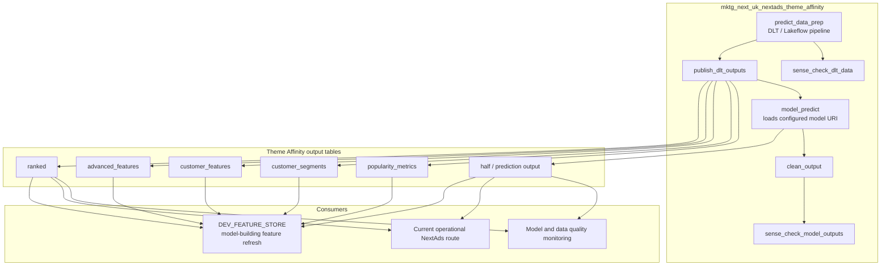

# Theme Affinity Operational Flow

Theme Affinity is a production model route. It is scheduled separately from the
main candidate-build route, and its output tables can feed model-building work
such as Feature Store.

The Feature Store route reads Theme Affinity outputs as stable sources. It does
not replace this operational route or change the production model URI.

## Pipeline provenance

Foundation publication must prove which pipeline task produced the data without
depending on preview or asynchronously populated observability features. The
current contract records the configured `PipelineID` and the exact upstream
`PipelineTaskRunID` supplied by the job, and validates the pipeline-produced
build marker against the leased foundation context. It then records the source
and published Delta versions, schema checksums, content checksums and row-level
validation evidence. Together these bind a published foundation to one job
execution and one immutable set of outputs across retries and task repairs.

`PipelineUpdateID` and `PipelineUpdateType` remain nullable reserved fields. The
nightly route must not query `system.lakeflow.pipeline_update_timeline` while
that table is Public Preview, and publication must not wait for an asynchronous
system-table record.

When `pipeline_update_timeline` is generally available, its contract and
delivery latency are supported for same-run use, and Data Engineering has
approved the required least-privilege access, add a non-blocking provenance
enrichment step after foundation publication. That step may populate the
reserved update fields by matching `PipelineID` and `PipelineTaskRunID`. Moving
the lookup back onto the publication critical path requires separate evidence
that the table is timely, stable and available under the production service
principal; general availability alone is not sufficient.
