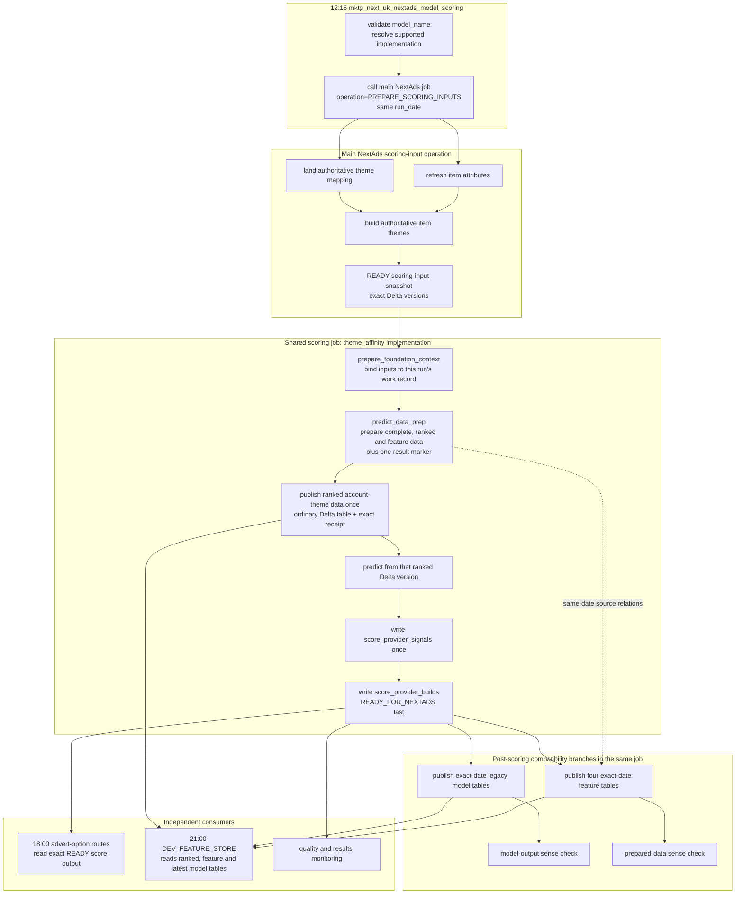

# Theme Affinity Operational Flow

Theme Affinity is the first implementation behind the shared `mktg_next_uk_nextads_model_scoring` job. It gives each account/theme pair a relevance score; it does not choose the final advert. The job is parameterised by `model_name`, validates the repository scoring declaration before any operational write, and currently accepts `theme_affinity`.

Theme Affinity writes the same **score-source output** that Markov or a future supported model can write. Task and table identifiers call a score source a `provider`. The evening advert-option routes select one exact accepted scoring result rather than reading whichever preparation table happens to be latest. In this page, **prepared account-theme data** is the plain description for the `foundation` tables, and **build** means a recorded result for fixed inputs.

## Shared Model-Scoring Request And Input Preparation

The scheduled job starts at 12:15 Europe/London with `model_name=theme_affinity`. `validate_model_scoring_request` resolves the declared score source and fails closed if the name or implementation is unsupported. A future supported model extends the declaration and shared implementation dispatch; it does not get another saved job.

`prepare_scoring_inputs` calls `mktg_next_uk_nextads_candidate_build` with `operation=PREPARE_SCORING_INPUTS` and the same `run_date`. That branch of the main NextAds job lands the theme mapping, refreshes item attributes, creates authoritative item themes and accepts the exact scoring-input snapshot. It does not run the 18:00 advert-option tasks. The main job's own scheduled run keeps `operation=CANDIDATE_BUILD` as its default.

## Theme Affinity Scoring Outputs

After the input child job succeeds, `prepare_foundation_context` opens a work record tied to the accepted scoring-input snapshot. Lakeflow then calculates its internal `complete`, `ranked`, `advanced_features`, `customer_features`, `customer_segments`, `popularity_metrics` and `build_marker` relations for that exact work record.

The Lakeflow table prefix is a bundle variable shared by the pipeline and the scoring publisher. PROD keeps `next_uk_nextads_account_theme_foundation_stage` in `marketingdata_prod.ds_sandbox`; PREPROD uses `next_uk_nextads_account_theme_foundation_pp_stage` in the same schema, so release validation cannot read from or replace the PROD-owned Lakeflow relations. Ordinary PREPROD publications remain in `marketingdata_prod.ds_sandbox`, while PROD publications remain in `marketingdata_prod.warehouse`.

`publish_and_score` validates the result marker, copies only `next_uk_nextads_account_theme_foundation_stage_ranked` into the ordinary Delta table `next_uk_nextads_account_theme_foundation_ranked`, and records the exact Delta transaction. The Lakeflow `complete` relation remains available inside the pipeline calculation, but there is no second physical `next_uk_nextads_account_theme_foundation_complete` publication on the score-source critical path.

Prediction reads the exact ranked Delta version recorded by the accepted prepared-data result. The resulting account-theme rows are converted to the shared score-source contract and written once to `next_uk_nextads_score_provider_signals`. The matching row in `next_uk_nextads_score_provider_builds` is written `READY_FOR_NEXTADS` only after that Delta write succeeds. If a repair finds the ranked-data or score-source transaction receipt from the same result and attempt, it reuses that version rather than recalculating or copying it again.

## Score Publication Failure Boundaries

Configuration, typed manifest tables, the accepted input binding and the Lakeflow marker are checked before a scoring result can become ready. A failure before `READY_FOR_NEXTADS` leaves the previous accepted score output selectable by the advert-option route under its existing 24-hour fallback rule. A data write that succeeds before a later manifest failure remains an unaccepted Delta version until the same attempt is repaired; it cannot be selected merely because the rows exist.

No full-table content checksum or post-write data rescan is part of this path. The evidence retained for each physical publication is its scoring-result and attempt identity, Git commit, schema checksum, row count from Delta operation metrics, exact Delta version and write receipt. Work-record cleanup after a ready score output is best effort and cannot revoke the accepted result.

## Compatibility Outputs In The Shared Scoring Job

After `publish_and_score` records the accepted scoring result, the shared scoring job runs two parallel publication branches. `publish_provider_compatibility` selects the exact accepted Theme Affinity result for the requested date and derives `next_uk_nextads_theme_affinity_model_full`, `next_uk_nextads_theme_affinity_inference_log` and `next_uk_nextads_theme_affinity_model_latest` from that exact score-signal version. `publish_feature_compatibility` copies the same date from the Lakeflow relations into the ordinary Delta tables ending `_advanced_features`, `_customer_features`, `_customer_segments` and `_popularity_metrics`.

Each branch has its own downstream sense check. The feature copies are created as explicit Delta tables from their Spark schemas rather than with `CREATE TABLE LIKE` against Lakeflow relations. Empty or missing rows for the requested date fail before the destination date is replaced.

The compatibility branches run after the shared score output is ready, so a later compatibility or sense-check failure makes the scoring job visibly fail but cannot revoke the accepted scoring result or yesterday's live assignments. Advert-option selection still uses the exact score-source manifest, while the model-building Feature Store requires the compatibility data it reads.

## Feature Store Consumption Boundary

The shared `DEV_FEATURE_STORE` job is scheduled at 21:00. Its Theme Affinity readers use `next_uk_nextads_account_theme_foundation_ranked`, the four physical feature-compatibility tables and `next_uk_nextads_theme_affinity_model_latest`. Personal Feature Store targets remain manual or paused. The operational advert-option route does not read Feature Store tables, so Feature Store publication remains model-development work rather than part of advert delivery.

## Lakeflow And Exact Delta Version Evidence

Publication of the prepared account-theme data records the configured pipeline ID and exact pipeline task run ID. The source Delta version is null for Lakeflow-owned relations because those relations do not expose a usable Delta history binding; the ordinary ranked table and its exact Delta version are the downstream boundary. The `build_marker` is checked both before and after the ranked copy so a concurrent Lakeflow update cannot make the copied rows ready under the wrong work record.

`PipelineUpdateID` and `PipelineUpdateType` remain nullable reserved fields. The score-source route does not query `system.lakeflow.pipeline_update_timeline` while that source is Public Preview. Any future enrichment must remain non-blocking unless its availability and permissions are proven separately.

## Lakeflow Object Retirement Conditions

Deployment does not automatically drop existing `next_uk_nextads_theme_affinity_predict_*` objects. Before removing one, identify its object type and owner, check repository and query-history references, and prove the ranked publication plus both compatibility branches have succeeded for the agreed observation period. Cleanup remains outside every scheduled scoring and delivery job so an object-retirement mistake cannot interrupt the nightly route.
