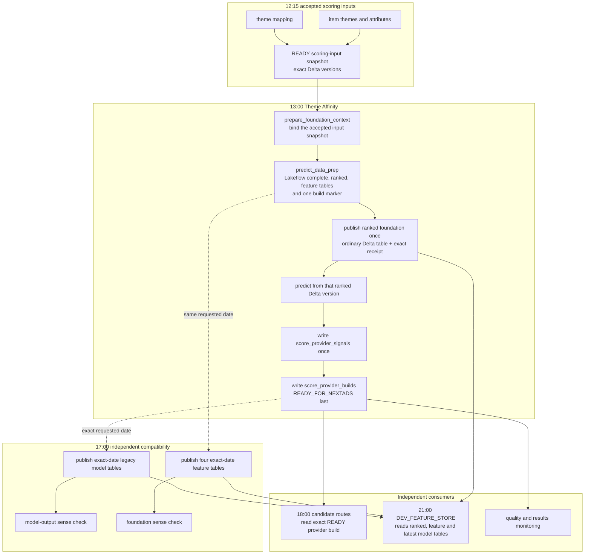

# Theme Affinity Operational Flow

Theme Affinity is one implementation of the shared NextAds account-theme scoring contract. It produces the same provider table shape that Markov or a future themed model can produce, and the candidate routes select an exact accepted provider build rather than reading whichever preparation table happens to be latest.

## What the 13:00 job publishes

The job has three tasks: `prepare_foundation_context`, `predict_data_prep` and `publish_and_score`. The first task waits for and records the accepted scoring-input snapshot. Lakeflow then calculates its internal `complete`, `ranked`, `advanced_features`, `customer_features`, `customer_segments`, `popularity_metrics` and `build_marker` relations for that exact context.

`publish_and_score` validates the build marker, copies only `next_uk_nextads_account_theme_foundation_stage_ranked` into the ordinary Delta table `next_uk_nextads_account_theme_foundation_ranked`, and records the exact Delta transaction. The Lakeflow `complete` relation remains available inside the pipeline calculation, but there is no second physical `next_uk_nextads_account_theme_foundation_complete` publication on the provider critical path.

Prediction reads the exact ranked Delta version recorded by the accepted foundation build. The resulting account-theme rows are converted to the shared provider contract and written once to `next_uk_nextads_score_provider_signals`. The matching row in `next_uk_nextads_score_provider_builds` is written `READY_FOR_NEXTADS` only after that Delta write succeeds. If a repair finds the ranked or provider transaction receipt from the same build and attempt, it reuses that version rather than recalculating or copying it again.

## Failure boundaries

Configuration, typed manifest tables, the accepted input binding and the Lakeflow marker are checked before a provider build can become ready. A failure before `READY_FOR_NEXTADS` leaves the previous accepted provider selectable by the candidate route under its existing 24-hour fallback rule. A data write that succeeds before a later manifest failure remains an unaccepted Delta version until the same attempt is repaired; it cannot be selected merely because the rows exist.

No full-table content checksum or post-write data rescan is part of this path. The evidence retained for each physical publication is its build and attempt identity, Git commit, schema checksum, row count from Delta operation metrics, exact Delta version and write receipt. Context cleanup after a ready provider is best effort and cannot revoke the accepted build.

## What the 17:00 compatibility job publishes

`mktg_next_uk_nextads_theme_feature_compatibility` is separate from Theme Affinity and has two parallel publication branches. `publish_provider_compatibility` selects the exact accepted Theme Affinity build for the requested historical date and derives `next_uk_nextads_theme_affinity_model_full`, `next_uk_nextads_theme_affinity_inference_log` and `next_uk_nextads_theme_affinity_model_latest` from that exact provider-signal version. `publish_feature_compatibility` copies the same date from the Lakeflow relations into the ordinary Delta tables ending `_advanced_features`, `_customer_features`, `_customer_segments` and `_popularity_metrics`.

Each branch has its own downstream sense check. The feature copies are created as explicit Delta tables from their Spark schemas rather than with `CREATE TABLE LIKE` against Lakeflow relations. Empty or missing rows for the requested date fail before the destination date is replaced.

This job does not gate Theme Affinity readiness, candidate generation, page assignment or delivery. A compatibility failure can delay the model-building Feature Store or its comparison evidence, but it cannot revoke the accepted provider build or yesterday's live assignments.

## Feature Store boundary

The shared `DEV_FEATURE_STORE` job is scheduled at 21:00. Its Theme Affinity readers use `next_uk_nextads_account_theme_foundation_ranked`, the four physical feature-compatibility tables and `next_uk_nextads_theme_affinity_model_latest`. Personal Feature Store targets remain manual or paused. The operational candidate route does not read Feature Store tables, so Feature Store publication remains model-building work rather than part of advert delivery.

## Lakeflow provenance

Foundation publication records the configured pipeline ID and exact pipeline task run ID. The source Delta version is null for Lakeflow-owned relations because those relations do not expose a usable Delta history binding; the ordinary ranked table and its exact Delta version are the downstream boundary. The build marker is checked both before and after the ranked copy so a concurrent Lakeflow update cannot make the copied rows ready under the wrong context.

`PipelineUpdateID` and `PipelineUpdateType` remain nullable reserved fields. The provider route does not query `system.lakeflow.pipeline_update_timeline` while that source is Public Preview. Any future enrichment must remain non-blocking unless its availability and permissions are proven separately.

## Retiring old Lakeflow objects

Deployment does not automatically drop existing `next_uk_nextads_theme_affinity_predict_*` objects. Before removing one, identify its object type and owner, check repository and query-history references, and prove the ranked publication plus both compatibility branches have succeeded for the agreed observation period. Cleanup remains outside every scheduled scoring and delivery job so an object-retirement mistake cannot interrupt the nightly route.
