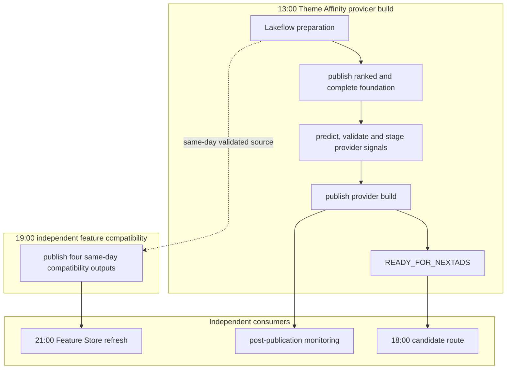

# Theme Affinity Operational Flow

Theme Affinity is one score provider within the reusable NextAds scoring
framework. Its accepted output is selected by provider and build identifiers;
the candidate route does not infer a build from mutable preparation tables.

## Nightly failure boundaries

The provider job publishes only the reusable `ranked` and `complete`
foundation outputs before prediction. Prediction output is validated and shaped
in memory, then staged directly into the canonical score-provider signals
table. There is no permanent `master` copy and no transient `half` table.

The four preparation outputs required by the Feature Store remain supported,
but they are copied by `mktg_next_uk_nextads_theme_feature_compatibility` at
19:00. That job requires rows for its supplied `run_date` and will not replace a
target with stale or empty data. It has independent alerting and is not a task
or dependency of the Theme Affinity, candidate, page, assignment or delivery
jobs. A compatibility failure can therefore delay the 21:00 Feature Store
refresh without preventing ads from being built or published.

## Stable physical boundary

The Lakeflow pipeline owns the
`next_uk_nextads_account_theme_foundation_stage_*` relations. After a successful
update, the provider job validates and publishes ordinary Delta tables named
`next_uk_nextads_account_theme_foundation_ranked` and
`next_uk_nextads_account_theme_foundation_complete`. Provider manifests pin the
exact accepted Delta versions. This boundary allows another provider or model
to consume the same foundation without inheriting Theme Affinity task names or
mutable latest-table reads.

The accepted compatibility outputs
`next_uk_nextads_theme_affinity_model_full`,
`next_uk_nextads_theme_affinity_inference_log` and
`next_uk_nextads_theme_affinity_model_latest` remain in place for current
consumers. The Feature Store uses the accepted latest score output rather than
the removed transient prediction table.

## Lakeflow provenance

Foundation publication records the configured pipeline ID and exact upstream
pipeline task run ID, and validates the pipeline build marker against the
leased foundation context. It also records source and published Delta versions,
schema checksums, content checksums and row-level validation evidence.

`PipelineUpdateID` and `PipelineUpdateType` remain nullable reserved fields.
The provider route must not query
`system.lakeflow.pipeline_update_timeline` while that source is Public Preview.
When it is generally available, its delivery latency is supported for same-run
use, and Data Engineering approves the required least-privilege access, add a
non-blocking provenance enrichment step after publication. It must not return
to the provider critical path without separate reliability evidence.

## Retiring legacy Lakeflow views

Deployment does not automatically drop existing
`next_uk_nextads_theme_affinity_predict_*` objects. After DEV acceptance:

1. Identify each object's type and owner through Unity Catalog metadata.
2. Search repository, job and query-history references for active consumers.
3. Prove the new physical foundation and independent compatibility job have
   completed successfully for the agreed observation period.
4. Have the owning team remove only confirmed-unused objects using the command
   appropriate to their actual object type.

This retirement is deliberately outside every scheduled build so a cleanup
mistake cannot interrupt scoring or delivery.
