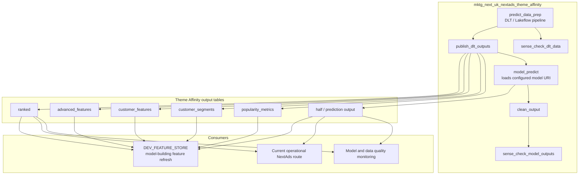

# Theme Affinity Operational Flow

Theme Affinity is a production model route. It is scheduled separately from the
main candidate-build route, and its output tables can feed model-building work
such as Feature Store.

The Feature Store route reads Theme Affinity outputs as stable sources. It does
not replace this operational route or change the production model URI.
