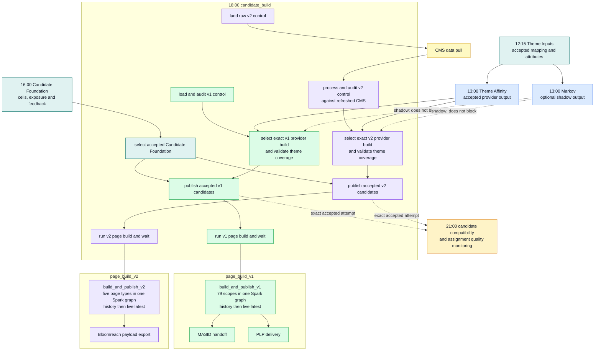
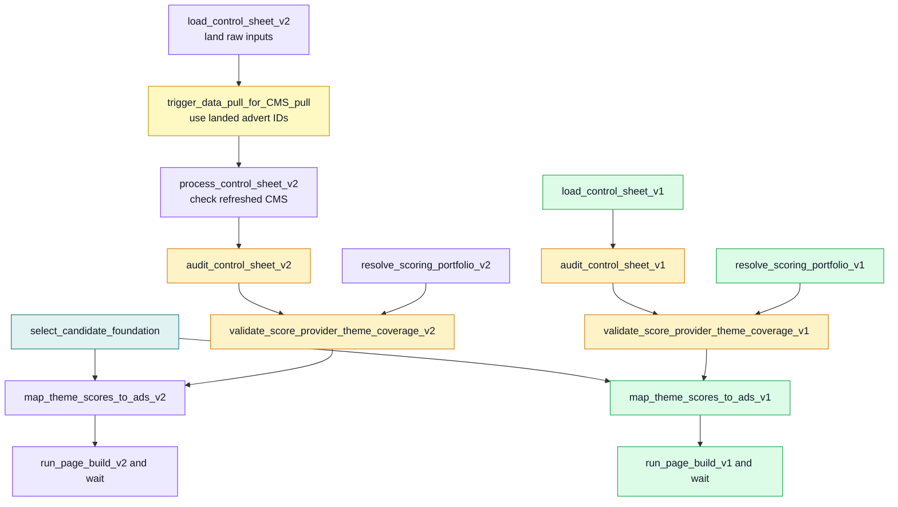

# NextAds V1/V2 Parallel Route DAG

Status: Active route on `feature/SWB/nextads-retry-stability`

Theme Affinity is the currently selected account-theme scoring provider. Markov is an independently runnable shadow provider. Both write the same provider table shape, so a later themed or non-themed model can join the route by producing that shape and being selected through configuration rather than by adding model-specific logic to candidate or assignment code.

Candidate Foundation prepares the customer cells, repeat-ad exposure and advert feedback used by both routes. Candidate build selects one accepted foundation, then v1 and v2 independently load their control data, select an exact provider build, map provider scores to active adverts and publish an accepted candidate build. A technical failure blocks only the affected route.

The v1 and v2 page jobs are separate synchronous children. V1 calculates all 79 location scopes in one Spark graph; v2 calculates all five page types in one Spark graph. Each route writes its dated history before replacing live latest. Delivery starts only after the relevant live table has advanced successfully.

## Diagram Legend

| Colour | Meaning |
| --- | --- |
| Blue | Accepted score-provider output. |
| Teal | Shared input or candidate-foundation work. |
| Green | V1 location-based route. |
| Purple | V2 page-type route. |
| Amber | Validation or compatibility work. |
| Yellow | External CMS dependency. |

## Databricks Job DAG

## Candidate-Build Task DAG

The candidate job contains no customer-cell calculation and no model calculation. It selects already accepted inputs, handles the two control routes independently and waits for both page-build child jobs.

## Why The Route Splits Here

The earlier migration assumption was that v2 would replace v1 after a short parallel run. Home Page remains on v1 while new page types use v2, so the routes now split at control loading, provider selection, candidate mapping and assignment publication.

| Boundary | Current behaviour | Reason |
| --- | --- | --- |
| Scoring provider | Models run independently and publish the same provider contract. | A new model can be evaluated or selected without changing candidate or assignment algorithms. |
| Candidate Foundation | Customer cells, repeat-ad exposure and advert feedback are prepared once for both routes. | Both routes use the same accepted customer inputs without recalculating them inside candidate build. |
| Control data | V1 and v2 load and audit separate tables. | V1 uses locations and v2 uses page types. |
| Provider selection | V1 and v2 resolve separate configured selections and exact provider versions. | A failure or future configuration change in one route does not have to block the other. |
| Candidate mapping | V1 and v2 publish separate accepted candidate attempts through the same internal contract. | Each route keeps its own output grain while sharing the same readiness and repair rules. |
| Page build | V1 and v2 run separate bulk Spark jobs. | Each route replaces its complete live result independently and cannot leave a mixture of old and new scopes. |
| Compatibility and monitoring | Legacy candidate shapes and assignment quality checks run at 21:00 from accepted outputs. | Monitoring or compatibility failures do not invalidate the canonical candidate or serving build. |

## Current Jobs And Tasks

| Databricks job | YAML | Current responsibility |
| --- | --- | --- |
| `mktg_next_uk_nextads_candidate_foundation` | `pipelines/databricks/jobs/mktg_next_uk_nextads_candidate_foundation.yml` | Builds customer cells, repeat-ad exposure and advert feedback in parallel, then records one accepted foundation. |
| `mktg_next_uk_nextads_theme_affinity` | `pipelines/databricks/jobs/mktg_next_uk_nextads_theme_affinity.yml` | Prepares the ranked foundation, scores Theme Affinity and records the canonical provider build READY last. |
| `mktg_next_uk_nextads_markov_scoring` | `pipelines/databricks/jobs/mktg_next_uk_nextads_markov_scoring.yml` | Builds and publishes the optional shadow provider, then writes its legacy compatibility outputs. |
| `mktg_next_uk_nextads_candidate_build` | `pipelines/databricks/jobs/mktg_next_uk_nextads.yml` | Selects the foundation, loads/audits both controls, selects provider builds, publishes candidate attempts and waits for both page jobs. |
| `mktg_next_uk_nextads_page_build` | `pipelines/databricks/jobs/mktg_next_uk_nextads_page_build.yml` | Builds and publishes all v1 assignments in one task, then runs MASID and PLP delivery. |
| `mktg_next_uk_nextads_page_build_v2` | `pipelines/databricks/jobs/mktg_next_uk_nextads_page_build_v2.yml` | Builds and publishes all v2 assignments in one task, then runs payload export. |
| `mktg_next_uk_nextads_candidate_compatibility` | `pipelines/databricks/jobs/mktg_next_uk_nextads_candidate_compatibility.yml` | Publishes the legacy v1/v2 candidate table shapes and triggers assignment quality monitoring independently. |

| Candidate-build task | Script or task type | Upstream task dependencies |
| --- | --- | --- |
| `select_candidate_foundation` | `jobs/orchestration/select_candidate_foundation.py` | None |
| `load_control_sheet_v1` | `jobs/nextads_control/load_control_sheet.py` | None |
| `audit_control_sheet_v1` | `jobs/nextads_control/audit_control_sheet.py` | `load_control_sheet_v1` |
| `load_control_sheet_v2` | `jobs/nextads_control/load_control_sheet_v2.py --phase land` | None |
| `trigger_data_pull_for_CMS_pull` | Native `run_job_task` | `load_control_sheet_v2` |
| `process_control_sheet_v2` | `jobs/nextads_control/load_control_sheet_v2.py --phase process` | `trigger_data_pull_for_CMS_pull` |
| `audit_control_sheet_v2` | `jobs/nextads_control/audit_control_sheet.py` | `process_control_sheet_v2` |
| `resolve_scoring_portfolio_v1` | `jobs/orchestration/resolve_scoring_portfolio.py` | None |
| `resolve_scoring_portfolio_v2` | `jobs/orchestration/resolve_scoring_portfolio.py` | None |
| `validate_score_provider_theme_coverage_v1` | `jobs/nextads_candidates/validate_theme_affinity_theme_coverage.py` | `audit_control_sheet_v1`, `resolve_scoring_portfolio_v1` |
| `validate_score_provider_theme_coverage_v2` | `jobs/nextads_candidates/validate_theme_affinity_theme_coverage.py` | `audit_control_sheet_v2`, `resolve_scoring_portfolio_v2` |
| `map_theme_scores_to_ads_v1` | `jobs/nextads_candidates/build_theme_ad_candidates.py` | `select_candidate_foundation`, `validate_score_provider_theme_coverage_v1` |
| `map_theme_scores_to_ads_v2` | `jobs/nextads_candidates/build_page_type_candidates_v2.py` | `select_candidate_foundation`, `validate_score_provider_theme_coverage_v2` |
| `run_page_build_v1` | Native `run_job_task` | `map_theme_scores_to_ads_v1` |
| `run_page_build_v2` | Native `run_job_task` | `map_theme_scores_to_ads_v2` |

The internal candidate boundary consists of `candidate_ad_sets`, `candidate_scores` and the manifest-last `candidate_builds` table. Only rows belonging to an accepted candidate attempt can be selected by page build. Public v1/v2 assignment schemas remain unchanged.

The full time-based job and table hand-off is maintained in [`nextads_databricks_runtime_map.md`](../CICD/nextads_databricks_runtime_map.md).
