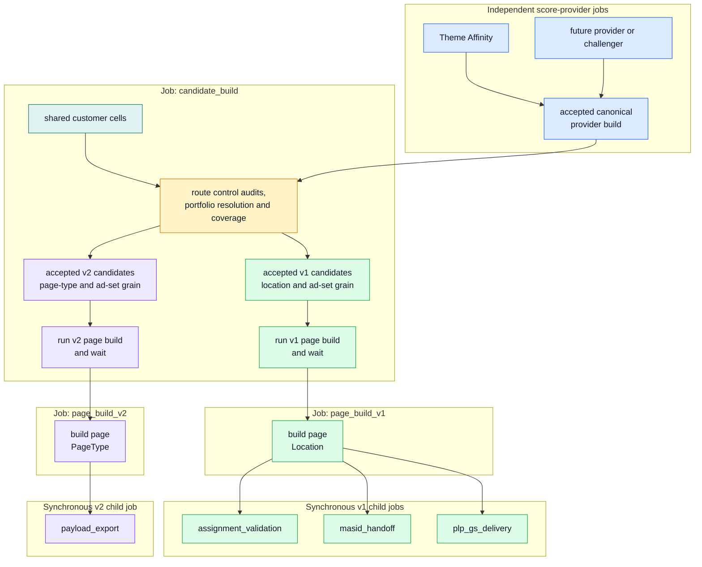
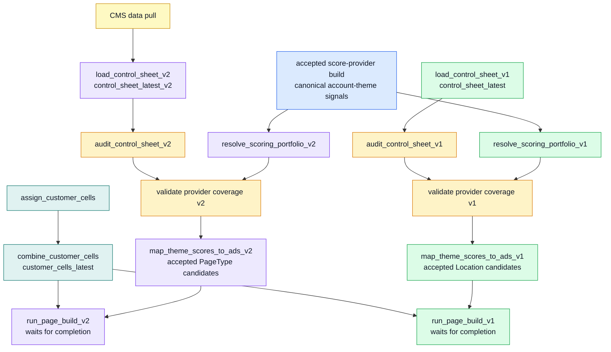

# NextAds V1/V2 Parallel Route DAG

Status: Active route on `feature/SWB/nextads-retry-stability`

This route treats Theme Affinity as the current implementation of a generic account-theme score provider. V1 and v2 independently resolve an immutable portfolio, capture the exact control-sheet version, build every serving entry, and publish an accepted candidate attempt at the route grain. The portfolio is also the provider-neutral plug-in point for future themed or non-themed challengers: build the model, validate its canonical output, and assign that exact build to a compatible serving or evaluation slot.

Product Theme Mapping and scoring input acceptance happen upstream. The independent Theme Affinity and Markov routes consume those accepted inputs. Markov starts at 13:00, waits up to 90 minutes for the accepted daily input, and publishes a canonical shadow build plus its legacy compatibility output. The evening candidate job captures route control sheets and does not rebuild provider models.

Each route has its own control audit, provider selector, coverage check, mapper and synchronous page child. A technical failure blocks that route but does not prevent the healthy sibling from completing. Business audit and coverage findings remain visible warnings.

## Diagram Legend

| Colour | Meaning |
| --- | --- |
| Blue | Accepted canonical score-provider builds. |
| Grey/teal | Shared candidate-build inputs and shared candidate-build tasks. |
| Green | V1 location-based route. |
| Purple | V2 page-type route. |
| Amber | Validation/guardrail task that can stop the candidate build. |
| Yellow | External CMS dependency. |

## Databricks Job DAG

This view separates Databricks jobs from tasks. The candidate-build job is the scheduled evening orchestration point; page-build and delivery jobs remain separate but are invoked with native tasks that wait for completion.

## Candidate-Build Task DAG

This view expands the tasks inside `mktg_next_uk_nextads_candidate_build`. V1 and v2 are separate only where the route input or output contract differs.

## Rationale

The previous migration assumption was that v2 would fully replace v1 after a short parallel run. That is no longer true: Home Page remains on v1, while new page types need v2. The safe split is therefore at the route-specific control-sheet join and output-grain layer.

| Boundary | Recommendation | Reason |
| --- | --- | --- |
| Score providers | Keep provider builds independent of the candidate job. | The portfolio binds validated builds to capability-compatible serving or evaluation slots, so future challengers do not embed model logic in assignment. |
| Product Theme Mapping and provider scoring | Keep in the independent input, Theme Affinity, and Markov routes. | Each model adapts its result to the canonical contract; candidate building resolves a declared portfolio and does not wait for an unavailable shadow entry. |
| Control sheets | Keep separate tasks. | V1 is location-based and v2 is page-type based. Each loaded table carries its own ad `Themes` values. |
| Theme coverage | Validate independently before each mapper. | A route may proceed only after its own control snapshot is technically readable and its active themes have been compared with the exact selected provider version. |
| Candidate mapping | Split v1 and v2 tasks, but use the same internal publication contract. | Each task pins its control version, reuses identical provider computation, stores content-stable ad sets and top-20 candidates, and writes readiness last. |
| Page build | Keep separate synchronous child jobs and bulk within each route. | V1 builds 77 primary locations then SB2/OC2 on shared clusters; v2 builds all five page types together. Both read the exact accepted candidate attempt and resolve champion/challenger as separate portfolio entries. |

## Databricks Job Granularity

The current YAMLs do not create a separate Databricks job for every node in the candidate-build DAG. They create one scheduled candidate-build job with multiple tasks, then run separate page-build and delivery jobs synchronously after candidate mapping completes.

| Databricks job | YAML | Runnable independently? | Contains / runs |
| --- | --- | --- | --- |
| `mktg_next_uk_nextads_theme_affinity` | `pipelines/databricks/jobs/mktg_next_uk_nextads_theme_affinity.yml` | Yes | Scheduled upstream score-provider route; publishes an accepted canonical provider build and compatibility outputs. |
| `mktg_next_uk_nextads_markov_scoring` | `pipelines/databricks/jobs/mktg_next_uk_nextads_markov_scoring.yml` | Yes | Scheduled shadow-provider route; builds Markov scores from the accepted input, publishes through the shared canonical contract, and retains legacy compatibility outputs. |
| `mktg_next_uk_nextads_candidate_build` | `pipelines/databricks/jobs/mktg_next_uk_nextads.yml` | Yes, as one multi-task job | Customer cells, isolated v1/v2 control routes, immutable portfolio resolution, accepted candidate publication, compatibility output and synchronous page-build jobs. |
| `mktg_next_uk_nextads_page_build` | `pipelines/databricks/jobs/mktg_next_uk_nextads_page_build.yml` | Yes | V1 primary/secondary bulk assignment, complete-build publication, then synchronous validation, MASID handoff, and PLP delivery jobs. |
| `mktg_next_uk_nextads_page_build_v2` | `pipelines/databricks/jobs/mktg_next_uk_nextads_page_build_v2.yml` | Yes | V2 all-page-type bulk assignment, complete-build publication, then synchronous payload export. |
| `mktg_next_uk_nextads_assignment_validation` | `pipelines/databricks/jobs/mktg_next_uk_nextads_assignment_validation.yml` | Yes | V1 assignment validation. |
| `mktg_next_uk_nextads_masid_handoff` | `pipelines/databricks/jobs/mktg_next_uk_nextads_masid_handoff.yml` | Yes | V1 MASID handoff check. |
| `mktg_next_uk_nextads_plp_gs_delivery` | `pipelines/databricks/jobs/mktg_next_uk_nextads_plp_gs_delivery.yml` | Yes | V1 PLP Google Sheets delivery. |
| `mktg_next_uk_nextads_payload_export` | `pipelines/databricks/jobs/mktg_next_uk_nextads_payload_export.yml` | Yes | V2 Bloomreach payload export. |

Inside `mktg_next_uk_nextads_candidate_build`, these are tasks, not standalone Databricks jobs:

| Candidate-build task | Script | Upstream task dependencies |
| --- | --- | --- |
| `assign_customer_cells` | `jobs/nextads_cells/assign_customer_cells.py` | None |
| `combine_customer_cells` | `jobs/nextads_cells/combine_customer_cells.py` | `assign_customer_cells` |
| `load_control_sheet_v1` | `jobs/nextads_control/load_control_sheet.py` | None |
| `audit_control_sheet_v1` | `jobs/nextads_control/audit_control_sheet.py` | `load_control_sheet_v1` |
| `trigger_data_pull_for_CMS_pull` | Native `run_job_task` | None |
| `load_control_sheet_v2` | `jobs/nextads_control/load_control_sheet_v2.py` | `trigger_data_pull_for_CMS_pull` |
| `audit_control_sheet_v2` | `jobs/nextads_control/audit_control_sheet.py` | `load_control_sheet_v2` |
| `resolve_scoring_portfolio_v1` | `jobs/orchestration/resolve_scoring_portfolio.py` | None |
| `resolve_scoring_portfolio_v2` | `jobs/orchestration/resolve_scoring_portfolio.py` | None |
| `validate_score_provider_theme_coverage_v1` | `jobs/nextads_candidates/validate_theme_affinity_theme_coverage.py` | `audit_control_sheet_v1`, `resolve_scoring_portfolio_v1` |
| `validate_score_provider_theme_coverage_v2` | `jobs/nextads_candidates/validate_theme_affinity_theme_coverage.py` | `audit_control_sheet_v2`, `resolve_scoring_portfolio_v2` |
| `map_theme_scores_to_ads_v1` | `jobs/nextads_candidates/build_theme_ad_candidates.py` | `combine_customer_cells`, `validate_score_provider_theme_coverage_v1` |
| `map_theme_scores_to_ads_v2` | `jobs/nextads_candidates/build_page_type_candidates_v2.py` | `combine_customer_cells`, `validate_score_provider_theme_coverage_v2` |
| `run_page_build_v1` | Native `run_job_task` | `combine_customer_cells`, `map_theme_scores_to_ads_v1` |
| `run_page_build_v2` | Native `run_job_task` | `combine_customer_cells`, `map_theme_scores_to_ads_v2` |

The candidate, page and delivery jobs remain independently runnable. Within the nightly route, native `run_job_task` dependencies wait for each child result, so a failed child fails its route while the independent sibling route can finish and publish.

The internal candidate boundary consists of `candidate_ad_sets`,
`candidate_scores`, and the manifest-last `candidate_builds` table. Ad-set IDs
are hashes of canonically sorted ad membership rather than run-local sequence
numbers. Only portfolio entries marked `SERVING` are materialised; Markov remains
visible in the portfolio but absent from assignment candidates while it is
`SHADOW`/`EVALUATE`.

Assignment consumers require one ready candidate header and exactly one
`best` and `best_challenger` binding. They filter `candidate_scores` and
`candidate_ad_sets` by the accepted attempt rather than consulting a mutable
latest table. Both bindings can point to Theme Affinity without aliasing the
dataframes; changing a portfolio entry later changes only that slot. Internal
assignment staging and events record the candidate build, candidate attempt,
portfolio, portfolio attempt and candidate-foundation snapshot. Public v1/v2
assignment schemas remain unchanged, and history still publishes before latest
only after every expected scope has a valid completion event.

The practical provider plug-in process and the evidence required before merge
are maintained in
[`nextads_modular_route_dev_acceptance.md`](../CICD/nextads_modular_route_dev_acceptance.md).
