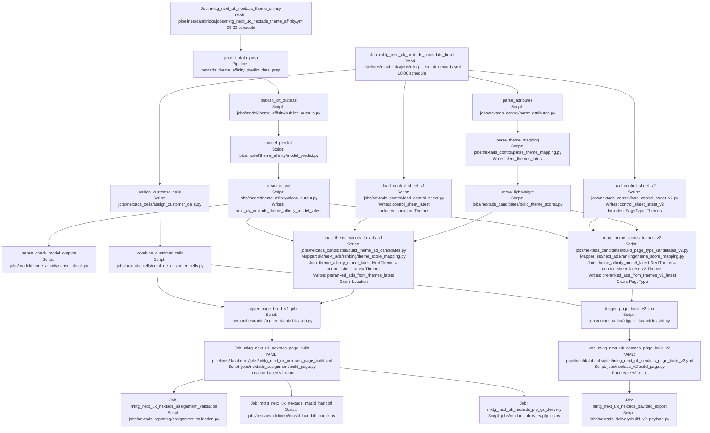

# NextAds V1/V2 Parallel Route DAG

Status: Target route for `feature/SWB/nextads-v1-v2-route-split`

This route keeps Theme Affinity as one shared upstream model output. The model writes customer-theme scores. V1 and v2 then split at the loaded control-sheet join layer: each route reads its own control sheet, uses that sheet's `Themes` column as the ad-theme mapping, joins customer `NextTheme` to ad `Themes`, and ranks the resulting customer-ad candidates at the route grain.

The `score_lightweight` arrows in the candidate-build job are current Databricks task dependencies retained from the existing evening graph. They are not the customer-theme data source for `run_theme_score_mapping`; the mapper reads `config.theme_affinity_assignment_sources.champion` or `challenger`, which currently resolve to `theme_affinity_model_latest`.

## Rationale

The previous migration assumption was that v2 would fully replace v1 after a short parallel run. That is no longer true: Home Page remains on v1, while new page types need v2. The safe split is therefore at the route-specific control-sheet join and output-grain layer.

| Boundary | Recommendation | Reason |
| --- | --- | --- |
| Theme Affinity | Keep one shared scheduled job. | It writes customer-theme scores and does not depend on either control sheet. |
| Product Theme Mapping and lightweight scoring | Keep shared in this PR. | These tasks feed the existing theme-scoring route and are not the route-specific ad-to-theme join used by candidate mapping. |
| Control sheets | Keep separate tasks. | V1 is location-based and v2 is page-type based. Each loaded table carries its own ad `Themes` values. |
| Candidate mapping | Split v1 and v2 tasks. | This is where customer-theme scores are joined to route-specific ad themes and ranked by `Location` or `PageType`. |
| Page build | Keep separate triggered jobs. | V1 builds by `Location`; v2 builds by `PageType` and feeds payload export. |

## Databricks Job Granularity

The current YAMLs do not create a separate Databricks job for every node in the candidate-build DAG. They create one scheduled candidate-build job with multiple tasks, then trigger separate page-build and delivery jobs after candidate mapping completes.

| Databricks job | YAML | Runnable independently? | Contains / runs |
| --- | --- | --- | --- |
| `mktg_next_uk_nextads_theme_affinity` | `pipelines/databricks/jobs/mktg_next_uk_nextads_theme_affinity.yml` | Yes | Scheduled upstream model route; writes `theme_affinity_model_latest`. |
| `mktg_next_uk_nextads_candidate_build` | `pipelines/databricks/jobs/mktg_next_uk_nextads.yml` | Yes, as one multi-task job | Customer cells, v1/v2 control-sheet loads, shared product theme mapping/scoring, v1/v2 candidate mapping, and page-build triggers. |
| `mktg_next_uk_nextads_page_build` | `pipelines/databricks/jobs/mktg_next_uk_nextads_page_build.yml` | Yes | V1 location-based page build, then triggers validation, MASID handoff, and PLP delivery. |
| `mktg_next_uk_nextads_page_build_v2` | `pipelines/databricks/jobs/mktg_next_uk_nextads_page_build_v2.yml` | Yes | V2 page-type page build, then triggers payload export. |
| `mktg_next_uk_nextads_assignment_validation` | `pipelines/databricks/jobs/mktg_next_uk_nextads_assignment_validation.yml` | Yes | V1 assignment validation. |
| `mktg_next_uk_nextads_masid_handoff` | `pipelines/databricks/jobs/mktg_next_uk_nextads_masid_handoff.yml` | Yes | V1 MASID handoff check. |
| `mktg_next_uk_nextads_plp_gs_delivery` | `pipelines/databricks/jobs/mktg_next_uk_nextads_plp_gs_delivery.yml` | Yes | V1 PLP Google Sheets delivery. |
| `mktg_next_uk_nextads_payload_export` | `pipelines/databricks/jobs/mktg_next_uk_nextads_payload_export.yml` | Yes | V2 Bloomreach payload export. |

Inside `mktg_next_uk_nextads_candidate_build`, these are tasks, not standalone Databricks jobs:

| Candidate-build task | Script | Upstream task dependencies |
| --- | --- | --- |
| `assign_customer_cells` | `jobs/nextads_cells/assign_customer_cells.py` | None |
| `combine_customer_cells` | `jobs/nextads_cells/combine_customer_cells.py` | `assign_customer_cells` |
| `load_control_sheet_v1` | `jobs/nextads_control/load_control_sheet.py` | None |
| `load_control_sheet_v2` | `jobs/nextads_control/load_control_sheet_v2.py` | None |
| `parse_attributes` | `jobs/nextads_control/parse_attributes.py` | None |
| `parse_theme_mapping` | `jobs/nextads_control/parse_theme_mapping.py` | `parse_attributes` |
| `score_lightweight` | `jobs/nextads_candidates/build_theme_scores.py` | `parse_theme_mapping` |
| `map_theme_scores_to_ads_v1` | `jobs/nextads_candidates/build_theme_ad_candidates.py` | `score_lightweight`, `load_control_sheet_v1` |
| `map_theme_scores_to_ads_v2` | `jobs/nextads_candidates/build_page_type_candidates_v2.py` | `score_lightweight`, `load_control_sheet_v2` |
| `trigger_page_build_v1_job` | `jobs/orchestration/trigger_databricks_job.py` | `combine_customer_cells`, `map_theme_scores_to_ads_v1` |
| `trigger_page_build_v2_job` | `jobs/orchestration/trigger_databricks_job.py` | `combine_customer_cells`, `map_theme_scores_to_ads_v2` |

If each node needs to be run as an independently addressable Databricks job, the YAML structure would need another split: separate job YAMLs for the control, scoring, and candidate-mapping nodes, plus an orchestration job using `run_job_task` or trigger tasks. That would improve manual rerun control, but it would add more deployed jobs, job ids, alert surfaces, and ordering contracts to maintain.

## Alternatives

| Option | Shape | Why not chosen |
| --- | --- | --- |
| Keep v2 dependent on v1 mapping | V2 reads `preranked_ads_from_themes_latest` and reshapes `Location` to `PageType`. | Couples v2 to v1 location eligibility and ranking, which is wrong for a long-lived page-type route. |
| Split Theme Affinity into v1 and v2 jobs | Two scheduled model-scoring jobs feed two candidate routes. | Adds model scheduling, monitoring, and table risk without a control-sheet dependency to justify it. |
| Split product Theme Mapping and lightweight scoring now | Separate `item_themes` and `next_theme_scores` tables are built from each workbook before candidate mapping. | This is a wider customer-theme scoring change and is not required for the v2 page-type ad mapping route described here. |
| Fully separate v1 and v2 candidate-build jobs now | Duplicate customer-cell and attribute tasks too. | More operational surface than needed while those inputs are still common. |
| Fully switch off v1 | V2 becomes the only route. | Not valid because Home Page continues on v1 beyond the initial parallel-run period. |
