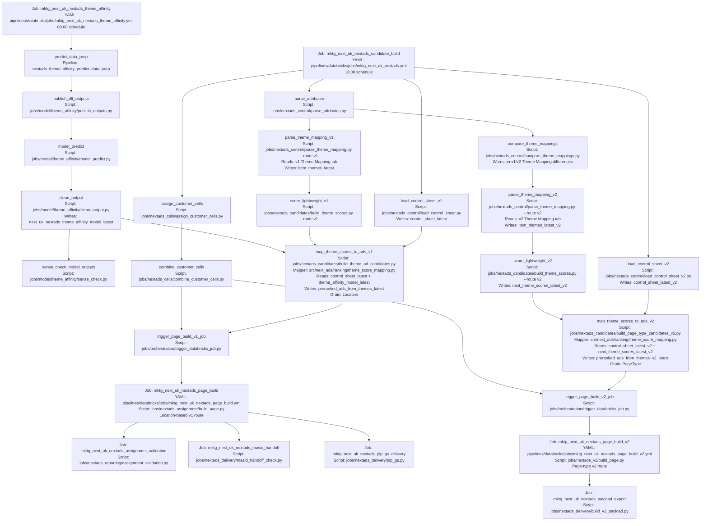

# NextAds V1/V2 Parallel Route DAG

Status: Target route for `feature/SWB/nextads-v1-v2-route-split`

This route keeps customer cells and item attributes shared. Theme Mapping and
lightweight theme scoring are split by route so v1 and v2 can read their
respective workbook tabs before the candidate mapping layer joins route-specific
theme scores to route-specific control-sheet ads.

## Rationale

The previous migration assumption was that v2 would fully replace v1 after a
short parallel run. That is no longer true: Home Page remains on v1, while new
page types need v2. Keeping the routes separate at the candidate mapping layer
lets both routes run without v2 depending on either a v1 location-shaped output
or a v1-only Theme Mapping tab.

This is the lowest-risk split because it only separates producers where the
input contract now differs:

| Boundary | Recommendation | Reason |
| --- | --- | --- |
| Theme Affinity | Keep shared scheduled job. | It writes customer-theme affinity scores and does not depend on either control sheet. |
| Theme mapping and lightweight score inputs | Split v1 and v2 tasks. | The Theme Mapping tabs can differ by workbook, so v2 needs separate item-theme and score outputs. |
| Control sheets | Keep separate tasks. | V1 is location-based; v2 is page-type based. Their schemas and output contracts differ. |
| Candidate mapping | Split v1 and v2 tasks. | This is where shared scores are joined to route-specific control data. |
| Page build | Keep separate triggered jobs. | V1 builds by `Location`; v2 builds by `PageType` and feeds payload export. |

## Databricks Job Granularity

The current YAMLs do not create a separate Databricks job for every node in the
candidate-build DAG. They create one scheduled candidate-build job with multiple
tasks, then trigger separate page-build and delivery jobs after candidate
mapping completes.

| Databricks job | YAML | Runnable independently? | Contains / runs |
| --- | --- | --- | --- |
| `mktg_next_uk_nextads_theme_affinity` | `pipelines/databricks/jobs/mktg_next_uk_nextads_theme_affinity.yml` | Yes | Scheduled upstream model route; writes `theme_affinity_model_latest`. |
| `mktg_next_uk_nextads_candidate_build` | `pipelines/databricks/jobs/mktg_next_uk_nextads.yml` | Yes, as one multi-task job | Customer cells, v1/v2 control-sheet loads, v1/v2 Theme Mapping, Theme Mapping comparison, v1/v2 lightweight scoring, v1/v2 candidate mapping, and page-build triggers. |
| `mktg_next_uk_nextads_page_build` | `pipelines/databricks/jobs/mktg_next_uk_nextads_page_build.yml` | Yes | V1 location-based page build, then triggers validation, MASID handoff, and PLP delivery. |
| `mktg_next_uk_nextads_page_build_v2` | `pipelines/databricks/jobs/mktg_next_uk_nextads_page_build_v2.yml` | Yes | V2 page-type page build, then triggers payload export. |
| `mktg_next_uk_nextads_assignment_validation` | `pipelines/databricks/jobs/mktg_next_uk_nextads_assignment_validation.yml` | Yes | V1 assignment validation. |
| `mktg_next_uk_nextads_masid_handoff` | `pipelines/databricks/jobs/mktg_next_uk_nextads_masid_handoff.yml` | Yes | V1 MASID handoff check. |
| `mktg_next_uk_nextads_plp_gs_delivery` | `pipelines/databricks/jobs/mktg_next_uk_nextads_plp_gs_delivery.yml` | Yes | V1 PLP Google Sheets delivery. |
| `mktg_next_uk_nextads_payload_export` | `pipelines/databricks/jobs/mktg_next_uk_nextads_payload_export.yml` | Yes | V2 Bloomreach payload export. |

Inside `mktg_next_uk_nextads_candidate_build`, these are tasks, not standalone
Databricks jobs:

| Candidate-build task | Script | Upstream task dependencies |
| --- | --- | --- |
| `assign_customer_cells` | `jobs/nextads_cells/assign_customer_cells.py` | None |
| `combine_customer_cells` | `jobs/nextads_cells/combine_customer_cells.py` | `assign_customer_cells` |
| `load_control_sheet_v1` | `jobs/nextads_control/load_control_sheet.py` | None |
| `load_control_sheet_v2` | `jobs/nextads_control/load_control_sheet_v2.py` | None |
| `parse_attributes` | `jobs/nextads_control/parse_attributes.py` | None |
| `parse_theme_mapping_v1` | `jobs/nextads_control/parse_theme_mapping.py --route v1` | `parse_attributes` |
| `compare_theme_mappings` | `jobs/nextads_control/compare_theme_mappings.py` | `parse_attributes` |
| `parse_theme_mapping_v2` | `jobs/nextads_control/parse_theme_mapping.py --route v2` | `parse_attributes`, `compare_theme_mappings` |
| `score_lightweight_v1` | `jobs/nextads_candidates/build_theme_scores.py --route v1` | `parse_theme_mapping_v1` |
| `score_lightweight_v2` | `jobs/nextads_candidates/build_theme_scores.py --route v2` | `parse_theme_mapping_v2` |
| `map_theme_scores_to_ads_v1` | `jobs/nextads_candidates/build_theme_ad_candidates.py` | `score_lightweight_v1`, `load_control_sheet_v1` |
| `map_theme_scores_to_ads_v2` | `jobs/nextads_candidates/build_page_type_candidates_v2.py` | `score_lightweight_v2`, `load_control_sheet_v2` |
| `trigger_page_build_v1_job` | `jobs/orchestration/trigger_databricks_job.py` | `combine_customer_cells`, `map_theme_scores_to_ads_v1` |
| `trigger_page_build_v2_job` | `jobs/orchestration/trigger_databricks_job.py` | `combine_customer_cells`, `map_theme_scores_to_ads_v2` |

If each node needs to be run as an independently addressable Databricks job,
the YAML structure would need another split: separate job YAMLs for the control,
theme-mapping, scoring, and candidate-mapping nodes, plus an orchestration job
using `run_job_task` or trigger tasks. That would improve manual rerun control,
but it would add more deployed jobs, job ids, alert surfaces, and ordering
contracts to maintain.

## Alternatives

| Option | Shape | Why not chosen |
| --- | --- | --- |
| Keep v2 dependent on v1 mapping | V2 reads `preranked_ads_from_themes_latest` and reshapes `Location` to `PageType`. | Couples v2 to v1 location eligibility and ranking, which is wrong for a long-lived page-type route. |
| Split Theme Affinity into v1 and v2 jobs | Two scheduled model-scoring jobs feed two candidate routes. | Adds model scheduling, monitoring, and table risk without a control-sheet dependency to justify it. |
| Fully separate v1 and v2 candidate-build jobs now | Duplicate customer-cell and attribute tasks too. | More operational surface than needed while those inputs are still common. |
| Fully switch off v1 | V2 becomes the only route. | Not valid because Home Page continues on v1 beyond the initial parallel-run period. |
