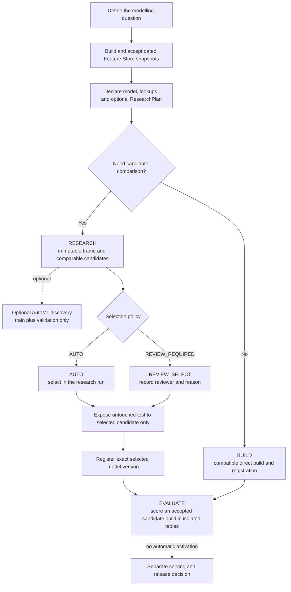

# Model Research Output Layer: Complete Data Scientist Walkthrough

Status: Core research, discovery, reviewed selection and isolated evaluation proved in personal DEV. Current-branch job-consolidation, quieter logging and exact-output-marker changes are implemented in source and await a new deployed runtime proof. This is the canonical data-scientist guide.

This document explains the complete declared model-research workflow introduced for [work item 5260243](https://dev.azure.com/Next-Technology/DirectoryMarketing.Personalisation/_workitems/edit/5260243). It is intentionally explicit. It covers what a data scientist can choose, what must be declared in source control, what the platform fixes, why each control exists, what every operation writes, how retries behave, and how the Shopping Bag pCTR proof used the workflow end to end.

The short version is: define one time-correct modelling question, compare declared candidates on the same immutable data, inspect comparable MLflow evidence, select one candidate, expose the untouched test period only after selection, register that exact model, and evaluate it without changing live NextAds output.

This is the detailed owner document. The broader operational job and table map remains in [NextAds job and table flow](architecture/nextads_job_table_flow.md), and model movement between environments remains in the [model lifecycle runbook](model_lifecycle_runbook.md).

## Contents

1. [Purpose and boundaries](#1-purpose-and-boundaries)
2. [The workflow at a glance](#2-the-workflow-at-a-glance)
3. [Who chooses what](#3-who-chooses-what)
4. [Core objects and states](#4-core-objects-and-states)
5. [Before starting](#5-before-starting)
6. [Declaring a model](#6-declaring-a-model)
7. [Declaring a research plan](#7-declaring-a-research-plan)
8. [Candidate choices and parameters](#8-candidate-choices-and-parameters)
9. [Metrics, plots, slices and explanations](#9-metrics-plots-slices-and-explanations)
10. [The generic lifecycle job](#10-the-generic-lifecycle-job)
11. [`BUILD`: the compatible direct-build route](#11-build-the-compatible-direct-build-route)
12. [`RESEARCH`: compare declared candidates](#12-research-compare-declared-candidates)
13. [Optional bounded AutoML discovery](#13-optional-bounded-automl-discovery)
14. [`REVIEW_SELECT`: lock, test and register one candidate](#14-review_select-lock-test-and-register-one-candidate)
15. [`EVALUATE`: score the selected model in isolation](#15-evaluate-score-the-selected-model-in-isolation)
16. [Supporting generic jobs](#16-supporting-generic-jobs)
17. [Outputs and where to find them](#17-outputs-and-where-to-find-them)
18. [MLflow layout and review checklist](#18-mlflow-layout-and-review-checklist)
19. [Retry, reuse and failure behaviour](#19-retry-reuse-and-failure-behaviour)
20. [Shopping Bag pCTR worked example](#20-shopping-bag-pctr-worked-example)
21. [Common decisions](#21-common-decisions)
22. [Troubleshooting and frequently asked questions](#22-troubleshooting-and-frequently-asked-questions)
23. [Release and activation boundary](#23-release-and-activation-boundary)
24. [Original acceptance-criteria trace](#24-original-acceptance-criteria-trace)
25. [Glossary](#25-glossary)
26. [Reference map](#26-reference-map)

## 1. Purpose and boundaries

### 1.1 The actual goal

The goal is to make MLflow the place where a data scientist can compare modelling attempts built from the same time-correct Feature Store data. Each declared candidate gets its own run, the evidence is comparable, and only an automatically or manually selected candidate can reach held-out testing and registration.

The implementation satisfies these requirements:

- the existing `Trainer.train(...) -> ModelBuild` route still works without a research plan;
- research is optional and controlled by a checked-in `ResearchPlan`;
- logistic regression, random forest, gradient-boosted trees and Spark XGBoost can run as separate nested MLflow runs;
- every candidate gets the same immutable training receipt, temporal split and evidence contract;
- model plug-ins cannot choose their own data split, publish scores, register a model or move an alias;
- the parent run contains the comparison and deterministic recommendation;
- only the selected candidate sees final test outcomes and can be registered;
- identical retries reuse the same logical evidence and registered version;
- AutoML is manual, bounded, isolated and non-registering;
- `EVALUATE` writes isolated score evidence and cannot change portfolios, assignments or payloads.

### 1.2 What this does not do

This workflow does not:

- promote a model to DEV Integration, PREPROD or PROD;
- move `dev_candidate`, `preprod`, `prod` or any other alias;
- add the model to a serving portfolio;
- write live candidate, assignment or delivery-payload tables;
- turn an AutoML trial into a registered model;
- let a run-form parameter silently change the reviewed research split;
- let candidate code read the untouched test split during comparison;
- make a model operational merely because a Unity Catalog version was registered.

Registration and activation are deliberately separate. A registered DEV version is an auditable model artifact. It is not a serving decision.

### 1.3 Supporting architecture included in the change

The research layer is the goal. Several supporting changes make it operable without adding more model-specific saved jobs:

- one generic DEV lifecycle job handles `BUILD`, `RESEARCH`, `REVIEW_SELECT` and `EVALUATE`;
- one separate generic discovery job provides the Databricks ML runtime needed by AutoML;
- the Feature Store job owns reusable feature construction and exact snapshot receipts;
- the scheduled model-scoring job is parameterised by `model_name`, with Theme Affinity as its current implementation;
- the main NextAds candidate job has a `PREPARE_SCORING_INPUTS` operation so scoring inputs can be prepared independently of the 18:00 candidate build;
- output-producing Python routes emit searchable, exact output destinations;
- dependency loggers such as Py4J are suppressed while application `INFO` evidence remains visible.

These are enabling controls, not a change in the user story's purpose.

## 2. The workflow at a glance



Use this decision table first:

| Intent | Route | What the data scientist chooses |
| --- | --- | --- |
| Train one declared implementation without candidate research | `BUILD` | Model name and explicit observation/feature dates plus label boundary |
| Compare a reviewed set of model families on one fixed split | `RESEARCH` | Model name and label boundary; candidates and dates come from source control |
| Explore a broader bounded search without registration | Model discovery | Exact completed research build, explicit `enabled=true`, optional timeout |
| Accept one reviewed research candidate | `REVIEW_SELECT` | Exact research build, declared candidate ID, reviewer name and substantive reason |
| Score an exact registered model against an accepted candidate build | `EVALUATE` | Exact model build and run date; normally leave snapshot, attempt, limit and slot on safe defaults |
| Make a model serve customers | Not this workflow | A separate reviewed portfolio, release and activation decision |

## 3. Who chooses what

The interface deliberately contains three different kinds of option. Treating them as interchangeable defeats the controls.

| Option owner | Where it is set | Examples | Why it lives there |
| --- | --- | --- | --- |
| Data scientist, reviewed in source control | [`configs/models/nextads_models.yaml`](../configs/models/nextads_models.yaml) | question, label, features, lags, split, candidates, metrics, slices, selection policy | These choices change the scientific claim and must be reviewable and reproducible |
| Data scientist, selected for one manual run | Databricks job parameters | operation, model name, exact build/candidate IDs, reviewer/reason, evaluation date | These choose which already-declared workflow or immutable object to execute |
| Plug-in author, reviewed in code | `src/next_ads/model_development/` | estimator implementation, prediction adapter, explanation implementation | Code is needed only when a supplied alias cannot express the required behaviour |
| Platform owner | bundle variables and job YAML | catalog/schema, experiment root, cluster, libraries, code SHA, concurrency, timeouts | Prevents a run from redirecting evidence or weakening the controlled runtime |
| Release owner | release/import/promotion jobs | exact source version, target namespace, promotion alias | Registration in personal DEV is not authority to release or activate |

### 3.1 Normal DS choices

A data scientist normally chooses:

1. the modelling question and model declaration;
2. the dated temporal split;
3. the declared candidate set and candidate hyperparameters;
4. metrics, reporting slices and selection policy;
5. whether to run optional bounded AutoML discovery;
6. which candidate to select after reviewing validation evidence;
7. the written reason for that choice;
8. the exact registered build and date to evaluate in isolation.

### 3.2 Choices a DS should normally leave alone

The following are visible in resources or code but are not ordinary experiment knobs:

- catalog and schema destinations;
- MLflow experiment root;
- cluster size, DBR version and attached libraries;
- Git SHA and orchestration/task attempt identity;
- output table names;
- prediction, probability, label, split and row-ID column names;
- model registration name and alias behaviour;
- provider publication and serving portfolio;
- feature-snapshot status or Delta version;
- main-test access.

If one of these needs changing, make a reviewed platform or contract change rather than entering a different value in a job form.

## 4. Core objects and states

Understanding the objects makes the job output much easier to interpret.

| Object | Meaning | Created or changed by | Important states |
| --- | --- | --- | --- |
| Model declaration | Versioned scientific and operational contract for one model | Source-control review | Valid or rejected at load time |
| Training-set receipt | Exact observation dates, label boundary and READY feature snapshot bindings | `BUILD` or `RESEARCH` | `READY`, `FAILED`; leakage check must pass |
| Research claim | Concurrency lease and recoverable checkpoint for one deterministic research identity | `RESEARCH`/selection retries | `CLAIMED`, `FRAME_READY`, `PARENT_READY`, `CANDIDATES_READY`, `SELECTION_LOCKED`, `REGISTERED`, `COMPLETE`, or terminal `FAILED` |
| Research frame | Immutable, PII-reduced train/validate/test rows at one Delta version | `RESEARCH` | Reconciled by row count, schema and value checksum |
| Research build | Parent experiment, candidate set, recommendation and terminal research status | `RESEARCH` | `RESEARCHING`, `AWAITING_SELECTION`, `READY`, `FAILED` |
| Candidate evaluation | One candidate attempt, child MLflow run, model URI, metrics and evidence digest | `RESEARCH` | `RESEARCHING`, `READY`, `FAILED` |
| Selection decision | Immutable automatic or reviewed candidate decision | `RESEARCH` for `AUTO`; `REVIEW_SELECT` otherwise | `READY`, `FAILED` |
| Model build | Exact registered model version and artifact lineage | `BUILD` or selected research route | `READY`, `FAILED` |
| AutoML claim/receipt | Separate bounded-discovery request, experiment, trials and leaderboard | Discovery job | claim checkpoints; receipt `READY` or `FAILED` |
| Evaluation scoring build | Exact selected model, candidate input, feature snapshots and isolated output receipt | `EVALUATE` | `BUILDING`, `READY`, `FAILED` |

Logical receipt, research, candidate, selection and build IDs are content-derived rather than friendly counters. Attempt IDs additionally include invocation identity such as job run, task run and execution count. This is intentional: immutable content determines whether two invocations mean the same logical work, while the attempt identity preserves which execution performed it.

## 5. Before starting

### 5.1 Required access and deployment

- Work in a personal DEV deployment of the feature branch.
- Use the centrally owned jobs rather than creating a saved job for one model.
- Confirm the live job tag and task `--code_sha` match the commit being reviewed.
- Confirm there is no active run for the same single-concurrency job before starting another manual operation.
- Do not use this workflow from PREPROD or PROD. The lifecycle and discovery resources are declared for DEV only.

### 5.2 Required data

Every observation date and feature reference date must have compatible READY Feature Store snapshots. A table existing is not enough. The lifecycle resolves accepted snapshot metadata, exact Delta versions, row/schema/value checksums and source attempts.

For a time-correct lookup, the feature timestamp must be no later than:

```text
observation timestamp - declared availability lag
```

Labels must be binary and mature by `label_end`. Every split must contain usable positive and negative outcomes. Missing dates, unexpected dates, duplicate keys, future features, immature labels or checksum mismatches fail closed.

### 5.3 Current supported model status

`shopping_bag_pctr` is the end-to-end proved declaration for `RESEARCH`, discovery, `REVIEW_SELECT` and `EVALUATE`.

`analytics_pctr` remains declared for contract compatibility, but it is not currently an end-to-end choice in the generic lifecycle:

- its trainer is not registered for generic `BUILD`;
- it has no declared research plan;
- it has no registered generic evaluator.

Selecting it for those operations will fail during preflight rather than silently use Shopping Bag behaviour.

## 6. Declaring a model

Model declarations live in [`configs/models/nextads_models.yaml`](../configs/models/nextads_models.yaml). They are loaded into a checksummed immutable contract. A changed declaration therefore creates new lineage rather than rewriting the meaning of an old receipt.

### 6.1 Top-level model fields

| Field | Required/default | DS options and validation | Why it exists |
| --- | --- | --- | --- |
| `model_name` | Required | Unique nonblank declaration key; use the repository lower-snake convention such as `shopping_bag_pctr` | Job selection key and registered-name suffix |
| `provider_id` | Required | Registered provider implementation ID | Separates the scientific model from the score-provider contract |
| `problem_statement` | Required | Plain description of what is predicted and for whom | Makes evidence interpretable without reading code |
| `prediction_entity` | Required | Plain entity/grain description | Prevents ambiguity about account, advert, location or another grain |
| `prediction_time` | Required | Plain timing description | Defines when information is considered available |
| `label` | Required | One selected observation column | Names the binary outcome used by training and evidence |
| `observation_keys` | Required | Unique selected observation columns | Define observation uniqueness and deterministic row lineage; they are not model features by default |
| `success_metrics` | Required | Unique metric names | Records model-level success intent. Current built-in research recommendation still uses validation PR-AUC, log loss and candidate ID, so this list does not change selection ordering |
| `runtime_profile` | Required | `dbr_15_4_spark_cpu` or `dbr_18_1_theme_gpu` | Pins a reproducible supported runtime. The generic research job currently uses DBR 15.4 CPU |
| `training_observation` | Required | See below | Defines the labelled observation population |
| `feature_lookups` | At least one | See below | Defines point-in-time reusable features |
| `trainer` | Required | Registered operational trainer ID | Used by direct `BUILD`, not by the research-candidate list |
| `score_provider` | Required | Registered provider ID | Defines the canonical score output contract |
| `candidate_adapter` | Required | Registered adapter ID | Defines how model scores attach to accepted NextAds candidates |
| `evaluation_use_case` | Defaults to `advert_ranking` | Registered evaluation implementation | Selects the isolated `EVALUATE` behaviour |
| `evaluation_scope` | Defaults to empty | Mapping of column to allowed values | Records the intended isolated-evaluation scope. The current Shopping Bag evaluator still fixes route `v1` and locations `SB1`/`SB2` in code; changing this YAML alone does not change the executable scope |
| `activation_mode` | Defaults to `EVALUATE`; effective value must be `EVALUATE` | Omit it for the safe default or declare `EVALUATE` explicitly | Makes non-activation a contract, not a convention |
| `research` | Optional | Full `ResearchPlan` described below | Keeps the direct Trainer route compatible while enabling research only where declared |

### 6.2 `training_observation` fields

| Field | Required/default | What to choose | Why |
| --- | --- | --- | --- |
| `feature_id` | Required | Registered labelled Feature Store contract | Prevents arbitrary table reads |
| `selected_columns` | Required, unique | Keys, label, timestamps, audit fields and any direct context features needed by the contract | Creates an explicit data boundary |
| `observation_timestamp` | Required and selected | Timestamp that represents prediction time | Drives point-in-time joins |
| `observation_date_column` | Defaults to `observation_timestamp` | A selected date column when partition/date semantics differ from the timestamp | Supports exact temporal coverage checks |
| `context_features` | Defaults to empty | Selected non-key, non-label, non-timestamp columns that are genuine model inputs | Allows context such as Shopping Bag location without treating audit fields as features |
| `label_maturity_column` | Optional | Selected date/timestamp proving the label is mature | Stops future outcome leakage |
| `filters` | Defaults to empty | Selected-column to non-null JSON scalar value | Fixes the scientific cohort, for example `route: v1` and `platform: WEB` |

Context features cannot include observation keys, the label, observation timestamps/dates or maturity fields. A selected audit column is not a model feature unless it is declared in `context_features` or supplied by a feature lookup.

### 6.3 `feature_lookups` fields

Each lookup is a point-in-time binding to one registered Feature Store contract.

| Field | Required/default | What to choose | Why |
| --- | --- | --- | --- |
| `feature_id` | Required | Registered feature contract | Gives the lookup a stable logical identity |
| `key_mapping` | At least one pair | Feature-table key to observation key | Makes join grain explicit |
| `selected_columns` | Required, unique | Only features the model is permitted to see | Prevents accidental column expansion |
| `observation_timestamp` | Required | Observation timestamp used for the cutoff | Couples the lookup to prediction time |
| `availability_lag_days` | Default `0`, integer >= 0 | Delay between source event and actual feature availability | Encodes operational latency rather than assuming instant availability |
| `renames` | Default empty | Selected source column to unique model-facing name | Resolves collisions and improves readability |
| `defaults` | Default empty | Selected column to JSON scalar value | Makes missing-feature behaviour reproducible and measurable |

All final feature names across context and lookups must be unique and cannot collide with observation keys or the label.

For YAML ergonomics, `filters`, `key_mapping`, `renames` and `defaults` accept either an ordinary mapping or a list of `{from: ..., to: ...}` entries. Both forms normalise into the same checksummed mapping. Use the ordinary mapping form unless duplicate-looking YAML keys or templating make the explicit list form clearer.

### 6.4 Shopping Bag declaration choices

The worked declaration asks: for an observed WEB Shopping Bag advert impression, how likely is a click in that session?

- Label source: `next_uk_nextads_fs_shopping_bag_click_labels`.
- Label: `clicked`.
- Observation keys: `exposure_id`, `label_horizon_days`.
- Fixed cohort: `route=v1`, `platform=WEB`, zero-day label horizon, mature labels, one observed impression.
- Direct context feature: `location`.
- Account features: nine 90-day browsing/action aggregates, keyed by `account_number`, with a one-day availability lag and explicit defaults.
- Advert features: campaign/theme/category/brand/template, keyed by `advert_id` and `location`.
- Evaluation scope: route `v1`, locations `SB1` and `SB2`.
- Activation: `EVALUATE` only.

The selected observation columns also include audit and slice fields such as device, but those do not enter the feature vector unless declared as context or lookup outputs.

## 7. Declaring a research plan

The optional `research` block is part of model lineage. Every field contributes to the plan checksum.

### 7.1 Top-level research fields

| Field | Required/default | Valid options | Why |
| --- | --- | --- | --- |
| `candidates` | Required, non-empty, unique IDs | One or more `CandidateSpec` entries | Defines the reviewed comparison set |
| `temporal_split` | Required | Exact inclusive train, validation and test date ranges | Prevents candidate-specific or random split drift |
| `evaluation_rules` | Required | Standard binary evidence contract plus allowed extensions | Makes results comparable |
| `slices` | Default empty | Zero or more unique `SliceSpec` entries | Makes subgroup behaviour visible with privacy bounds |
| `selection_policy` | Required | `AUTO` or `REVIEW_REQUIRED` | Controls whether research can select/register immediately or must pause for review |
| `explanation_requirements` | Must include standard trio | `global_feature_importance`, `readable_feature_names`, `model_specific_or_permutation`, plus optional names | Gates selection on understandable evidence |
| `evaluation_schema_version` | `binary_classifier_evidence/v1` | Any nonblank lineage value; use the current default | Versions the evidence identity. Changing this text alone does not implement or select another evaluator/schema |
| `minimum_successful_candidates` | Default `1`; 1..candidate count | Must be at least the number of candidates whose failure is not allowed | Defines recommendation quorum |
| `evidence_producers` | Default empty | Unique in-repo `next_ads.*` evidence plug-ins | Adds aggregate-only evidence without giving plug-ins row access or orchestration control |
| `candidate_search` | Default absent | Optional AutoML discovery declaration | Allows a separate bounded discovery run without coupling it to standard research |

### 7.2 Temporal split

The six required ISO dates are:

```yaml
temporal_split:
  train:    {start: YYYY-MM-DD, end: YYYY-MM-DD}
  validate: {start: YYYY-MM-DD, end: YYYY-MM-DD}
  test:     {start: YYYY-MM-DD, end: YYYY-MM-DD}
```

They are inclusive and must satisfy:

```text
train.start <= train.end < validate.start <= validate.end < test.start <= test.end
```

The split has three different purposes:

- `train`: passed to candidate fitting;
- `validate`: passed to comparable candidate evidence and recommendation;
- `test`: retained in the immutable frame but outcomes withheld until exact selection.

The `RESEARCH` job derives these dates from YAML. A DS cannot override them in the run form. To change the scientific split, change the declaration, review it, deploy the new SHA and create new lineage.

### 7.3 `evaluation_rules` fields

| Field | Default | Contract options | Effective behaviour and why |
| --- | --- | --- | --- |
| `required_metrics` | Mandatory binary-classifier set in section 9.1 | Unique names; may add but may not remove a mandatory metric | Gates candidate completeness. Adding a name does not implement its calculation, so unsupported additions make completeness fail |
| `required_evidence` | Mandatory evidence set in section 9.2 | Unique names; may add but may not remove a mandatory artifact type | Gates comparable evidence. Unsupported names do not create artifacts; implement a reviewed evidence producer instead |
| `top_fractions` | `0.01`, `0.05`, `0.10` | Unique finite fractions greater than `0` and at most `1`; must include 1%, 5% and 10% | Defines precision, recall, lift and top-fraction confusion points. Runtime currently accepts unique integer percentages from 1% to 50% after conversion |
| `confidence_interval_metrics` | `auc_pr`, `lift_at_5_percent` | Nonempty unique subset of required metrics | Lineage metadata today; selected-test runtime still computes/requires exactly this default pair |
| `confidence_level` | `0.95` | Contract: greater than `0`, less than `1`; runtime: `0.8 <= value < 1` | Sets the selected-test interval coverage |
| `confidence_interval_resamples` | `1000` | Contract: integer >=1; runtime: 20..2000 | Bounds deterministic selected-test bootstrap work |
| `confidence_interval_seed` | `1729` | Integer >=0 | Makes the block-bootstrap interval reproducible |
| `minimum_slice_rows` | `100` | Integer >=1 | Seeds the evaluator's general slice threshold; each declared slice's own `minimum_rows` replaces it for that slice |
| `prevalence_baseline` | `true` | Boolean | Declares the constant train-prevalence comparison. Runtime currently writes it even when false, so false is not yet an effective off switch |

The mandatory metric/evidence names and current implementation limitations are listed in section 9. The checked-in Shopping Bag plan uses the effective-safe defaults above.

### 7.4 Slice fields

| Field | Required/default | Behaviour |
| --- | --- | --- |
| `slice_id` | Required unique lower-snake ID | Stable evidence name |
| `column` | Required | Selected observation/slice column; identity-like columns are forbidden |
| `values` | Default empty | Explicit values pin at most 25 groups. Empty performs automatic discovery only when the column has at most 25 distinct values; a 26th value fails the candidate rather than being truncated |
| `if_present` | Default `false` | `false` fails if the column is absent; `true` records the slice only when present |
| `minimum_rows` | Default `100`, >=1 | Low-volume groups are `INSUFFICIENT` and expose row count only, not outcome rates |

`evaluation_rules.minimum_slice_rows` seeds the evaluator's general default. Each declared `SliceSpec.minimum_rows` then replaces that value for its slice; the two values are not combined or maximised. Set the required privacy/stability threshold explicitly on every declared slice rather than assuming the global value will raise it.

### 7.5 Selection policies

| Policy | Behaviour | Use when |
| --- | --- | --- |
| `REVIEW_REQUIRED` | `RESEARCH` finishes `AWAITING_SELECTION`; no test outcomes, registration or model build are created until `REVIEW_SELECT` | Human rationale, governance or qualitative evidence matters |
| `AUTO` | The deterministic recommendation is selected by the research route, then the selected candidate alone is tested and registered | The reviewed declaration explicitly authorises automatic selection |

The deterministic recommendation order is fixed:

1. highest validation PR-AUC;
2. then lowest validation log loss;
3. then alphabetical `candidate_id`.

`success_metrics` in the model declaration and extra metric names in the research plan do not currently change this ordering.

## 8. Candidate choices and parameters

### 8.1 `CandidateSpec`

| Field | Default | Rules | Why |
| --- | --- | --- | --- |
| `candidate_id` | None | Required, unique lower-snake ID | Stable selection and evidence key; distinct from the durable `candidate:<digest>` evaluation ID |
| `plugin` | None | Built-in alias or reviewed `next_ads.*` class | Chooses implementation without changing orchestration |
| `parameters` | `{}` | Unique JSON-safe finite estimator parameters | Allows model-specific tuning while preserving the common workflow |
| `seed` | `1729` | Integer >=0 | Reproducibility; used by RF, GBT and XGBoost built-ins |
| `failure_allowed` | `false` | Boolean | Says whether the research build may still reach its quorum if this candidate fails |

`minimum_successful_candidates` must still be high enough to include every candidate with `failure_allowed=false`. In the Shopping Bag proof all four are required and the minimum is four, so any candidate failure stops recommendation.

### 8.2 Built-in candidates

| Plug-in | Main reason to include it | Built-in defaults used by Shopping Bag | Main trade-off |
| --- | --- | --- | --- |
| `spark_logistic_regression` | Interpretable linear baseline with calibrated probabilities | `maxIter=50`, `regParam=0.01`, `elasticNetParam=0.0` | Cannot represent complex interactions unless features encode them |
| `spark_random_forest` | Non-linear bagged-tree comparator that is robust to many relationships | `numTrees=120`, `maxDepth=8`, `minInstancesPerNode=20`, declared seed | Can collapse toward prevalence on highly imbalanced data and may be less well calibrated |
| `spark_gradient_boosted_trees` | Sequential tree boosting for non-linear ranking signal | `maxIter=60`, `maxDepth=5`, `stepSize=0.05`, declared seed | More expensive and can overfit; Spark constructor/output behaviour needs stricter compatibility |
| `spark_xgboost` | Distributed boosted-tree comparator with strong tabular performance | `eval_metric=aucpr`, `max_depth=6`, `learning_rate=0.05`, `n_estimators=150`, `subsample=0.8`, `colsample_bytree=0.8`, `num_workers=4`, declared seed | Higher runtime/cost and more hyperparameters; explanation contributions are deliberately bounded |

The Shopping Bag choices are comparison baselines, not a claim that these are the only valid models.

### 8.3 What common parameters mean

| Parameter | Applies to | Meaning |
| --- | --- | --- |
| `maxIter` | LR, GBT | Maximum optimization/boosting iterations |
| `regParam` | LR | Overall regularisation strength |
| `elasticNetParam` | LR | `0` is L2, `1` is L1, values between blend them |
| `numTrees` | RF | Number of independently trained trees |
| `maxDepth` | RF, GBT | Maximum tree depth and interaction complexity |
| `minInstancesPerNode` | RF | Minimum examples required in a child node; larger values regularise the forest |
| `stepSize` | GBT | Boosting learning rate |
| `eval_metric` | XGBoost | Training diagnostic metric; `aucpr` suits rare positive outcomes |
| `learning_rate` | XGBoost | Contribution of each new tree |
| `n_estimators` | XGBoost | Number of boosting rounds/trees |
| `subsample` | XGBoost | Fraction of rows sampled per tree |
| `colsample_bytree` | XGBoost | Fraction of features sampled per tree |
| `num_workers` | XGBoost | Distributed Spark workers used by the estimator |

The repository validates that parameter values are JSON-safe and finite, but it does not maintain a full allowlist or range table for every estimator-native option. Declaration parameters overlay the built-in defaults and are passed to the underlying Spark/XGBoost constructor. An unsupported name or value fails there. Review the installed DBR 15.4 library API before adding a new option.

### 8.4 Parameters candidates may not control

Candidate `parameters` cannot contain orchestration-owned concepts, including:

- feature, label, split, prediction, probability or raw-prediction column names;
- train/validation/test dates or split seeds;
- MLflow experiment/run IDs;
- model/alias/registered-model names;
- output or score tables;
- provider IDs or score-provider choice;
- publish, register or alias-setting flags;
- random seed aliases such as `random_seed`, `random_state` or `seed`.

Use the top-level `seed` field for supported candidate randomness. The denial list prevents an estimator declaration from taking ownership of data splitting, evidence location, publication or registration.

The exact normalised protected names are:

```text
alias
features_col
label_col
mlflow_experiment
mlflow_experiment_id
mlflow_run_id
model_alias
model_name
output_table
prediction_col
probability_col
provider_id
publish
publish_scores
random_seed
random_state
raw_prediction_col
register_model
registered_model_name
score_provider
score_table
seed
set_alias
split
split_col
split_column
split_seed
test_end
test_start
train_end
train_start
validation_end
validation_start
```

### 8.5 Fixed preprocessing

Preprocessing is common evidence infrastructure, not a per-candidate choice:

- string features use alphabetically ordered `StringIndexer(handleInvalid="keep")`;
- indexed strings use one-hot encoding with `dropLast=false` and invalid values retained;
- numeric features use median imputation;
- vector assembly keeps invalids;
- the readable feature map retains original feature/category names and consecutive vector positions.

Only supported Spark string and numeric feature types are accepted. Empty or unsupported feature schemas fail before fitting.

### 8.6 Custom candidates and evidence extensions

A custom candidate must be a reviewed, in-repository class under `next_ads.*`, have a no-argument constructor, and implement the candidate fit, predict and persistence contracts. A random external Python import path is rejected.

Candidate code receives the orchestrator-owned training split and standard feature contract. It must return the standard scalar positive-class `score` in `[0,1]` plus binary `prediction`. The framework checks row count, types, labels, dates, split/slice preservation and unique hashed row lineage. Reloaded persisted models must reproduce scores and predictions.

Custom evidence producers are separate plug-ins. They receive bounded aggregates and readable feature names, not unrestricted scored rows. Their JSON is bounded by nesting, value-count and byte-size limits and cannot contain identity-like or record-shaped row data.

## 9. Metrics, plots, slices and explanations

### 9.1 Mandatory metrics

Every selectable binary-classification candidate must provide the same finite validation metrics.

| Metric | What it answers | How to interpret it here |
| --- | --- | --- |
| `auc_pr` | How well are positive clicks concentrated above negatives across thresholds? | Primary comparison metric for a rare positive outcome; higher is better |
| `prevalence` | What fraction of rows are positive? | The base rate against which PR-AUC, precision and lift must be understood |
| `auc_roc` | How often does a random positive outrank a random negative? | Higher is better, but can look optimistic on severe imbalance, so it is not the only ranking metric |
| `log_loss` | Are predicted probabilities both accurate and appropriately confident? | Lower is better; confident wrong predictions are penalised heavily |
| `observed_click_rate` | What actually happened in the evaluated split? | Should agree with prevalence |
| `predicted_click_rate` | What average probability did the model predict? | Compare with observed rate to judge aggregate calibration |
| `calibration_gap` | Absolute difference between predicted and observed average rate | Lower is better |
| `precision_at_1_percent` | Of the top-scored 1%, what fraction clicked? | Quality at the most selective action point |
| `recall_at_1_percent` | Of all clicks, what fraction appears in the top 1%? | Positive coverage at the most selective action point |
| `lift_at_1_percent` | How much better is top-1% precision than prevalence? | `1` is no gain over random/base-rate selection |
| `precision_at_5_percent` | Click rate in the top-scored 5% | Important operational ranking view for the current proof |
| `recall_at_5_percent` | Fraction of clicks captured in the top 5% | Complements precision/lift |
| `lift_at_5_percent` | Top-5% precision divided by prevalence | Secondary recommendation/review evidence |
| `precision_at_10_percent` | Click rate in the top-scored 10% | Wider action band |
| `recall_at_10_percent` | Fraction of clicks captured in the top 10% | Wider positive coverage |
| `lift_at_10_percent` | Top-10% precision divided by prevalence | Whether value persists outside the very top ranks |

Score ties are ordered deterministically using the hashed row ID. Candidate comparison therefore does not depend on arbitrary Spark row order.

### 9.2 Mandatory evidence

Each candidate child run receives machine-readable JSON/CSV plus graphs for the common evidence set.

| Evidence | Files | Review question |
| --- | --- | --- |
| Complete evaluation | `evaluation.json`, `metrics.json` | Are all required metrics present and finite? |
| Precision-recall | `precision_recall_curve.csv/.png` | Does precision remain useful as recall increases? |
| ROC | `roc_curve.csv/.png` | Is discrimination consistently above chance? |
| Calibration | `calibration.csv/.png` | Do score bands match observed rates? |
| Lift and cumulative gain | `lift_gain.csv/.png` | How quickly are clicks concentrated at the top? |
| Score distribution | `score_distribution.csv/.png` | Has the model collapsed to nearly one score, or produced extreme probabilities? |
| Top-fraction confusion | `top_confusion.csv/.png` | What are TP/FP/FN/TN consequences at 1%, 5% and 10%? |
| Slice metrics | `slice_metrics.csv/.png` | Are SB1/SB2 and other permitted groups materially different? |
| Feature coverage | `feature_coverage.json/.csv/.png` | Which features are missing or defaulted, and at what rate? |
| Explanation | `explanation.json`, `feature_importance.csv/.png` | Which readable declared features drive the model? |
| Confidence intervals | `confidence_intervals.json` on selected test evidence | Is held-out performance distinguishable from instability? |
| Optional extensions | `optional_evidence.json` | Did any reviewed aggregate extension complete honestly? |
| Artifact manifest | `artifact_manifest.json` | Do names, sizes and SHA-256 digests make the evidence immutable? |

The parent research run receives `candidate_comparison.json/.csv/.png` and the full set of receipt, split, coverage, plan, definition, recommendation, status and manifest artifacts described in [MLflow layout](#18-mlflow-layout-and-review-checklist).

### 9.3 Fixed evidence geometry

The following are platform controls rather than plan options:

- 100 configured bins: PR/ROC curves contain up to 101 points including their prepended origin, while rank evidence contains at most 100 rows;
- 10 calibration bins;
- 20 score-distribution bins;
- at least 5 positives and 5 negatives for valid outcome evidence;
- automatic slice discovery only for columns with at most 25 distinct values; enumerate at most 25 values explicitly when the source column has higher cardinality;
- bounded selected-test bootstrap output with no block IDs;
- deterministic artifact ordering and hashing.

Insufficient data is reported as insufficient. It is not converted into a zero metric or silently treated as passing evidence.

### 9.4 Explanations by model family

| Model family | Explanation |
| --- | --- |
| Logistic regression | Signed coefficient, absolute magnitude and odds ratio for each readable vector feature |
| Random forest | Native global feature importance mapped back to readable feature/category names |
| Gradient-boosted trees | Native global feature importance mapped back to readable names |
| Spark XGBoost | Gain-based importance plus bounded aggregate contribution evidence |
| Custom candidate | Deterministic three-repeat permutation importance based on validation PR-AUC loss; there is currently no separate custom-explanation hook |

Names such as `feature_0` are not accepted as an adequate mapping. Every fitted vector position must be mapped exactly once, positions must be consecutive, and readable names must be unique. Explanation failure prevents the candidate becoming READY.

### 9.5 Prevalence baseline

The framework also evaluates a constant score equal to the training positive rate. It is recorded as `prevalence_only_baseline` and is never selectable. Its purpose is to show whether a learned model adds ranking or calibration value beyond predicting the base rate for every row.

Current implementation note: `evaluation_rules.prevalence_baseline` is validated and included in lineage, but the runtime currently computes the baseline even if that flag is `false`. The Shopping Bag plan declares `true`, so its behaviour and declaration agree. Until the mismatch is changed, do not present `false` as an effective off switch.

### 9.6 Confidence intervals

Only the selected candidate receives confidence intervals on the untouched test split. The current implementation uses deterministic hash-block bootstrap intervals for:

- PR-AUC;
- lift at 5%.

The Shopping Bag plan declares 95% confidence, 1,000 resamples and seed 1729. Although the declaration contract accepts wider values, the effective runtime bounds are:

- confidence level `>= 0.8` and `< 1.0`;
- resamples between `20` and `2000` inclusive.

`confidence_interval_metrics` is currently lineage metadata rather than a dynamic algorithm selector: the implementation and completeness gate still require exactly PR-AUC and lift@5. Declare that pair until the runtime is extended.

### 9.7 Additional declaration caveats

- Required metrics/evidence may not omit the mandatory set.
- Adding an arbitrary metric name does not implement a new metric; the fixed evaluator cannot produce it and completeness will fail.
- Adding an arbitrary required-evidence or explanation name does not create a new artifact. Implement a reviewed evidence producer for genuine extensions.
- `top_fractions` must contain 1%, 5% and 10%. The effective evaluator converts fractions to integer percentages and accepts unique values from 1% to 50%; fractions that round to the same integer or exceed 50% fail.

## 10. The generic lifecycle job

The saved job is [`mktg_next_uk_nextads_model_development`](../pipelines/databricks/jobs/mktg_next_uk_nextads_model_development.yml), deployed in DEV as [job 383960843241650](https://adb-6694370232251359.19.azuredatabricks.net/jobs/383960843241650?o=6694370232251359). It is a manual, personal-DEV entry point with one task, one active run at a time and queueing enabled.

### 10.1 Runtime shape

| Setting | Value | Reason |
| --- | --- | --- |
| Target | DEV only | Research and evaluation are isolated from controlled release environments |
| Schedule | None | A DS starts deliberate work manually |
| Task | `run_declared_model_operation` | One dispatcher prevents saved-job proliferation |
| Maximum concurrency | 1 | Avoids competing lifecycle mutation in one personal namespace |
| Job/task timeout | 21,600 seconds (6 hours) | Covers the full four-candidate run |
| Runtime | DBR 15.4, standard Spark/CPU | Reproducible installed Spark and MLflow contract |
| Cluster | Driver plus four `Standard_D32ads_v5` workers | Fixed reviewed research capacity |
| Libraries | internal utilities plus Feature Engineering, Dynaconf, Matplotlib, MLflow, NumPy and XGBoost pinned in `requirements-model-research.txt` | Keeps candidate persistence/evidence reproducible |
| Retry count | No automatic retry declared | Repairs are explicit task attempts and reconciled through deterministic receipts |
| Application logging | `INFO`; noisy dependency loggers reduced to `WARNING` on the current branch | Keeps lifecycle/output evidence visible without Py4J callback spam |

### 10.2 Every run-form field

Databricks shows the union of all operation fields. Supplying a nonblank field that does not belong to the chosen operation is an error.

| UI field | Used by | Required/default | Format and meaning |
| --- | --- | --- | --- |
| `operation` | All | Required | `BUILD`, `RESEARCH`, `REVIEW_SELECT` or `EVALUATE`; trimmed and case-normalised |
| `model_name` | All | Required | Exact case-sensitive declared name |
| `observation_reference_dates` | `BUILD` | Required | Unique comma-separated ISO dates |
| `feature_reference_dates` | `BUILD` | Required | Unique comma-separated ISO dates |
| `feature_reference_dates` | `EVALUATE` | Optional; blank=`AUTO` | `AUTO` or exact unique comma-separated dates |
| `label_end` | `BUILD`, `RESEARCH` | Required | ISO date proving labels are mature |
| `research_build_id` | `REVIEW_SELECT` | Required | Exact `research:<digest>` ID |
| `candidate_id` | `REVIEW_SELECT` | Required | Declared READY candidate key such as `logistic_regression`, not the durable `candidate:<digest>` row ID |
| `written_reason` | `REVIEW_SELECT` | Required | Nonblank free text other than literal `REQUIRED`; participates in decision identity. A specific evidence-based rationale is required by operating guidance, not by a semantic text validator |
| `reviewed_by` | `REVIEW_SELECT` | Required | Nonblank reviewer text; currently recorded but not identity-verified |
| `model_build_id` | `EVALUATE` | Required | Exact READY build ID, not model alias/version alone |
| `run_date` | `EVALUATE` | Required | ISO candidate-build/evaluation date |
| `evaluation_account_limit` | `EVALUATE` | Optional; blank=`10000` | Positive integer account cap; currently no coded maximum |
| `evaluation_serving_slot` | `EVALUATE` | Optional; blank=`best` | Accepted portfolio slot, currently `best` or `best_challenger` when present |
| `evaluation_candidate_build_attempt_id` | `EVALUATE` | Optional; blank=`AUTO` | Exact READY v1 candidate attempt or latest accepted attempt for the date |

The literal placeholder `REQUIRED` and an empty string both count as missing.

### 10.3 Fields that must be blank

| Operation | Allowed operation-specific fields | All other operation fields |
| --- | --- | --- |
| `BUILD` | observation dates, feature dates, `label_end` | Must be blank |
| `RESEARCH` | `label_end` | Must be blank, including observation/feature dates because YAML owns the split |
| `REVIEW_SELECT` | research build, candidate, reason, reviewer | Must be blank |
| `EVALUATE` | model build, run date, four optional evaluation overrides | Must be blank |

This validation is intentional. It prevents a stale value left in the generic form from changing a different operation.

### 10.4 Derived, non-selectable values

| Derived value | Resolution |
| --- | --- |
| Feature/model catalog | Personal DEV deployment catalog, currently `marketingdata_dev` |
| Feature/model schema | Deployed personal schema |
| Registered model | `<catalog>.<schema>.nextads_<model_name>` |
| `BUILD` experiment | `<bundle-root>/<model_name>` |
| `RESEARCH` and `REVIEW_SELECT` experiment | `<bundle-root>/<model_name>_research`; review appends to the existing parent/selected child rather than creating another experiment |
| `EVALUATE` experiment | None; this operation writes an isolated Delta manifest and score table, not an MLflow experiment |
| Candidate/evidence table namespace | Same personal model catalog/schema |
| Code provenance | Deployed Git commit SHA |
| Invocation provenance | Parent job run, task run and task execution count |
| Registration alias | None; this job does not set one |

Changing source YAML does not change an already deployed job. Deploy the new commit and start a new run.

## 11. `BUILD`: the compatible direct-build route

### 11.1 When to use it

Use `BUILD` when the intention is to exercise the existing direct Trainer route and create a personal-DEV registered version without the richer declared four-candidate research process.

Do not use it as a shorthand for the Shopping Bag research comparison. `BUILD` and `RESEARCH` deliberately have different candidate and split behaviour.

### 11.2 Required choices

```text
operation=BUILD
model_name=<declared model>
observation_reference_dates=<comma-separated dates>
feature_reference_dates=<comma-separated dates>
label_end=<YYYY-MM-DD>
```

At least two usable observation dates are needed because direct BUILD makes a temporal train/validation split.

### 11.3 What happens

1. Resolve the declared trainer, score provider and candidate adapter before writes.
2. Load exact READY observation and feature snapshots.
3. Apply filters, maturity checks and point-in-time lookups.
4. Persist the deterministic training-set receipt.
5. Split whole observation dates: the latest 20% of distinct dates, rounded up, form validation; earlier dates form training.
6. Compare the direct trainer's fixed logistic-regression and gradient-boosted-tree candidates.
7. Choose the highest validation PR-AUC.
8. Register the winning exact Spark model version in personal DEV, or reconcile an identical prior model build.
9. Score the validation holdout and run the candidate adapter twice to reject nondeterministic output.
10. Write evaluation candidate and provider-contract evidence.

### 11.4 Outputs

- `next_uk_nextads_training_set_receipts`;
- `next_uk_nextads_model_builds`;
- `next_uk_nextads_model_evaluation_candidates`;
- `next_uk_nextads_score_provider_signals`;
- `next_uk_nextads_score_provider_builds`;
- direct-build MLflow run/artifacts;
- numeric version of `<catalog>.<schema>.nextads_<model_name>`.

It does not set an alias, add a portfolio entry, write assignments or build a payload.

### 11.5 Important distinction from `RESEARCH`

For seven observation dates, direct BUILD validates on the latest two dates because `ceil(20% of 7)=2`. The Shopping Bag research plan instead fixes train to 5–8 August, validation to 9–10 August and test to 11 August. Direct BUILD also compares only its two trainer candidates; it does not use `research.candidates`.

## 12. `RESEARCH`: compare declared candidates

### 12.1 When to use it

Use `RESEARCH` when the question is: “Which of the reviewed candidate implementations performs best on the same time-correct data, and what comparable evidence supports that conclusion?”

### 12.2 Required choices

```text
operation=RESEARCH
model_name=<model with a ResearchPlan>
label_end=<date on or after declared test end>
```

Leave every other operation field blank. In particular, do not supply observation or feature dates: the checked-in split owns them.

### 12.3 What happens before fitting

1. Load and checksum the model declaration and research plan.
2. Resolve every candidate/evidence plug-in before durable work.
3. Derive every observation date in the three inclusive ranges.
4. Derive the expected feature-reference day for each observation day; the current research entry point requires exactly one day earlier.
5. Resolve READY labelled-observation and feature snapshots with exact Delta versions/checksums.
6. Enforce binary/mature labels, point-in-time lags, exact date coverage, uniqueness and leakage checks.
7. Persist/reconcile a READY training-set receipt.
8. Acquire the deterministic research claim.
9. Build/reconcile the immutable research frame.
10. Create/reconcile the flat personal MLflow research experiment and parent run.

### 12.4 Immutable frame and privacy

The durable frame stores:

- research/frame/attempt IDs;
- training receipt ID;
- SHA-256 row identity;
- observation date and declared split;
- binary label;
- typed feature JSON;
- permitted slice JSON;
- creation time.

Raw account, customer, email, exposure and row identifiers are not stored. Raw keys are used to calculate deterministic lineage, then dropped. Identity-like feature/slice names are denied. Candidate artifacts cannot contain row-level prediction dumps.

### 12.5 Candidate execution

For each candidate:

1. fit on `TRAIN` only;
2. produce the standard prediction contract;
3. evaluate comparable metrics on `VALIDATE`;
4. record aggregate train diagnostics;
5. generate common evidence and readable explanation;
6. persist the model under a child-run attempt path;
7. reload it and verify exact score/prediction reproduction;
8. hash model and evidence artifacts;
9. persist a READY or FAILED candidate row.

The true `TEST` outcome is not available to these steps.

### 12.6 Terminal outcomes

| Situation | Result |
| --- | --- |
| Required candidate fails or successful quorum is missed | Research `FAILED`; failure attempt remains auditable |
| All evidence passes and policy is `REVIEW_REQUIRED` | `AWAITING_SELECTION`; recommendation recorded; no test/registration |
| All evidence passes and policy is `AUTO` | Recommended candidate is selected, tested and registered; research `READY` |

The lifecycle result is emitted with the searchable prefix `MODEL_LIFECYCLE_EVIDENCE=`.

## 13. Optional bounded AutoML discovery

### 13.1 Why it is a separate job

Databricks AutoML needs a CPU ML runtime and has different dependency/bootstrap behaviour from the standard research job. Keeping it in [`mktg_next_uk_nextads_model_discovery`](../pipelines/databricks/jobs/mktg_next_uk_nextads_model_research_automl.yml), deployed in DEV as [job 1060266822908498](https://adb-6694370232251359.19.azuredatabricks.net/jobs/1060266822908498?o=6694370232251359), prevents AutoML from changing the reliable four-candidate route.

It is discovery evidence, not another selection or registration mechanism.

### 13.2 Job shape

| Setting | Value |
| --- | --- |
| Target | DEV only |
| Schedule | None |
| Default state | Disabled |
| Maximum concurrency | 1 |
| Timeout | 9,000 seconds for job/task |
| Cluster | DBR 15.4 CPU ML, driver plus four `Standard_D32ads_v5` workers |
| Task libraries | None; the entry point bootstraps from deployed workspace source |
| Experiment | Flat `<bundle-root>/<model_name>_automl` path |

### 13.3 Every AutoML run-form field

| Field | Required/default | Valid value | Why |
| --- | --- | --- | --- |
| `enabled` | Default `false` | Exact lowercase `true` or `false` | Requires deliberate opt-in; `false` exits without discovery work |
| `model_name` | Required | Exact declared model | Resolves the plan and immutable frame |
| `research_build_id` | Required | Exact selectable completed research build | Prevents searching a different/latest frame |
| `timeout_minutes` | Default `30` | Integer 1–120 | Bounds compute and experiment breadth |

The declaration must also contain:

```yaml
candidate_search:
  plugin: databricks_automl_classification
  enabled: false
  timeout_minutes: 30
```

The saved-job `enabled=true` is the deliberate execution switch. The declaration records that discovery is available and its reviewed default; it does not make discovery automatic.

Current implementation detail: the runtime requires the declaration to contain the supported candidate-search plug-in, but it does not enforce the declaration's `enabled` or declared timeout. The saved-job `enabled` and `timeout_minutes` values are the effective execution controls. Treat the declaration values as reviewed metadata/default intent until that enforcement is tightened.

### 13.4 Data exposed to AutoML

AutoML receives only:

- declared model input features;
- an integer binary label;
- an internal split marker;
- research `TRAIN` and `VALIDATE` periods.

It does not receive observation keys, audit fields, research slices or the true research `TEST` split.

Within train+validation, the latest validation date becomes AutoML's internal test when at least two validation dates exist. If only one validation date exists, that validation population is deterministically hash-partitioned. This internal test is not the research main test.

### 13.5 Search and evidence bounds

- Primary AutoML metric: ROC-AUC.
- Timeout: run selection, 1–120 minutes.
- Accepted completed-trial summary: at most 512 trials.
- Canonical leaderboard JSON: at most 1,000,000 UTF-8 bytes.
- Best trial must have a generated notebook/recipe association.
- Non-best trials may legitimately have no notebook association.
- Trial IDs/ranks must be unique and bounded.
- Main research test rows exposed: exactly zero.
- Registration performed: always false.

The runtime writes a deterministic leaderboard artifact and receipt, with output marker `MODEL_RESEARCH_AUTOML_DISCOVERY=`.

### 13.6 What AutoML does not do

Its best trial does not automatically:

- become a declared research candidate;
- replace the deterministic research recommendation;
- see the true held-out test;
- create a model-build receipt;
- register a Unity Catalog version;
- set/move an alias;
- activate or publish anything.

To promote an AutoML idea into standard research, implement/review it as a declared candidate with the common prediction, evidence, explanation and persistence contracts.

## 14. `REVIEW_SELECT`: lock, test and register one candidate

### 14.1 When to use it

Use this operation only after a `REVIEW_REQUIRED` research build has reached `AWAITING_SELECTION` and the parent/child evidence has been reviewed.

### 14.2 Required choices

```text
operation=REVIEW_SELECT
model_name=<same model>
research_build_id=<exact research ID>
candidate_id=<declared READY candidate key>
written_reason=<specific evidence-based rationale>
reviewed_by=<reviewer name>
```

`candidate_id` is the readable declaration key, such as `logistic_regression`. The runtime resolves the matching durable candidate-evaluation ID itself.

### 14.3 Recommendation versus decision

The reviewer may:

- accept the deterministic recommendation; or
- choose another READY declared candidate.

An override is supported, but both recommended and selected IDs plus the reviewer/reason are retained. A failed, incomplete, undeclared or mismatched candidate cannot be selected.

### 14.4 Order of operations

1. Reload and reconcile the exact research build, plan, frame, candidate attempts and parent/child run tags.
2. Recompute the deterministic recommendation.
3. Create the immutable selection identity from the build, selection mode, recommendation, selected candidate and written reason. `reviewed_by` is persisted and immutable but is not hashed into the decision ID.
4. Persist and lock the decision before reading test outcomes.
5. Load only the selected candidate's persisted model.
6. Expose only that candidate to the true test partition.
7. Produce test metrics, curves, slices and confidence intervals. The candidate's already-gated validation-stage explanation is retained; REVIEW_SELECT does not compute a new test explanation.
8. Log selected-test evidence to the selected child and reviewed-selection evidence to the parent.
9. Register the exact candidate model under `<catalog>.<schema>.nextads_<model_name>`.
10. Download/reload the numeric version and reproduce selected test scores.
11. Persist/reconcile the READY model build and complete the research claim.

On the reviewed path, the immutable research-build row remains `AWAITING_SELECTION`; it truthfully records how RESEARCH itself ended. Completion is represented by the claim reaching `COMPLETE`, a READY selection decision and a READY model build. Only an `AUTO` research route makes the research-build row itself `READY`.

### 14.5 Registration is not activation

The operation registers an exact numeric version and records its digest. It does not set an alias. A current alias such as `dev_candidate` remains on its previous version until a separate, deliberate operation changes it.

### 14.6 Reason/reviewer limitations

Both fields are required nonblank free text, and literal `REQUIRED` is treated as missing. Other placeholder-like text such as `TBD` is not programmatically rejected, so the reviewer must supply an evidence-based reason rather than relying on validation to assess its quality. Also:

- there is no structured reason taxonomy or configured length limit in this entry point;
- `reviewed_by` is not cross-checked against the Databricks run-as identity.

Use a full name and a reason that cites the validation evidence and any qualitative trade-off.

## 15. `EVALUATE`: score the selected model in isolation

### 15.1 Purpose

`EVALUATE` answers: “How does this exact reviewed numeric model version score an accepted NextAds candidate population for a fixed date?” It is a scientific/operational compatibility check, not customer activation.

### 15.2 Required and optional choices

```text
operation=EVALUATE
model_name=<same model>
model_build_id=<exact READY model build>
run_date=<YYYY-MM-DD>
feature_reference_dates=<blank/AUTO or exact dates>
evaluation_account_limit=<blank or positive integer>
evaluation_serving_slot=<blank, best or best_challenger>
evaluation_candidate_build_attempt_id=<blank/AUTO or exact READY attempt>
```

Normal safe defaults are:

- feature dates: `AUTO`;
- candidate attempt: `AUTO`;
- account limit: `10000`;
- serving slot: `best`.

### 15.3 Option details

| Option | Default behaviour | When to override | Risk/control |
| --- | --- | --- | --- |
| Feature dates | Latest READY snapshot independently for each lookup on/before its availability cutoff | Reproducing an earlier exact comparison | Explicit dates still receive point-in-time lag checks, but a poor choice may cause missing/defaulted history; `AUTO` is normally safest |
| Candidate attempt | Latest accepted v1 `READY_FOR_NEXTADS` attempt for `run_date`, ordered by completion then ID | Reproducing one known candidate publication | Exact attempt must match date/route/status |
| Account limit | Deterministic first 10,000 eligible accounts by hashed account order | Smaller bounded smoke or explicitly reviewed larger proof | It is an account cap, not row cap; there is currently no coded maximum |
| Serving slot | `best` | Testing accepted `best_challenger` when that slot exists | Case-sensitive and must exist in the accepted portfolio |

### 15.4 Evaluation steps

1. Load the READY model-build receipt and require the current model declaration/checksum to match.
2. Resolve an exact numeric `models:/.../<version>` URI; aliases are not accepted as evidence identity.
3. Verify Unity Catalog version tags, source run and model artifact digest.
4. Resolve the accepted candidate build/portfolio/ad sets/scores for `run_date`.
5. Require the declared route and SB1/SB2 evaluation scope.
6. Select accounts present in both scopes, order deterministically and apply the account cap.
7. Resolve exact Feature Store snapshots and apply time-correct lookups.
8. Run the declared `shopping_bag_advert_ranking` evaluator and score-provider contract.
9. Validate the canonical `account_entity_scores/v1` rows and isolated comparison rows.
10. Write a BUILDING then READY scoring manifest around an attempt-scoped replacement/commit of the exact output rows.

### 15.5 Outputs and non-outputs

Writes:

- `next_uk_nextads_model_evaluation_scoring_builds`;
- `next_uk_nextads_model_evaluation_scores`.

Does not write:

- candidate portfolios or entries;
- candidate builds, scores or advert sets;
- canonical operational provider tables;
- assignments or assignments-v2;
- payload or payload-latest;
- registry versions or aliases.

## 16. Supporting generic jobs

The following jobs were consolidated or parameterised to support reusable model work. They are not alternative research operations, but a DS will encounter them when producing inputs or validating an operational model.

### 16.1 Generic Feature Store job

Resource: [`mktg_next_uk_nextads_feature_store`](../pipelines/databricks/jobs/mktg_next_uk_nextads_feature_store.yml).

Personal DEV is manual. The shared `DEV_FEATURE_STORE` target is scheduled for 21:00 Europe/London. The job creates/validates table contracts, builds the internal Analytics pCTR source, materialises reusable features, publishes exact snapshot metadata and runs quality checks.

| Parameter | Default owner | Normal DS action | Why it exists |
| --- | --- | --- | --- |
| `reference_date` | Deployment variable | Choose the dated proof when running personal DEV | Pins every dated output and snapshot |
| `source_catalog` | Deployment variable | Leave default unless proving an approved alternate DEV source | Operational source namespace |
| `source_schema` | Deployment variable | Leave default | Operational source schema |
| `theme_source_catalog` | Deployment variable | Leave default | Theme Affinity source namespace |
| `theme_source_schema` | Deployment variable | Leave default | Theme Affinity source schema |
| `theme_table_prefix` | Deployment variable | Leave default | Resolves the retained Theme Affinity source family |
| `theme_training_reference_date` | Deployment variable | Supply only when deliberately building historical Theme Affinity training input | Separates historical training data from daily reference date |
| `analytics_pctr_source_binding` | Deployment variable | Leave default | Pins the in-job Analytics pCTR source contract |
| `analytics_pctr_source_schema` | Deployment variable | Leave default | Names the controlled SQL intermediate/source schema |
| `recreate_feature_tables` | `false` | Do not enable during normal DS work | Table recreation changes physical contracts/data and is an explicit setup/migration action |

The job's registered feature outputs are:

```text
next_uk_nextads_fs_account_profile
next_uk_nextads_fs_account_web_activity_90d
next_uk_nextads_fs_shopping_bag_account_activity_90d  (on-demand builder)
next_uk_nextads_fs_item_attributes_latest
next_uk_nextads_fs_product_embeddings_latest
next_uk_nextads_fs_advert_core_daily
next_uk_nextads_fs_advert_attribute_profile_daily
next_uk_nextads_fs_advert_semantic_profile_daily
next_uk_nextads_fs_advert_product_profile_daily
next_uk_nextads_fs_seasonal_product_demand_daily
next_uk_nextads_fs_account_theme_interactions_daily
next_uk_nextads_fs_account_theme_affinity_daily
next_uk_nextads_fs_theme_popularity_daily
next_uk_nextads_fs_account_advert_affinity_daily
next_uk_nextads_fs_session_context_daily
next_uk_nextads_fs_theme_affinity_model_input
next_uk_nextads_fs_theme_affinity_training_input
next_uk_nextads_fs_pctr_model_input
next_uk_nextads_fs_labels_clicks
next_uk_nextads_fs_shopping_bag_click_labels          (on-demand builder)
next_uk_nextads_fs_labels_theme_response
next_uk_nextads_fs_feature_quality_events
```

It also maintains compatibility views:

```text
next_uk_nextads_theme_affinity_features_latest
next_uk_nextads_pctr_features_latest
```

The two Shopping Bag-specific contracts are registered Feature Store outputs but are currently built through focused on-demand builder entry points, not by tasks in the scheduled full Feature Store job. Do not claim a scheduled run produced them unless those builders were invoked.

Build/snapshot metadata is written to:

```text
next_uk_nextads_feature_builds
next_uk_nextads_feature_build_sources
next_uk_nextads_feature_build_outputs
next_uk_nextads_feature_snapshots
next_uk_nextads_feature_snapshot_bindings
next_uk_nextads_analytics_pctr_feature_source_receipts
```

### 16.2 Generic main NextAds candidate job

Resource: [`mktg_next_uk_nextads_candidate_build`](../pipelines/databricks/jobs/mktg_next_uk_nextads.yml). It retains the established 18:00 Europe/London schedule.

| Parameter | Default | Meaning |
| --- | --- | --- |
| `operation` | `CANDIDATE_BUILD` | Exact `CANDIDATE_BUILD` or `PREPARE_SCORING_INPUTS` |
| `run_date` | Job start ISO date | Dated control/candidate/assignment partition |
| `v1_portfolio_policy_id` | `v1_default` | Reviewed v1 provider portfolio policy for candidate build |
| `v2_portfolio_policy_id` | `v2_default` | Reviewed v2 provider portfolio policy for candidate build |
| `foundation_snapshot_id` | `same_day` | Accepted customer/candidate foundation snapshot selected by normal candidate build |

`PREPARE_SCORING_INPUTS` is the supporting operation used by generic model scoring. It:

1. lands the authoritative Theme Mapping;
2. refreshes item attributes;
3. creates dated item-theme inputs;
4. accepts an immutable scoring-input snapshot;
5. stops before candidate, assignment and page-build branches.

The portfolio policy and foundation fields are meaningful for `CANDIDATE_BUILD`, not normal input preparation. A DS normally changes only `operation` and `run_date` for an explicit preparation proof.

For `<ns> = <catalog_write>.<schema_write>`, `PREPARE_SCORING_INPUTS` writes or verifies these exact destinations and no candidate/assignment destinations:

```text
<ns>.next_uk_nextads_scoring_input_theme_mapping_raw
<ns>.next_uk_nextads_attribute_set
<ns>.next_uk_nextads_attribute_set_latest
<ns>.next_uk_nextads_item_attributes_latest
<ns>.next_uk_nextads_theme_mapping
<ns>.next_uk_nextads_theme_mapping_latest
<ns>.next_uk_nextads_item_themes
<ns>.next_uk_nextads_item_themes_latest
<ns>.next_uk_nextads_scoring_input_item_themes
<ns>.next_uk_nextads_scoring_input_snapshots
<ns>.next_uk_nextads_scoring_input_snapshot_sources
```

The underlying item-attribute entry point has an optional BigQuery publication mode, but this generic `PREPARE_SCORING_INPUTS` route does not pass that flag. The BigQuery popularity table is therefore not an output of this saved-job operation.

`CANDIDATE_BUILD` writes or verifies the following control, portfolio and candidate destinations:

```text
<ns>.next_uk_nextads_control_sheet_raw
<ns>.next_uk_nextads_control_sheet_raw_latest
<ns>.next_uk_nextads_control_sheet_plp_raw
<ns>.next_uk_nextads_control_sheet_plp_raw_latest
<ns>.next_uk_nextads_control_sheet
<ns>.next_uk_nextads_control_sheet_latest
<ns>.next_uk_nextads_multipage_locations
<ns>.next_uk_nextads_multipage_locations_latest
<ns>.next_uk_nextads_control_sheet_raw_v2
<ns>.next_uk_nextads_control_sheet_raw_latest_v2
<ns>.next_uk_nextads_exclusions
<ns>.next_uk_nextads_exclusions_latest
<ns>.next_uk_nextads_control_sheet_v2
<ns>.next_uk_nextads_control_sheet_latest_v2
<ns>.next_uk_nextads_scoring_portfolios
<ns>.next_uk_nextads_scoring_portfolio_entries
<ns>.next_uk_nextads_candidate_builds
<ns>.next_uk_nextads_candidate_scores
<ns>.next_uk_nextads_candidate_ad_sets
```

It also publishes the exclusions document to the configured Cosmos database/container. Its synchronous page-build children write or verify:

```text
<ns>.next_uk_nextads_assignments_build_staging
<ns>.next_uk_nextads_assignments
<ns>.next_uk_nextads_assignments_latest
<ns>.next_uk_nextads_assignments_v2_build_staging
<ns>.next_uk_nextads_assignments_v2
<ns>.next_uk_nextads_assignments_v2_latest
<ns>.next_uk_nextads_assignment_build_events
```

The v2 control refresh synchronously invokes the data-pull pipeline, which writes or verifies:

```text
<ns>.next_uk_nextads_cms_content
<ns>.next_uk_nextads_cms_content_latest
<catalog_write>.<schema_write>.nextads_sort_order_v2
<catalog_write>.<schema_write>.nextads_sort_order_v2_latest
```

Its private Lakeflow relations `query_prep` and `full_output` remain internal to that pipeline.

The v1 page-build child also invokes PLP/Google-Sheets delivery, which writes `next_uk_nextads_plp_gs_latest`, configured territory-latest tables such as `next_uk_nextads_plp_gs_next_gb_latest`, and the configured ABFS CSV destination. Its MASID handoff child is read-only. The v2 page-build child invokes payload export, which writes:

```text
<ns>.next_uk_nextads_payload
<ns>.next_uk_nextads_payload_latest
<configured-abfs-root>/outbound/customer_attributes/next_ads
<configured-abfs-root>/outbound/customer_attributes/next_ads_blanking
```

The preparation branch never reaches these candidate/page-build/delivery destinations. The candidate branch does not rebuild the selected Candidate Foundation; it reads the accepted `next_uk_nextads_candidate_foundation_builds` and `next_uk_nextads_candidate_foundation_sources` receipts.

### 16.3 Generic operational model-scoring job

Resource: [`mktg_next_uk_nextads_model_scoring`](../pipelines/databricks/jobs/mktg_next_uk_nextads_model_scoring.yml). It preserves the existing Theme Affinity resource identity/run history and 12:15 Europe/London schedule. It is declared across SANDBOX, DEV, DEV Integration, PREPROD and PROD, but environment execution still follows release controls.

| Parameter | Default | Normal DS choice | Why |
| --- | --- | --- | --- |
| `model_name` | `theme_affinity` | Leave `theme_affinity`; it is the only registered implementation today | Provides a generic route without pretending an undeclared implementation exists |
| `run_date` | Job start date | Override for a dated DEV/PREPROD proof | Pins preparation, scoring and publication |
| `input_snapshot_id` | `same_day` | Normally leave | Selects accepted scoring-foundation context |
| `publish_source_namespace` | Deployment pipeline namespace | Leave unless an approved isolated validation needs another deployed source | Resolves Lakeflow stage outputs |
| `publish_target_namespace` | Deployment output namespace | Leave | Resolves published compatibility/canonical outputs |
| `publish_source_table_prefix` | `next_uk_nextads_account_theme_foundation_stage` | Leave | Names staged Lakeflow family |
| `publish_target_table_prefix` | `next_uk_nextads_account_theme_foundation` | Leave | Names published foundation family |
| `table_suffixes` | Deployment variable | Leave | Controlled compatibility-publication list |
| `model_uri` | Deployment Theme Affinity URI | Override with an exact numeric imported model URI for deliberate validation | Proves the reviewed artifact rather than the environment default |

The current Theme Affinity scoring route:

1. validates `model_name` against the operational declaration;
2. runs the main job with `PREPARE_SCORING_INPUTS` for the same date;
3. prepares/reuses a scoring-foundation context;
4. runs Lakeflow data preparation;
5. loads the requested model URI and publishes canonical provider signals/build evidence;
6. publishes provider and legacy feature compatibility outputs;
7. runs foundation and model-output sense checks.

The output-producing tasks in the current Theme Affinity implementation write or verify every ordinary Delta destination below. The child `PREPARE_SCORING_INPUTS` destinations are the preparation list in section 16.2 and are also part of the scoring job's run graph.

```text
<catalog>.<schema>.next_uk_nextads_score_provider_signals
<catalog>.<schema>.next_uk_nextads_score_provider_builds
<catalog>.<schema>.next_uk_nextads_score_provider_run_contexts
<catalog>.<schema>.next_uk_nextads_account_theme_foundation_ranked
<catalog>.<schema>.next_uk_nextads_scoring_foundation_outputs
<catalog>.<schema>.next_uk_nextads_scoring_foundation_builds
<catalog>.<schema>.next_uk_nextads_scoring_foundation_run_contexts
<catalog>.<schema>.next_uk_nextads_theme_affinity_model_full
<catalog>.<schema>.next_uk_nextads_theme_affinity_inference_log
<catalog>.<schema>.next_uk_nextads_theme_affinity_model_latest
<catalog>.<schema>.next_uk_nextads_account_theme_foundation_advanced_features
<catalog>.<schema>.next_uk_nextads_account_theme_foundation_customer_features
<catalog>.<schema>.next_uk_nextads_account_theme_foundation_customer_segments
<catalog>.<schema>.next_uk_nextads_account_theme_foundation_popularity_metrics
<catalog>.<schema>.next_uk_nextads_theme_affinity_dlt_sense_check_summary
<catalog>.<schema>.next_uk_nextads_theme_affinity_model_sense_check_summary
```

The Lakeflow pipeline materialises the following controlled stage suffixes under `<publish_source_namespace>.next_uk_nextads_account_theme_foundation_stage_<suffix>`:

```text
product_catalog
atbs
baskets
baskets_ly
views
views_ly
atbs_themes
baskets_themes
views_themes
vatb
advanced_features
atbs_bytheme
baskets_bytheme
views_bytheme
repurchase
baskets_target
algo_atbs1
algo_atbs5
algo_baskets1
algo_baskets5
algo_views1
algo_views5
customer_features
customer_segments
popularity_metrics
master
complete
build_marker
ranked
```

Its private pipeline relations are `0_theme_mapping`, `pinned_item_themes` and `spine`; they are implementation relations, not consumer outputs. The `complete` stage remains inside Lakeflow: the scoring route publishes only ordinary Delta `next_uk_nextads_account_theme_foundation_ranked`, not a second ordinary `..._complete` table. [Theme Affinity operational flow](architecture/theme_affinity_operational_flow.md) owns the task ordering and failure boundaries for this exhaustive destination list.

### 16.4 Saved-job consolidation

Model-specific saved jobs for Shopping Bag preparation/labels/evaluation, Analytics pCTR source/verification/adoption and Theme Affinity input/compatibility/scoring were replaced by the generic routes above. The implementations/contracts remain reusable; the operator chooses a declared operation or model rather than finding another job per experiment.

This does not mean every model is magically supported. Validation fails if the named model has no registered implementation for the chosen generic route.

### 16.5 Delivery controls changed alongside the work

- Pull-request templates no longer repeat a target-branch checklist; Azure chooses the branch-specific template and the canonical release documentation owns the route.
- The manually queued deployment pipeline no longer contains the PROD integration-test stage. CI and environment deployment remain separate.
- Neither change grants a DS permission to deploy PREPROD/PROD or complete a PR.

## 17. Outputs and where to find them

### 17.1 Searchable output marker

Repository-owned Python output routes now use compact, sorted, PII-free lines beginning:

```text
NEXTADS_OUTPUT=
```

Example shape:

```json
{"delta_version":2,"destination":"marketingdata_dev.stephen_blain.next_uk_nextads_model_evaluation_scores","kind":"delta_table","row_count":398964}
```

Search a task's output for `NEXTADS_OUTPUT=` to find a concrete destination. Across repository jobs, `kind` can identify a Delta table, file path, BigQuery table, Cosmos container or managed-monitor asset. Lifecycle MLflow and Unity Catalog identities are also returned in the operation-specific evidence marker; do not assume they will each have a separate `NEXTADS_OUTPUT` line.

The marker is emitted only after the relevant write/reuse has been verified. It does not contain account-level data. Multiple lines in one run are expected because control, history, latest, manifest and data tables are distinct destinations.

Legacy SQL/Lakeflow tasks that cannot call the shared Python helper expose their destinations in SQL statements, the pipeline graph or established exact-path log lines. The complete saved-job inventory is in [NextAds job and table flow](architecture/nextads_job_table_flow.md).

Use the three evidence prefixes for different questions:

| Prefix | Answers |
| --- | --- |
| `MODEL_LIFECYCLE_EVIDENCE=` | What BUILD/RESEARCH/REVIEW_SELECT/EVALUATE returned: status, IDs, model/run/artifact lineage and operation result |
| `MODEL_RESEARCH_AUTOML_DISCOVERY=` | What bounded discovery returned: receipt/experiment/best trial/leaderboard, reuse, split counts, main-test exposure and registration flag |
| `NEXTADS_OUTPUT=` | Where a durable sink was written or verified: exact table/path/resource and available version/count/receipt details |

The EVALUATE lifecycle marker currently does not name its output table. Use `NEXTADS_OUTPUT=` or the READY evaluation manifest for that destination.

### 17.2 Why old linked runs still contain Py4J `command c`

Old evidence runs were executed before the shared logging change. Python root logging was set to `INFO`, so `py4j.clientserver` printed every Java-to-Python callback:

```text
INFO:py4j.clientserver:Received command c on object id p0
```

`c` is Py4J's callback command and `p0` is a Python proxy object. It is dependency chatter, not a model command, data-quality error or failed validation. In the successful research run it accounted for most displayed lines while the task still completed successfully.

The current branch keeps application `INFO` evidence and raises only `py4j`/`py4j.clientserver` to `WARNING`. `SparkContext.setLogLevel` would not solve this because that controls JVM Spark logs, not the Python Py4J logger.

This logging/output patch has unit/static evidence on the current branch, but the older linked runtime evidence naturally does not demonstrate it. A new deployment/run is required before expecting the quieter output and new destination markers in Databricks.

### 17.3 Lifecycle and discovery tables

For a personal namespace `<ns> = <model_catalog>.<model_schema>`:

| Destination | Purpose |
| --- | --- |
| `<ns>.next_uk_nextads_training_set_receipts` | Exact observation/feature bindings, label boundary, checksums and leakage result |
| `<ns>.next_uk_nextads_model_research_claims` | Research lease/checkpoint/control state |
| `<ns>.next_uk_nextads_model_research_frames` | PII-reduced immutable split frame |
| `<ns>.next_uk_nextads_model_research_builds` | Parent experiment, plan, recommendation and status |
| `<ns>.next_uk_nextads_candidate_evaluations` | Candidate attempts, child runs, metrics, model/evidence lineage |
| `<ns>.next_uk_nextads_model_selection_decisions` | Automatic/reviewed selection, reviewer/reason and selected build link |
| `<ns>.next_uk_nextads_model_builds` | Direct/selected registered model receipts |
| `<ns>.next_uk_nextads_model_evaluation_candidates` | Direct BUILD evaluation candidates |
| `<ns>.next_uk_nextads_external_score_receipts` | Exact adopted external-score provenance where that route is used |
| `<ns>.next_uk_nextads_score_provider_signals` | Canonical evaluation/provider scores written by compatible routes |
| `<ns>.next_uk_nextads_score_provider_builds` | Selectable provider build receipt |
| `<ns>.next_uk_nextads_automl_discovery_claims` | Discovery lease/checkpoint/control state |
| `<ns>.next_uk_nextads_automl_discovery_receipts` | AutoML experiment, trials, leaderboard and recipe evidence |
| `<ns>.next_uk_nextads_model_evaluation_scoring_builds` | Isolated EVALUATE request/input/output manifest |
| `<ns>.next_uk_nextads_model_evaluation_scores` | Isolated incumbent-versus-model score/rank rows |

Registered model:

```text
<model_catalog>.<model_schema>.nextads_<model_name>
```

MLflow experiments:

```text
<bundle-root>/<model_name>              # BUILD
<bundle-root>/<model_name>_research     # RESEARCH and reviewed selection
<bundle-root>/<model_name>_automl       # optional discovery
```

Databricks tracking APIs may display the workspace path with `/Workspace` normalised to `/Users`; the experiment ID is the authoritative identity.

### 17.4 Output versus control/evidence tables

Not every table above is a model score. Claims and receipts are control/evidence. They are equally important because they answer “what exactly happened?” but should not be consumed as feature or serving data.

For the Shopping Bag proof:

- research frame: evidence input;
- candidate evaluations: research evidence;
- model selection/model build: decision/registration evidence;
- evaluation scores: isolated comparison output;
- assignments/payload: deliberately untouched operational outputs.

## 18. MLflow layout and review checklist

### 18.1 Research experiment

The research experiment is the flat personal workspace path:

```text
<bundle-root>/<model_name>_research
```

One parent run represents the research build. Each candidate is a child run.

### 18.2 Parent artifacts

A completed parent can contain:

```text
research/artifact_manifest.json
research/automatic_recommendation.json
research/candidate_comparison.csv
research/candidate_comparison.json
research/candidate_comparison.png
research/candidate_statuses.json
research/feature_snapshot_coverage.json
research/model_definition.json
research/prevalence_baseline.json
research/research_frame_binding.json
research/research_plan.json
research/temporal_split_profile.json
research/training_receipt.json
```

After reviewed selection it also records reviewed-selection/test lineage and an updated parent manifest.

### 18.3 Child-run contents

Each candidate child run should have:

- declared candidate ID, plug-in, seed and parameters;
- definition/plan/receipt/research/frame IDs;
- validation metrics;
- complete evidence bundle described in section 9;
- readable explanation status;
- persisted model under a deterministic attempt artifact path;
- evidence, model and combined artifact digests;
- terminal `READY` or safe failure tags.

Only the selected child should later receive `selected_test_evidence` and selected-test metric history.

### 18.4 Parent review order

1. Confirm the model definition, plan checksum and training receipt match the intended run.
2. Confirm split dates/counts/positives and leakage status.
3. Confirm all required candidates are READY.
4. Compare PR-AUC first, then log loss, calibration and top-fraction lift.
5. Compare against the prevalence-only baseline.
6. Review SB1/SB2 and device slices, noting any `INSUFFICIENT` status.
7. Review missing/default coverage.
8. Review readable importance/explanation for implausible leakage proxies.
9. Confirm automatic recommendation follows the deterministic ordering.
10. Decide whether to accept it or record a justified READY alternative.

### 18.5 Selected-test review

After selection, check:

- only the selected child has test evidence;
- test date/count/prevalence match the immutable frame;
- test metrics and confidence intervals are plausible relative to validation;
- numeric model version tags match research, decision, candidate and artifact digests;
- clean model reload reproduces scores;
- no alias moved.

## 19. Retry, reuse and failure behaviour

### 19.1 What determines identity

Important identity inputs include:

- model/plan checksums;
- deployed code SHA;
- exact Feature Store bindings and training receipt;
- split and candidate definition;
- research build/attempt;
- selected candidate and reason, which participate in the decision ID;
- reviewer, which is immutable decision content even though it is not part of that ID;
- registered target and artifact digest;
- AutoML timeout/path/request;
- EVALUATE model/candidate/snapshot/date/attempt identity.

A new code SHA intentionally creates a new training receipt and research identity. That is why a corrected run does not overwrite evidence produced by older code.

### 19.2 `RESEARCH` reuse

An identical successful research rerun can return the same receipt, frame Delta version, parent/child MLflow run IDs, candidate rows, recommendation and manifest without refitting. The marker reports `reused=true`.

Control metadata may be reacquired and checkpoint versions/owner timestamps may advance. That is a control-row update, not a new frame, candidate, model or artifact identity. Review both logical object counts and control-table history when proving reuse.

Failed candidate attempts remain in durable/MLflow history. A corrected code SHA produces isolated new IDs and does not reinterpret the failed build as READY.

The standard research claim lease is 23,400 seconds (6.5 hours), longer than the six-hour task timeout. The same owning top-level run can resume immediately; a fresh top-level run remains fenced until lease expiry. An exact terminal FAILED identity does not refit. Correct the underlying input/declaration/code so the new work has legitimate new lineage; never edit or delete claim rows.

### 19.3 AutoML reuse

An identical READY discovery request returns the same receipt, experiment, best trial, leaderboard run/artifact and digest. It creates no new AutoML trials or evidence run, and reports `reused=true` with `main_test_rows_exposed=0` and `registration_performed=false`.

The actual execution gate is the saved-job `enabled=true` parameter. The current declaration-level `candidate_search.enabled` value participates in the declared plan but is not separately enforced by the runtime; do not describe it as the execution switch.

A live `RUNNING` AutoML claim is deliberately not taken over merely because its lease looks old. Reconcile the actual Databricks/MLflow/durable state before deciding whether code or operator recovery is required.

The AutoML lease is three hours. Identical `CLAIMED`, `RUNNING` or `FAILED` requests fail closed rather than starting another search. `EVIDENCE_READY`/`COMPLETE` can reconcile their receipt/completion without another AutoML call. A crash after the external AutoML work but before the evidence checkpoint requires owner reconciliation, not blind retry.

### 19.4 `REVIEW_SELECT` reuse

An identical rerun reuses the logical decision, model build and numeric version; it must not create a new registered version. The lifecycle marker reports `reused=true`.

Physical implementation nuance: the current reuse path can make no-op/identical Delta commits and rewrite the existing parent/child artifact paths or metric history with identical bytes/values. Prove idempotence using row identity/content, artifact hashes, model version and alias state—not solely the absence of any Delta history entry or changed MLflow end timestamp.

A changed candidate or reason resolves to a different decision identity. A changed reviewer resolves to the same decision ID but conflicts with its immutable stored content. An incompatible target is also rejected; none of these changes can silently reuse the old decision.

The review-selection claim lease is 12,600 seconds (3.5 hours). Registry conflicts, multiple compatible partial versions, artifact mismatch or score-reproduction mismatch require owner reconciliation rather than repeated registration attempts.

### 19.5 `EVALUATE` is repeatable, not READY-reusing

Every new EVALUATE task execution has its own attempt identity and writes its own manifest/output rows. It does not short-circuit to an old READY attempt. Old READY, FAILED and BUILDING attempts remain. Therefore rerunning EVALUATE is an authorised new isolated evaluation write, not a no-write reuse check.

Read evaluation rows using both `scoring_build_id` and `scoring_build_attempt_id`, then require the matching manifest to be `READY`. A failure after the attempt-scoped score commit can leave rows for a FAILED attempt; ignore them. A failure before the BUILDING write can leave no manifest, while a failure in terminal-failure recording can leave BUILDING. Correct the input/code and rerun or repair with exact feature and candidate bindings.

Low-level atomic Delta writers retry only `DeltaConcurrentModificationException`: up to five attempts with bounded exponential backoff and jitter. That does not retry candidate fitting, AutoML or evaluation logic.

### 19.6 Safe failure expectations

| Failure point | Expected retained evidence | Must remain unchanged |
| --- | --- | --- |
| Preflight/declaration/snapshot | Job error and any pre-existing receipts | Registry, aliases, serving outputs |
| Research frame or parent setup | Claim/failed attempt as available; no candidate selection | Registry/alias |
| Candidate fit/evidence | Failed child/candidate reason with safe hash; other attempts retained | No selected model unless policy/quorum legitimately permits it |
| AutoML classification/evidence extraction | FAILED claim/receipt and experiment evidence where reached | No registration/alias/main-test exposure |
| Selection before decision lock | No test outcome access | Registry |
| Selection after lock/registration failure | Exact decision/attempt and failure evidence for recovery | No unrelated model/alias |
| EVALUATE | BUILDING/FAILED manifest and attempt-scoped rows according to commit boundary | Portfolios, assignments, payload, registry |

RESEARCH and AutoML durable failure evidence uses bounded type/stage/message-digest references rather than unrestricted exception/data content. EVALUATE currently stores `str(exception)[:4000]` directly in the manifest's `failure_reason`; operators must therefore avoid putting sensitive values into raised exception text, and this route should be tightened in a follow-up. Controlled task logs and source remain the diagnostic record.

## 20. Shopping Bag pCTR worked example

This is the “I wanted to investigate Shopping Bag” workflow in plain sequence.

### 20.1 Start with the question

The question was not “train XGBoost.” It was:

> For an observed WEB Shopping Bag advert impression, can time-correct account-activity and advert features rank the likelihood of a click, and which reviewed candidate gives the strongest comparable evidence?

That framing determined:

- observation source and filters;
- account/advert grain;
- a rare binary click label;
- one-day lagged account activity;
- SB1/SB2 scope;
- train/validation/test dates;
- metrics centred on PR-AUC, calibration and lift;
- review-required selection.

### 20.2 Build and accept inputs

The seven observation dates were 5–11 August 2026. Required feature dates were 4–10 August. The label boundary was 18 August, after the final test outcome had matured.

The resulting exact receipt bound 21 snapshots: seven labelled observation bindings, seven account-activity bindings and seven advert-core bindings. The leakage check passed.

### 20.3 Run declared research

Run values:

```text
operation=RESEARCH
model_name=shopping_bag_pctr
label_end=2026-08-18
```

Evidence: [research run 599405341866696](https://adb-6694370232251359.19.azuredatabricks.net/jobs/383960843241650/runs/599405341866696?o=6694370232251359).

Result:

- run/task succeeded on the original attempt;
- research build `research:9f57ad22b883fa598e1b24e85b3dab15723748a67d7f4ff95e5b630367853c6a`;
- 203,310 immutable rows;
- train: 96,877 rows / 955 positives, 5–8 August;
- validation: 69,599 / 696, 9–10 August;
- untouched test: 36,834 / 302, 11 August;
- all four candidates READY with complete evidence/explanations;
- automatic recommendation: logistic regression;
- terminal status: `AWAITING_SELECTION`;
- no selection, model build, registration or alias change.

Validation comparison:

| Candidate | PR-AUC | ROC-AUC | Log loss | Lift@5% |
| --- | ---: | ---: | ---: | ---: |
| Logistic regression | 0.01627905 | 0.61135514 | 0.05536351 | 2.29882 |
| Random forest | 0.01000014 | 0.50000000 | 0.05600302 | 0.89079 |
| Gradient-boosted trees | 0.01409510 | 0.58233513 | 0.07060623 | 2.01147 |
| Spark XGBoost | 0.01554395 | 0.58767826 | 0.05554905 | 2.04020 |

Logistic regression won on PR-AUC and also had the lowest log loss and strongest lift@5 among the four READY candidates.

### 20.4 Prove deterministic research reuse

Evidence: [research reuse run 598465465495617](https://adb-6694370232251359.19.azuredatabricks.net/jobs/383960843241650/runs/598465465495617?o=6694370232251359).

It returned `reused=true` with the same receipt, frame, parent, candidate IDs, metrics and recommendation. No new candidate fitting or registered model occurred. The claim's control checkpoint metadata was reacquired/advanced, which is expected control-state behaviour.

### 20.5 Optionally explore with AutoML

Run values:

```text
enabled=true
model_name=shopping_bag_pctr
research_build_id=research:9f57ad22b883fa598e1b24e85b3dab15723748a67d7f4ff95e5b630367853c6a
timeout_minutes=30
```

Evidence: [AutoML run 933822139697382](https://adb-6694370232251359.19.azuredatabricks.net/jobs/1060266822908498/runs/933822139697382?o=6694370232251359).

Result:

- 332 completed bounded trials;
- best validation ROC-AUC 0.61687189;
- best trial `70f78a30e5c844eabd8f50ed9a8ed8bc`;
- 81,888-byte canonical leaderboard with matching SHA-256 receipt;
- 82 legitimate non-best rows with no notebook link retained successfully;
- true research test rows exposed: 0;
- registration performed: false;
- registry and aliases unchanged.

Evidence: [AutoML reuse run 1095073337309440](https://adb-6694370232251359.19.azuredatabricks.net/jobs/1060266822908498/runs/1095073337309440?o=6694370232251359).

It reused the exact receipt, experiment, trial/leaderboard identity and created no new MLflow run.

AutoML did not replace logistic regression in the declared comparison. It supplied additional discovery evidence only.

### 20.6 Review and select

Run values:

```text
operation=REVIEW_SELECT
model_name=shopping_bag_pctr
research_build_id=research:9f57ad22b883fa598e1b24e85b3dab15723748a67d7f4ff95e5b630367853c6a
candidate_id=logistic_regression
reviewed_by=Stephen Blain
written_reason=Selected the automatic recommendation because logistic regression achieved the highest validation PR-AUC (0.016279), lowest validation log loss (0.055364), and highest validation lift at 5% (2.298818) across all four READY candidates.
```

Evidence: [reviewed selection run 854383935657854](https://adb-6694370232251359.19.azuredatabricks.net/jobs/383960843241650/runs/854383935657854?o=6694370232251359).

Held-out test result on 36,834 rows / 302 positives:

| Metric | Value |
| --- | ---: |
| PR-AUC | 0.01474509 |
| ROC-AUC | 0.62395515 |
| Log loss | 0.04699850 |
| Lift@5% | 2.58236 |
| PR-AUC 95% interval | [0.01138547, 0.01826464] |
| Lift@5% 95% interval | [1.79005, 3.43311] |

The operation registered personal DEV version 4 of `marketingdata_dev.stephen_blain.nextads_shopping_bag_pctr`. `dev_candidate` remained on version 3. No activation occurred.

Evidence: [reviewed-selection reuse run 905782107063851](https://adb-6694370232251359.19.azuredatabricks.net/jobs/383960843241650/runs/905782107063851?o=6694370232251359).

It returned the same decision/build/version and did not create version 5. It made identical/no-op evidence/control rewrites as described in section 19.

### 20.7 Evaluate the exact selected model

Run values:

```text
operation=EVALUATE
model_name=shopping_bag_pctr
model_build_id=1916b3788bf466c34681f4b743afbf2b9c76fb960c36665d88d8bf327061ee7c
run_date=2026-08-07
feature_reference_dates=2026-08-05
evaluation_account_limit=
evaluation_serving_slot=
evaluation_candidate_build_attempt_id=candidates_v1_20260807_f5b555dc7956852fdba5:attempt:1:249701592970222
```

Evidence: [evaluation run 189657224366652](https://adb-6694370232251359.19.azuredatabricks.net/jobs/383960843241650/runs/189657224366652?o=6694370232251359).

The blanks resolved to 10,000 accounts and serving slot `best`. The evaluation pinned:

- model build `1916b378...ee7c` and numeric version 4;
- exact v1 candidate attempt;
- account-activity snapshot Delta version 5;
- advert-core snapshot Delta version 21.

It wrote:

- 398,964 isolated evaluation rows;
- both SB1 and SB2 scopes;
- no duplicate keys, null scores or malformed ranks.

It also produced and checksum-validated 199,482 canonical account/advert provider rows in memory. It did not persist those rows to the operational provider-signal table.

It did not write an operational provider build, candidate build, assignment or payload. The registry stayed versions 1–4 and `dev_candidate` stayed version 3.

### 20.8 Protected-state proof

After the complete proof:

- assignments latest remained Delta v817 / 592,806,684 rows;
- assignments-v2 latest remained Delta v20 / 762,850,412 rows;
- payload latest remained Delta v2 / 9,475,366 rows;
- no portfolio/entry/candidate-build activation occurred;
- no PREPROD or PROD execution occurred.

### 20.9 Earlier safe failures and why they matter

The successful path followed several DEV failures that proved the fail-closed boundaries:

| Run | Failure | Durable/customer impact | Fix |
| --- | --- | --- | --- |
| [Research 897039777769456](https://adb-6694370232251359.19.azuredatabricks.net/jobs/383960843241650/runs/897039777769456?o=6694370232251359) | Candidate optional evidence contained record-shaped feature mappings; GBT received an unsupported constructor parameter | Failed research/candidate evidence retained; no selection/registration/alias change | Keep readable mapping in standard explanation only; use supported GBT constructor arguments |
| [Discovery 486738783192101](https://adb-6694370232251359.19.azuredatabricks.net/jobs/1060266822908498/runs/486738783192101?o=6694370232251359) | Workspace execution had no `__file__` | Failed before discovery claim/receipt or data access | Bootstrap from injected workspace context without a custom-library dependency |
| [Discovery 579672967504921](https://adb-6694370232251359.19.azuredatabricks.net/jobs/1060266822908498/runs/579672967504921?o=6694370232251359) | AutoML classification rejected a `DoubleType` label | FAILED SHA-specific claim/receipt; zero trials; no main-test/registry change | Validate binary 0/1 then cast only the bounded AutoML input to integer |
| [Discovery 636897489079399](https://adb-6694370232251359.19.azuredatabricks.net/jobs/1060266822908498/runs/636897489079399?o=6694370232251359) | Evidence extraction incorrectly required a notebook association for every non-best trial | AutoML itself succeeded; wrapper receipt failed; no registration/alias change | Require recipe link for best only; permit bounded null links for non-best trials |

Each correction was deployed with a new SHA, so new receipts were isolated from failed identities rather than rewriting them.

### 20.10 Code and bundle validation evidence

[Pipeline 2083278](https://dev.azure.com/Next-Technology/DirectoryMarketing.Personalisation/_build/results?buildId=2083278&view=results) succeeded on the exact `066a5f565588a88eca6664e8b554e2f80a66ea5c` runtime-proof SHA:

- 1,530 tests passed and 21 skipped;
- Ruff passed;
- DEV bundle plan: 0 add, 56 change, 0 delete, 2 unchanged;
- only CI and personal DEV deployment ran;
- no shared integration, PREPROD, PROD or destructive stage ran.

Later commits simplified PR templates and added repo-wide output/logging observability. Those later changes require their own current-commit validation/runtime evidence; do not treat the older successful research run or pipeline as proof that new `NEXTADS_OUTPUT=` lines are already live.

## 21. Common decisions

| “I want to…” | Choose | Do not choose |
| --- | --- | --- |
| Compare the four Shopping Bag candidates and register nothing | `RESEARCH`, Shopping Bag, mature label end | `BUILD` or `AUTO` selection |
| Repeat the exact comparison | Same SHA/declaration/label end | A changed declaration if the goal is reuse proof |
| Add another candidate | Add a reviewed candidate declaration/plugin and adjust quorum | An undeclared class path in the job form |
| Tune one built-in candidate | Change its estimator-native `parameters` in YAML and deploy | Protected split/output/register parameters |
| Change research dates | Change `temporal_split` in YAML | Observation/feature dates in the RESEARCH form |
| Make one candidate optional | `failure_allowed=true` and review `minimum_successful_candidates` | Silently lower quorum below required-candidate count |
| Require a human decision | `selection_policy=REVIEW_REQUIRED` | Assuming `AUTO` will pause |
| Authorise automatic decision/registration | Reviewed `selection_policy=AUTO` | A run-form shortcut; none exists |
| Explore AutoML | Separate discovery job, exact research build, `enabled=true` | Adding the AutoML best trial directly to REVIEW_SELECT |
| Accept the recommendation | REVIEW_SELECT with recommended declared ID and evidence-based reason | Durable `candidate:<digest>` ID as `candidate_id` |
| Select another candidate | REVIEW_SELECT with another READY ID and explicit rationale | Failed/incomplete candidate |
| Reproduce an evaluation exactly | Exact model build, run date, feature dates and candidate attempt | Alias/latest-only references |
| Run a normal bounded evaluation | Leave optional fields blank for AUTO/10,000/best | An arbitrarily huge account limit |
| Evaluate challenger slot | `evaluation_serving_slot=best_challenger` when the accepted build contains it | A made-up slot |
| Activate a model | Use the separate reviewed serving/release process | Any lifecycle or AutoML operation in this document |

## 22. Troubleshooting and frequently asked questions

### Which fields do I enter for RESEARCH?

Only `operation`, `model_name` and `label_end`. Leave all other generic fields blank.

### Why can I see fields that do not apply?

Databricks shows one union parameter form for the generic job. The dispatcher rejects nonblank irrelevant values so stale inputs cannot affect another operation.

### Why are research dates not run-form options?

Changing dates changes the scientific comparison and test boundary. They belong in the reviewed, checksummed declaration.

### Can I use a random train/test split?

No. The standard route requires ordered non-overlapping temporal periods. Candidate plug-ins cannot create their own split.

### Why is the feature date one day earlier in this research entry point?

The current declared research route derives a feature reference date one day before each observation date, then still enforces each lookup's availability lag during point-in-time joins. This prevents same-outcome-day feature leakage.

### Can I train on validation after choosing hyperparameters?

Not in this workflow. Candidates fit on TRAIN and compare on VALIDATE; the evidence corresponds to that immutable contract. A changed retraining policy would need a new reviewed contract and lineage.

### Can any candidate inspect the main test rows?

No. Test outcomes are withheld by the frame reader until an exact selection decision is persisted. AutoML also receives zero main-test rows.

### Can AutoML's best trial be selected in REVIEW_SELECT?

No. REVIEW_SELECT loads the declared candidate receipts. Turn an AutoML idea into a reviewed declared candidate first.

### Does `candidate_search.enabled=false` stop the saved discovery job?

The actual current run gate is the discovery job's `enabled` parameter. The declaration flag is recorded in the plan but is not separately enforced by the runtime. Use `enabled=false` in the job unless a deliberate discovery run is intended.

### Why does AutoML optimise ROC-AUC when research recommends by PR-AUC?

AutoML is an independent discovery aid using Databricks classification's configured primary metric. It cannot replace the declared research decision, whose rare-event comparison is validation PR-AUC first.

### Why is the prevalence baseline not selectable?

It has no learned ranking. It exists only to show whether candidates improve on predicting the train base rate for everyone.

### Can I remove a mandatory metric or plot?

No. Comparable evidence is the main contract. Missing mandatory evidence makes the candidate non-selectable.

### Can I add a metric name in YAML?

Only if the runtime actually produces it. Arbitrary names are not implementation. Add reviewed evaluator/evidence code or the candidate will fail completeness.

### Why is a slice `INSUFFICIENT`?

It did not meet the effective minimum row count or outcome requirements. Only a safe count is shown; outcome rates are suppressed rather than overstated.

### Can I slice by account or exposure ID?

No. Identity-like fields are blocked from durable research features/slices/artifacts.

### Where are row-level research predictions?

They are deliberately not emitted as unrestricted artifacts. The immutable frame has hashed lineage, and evidence is aggregate. EVALUATE writes account-level rows only in its isolated controlled score table.

### What does `failure_allowed=true` mean?

That experimental candidate may fail without blocking the research build only if every non-optional candidate and `minimum_successful_candidates` quorum still pass. Its failure remains visible.

### Why did one required candidate failure stop all selection?

That is the declared quorum. Shopping Bag requires all four, so the comparison is incomplete if any one fails.

### Can I select a candidate other than the recommendation?

Yes, if it is READY in the same build. The selected and recommended IDs, reviewer and reason are all retained.

### Does registering version 4 make it live?

No. No alias moved, no portfolio changed and no assignments/payloads were written.

### Why does EVALUATE require a model-build ID instead of version 4?

The build receipt connects version 4 to the exact declaration, training receipt, candidate, selection and artifact digest. A bare number does not prove that lineage.

### Why does EVALUATE prefer numeric model URIs?

Aliases are mutable. The evaluation must be reproducible against one exact artifact.

### What does blank `feature_reference_dates` mean in EVALUATE?

`AUTO`: resolve the latest READY snapshot for each lookup on/before its own availability cutoff.

### What does blank candidate attempt mean?

`AUTO`: choose the latest accepted v1 `READY_FOR_NEXTADS` attempt for the run date, with deterministic tie-breaking.

### Why is the default account limit 10,000?

It bounds DEV cost while producing a useful deterministic cohort. It limits distinct accounts, not final rows.

### Is there a maximum evaluation account limit?

Not currently in code. Any increase should be explicitly reviewed for cost and output size rather than inferred safe from input validation.

### Does EVALUATE reuse an old READY output?

No. Each new task execution is a new attempt and writes attempt-scoped manifest/output evidence.

### What does `reused=true` guarantee?

It means the logical immutable evidence/build/version was reconciled. It does not always mean zero physical control-table commits, artifact rewrites or timestamp changes. Check IDs, rows, bytes, hashes and registry state.

### Why did a corrected run create a different receipt/build?

Code SHA is part of lineage. A fix must not reinterpret evidence created by older code.

### Can I repair a run?

Repairs carry a new task execution count. The receipt/claim logic determines whether to resume/reconcile or reject conflict. Do not delete failed rows or manually change claim state.

### What if an AutoML claim says RUNNING after compute stopped?

Do not assume an expired-looking lease authorises takeover. Reconcile the Databricks run, experiment and durable evidence; the current claim path deliberately fails closed.

### Why is there no lifecycle marker in some failed output?

Bootstrap or wrapper failure can occur before the normal marker is logged. Use the Databricks terminal state plus durable FAILED claim/receipt and unchanged registry evidence. Do not reconstruct a success marker for a failed run.

### What are the repeated Py4J `command c` lines?

Java-to-Python callback logging from old runs. They are noise, not model operations. The current branch suppresses those dependency INFO lines while retaining application evidence.

### Where did a job write its output?

Search new Python task logs for `NEXTADS_OUTPUT=`. For the complete cross-job map, use [NextAds job and table flow](architecture/nextads_job_table_flow.md).

### Is the new quieter/output logging already demonstrated by the linked research run?

No. Those runs predate the logging patch. The patch is in the current branch and requires a new deployment/run for live proof.

### Can I run `analytics_pctr` through this job?

Not end to end today. The declaration exists, but the generic trainer/research/evaluator support is incomplete and preflight fails.

### Can I change preprocessing per candidate?

Not through the ResearchPlan. Shared preprocessing is part of fair comparison. A new reviewed framework capability would be needed.

### Can a custom plug-in live in another package?

No. It must be a reviewed class under `next_ads.*` and satisfy the no-argument/protocol contracts.

### What should I record in a PR?

At minimum: deployed SHA, Databricks job/run links, research/build/receipt IDs, split counts, candidate comparison, recommendation/decision reason, selected-test metrics/CIs, numeric model version, before/after alias state, evaluation input/output versions and proof that protected outputs did not change.

## 23. Release and activation boundary

### 23.1 Personal DEV registration

`BUILD` and selected research can create a numeric model version in a personal DEV namespace. The generic lifecycle never sets an alias.

### 23.2 Moving an exact model

After code review/merge and with release-owner agreement, the separate lifecycle movement jobs copy exact numeric versions into controlled namespaces. They do not retrain to recreate the artifact. See [model lifecycle runbook](model_lifecycle_runbook.md).

### 23.3 PREPROD and PROD

- Feature work targets `develop`.
- DEV Integration follows merge to develop.
- Release owners cut `release/*` for PREPROD validation.
- PROD is manual and tag-gated from `main`.
- No PREPROD/PROD lifecycle action is implied by the DEV evidence in this guide.

### 23.4 Activation requires a separate decision

Before treating a model as operational, reviewers must separately prove:

- exact promoted version and environment namespace;
- intended scoring model URI/alias;
- operational provider/compatibility outputs;
- sense checks and output movement;
- portfolio/assignment/payload impact;
- monitoring and rollback controls.

None of those activation decisions is hidden inside research, AutoML, REVIEW_SELECT or EVALUATE.

## 24. Original acceptance-criteria trace

| Original requirement | Where the implementation/walkthrough answers it | DEV proof |
| --- | --- | --- |
| Existing `Trainer.train(...) -> ModelBuild` remains compatible and research is optional | Model `research` is optional; direct BUILD is section 11 | Direct-route contract/unit coverage; no forced research block for declarations |
| Supplied/reviewed candidate plug-ins use common contracts without changing orchestration | Sections 8.2, 8.6 and 12.5 | Four different model families completed under one job/task |
| Same immutable receipt and declared train/validate/untouched-test periods; candidates cannot split/register | Sections 7.2, 12.3–12.5 and 14.4 | Research frame v3, 203,310 rows; test withheld until decision lock |
| LR/RF/GBT/XGBoost separate child runs plus prevalence baseline | Sections 8.2, 9.5 and 20.3 | Four READY child runs and non-selectable baseline |
| Common metrics, plots, slices, readable explanations and hashed manifests without raw account IDs | Sections 9, 12.4 and 18 | Complete evidence/explanation tags and per-candidate digests |
| Parent records receipt, comparison, deterministic recommendation and reviewed reason | Sections 9.2, 12.6, 14 and 18.2 | Parent recommendation logistic regression; reviewed-selection artifact/digest |
| Only selected candidate gets test evidence/registration; scalar score/prediction and DBR 15.4 reload | Sections 8.6, 14.4–14.5 and 18.5 | Selected child test bundle, score reproduction and numeric v4 |
| Immutable receipts make identical retries reuse evidence/version while retaining failures | Section 19 | Research, discovery and selection reuse runs; no v5; failed attempts retained |
| AutoML manual, bounded, isolated and non-registering | Section 13 | 332 trials, zero main-test rows, no registration, exact reuse |
| Fixed seven-date Shopping Bag proof through isolated SB1/SB2 EVALUATE | Section 20 | Research through 398,964 persisted isolated evaluation rows / 199,482 checksum-validated canonical rows |
| Contract, plug-in, evidence, retry, lint, bundle and DEV checks with no portfolio/assignment/payload/PREPROD/PROD change | Sections 20.8, 20.9 and 23 | CI/DEV evidence and unchanged protected Delta/registry state |

## 25. Glossary

| Term | Meaning in this workflow |
| --- | --- |
| Accepted snapshot | A Feature Store output whose build/snapshot metadata is READY and pins an exact Delta version/checksum |
| Activation | Making a model affect operational provider/portfolio/assignment/payload output; separate from registration |
| Attempt | One task execution of a deterministic logical operation; repairs get a new execution count |
| Automatic recommendation | Deterministic validation ordering: PR-AUC descending, log loss ascending, candidate ID ascending |
| AutoML discovery | Separate bounded experiment over train+validation only; evidence-only and non-registering |
| Candidate | One declared estimator implementation and parameter set in the standard research comparison |
| Candidate adapter | Operational plug-in that maps provider scores to eligible/ranked NextAds candidates; not a research estimator |
| Candidate evaluation ID | Durable `candidate:<digest>` evidence identity; different from the readable `candidate_id` used in the run form |
| Claim | Mutable concurrency/checkpoint control row guarding one deterministic research/discovery identity |
| Declaration checksum | SHA-256 identity of the canonical model or research contract |
| Evidence manifest | Deterministic list of artifact paths, sizes and hashes, itself hashed |
| Feature reference date | Date/version from which a Feature Store lookup is resolved |
| Held-out/main test | Declared final temporal period whose outcomes are withheld until selection |
| Immutable frame | PII-reduced durable research rows with hashed lineage and fixed split |
| Label boundary (`label_end`) | Date proving the complete outcome/maturity window is available |
| Model build | Receipt tying a model definition/training/selection to one exact registered artifact/version |
| Model registration | Creating/reusing a numeric Unity Catalog model version; not an alias move or activation |
| Observation date | Dated labelled event population to which point-in-time features attach |
| Point-in-time join | Lookup that only admits feature values knowable by prediction time after availability lag |
| Prevalence | Positive-label rate in the evaluated population |
| Provider | Canonical scorer/output contract; separate from candidate research implementation |
| READY candidate | Fit, prediction, evidence, explanation, persistence and reload checks all passed |
| Research build | Immutable parent identity/result for one declaration, receipt, frame and candidate set |
| Research test | True final test split, different from AutoML's internal validation-derived test |
| Selection decision | Durable AUTO or reviewed choice made before test outcomes are released |
| Serving slot | Accepted portfolio position (`best`/`best_challenger`) used as EVALUATE's incumbent cohort |
| Slice | Bounded aggregate subgroup evidence with low-volume suppression |
| Training-set receipt | Exact observation/feature snapshot/version/checksum and leakage lineage used to construct model data |
| Validation | Split used to compare candidates and make the recommendation; not the final test |

## 26. Reference map

### Primary declarations and jobs

- [Model declarations](../configs/models/nextads_models.yaml)
- [Generic lifecycle job](../pipelines/databricks/jobs/mktg_next_uk_nextads_model_development.yml)
- [Generic discovery job](../pipelines/databricks/jobs/mktg_next_uk_nextads_model_research_automl.yml)
- [Generic model-scoring job](../pipelines/databricks/jobs/mktg_next_uk_nextads_model_scoring.yml)
- [Generic main candidate job](../pipelines/databricks/jobs/mktg_next_uk_nextads.yml)
- [Feature Store job](../pipelines/databricks/jobs/mktg_next_uk_nextads_feature_store.yml)

### Runtime and contracts

- [Lifecycle dispatcher](../jobs/model/development/run_declared_model_operation.py)
- [Direct BUILD entry point](../jobs/model/development/run_declared_model.py)
- [Research entry point](../jobs/model/research/run_declared_research.py)
- [Reviewed selection entry point](../jobs/model/research/select_research_candidate.py)
- [AutoML entry point](../jobs/model/research/run_automl_discovery.py)
- [Model declaration contracts](../src/next_ads/model_development/contracts.py)
- [Research contracts](../src/next_ads/model_development/research_contracts.py)
- [Research runtime](../src/next_ads/model_development/research_runtime.py)
- [Research data/privacy boundary](../src/next_ads/model_development/research_data.py)
- [Candidate implementations](../src/next_ads/model_development/spark_research.py)
- [Metrics/evaluation](../src/next_ads/model_development/research_evaluation.py)
- [Evidence/artifact contract](../src/next_ads/model_development/research_evidence.py)
- [Readable explanations](../src/next_ads/model_development/research_explainability.py)
- [Selection/registration](../src/next_ads/model_development/research_selection.py)
- [Output destination logging](../src/next_ads/common/output_locations.py)
- [Job logging](../src/next_ads/common/job_logging.py)

### Related guides

- [Model lifecycle runbook](model_lifecycle_runbook.md)
- [Feature Store overview](feature_store/README.md)
- [Feature Store and research flow](architecture/feature_store_flow.md)
- [NextAds job and table flow](architecture/nextads_job_table_flow.md)
- [Databricks job settings](CICD/nextads_databricks_job_settings.md)
- [Databricks runtime map](CICD/nextads_databricks_runtime_map.md)
- [Developer workflow guide](developer_workflow_guide.md)
