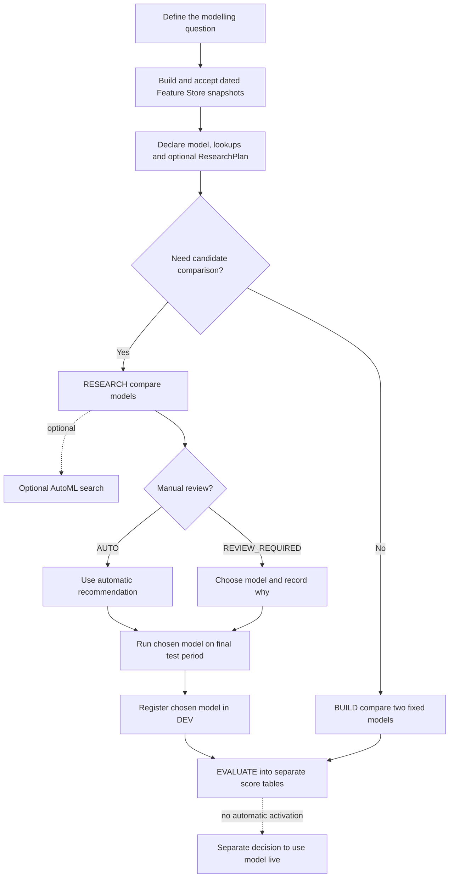

# Model research: data scientist guide

This guide shows how to compare model options in MLflow, choose one, register it in personal DEV and score it safely. Shopping Bag pCTR is the worked example for [work item 5260243](https://dev.azure.com/Next-Technology/DirectoryMarketing.Personalisation/_workitems/edit/5260243).

The basic flow is: define the question and dates once, run every model against the same data and metrics, choose a winner, then use the untouched test period as the final check. The chosen model can be registered and scored in DEV, but nothing is put live.

For the shortest route, read the workflow in section 2 and the Shopping Bag example in section 20. The rest is the full reference for fields, outputs and recovery. The wider job/table map is in [NextAds job and table flow](architecture/nextads_job_table_flow.md), and environment movement is in the [model lifecycle runbook](model_lifecycle_runbook.md).

## Contents

1. [What this workflow is for](#1-what-this-workflow-is-for)
2. [The short version](#2-the-short-version)
3. [What you choose and what the jobs choose](#3-what-you-choose-and-what-the-jobs-choose)
4. [What the IDs and records mean](#4-what-the-ids-and-records-mean)
5. [Before you run anything](#5-before-you-run-anything)
6. [Set up the model](#6-set-up-the-model)
7. [Set up the comparison](#7-set-up-the-comparison)
8. [Choose the models to compare](#8-choose-the-models-to-compare)
9. [Choose what MLflow should show](#9-choose-what-mlflow-should-show)
10. [Run the lifecycle job](#10-run-the-lifecycle-job)
11. [`BUILD`: run the existing two-model builder](#11-build-run-the-existing-two-model-builder)
12. [`RESEARCH`: compare the models in YAML](#12-research-compare-the-models-in-yaml)
13. [Optional AutoML search](#13-optional-automl-search)
14. [`REVIEW_SELECT`: choose, test and register one candidate](#14-review_select-choose-test-and-register-one-candidate)
15. [`EVALUATE`: compare the selected model without using it live](#15-evaluate-compare-the-selected-model-without-using-it-live)
16. [Other jobs used by this workflow](#16-other-jobs-used-by-this-workflow)
17. [Find the outputs](#17-find-the-outputs)
18. [What to check in MLflow](#18-what-to-check-in-mlflow)
19. [Reruns and failures](#19-reruns-and-failures)
20. [Shopping Bag pCTR: worked example](#20-shopping-bag-pctr-worked-example)
21. [Current limitations and quick answers](#21-current-limitations-and-quick-answers)
22. [What happens after personal DEV](#22-what-happens-after-personal-dev)
23. [Glossary](#23-glossary)
24. [Related docs and source](#24-related-docs-and-source)

## 1. What this workflow is for

The goal is to compare models fairly in MLflow. Every model uses the same dated Feature Store data—the data that would have been available when the prediction was made—and gets its own run. Only the selected model is checked against the untouched final period and registered.

The system calls each model option a model candidate. This is different from an advert candidate in the operational NextAds flow: a model candidate is an algorithm being compared, while an advert candidate is an eligible scored advert that could later be assigned. The important rules are:

- The existing `BUILD` route still compares its two fixed models and registers the winner without a research plan.
- `RESEARCH` is optional. Its dates, models and checks are saved in YAML.
- Every model candidate gets its own MLflow run using the same data and split.
- Model-candidate code cannot change the split, publish scores, register itself or move an alias.
- The parent run compares the results and recommends a model candidate. Only the chosen one sees the final test period.
- `RESEARCH`, AutoML and `REVIEW_SELECT` can reuse matching completed work. Every `EVALUATE` run creates a new separate attempt.

This workflow does not:

- promote models or move aliases in DEV Integration, PREPROD or PROD;
- add a model to serving or write live candidate, assignment or payload tables;
- let candidate code read the final test data or let job-form values override the split in YAML;
- register an AutoML trial or make NextAds use a model merely because it was registered in personal DEV.

Registering a model in personal DEV only saves that exact version. It does not make NextAds use it.

## 2. The short version



Use this table first:

| What you want to do | Run | What you enter |
| --- | --- | --- |
| Compare the two fixed BUILD models and register the winner | `BUILD` | Model name and explicit observation/feature dates plus label boundary |
| Compare a reviewed set of model families on one fixed split | `RESEARCH` | Model name and label boundary; candidates and dates come from source control |
| Explore a wider search without registration | Model discovery | The ID of a completed research run, explicit `enabled=true`, optional timeout |
| Accept one reviewed research candidate | `REVIEW_SELECT` | Exact research build, declared candidate ID, reviewer name and substantive reason |
| Score an exact registered model against an accepted candidate-build result | `EVALUATE` | Exact model build and run date; normally leave snapshot, attempt, limit and slot on the current defaults |
| Make a model serve customers | Not this workflow | A separate reviewed portfolio, release and activation decision |

### What this looked like for Shopping Bag

The starting question was simple: could recent account activity and advert details help rank Shopping Bag adverts by click likelihood?

1. The label, feature sets, dates, four model options and review rules were added to YAML.
2. `RESEARCH` ran all four models on the same 203,310 saved rows. Logistic regression came out best on the validation checks.
3. AutoML was run separately to explore more ideas. It used train and validation only, and could not register anything.
4. `REVIEW_SELECT` recorded why logistic regression was chosen, showed that model the untouched test period, and registered numeric version 4 in personal DEV.
5. The existing `dev_candidate` alias stayed on version 3, so the new model was not live.
6. `EVALUATE` scored 10,000 accounts into separate comparison tables. It did not change candidate, provider, assignment or payload output.

Section 20 contains the real run links, IDs, metrics, row counts and before/after checks.

## 3. What you choose and what the jobs choose

A DS makes two kinds of choice: settings saved in YAML and values entered for a particular run. Code, runtime and release settings are owned elsewhere.

| Option owner | Where it is set | Examples | Why it lives there |
| --- | --- | --- | --- |
| Data scientist, reviewed in source control | [`configs/models/nextads_models.yaml`](../configs/models/nextads_models.yaml) | question, label, features, lags, split, candidates, metrics, slices, selection policy | These change what is being tested, so they must be reviewed |
| Data scientist, selected for one manual run | Databricks job parameters | operation, model name, exact build/candidate IDs, reviewer/reason, evaluation date | These point the job at saved settings or a completed result; they do not redefine it |
| Plug-in author, reviewed in code | `src/next_ads/model_development/` | model implementation, prediction adapter, explanation implementation | Only needed when the built-in model options cannot do the job |
| Platform owner | bundle variables and job YAML | catalog/schema, experiment root, cluster, libraries, code SHA, concurrency, timeouts | Keeps runs on the approved storage and compute setup |
| Release owner | release/import/promotion jobs | exact source version, target namespace, promotion alias | A personal DEV model is not approved for release |

### 3.1 Normal DS choices

A data scientist normally chooses:

1. what to predict and which features to use;
2. the train, validation and test dates;
3. which models and settings to compare;
4. which metrics and groups to review, and whether selection is automatic;
5. whether to run optional AutoML;
6. after reviewing results, which model to choose and which registered build/date to evaluate.

A data scientist normally does not choose:

- catalogs, schemas, MLflow paths or output table names;
- cluster, runtime, libraries or deployed code version;
- internal column names, run IDs or accepted snapshot versions;
- registration naming, aliases, provider publication or serving;
- access to the final test period.

If one needs changing, ask the platform or release owner rather than working around it in the job form.

## 4. What the IDs and records mean

These are the main records a DS will see:

| Object | Meaning | Created or changed by | Important states |
| --- | --- | --- | --- |
| Model declaration | Saved YAML settings for one model | Source-control review | Valid or rejected when loaded |
| Training-set receipt | Record of exactly which dated data was used | `BUILD` or `RESEARCH` | `READY`, `FAILED`; the future-data check must pass |
| Research build | One comparison containing all model runs and the recommendation | `RESEARCH` | `RESEARCHING`, `AWAITING_SELECTION`, `READY`, `FAILED` |
| Candidate evaluation | One candidate's MLflow run, saved model, metrics and file hashes | `RESEARCH` | `RESEARCHING`, `READY`, `FAILED` |
| Selection decision | Recorded choice of candidate, either automatic or manual | `RESEARCH` for `AUTO`; `REVIEW_SELECT` otherwise | `READY`, `FAILED` |
| Model build | The registered DEV model and where it came from | `BUILD` or selected research route | `READY`, `FAILED` |
| Evaluation scoring build | One separate scoring run and the tables it wrote | `EVALUATE` | `BUILDING`, `READY`, `FAILED` |

Most IDs are calculated from the inputs. Running the same setup again therefore gets the same logical ID. Attempt IDs also include the Databricks run, so every execution is still recorded. This is how retries can reuse completed work without hiding which run performed it.

The retry section explains the lower-level claim and checkpoint records. In day-to-day review, `READY` means usable, `FAILED` means unusable, and `AWAITING_SELECTION` means a reviewer must choose.

## 5. Before you run anything

### 5.1 Required access and deployment

- Work in a personal DEV deployment of the feature branch.
- Use the centrally owned jobs rather than creating a saved job for one model.
- Confirm the live job tag and task `--code_sha` match the commit being reviewed.
- The lifecycle job runs one operation at a time. Let later runs queue.
- Do not use this workflow from PREPROD or PROD. The lifecycle and discovery resources are declared for DEV only.

### 5.2 Required data

Every requested date needs a `READY` Feature Store snapshot. Having a table is not enough: the job also checks the saved Delta version, row count, schema and checksum.

For a time-correct lookup, the feature timestamp must be no later than:

```text
observation timestamp - declared availability lag
```

Labels must be `0` or `1` and old enough by `label_end`. Every split needs usable positive and negative examples. The run stops if dates are missing, keys are duplicated, features come from the future, labels are not mature, or saved data no longer matches its receipt.

### 5.3 Current supported model status

At the moment, `shopping_bag_pctr` is the only declaration proven end to end through `RESEARCH`, discovery, `REVIEW_SELECT` and `EVALUATE`.

`analytics_pctr` is still listed for compatibility, but it is not currently an end-to-end choice in the generic lifecycle:

- its trainer is not registered for generic `BUILD`;
- it has no declared research plan;
- it has no registered generic evaluator.

Choosing it for those routes fails before training starts rather than silently using Shopping Bag behaviour.

## 6. Set up the model

Model settings live in [`configs/models/nextads_models.yaml`](../configs/models/nextads_models.yaml). The system saves a checksum of those settings. If they change, the next run is treated as new work rather than changing an earlier result.

### 6.1 Top-level model fields

These are the fields a DS normally changes:

| Field | Required/default | What it controls |
| --- | --- | --- |
| `model_name` | Required | Nonblank name used in the job and registered-model name. Follow the repository convention, such as `shopping_bag_pctr` |
| `problem_statement` | Required | What is predicted and for whom |
| `prediction_entity` | Required | What one prediction is for |
| `prediction_time` | Required | When the prediction is made and what data is allowed by then |
| `label` | Required | The binary outcome column |
| `observation_keys` | Required | Columns that uniquely identify one input row. They are not model features by default |
| `success_metrics` | Required | Measures the model is meant to improve. They are recorded, but winner selection still uses validation PR-AUC, then log loss, then candidate ID |
| `training_observation` | Required | The labelled rows used for training; see below |
| `feature_lookups` | At least one | Dated feature sets joined to those rows; see below |
| `evaluation_scope` | Defaults to empty | Intended isolated-evaluation scope. Shopping Bag is currently fixed in code to route `v1` and locations `SB1`/`SB2`; changing YAML alone does not change it |
| `research` | Optional | The models, dates and checks used by `RESEARCH` |

These fields wire the declaration into the platform and are normally left alone:

| Field | Required/default | What it controls |
| --- | --- | --- |
| `provider_id` | Required | Registered provider implementation |
| `runtime_profile` | Required | `dbr_15_4_spark_cpu` or `dbr_18_1_theme_gpu`; generic research currently uses DBR 15.4 CPU |
| `trainer` | Required | Operational trainer used by direct `BUILD`, not the research candidate list |
| `score_provider` | Required | Standard score columns and format |
| `candidate_adapter` | Required | How scores attach to accepted NextAds candidates |
| `evaluation_use_case` | Defaults to `advert_ranking` | The isolated `EVALUATE` implementation |
| `activation_mode` | Defaults to `EVALUATE`; only `EVALUATE` is allowed | Stops this route from activating a model |

### 6.2 `training_observation` fields

| Field | Required/default | What to choose | Why |
| --- | --- | --- | --- |
| `feature_id` | Required | Registered labelled Feature Store definition | Prevents arbitrary table reads |
| `selected_columns` | Required, unique | Keys, label, timestamps, audit fields and any direct context features needed by the definition | Creates an explicit data boundary |
| `observation_timestamp` | Required and selected | Timestamp that represents prediction time | Drives point-in-time joins |
| `observation_date_column` | Defaults to `observation_timestamp` | A selected date column when partition/date semantics differ from the timestamp | Supports exact temporal coverage checks |
| `context_features` | Defaults to empty | Selected non-key, non-label, non-timestamp columns that are genuine model inputs | Allows context such as Shopping Bag location without treating audit fields as features |
| `label_maturity_column` | Optional | Selected date/timestamp proving the label is mature | Stops future outcome leakage |
| `filters` | Defaults to empty | Selected-column to non-null YAML/JSON value | Fixes which rows are used, for example `route: v1` and `platform: WEB` |

Context features cannot include observation keys, the label, observation timestamps/dates or maturity fields. A selected audit column is not a model feature unless it is declared in `context_features` or supplied by a feature lookup.

### 6.3 `feature_lookups` fields

Each lookup adds dated features from one registered Feature Store dataset.

| Field | Required/default | What to choose | Why |
| --- | --- | --- | --- |
| `feature_id` | Required | Registered feature definition | Gives the lookup a stable name |
| `key_mapping` | At least one pair | Feature-table key to observation key | States exactly how the two datasets join |
| `selected_columns` | Required, unique | Only features the model is permitted to see | Prevents accidental column expansion |
| `observation_timestamp` | Required | Observation timestamp used for the cutoff | Couples the lookup to prediction time |
| `availability_lag_days` | Default `0`, integer >= 0 | Delay between source event and actual feature availability | Stops the join assuming that data is available immediately |
| `renames` | Default empty | Selected source column to unique model-facing name | Resolves collisions and improves readability |
| `defaults` | Default empty | Selected column to JSON scalar value | Makes missing-feature behaviour reproducible and measurable |

All final feature names across context and lookups must be unique and cannot collide with observation keys or the label.

Most people should use a normal YAML mapping. `filters`, `key_mapping`, `renames` and `defaults` also accept a list of `{from: ..., to: ...}` pairs; both forms save the same settings.

### 6.4 Shopping Bag declaration choices

The worked declaration asks: for each Shopping Bag advert shown on WEB, how likely is it to be clicked during the same session?

- Label source: `next_uk_nextads_fs_shopping_bag_click_labels`.
- Label: `clicked`.
- Observation keys: `exposure_id`, `label_horizon_days`.
- Rows used: `route=v1`, `platform=WEB`, zero-day label horizon, mature labels, one observed impression.
- Input taken directly from the label row: `location`.
- Account features: nine 90-day browsing/action aggregates, keyed by `account_number`, with a one-day availability lag and explicit defaults.
- Advert features: campaign/theme/category/brand/template, keyed by `advert_id` and `location`.
- Evaluation scope: route `v1`, locations `SB1` and `SB2`.
- It can only write separate evaluation output; it cannot go live: `EVALUATE` only.

The selected observation columns also include audit and slice fields such as device, but those do not enter the feature vector unless declared as context or lookup outputs.

## 7. Set up the comparison

The optional `research` block says which models to compare and how to compare them. It is included in the saved settings, so changing it creates a new research build.

### 7.1 Top-level research fields

| Field | Required/default | Valid options | Why |
| --- | --- | --- | --- |
| `candidates` | Required, non-empty, unique IDs | One or more `CandidateSpec` entries | Models to compare |
| `temporal_split` | Required | Exact inclusive train, validation and test date ranges | Dates for training, comparison and final testing |
| `evaluation_rules` | Required | Standard binary results plus allowed extensions | Metrics and charts every model must produce |
| `slices` | Default empty | Zero or more unique `SliceSpec` entries | Groups to report separately, with low-volume results hidden |
| `selection_policy` | Required | `AUTO` or `REVIEW_REQUIRED` | Choose automatically or stop for review |
| `explanation_requirements` | Must include standard trio | `global_feature_importance`, `readable_feature_names`, `model_specific_or_permutation`, plus optional names | Explanation files each model must provide |
| `minimum_successful_candidates` | Default `1`; 1..candidate count | Must be at least the number of candidates whose failure is not allowed | How many models must finish before a recommendation is allowed |
| `candidate_search` | Default absent | Optional AutoML settings | Allows a separate AutoML run without adding those trials to the main comparison |

Advanced fields should normally be left alone:

| Field | Default | What it does |
| --- | --- | --- |
| `evaluation_schema_version` | `binary_classifier_evidence/v1` | Saved with the result and used in its ID. Changing the text alone does not add another evaluator or output format |
| `evidence_producers` | Empty | Runs checked-in `next_ads.*` extensions that can add summary files but cannot see row-level identities or control registration |

### 7.2 Temporal split

The six required ISO dates are:

```yaml
temporal_split:
  train:    {start: YYYY-MM-DD, end: YYYY-MM-DD}
  validate: {start: YYYY-MM-DD, end: YYYY-MM-DD}
  test:     {start: YYYY-MM-DD, end: YYYY-MM-DD}
```

They are inclusive and must satisfy:

```text
train.start <= train.end < validate.start <= validate.end < test.start <= test.end
```

The split has three different purposes:

- `train`: passed to candidate fitting;
- `validate`: used to compare candidates and make the recommendation;
- `test`: saved with the research data, but its outcomes stay hidden until a candidate is selected.

The job reads these dates from YAML. To use different dates, edit and review the YAML, deploy it, then start a new research run. The dates cannot be changed in the job form.

### 7.3 `evaluation_rules` fields

YAML validation is broader than the current evaluator in a few places. Where they differ, the current runtime limits below are the ones that matter.

| Field | Default | Allowed values | What happens now |
| --- | --- | --- | --- |
| `required_metrics` | Mandatory binary-classifier set in section 9.1 | Unique names; may add but may not remove a mandatory metric | Keep the mandatory list. Only add one when code exists to calculate it |
| `required_evidence` | Mandatory result-file set in section 9.2 | Unique names; may add but may not remove a mandatory file type | Keep the mandatory list. Only add one when code exists to create it |
| `top_fractions` | `0.01`, `0.05`, `0.10` | Unique finite fractions greater than `0` and at most `1`; must include 1%, 5% and 10% | Defines precision, recall, lift and top-fraction confusion points. Runtime currently accepts unique integer percentages from 1% to 50% after conversion |
| `confidence_interval_metrics` | `auc_pr`, `lift_at_5_percent` | Nonempty unique subset of required metrics | Leave the default pair; the code currently always uses those two |
| `confidence_level` | `0.95` | YAML accepts greater than `0` and less than `1`; runtime requires `0.8 <= value < 1` | Sets the selected-test interval coverage |
| `confidence_interval_resamples` | `1000` | Definition: integer >=1; runtime: 20..2000 | Number of resamples used for the selected model's test ranges |
| `confidence_interval_seed` | `1729` | Integer >=0 | Makes those ranges repeatable |
| `minimum_slice_rows` | `100` | Integer >=1 | General fallback. A value on an individual slice replaces it |
| `prevalence_baseline` | `true` | Boolean | Leave `true`; `false` is accepted but does not currently turn it off |

The mandatory metric and file names, plus current implementation limits, are listed in section 9. The checked-in Shopping Bag plan uses the current defaults above.

### 7.4 Slice fields

| Field | Required/default | Behaviour |
| --- | --- | --- |
| `slice_id` | Required unique lower-snake ID | Stable name for the slice result |
| `column` | Required | Selected observation/slice column; identity-like columns are forbidden |
| `values` | Default empty | Explicit values pin at most 25 groups. Empty performs automatic discovery only when the column has at most 25 distinct values; a 26th value fails the candidate rather than being truncated |
| `if_present` | Default `false` | `false` fails if the column is absent; `true` records the slice only when present |
| `minimum_rows` | Default `100`, >=1 | Low-volume groups are `INSUFFICIENT` and expose row count only, not outcome rates |

A slice's `minimum_rows` replaces the general setting; the two are not combined. Set it on each slice when the threshold matters.

### 7.5 Selection policies

| Policy | Behaviour | Use when |
| --- | --- | --- |
| `REVIEW_REQUIRED` | `RESEARCH` finishes `AWAITING_SELECTION`; no test outcomes, registration or model build are created until `REVIEW_SELECT` | A person needs to review the results and record why they chose the model |
| `AUTO` | The recommendation is selected by the research route, then the selected candidate alone is tested and registered | The saved settings explicitly allow automatic selection |

Automatic selection follows this fixed order:

1. highest validation PR-AUC;
2. then lowest validation log loss;
3. then alphabetical `candidate_id`.

`success_metrics` in the model declaration and extra metric names in the research plan do not currently change this ordering.

## 8. Choose the models to compare

### 8.1 `CandidateSpec`

| Field | Default | Rules | Why |
| --- | --- | --- | --- |
| `candidate_id` | None | Required, unique lower-snake ID | Name used when comparing and selecting the candidate; different from the saved `candidate:<digest>` result ID |
| `plugin` | None | Built-in alias or checked-in `next_ads.*` class | Chooses the model implementation |
| `parameters` | `{}` | Normal YAML/JSON values; numbers cannot be infinite or `NaN` | Model-specific settings |
| `seed` | `1729` | Integer >=0 | Makes RF, GBT and XGBoost runs repeatable |
| `failure_allowed` | `false` | Boolean | Whether research may continue if this model fails. The overall minimum-success setting must still be met |

`minimum_successful_candidates` must still be high enough to include every candidate with `failure_allowed=false`. In the Shopping Bag proof all four are required and the minimum is four, so any candidate failure stops recommendation.

### 8.2 Built-in candidates

| Model option | Main reason to include it | Built-in defaults used by Shopping Bag | Main trade-off |
| --- | --- | --- | --- |
| `spark_logistic_regression` | Simple baseline and easiest to explain | `maxIter=50`, `regParam=0.01`, `elasticNetParam=0.0` | Cannot represent complex interactions unless features encode them |
| `spark_random_forest` | Uses many trees to capture non-linear relationships | `numTrees=120`, `maxDepth=8`, `minInstancesPerNode=20`, declared seed | Can fall back towards the overall click rate on very imbalanced data and may be less well calibrated |
| `spark_gradient_boosted_trees` | Builds trees in sequence, improving weak areas each time | `maxIter=60`, `maxDepth=5`, `stepSize=0.05`, declared seed | More expensive and can overfit |
| `spark_xgboost` | A more flexible distributed boosted-tree option | `eval_metric=aucpr`, `max_depth=6`, `learning_rate=0.05`, `n_estimators=150`, `subsample=0.8`, `colsample_bytree=0.8`, `num_workers=4`, declared seed | Higher runtime/cost and more settings to tune |

The Shopping Bag choices are comparison baselines, not a claim that these are the only valid models.

### 8.3 What common parameters mean

| Parameter | Applies to | Meaning |
| --- | --- | --- |
| `maxIter` | LR, GBT | Maximum optimization/boosting iterations |
| `regParam` | LR | Overall regularisation strength |
| `elasticNetParam` | LR | `0` is L2, `1` is L1, values between blend them |
| `numTrees` | RF | Number of independently trained trees |
| `maxDepth` | RF, GBT | Maximum tree depth and interaction complexity |
| `minInstancesPerNode` | RF | Minimum examples required in a child node; larger values regularise the forest |
| `stepSize` | GBT | Boosting learning rate |
| `eval_metric` | XGBoost | Training diagnostic metric; `aucpr` suits rare positive outcomes |
| `learning_rate` | XGBoost | Contribution of each new tree |
| `n_estimators` | XGBoost | Number of boosting rounds/trees |
| `subsample` | XGBoost | Fraction of rows sampled per tree |
| `colsample_bytree` | XGBoost | Fraction of features sampled per tree |
| `num_workers` | XGBoost | Distributed Spark workers used by the estimator |

Parameters must be valid YAML/JSON values, and numbers cannot be infinite or `NaN`. The repository does not check every model-specific name or range. Your values replace the defaults and are passed to Spark or XGBoost; unsupported settings make the run fail. Check the DBR 15.4 API before adding one.

### 8.4 Parameters candidates may not control

Candidate `parameters` cannot contain orchestration-owned concepts, including:

- feature, label, split, prediction, probability or raw-prediction column names;
- train/validation/test dates or split seeds;
- MLflow experiment/run IDs;
- model/alias/registered-model names;
- output or score tables;
- provider IDs or score-provider choice;
- publish, register or alias-setting flags;
- random seed aliases such as `random_seed`, `random_state` or `seed`.

Use the top-level `seed` field for randomness. These restrictions stop a model from changing its data, outputs, MLflow location or registration behaviour.

<details>
<summary>Exact blocked parameter names</summary>

```text
alias
features_col
label_col
mlflow_experiment
mlflow_experiment_id
mlflow_run_id
model_alias
model_name
output_table
prediction_col
probability_col
provider_id
publish
publish_scores
random_seed
random_state
raw_prediction_col
register_model
registered_model_name
score_provider
score_table
seed
set_alias
split
split_col
split_column
split_seed
test_end
test_start
train_end
train_start
validation_end
validation_start
```

</details>

### 8.5 Fixed preprocessing

Every model gets the same data preparation:

- text values are converted to fixed categories, with unseen values kept (`StringIndexer(handleInvalid="keep")`);
- text categories use one-hot encoding with `dropLast=false`;
- missing numbers use the median;
- all features are assembled in the same saved order;
- the saved feature map records the readable name for every position.

Only supported Spark string and numeric feature types are accepted. Empty or unsupported feature schemas fail before fitting.

### 8.6 Adding a new model implementation

<details>
<summary>Developer requirements for a custom candidate</summary>

Only checked-in classes under `next_ads.*` can be used. They must be constructible without arguments and support fit, predict, save and load. External import paths are rejected.

The job supplies the training data and expects a score from `0` to `1` plus a binary prediction. It checks the returned rows, columns, labels, dates and IDs, then reloads the saved model to confirm it gives the same result.

Extra result-file code receives summary data, not row-level scores. Its output is limited in size and shape so it cannot expose identity-like records.

</details>

## 9. Choose what MLflow should show

### 9.1 Mandatory metrics

Every candidate must write these validation metrics. A candidate cannot be selected if any are missing or invalid.

| Metric | What it answers | How to interpret it here |
| --- | --- | --- |
| `auc_pr` | How well does the model put clicks near the top of the ranking? | Main comparison for a rare positive outcome; higher is better |
| `prevalence` | What share of rows clicked? | The base rate needed to understand PR-AUC, precision and lift |
| `auc_roc` | How often does a clicked row rank above a non-clicked row? | Higher is better, but it can look optimistic when clicks are rare |
| `log_loss` | How accurate are the probabilities? | Lower is better; confident mistakes cost more |
| `observed_click_rate` | What actually happened in the evaluated split? | Should agree with prevalence |
| `predicted_click_rate` | What average probability did the model predict? | Compare with observed rate to judge aggregate calibration |
| `calibration_gap` | Difference between the average predicted and actual click rates | Lower is better |
| `precision_at_1_percent` | Of the top-scored 1%, what fraction clicked? | Quality at the most selective action point |
| `recall_at_1_percent` | Of all clicks, what fraction appears in the top 1%? | Positive coverage at the most selective action point |
| `lift_at_1_percent` | How much better is top-1% precision than prevalence? | `1` is no gain over random/base-rate selection |
| `precision_at_5_percent` | Click rate in the top-scored 5% | Important operational ranking view for the current proof |
| `recall_at_5_percent` | Fraction of clicks captured in the top 5% | Complements precision/lift |
| `lift_at_5_percent` | Top-5% precision divided by prevalence | Useful second check when reviewing the recommendation |
| `precision_at_10_percent` | Click rate in the top-scored 10% | Wider action band |
| `recall_at_10_percent` | Fraction of clicks captured in the top 10% | Wider positive coverage |
| `lift_at_10_percent` | Top-10% precision divided by prevalence | Whether value persists outside the very top ranks |

Score ties use the hashed row ID, so the same data produces the same ordering rather than relying on Spark row order.

### 9.2 Required result files

Each candidate run gets the same JSON/CSV files and graphs.

| Result | Files | Review question |
| --- | --- | --- |
| Complete evaluation | `evaluation.json`, `metrics.json` | Are all required metrics present and finite? |
| Precision-recall | `precision_recall_curve.csv/.png` | Does precision remain useful as recall increases? |
| ROC | `roc_curve.csv/.png` | Is discrimination consistently above chance? |
| Calibration | `calibration.csv/.png` | Do score bands match observed rates? |
| Lift and cumulative gain | `lift_gain.csv/.png` | How quickly are clicks concentrated at the top? |
| Score distribution | `score_distribution.csv/.png` | Has the model collapsed to nearly one score, or produced extreme probabilities? |
| Top-fraction confusion | `top_confusion.csv/.png` | What are TP/FP/FN/TN consequences at 1%, 5% and 10%? |
| Slice metrics | `slice_metrics.csv/.png` | Are the results noticeably different between SB1/SB2 or other permitted groups? |
| Feature coverage | `feature_coverage.json/.csv/.png` | Which features are missing or defaulted, and at what rate? |
| Explanation | `explanation.json`, `feature_importance.csv/.png` | Which readable declared features drive the model? |
| Confidence intervals | `confidence_intervals.json` for the selected test result | Is held-out performance reasonably stable? |
| Optional extensions | `optional_evidence.json` | Did the optional extension finish, and what did it return? |
| File list | `artifact_manifest.json` | Do the recorded names, sizes and SHA-256 hashes match the files? |

The parent run gets `candidate_comparison.json/.csv/.png` plus the overall receipt and status files. Section 18 lists every file.

### 9.3 Limits used for charts and slices

These limits are fixed by the job:

- PR/ROC charts use up to 101 points and ranking charts use up to 100 rows;
- calibration uses 10 groups and score distribution uses 20;
- at least 5 positives and 5 negatives before outcome metrics are shown;
- automatic slice discovery only for columns with at most 25 distinct values; enumerate at most 25 values explicitly when the source column has higher cardinality;
- selected-test resampling output never includes its internal block IDs;
- files are written in a stable order and hashed.

If there is too little data, the result is marked `INSUFFICIENT`. It is not changed to zero or treated as a pass.

### 9.4 Explanations by model family

| Model family | Explanation |
| --- | --- |
| Logistic regression | Signed coefficient, absolute magnitude and odds ratio for each readable vector feature |
| Random forest | Native global feature importance mapped back to readable feature/category names |
| Gradient-boosted trees | Native global feature importance mapped back to readable names |
| Spark XGBoost | Gain-based importance plus limited summary contribution results |
| Custom candidate | The job shuffles each feature three times and measures the drop in validation PR-AUC; there is no separate custom-explanation hook |

Names such as `feature_0` are not accepted as an adequate mapping. Every fitted vector position must be mapped exactly once, positions must be consecutive, and readable names must be unique. Explanation failure prevents the candidate becoming READY.

### 9.5 Prevalence baseline

The framework also evaluates a constant score equal to the training positive rate. It is recorded as `prevalence_only_baseline` and is never selectable. Its purpose is to show whether a learned model adds ranking or calibration value beyond predicting the base rate for every row.

`prevalence_baseline: false` does not currently turn the baseline off; the runtime still writes it. Shopping Bag uses `true`, so this does not affect its result. Leave it `true` until the runtime supports switching it off.

### 9.6 Confidence intervals

Only the selected candidate gets uncertainty ranges on the final test period. The current code calculates them for:

- PR-AUC;
- lift at 5%.

The Shopping Bag plan uses 95% confidence, 1,000 resamples and seed 1729. Although YAML accepts wider values, the runtime limits are:

- confidence level `>= 0.8` and `< 1.0`;
- resamples between `20` and `2000` inclusive.

`confidence_interval_metrics` is currently saved with the setup but does not choose the calculation. The code still requires PR-AUC and lift@5, so leave that pair in place until the runtime is extended.

## 10. Run the lifecycle job

The saved job is [`mktg_next_uk_nextads_model_development`](../pipelines/databricks/jobs/mktg_next_uk_nextads_model_development.yml), deployed in DEV as [job 383960843241650](https://adb-6694370232251359.19.azuredatabricks.net/jobs/383960843241650?o=6694370232251359). It is a manual, personal-DEV entry point with one task, one active run at a time and queueing enabled.

### 10.1 Job setup — not DS choices

| Setting | Value | Reason |
| --- | --- | --- |
| Target | DEV only | Research and evaluation are isolated from controlled release environments |
| Schedule | None | Started manually by a DS |
| Task | `run_declared_model_operation` | Runs all four operations from one job |
| Maximum concurrency | 1 | Only one run writes to the personal DEV area at a time |
| Job/task timeout | 21,600 seconds (6 hours) | Covers the full four-candidate run |
| Runtime | DBR 15.4, standard Spark/CPU | The reviewed runtime for this job |
| Cluster | Driver plus four `Standard_D32ads_v5` workers | Compute sized for the four-candidate run |
| Libraries | Pinned research libraries in `requirements-model-research.txt` | Keeps model saving and results consistent |
| Retry count | No automatic retry declared | A retry is a deliberate new attempt; completed work is reused by ID |
| Application logging | `INFO`; noisy dependency loggers reduced to `WARNING` on the current branch | Shows job progress while hiding repeated Py4J callback messages |

### 10.2 Every run-form field

Databricks shows the union of all operation fields. Supplying a nonblank field that does not belong to the chosen operation is an error.

| UI field | Used by | Required/default | Format and meaning |
| --- | --- | --- | --- |
| `operation` | All | Required | `BUILD`, `RESEARCH`, `REVIEW_SELECT` or `EVALUATE`; trimmed and case-normalised |
| `model_name` | All | Required | Exact case-sensitive declared name |
| `observation_reference_dates` | `BUILD` | Required | Unique comma-separated ISO dates |
| `feature_reference_dates` | `BUILD` | Required | Unique comma-separated ISO dates |
| `feature_reference_dates` | `EVALUATE` | Optional; blank=`AUTO` | `AUTO` or exact unique comma-separated dates |
| `label_end` | `BUILD`, `RESEARCH` | Required | ISO date proving labels are mature |
| `research_build_id` | `REVIEW_SELECT` | Required | Exact `research:<digest>` ID |
| `candidate_id` | `REVIEW_SELECT` | Required | Declared READY candidate key such as `logistic_regression`, not the durable `candidate:<digest>` row ID |
| `written_reason` | `REVIEW_SELECT` | Required | Explain why this candidate was chosen. It cannot be blank or literal `REQUIRED`. The text is part of the decision ID, but the job does not judge whether the explanation is good |
| `reviewed_by` | `REVIEW_SELECT` | Required | Reviewer name saved with the decision. The job records the text but does not verify the person's identity |
| `model_build_id` | `EVALUATE` | Required | Exact READY build ID, not model alias/version alone |
| `run_date` | `EVALUATE` | Required | ISO candidate-build/evaluation date |
| `evaluation_account_limit` | `EVALUATE` | Optional; blank=`10000` | Positive integer account cap; currently no coded maximum |
| `evaluation_serving_slot` | `EVALUATE` | Optional; blank=`best` | Accepted portfolio slot, currently `best` or `best_challenger` when present |
| `evaluation_candidate_build_attempt_id` | `EVALUATE` | Optional; blank=`AUTO` | Exact READY v1 candidate attempt or latest accepted attempt for the date |

The literal placeholder `REQUIRED` and an empty string both count as missing.

### 10.3 Leave unrelated fields blank

Leave every field not listed for the chosen operation blank. The job rejects stale values left in another operation's fields.

### 10.4 Values filled in by the job

| Derived value | Resolution |
| --- | --- |
| Feature/model catalog | Personal DEV deployment catalog, currently `marketingdata_dev` |
| Feature/model schema | Deployed personal schema |
| Registered model | `<catalog>.<schema>.nextads_<model_name>` |
| `BUILD` experiment | `<bundle-root>/<model_name>` |
| `RESEARCH` and `REVIEW_SELECT` experiment | `<bundle-root>/<model_name>_research`; review appends to the existing parent/selected child rather than creating another experiment |
| `EVALUATE` experiment | None; this operation writes a Delta summary and score table, not an MLflow experiment |
| Candidate/result table namespace | Same personal model catalog/schema |
| Code version | Deployed Git commit SHA |
| Databricks run details | Parent job run, task run and task execution count |
| Alias | None; this job never sets one |

Changing source YAML does not change an already deployed job. Deploy the new commit and start a new run.

## 11. `BUILD`: run the existing two-model builder

### 11.1 When to use it

Use `BUILD` to run the existing two-model trainer and register the better model in your personal DEV area. Use `RESEARCH` for the four-candidate Shopping Bag comparison. The two operations use different candidates and split the data differently.

### 11.2 Required choices

```text
operation=BUILD
model_name=<declared model>
observation_reference_dates=<comma-separated dates>
feature_reference_dates=<comma-separated dates>
label_end=<YYYY-MM-DD>
```

At least two usable observation dates are needed because direct BUILD makes a temporal train/validation split.

### 11.3 What happens

1. Check that the named model has a `BUILD` trainer and scoring implementation before writing anything.
2. Load the requested `READY` observation and feature snapshots.
3. Apply the declared filters, check that labels are complete, and join only features that were available at the time.
4. Save a record of the data used.
5. Put the latest 20% of whole observation dates into validation and use the earlier dates for training.
6. Train the fixed logistic-regression and gradient-boosted-tree candidates.
7. Choose the candidate with the highest validation PR-AUC.
8. Register it in personal DEV, or reuse the same model build if it already exists.
9. Score the validation rows twice and stop if the two results differ.
10. Save the evaluation and scoring-format results.

### 11.4 Outputs

- `next_uk_nextads_training_set_receipts`;
- `next_uk_nextads_model_builds`;
- `next_uk_nextads_model_evaluation_candidates`;
- `next_uk_nextads_score_provider_signals`;
- `next_uk_nextads_score_provider_builds`;
- direct-build MLflow run/artifacts;
- numeric version of `<catalog>.<schema>.nextads_<model_name>`.

It does not set an alias, add a portfolio entry, write assignments or build a payload.

### 11.5 Important distinction from `RESEARCH`

With seven observation dates, `BUILD` uses the latest two for validation because `ceil(20% of 7)=2`. The Shopping Bag research plan instead uses 5–8 August for training, 9–10 August for validation and 11 August for test. `BUILD` compares only its two fixed models; it does not read `research.candidates`.

## 12. `RESEARCH`: compare the models in YAML

### 12.1 When to use it

Use `RESEARCH` to compare every candidate in the checked-in plan using the same fixed data.

### 12.2 Required choices

```text
operation=RESEARCH
model_name=<model with a ResearchPlan>
label_end=<date on or after declared test end>
```

Leave every other operation field blank. In particular, do not supply observation or feature dates: the checked-in split owns them.

### 12.3 What happens before fitting

1. Load the model settings and research plan and record their checksums.
2. Check that every declared candidate and result-file component is available before writing anything.
3. Build the full list of training, validation and test dates from the plan.
4. Match each observation date to its feature date. This route currently requires features from exactly one day earlier.
5. Load the `READY` observation and feature snapshots and record their Delta versions and checksums.
6. Check label values and maturity, date coverage, duplicate rows, time lags and possible future-data leakage.
7. Save or reuse the `READY` training-data record.
8. Claim this research build so another run cannot build the same thing at the same time.
9. Create or reuse the fixed research dataset.
10. Create or reuse the personal MLflow experiment and parent run.

### 12.4 Saved research data and privacy

The saved research dataset contains:

- research/frame/attempt IDs;
- training receipt ID;
- SHA-256 row identity;
- observation date and declared split;
- binary label;
- typed feature JSON;
- permitted slice JSON;
- creation time.

Raw account, customer, email, exposure and row IDs are not saved. They are used only to create a stable record of which rows were used, then removed. Feature and slice names that look like identities are rejected. Candidate files cannot contain row-level predictions.

### 12.5 Candidate execution

For each candidate:

1. train on `TRAIN` only;
2. return scores and predictions in the required common format;
3. calculate the common metrics on `VALIDATE`;
4. save training summaries, never row-level training data;
5. create the same result files and a readable explanation for every candidate;
6. save the model under that candidate attempt's MLflow path;
7. reload it and check that it produces the same scores and predictions;
8. record hashes for the model and result files;
9. save the candidate as `READY` or `FAILED`.

Candidates cannot see the `TEST` rows or results at this stage.

### 12.6 Terminal outcomes

| Situation | Result |
| --- | --- |
| A required candidate fails or too few candidates succeed | Research `FAILED`; the failed attempt stays in the record |
| All required results pass and policy is `REVIEW_REQUIRED` | `AWAITING_SELECTION`; recommendation recorded; no test or registration |
| All required results pass and policy is `AUTO` | Recommended candidate is selected, tested and registered; research `READY` |

Search the task output for `MODEL_LIFECYCLE_EVIDENCE=` to find the result.

## 13. Optional AutoML search

### 13.1 Why it is a separate job

AutoML runs as a separate DEV job because it needs a CPU ML runtime and different setup from normal research. This keeps it optional and separate from the four declared candidates. The job is [`mktg_next_uk_nextads_model_discovery`](../pipelines/databricks/jobs/mktg_next_uk_nextads_model_research_automl.yml), deployed in DEV as [job 1060266822908498](https://adb-6694370232251359.19.azuredatabricks.net/jobs/1060266822908498?o=6694370232251359).

It helps explore other ideas. It does not select or register a model.

### 13.2 Job settings

| Setting | Value |
| --- | --- |
| Target | DEV only |
| Schedule | None |
| Default state | Disabled |
| Maximum concurrency | 1 |
| Timeout | 9,000 seconds for job/task |
| Cluster | DBR 15.4 CPU ML, driver plus four `Standard_D32ads_v5` workers |
| Task libraries | None; the entry point bootstraps from deployed workspace source |
| Experiment | Flat `<bundle-root>/<model_name>_automl` path |

### 13.3 Every AutoML run-form field

| Field | Required/default | Valid value | Why |
| --- | --- | --- | --- |
| `enabled` | Default `false` | Exact lowercase `true` or `false` | Requires deliberate opt-in; `false` exits without discovery work |
| `model_name` | Required | Exact declared model | The model whose research data will be used |
| `research_build_id` | Required | Exact selectable completed research build | The completed research build you reviewed |
| `timeout_minutes` | Default `30` | Integer 1–120 | Limits cost and run time |

The declaration must also contain:

```yaml
candidate_search:
  plugin: databricks_automl_classification
  enabled: false
  timeout_minutes: 30
```

The job-form values are the real controls: `enabled=true` starts AutoML and `timeout_minutes` sets its limit. The YAML records that AutoML is available and its usual default. Runtime currently checks the plug-in name but does not enforce the YAML `enabled` or timeout values.

### 13.4 Data exposed to AutoML

AutoML receives only:

- declared model input features;
- an integer binary label;
- a column telling AutoML whether a row belongs to its training or validation data;
- research `TRAIN` and `VALIDATE` periods.

It does not receive observation keys, audit fields, research slices or the true research `TEST` split.

Within train and validation, the latest validation date becomes AutoML's internal test when at least two validation dates exist. With only one validation date, rows are split by a stable hash. This internal test is not the real research test.

### 13.5 Search limits and saved results

- Primary AutoML metric: ROC-AUC.
- Time limit: 1–120 minutes, chosen in the run form.
- At most 512 completed trials are kept in the saved result.
- The saved leaderboard JSON must be no larger than 1,000,000 UTF-8 bytes.
- The winning trial must link to its generated notebook or recipe.
- Other trials may have no notebook link.
- Trial IDs and ranks cannot be duplicated.
- Rows from the real research test set: `0`.
- Model registration: always `false`.

The job saves the leaderboard and receipt, then logs `MODEL_RESEARCH_AUTOML_DISCOVERY=`.

### 13.6 What AutoML does not do

Its best trial does not automatically:

- become a declared research candidate;
- replace the main research recommendation;
- see the true held-out test;
- create a model-build receipt;
- register a Unity Catalog version;
- set/move an alias;
- activate or publish anything.

To use an AutoML idea in the main comparison, add it as a checked-in candidate in YAML and make it pass the same scoring, result-file, explanation and save/reload checks.

## 14. `REVIEW_SELECT`: choose, test and register one candidate

### 14.1 When to use it

Use this operation only after a `REVIEW_REQUIRED` research build has reached `AWAITING_SELECTION` and its parent and candidate results have been reviewed.

### 14.2 Required choices

```text
operation=REVIEW_SELECT
model_name=<same model>
research_build_id=<exact research ID>
candidate_id=<declared READY candidate key>
written_reason=<specific reason based on the results>
reviewed_by=<reviewer name>
```

`candidate_id` is the readable declaration key, such as `logistic_regression`. The runtime resolves the matching durable candidate-evaluation ID itself.

### 14.3 Recommendation versus decision

The reviewer can accept the recommended candidate or choose another declared candidate with status `READY`. The saved decision keeps both candidate IDs, the reviewer and the reason. Failed, incomplete, undeclared or unrelated candidates cannot be selected.

### 14.4 Order of operations

1. Reload the chosen research build and confirm its saved plan, data, candidate records and MLflow tags still agree.
2. Recalculate the recommendation.
3. Create the decision ID from the research build, selection mode, recommendation, chosen candidate and reason. The reviewer is saved with the decision, but is not part of the ID.
4. Save and lock the decision before reading any test result.
5. Load only the chosen candidate's saved model.
6. Score only that candidate on `TEST`.
7. Calculate test metrics, curves, slices and confidence intervals. Keep its validation explanation; do not create a separate test explanation.
8. Add the test results to the selected child run and the decision details to the parent run.
9. Register that model as `<catalog>.<schema>.nextads_<model_name>`.
10. Reload the registered numeric version and check that it reproduces the test scores.
11. Save or reuse the `READY` model build and mark the research claim `COMPLETE`.

The research-build row stays `AWAITING_SELECTION` because that records how the original `RESEARCH` run ended. Reviewed selection is complete when the claim is `COMPLETE`, the decision is `READY` and the model build is `READY`. Only `AUTO` changes the research-build row itself to `READY`.

### 14.5 Registration is not activation

The operation registers one numeric version and records its file hash. It does not set an alias. A current alias such as `dev_candidate` stays on its previous version until a separate operation changes it.

### 14.6 Reason/reviewer limitations

`written_reason` and `reviewed_by` must contain text. The literal value `REQUIRED` is rejected. Other placeholders such as `TBD` are currently allowed, so do not rely on validation to judge whether the reason is useful. Also:

- there is no structured reason taxonomy or configured length limit in this entry point;
- `reviewed_by` is not cross-checked against the Databricks run-as identity.

Use a full name and a reason that cites the validation results and any practical trade-off.

## 15. `EVALUATE`: compare the selected model without using it live

### 15.1 Purpose

`EVALUATE` checks how one numeric model version ranks a fixed, accepted set of operational advert options for one date. The implementation calls this an accepted candidate set. It writes separate comparison results only and does not affect customers.

### 15.2 Required and optional choices

```text
operation=EVALUATE
model_name=<same model>
model_build_id=<exact READY model build>
run_date=<YYYY-MM-DD>
feature_reference_dates=<blank/AUTO or exact dates>
evaluation_account_limit=<blank or positive integer>
evaluation_serving_slot=<blank, best or best_challenger>
evaluation_candidate_build_attempt_id=<blank/AUTO or exact READY attempt>
```

The normal defaults are:

- feature dates: `AUTO`;
- candidate attempt: `AUTO`;
- account limit: `10000`;
- serving slot: `best`.

### 15.3 Option details

| Option | Default behaviour | When to override | Risk/control |
| --- | --- | --- | --- |
| Feature dates | For each feature, use the latest `READY` snapshot old enough for the run date | Reproducing an earlier comparison | Normal date-lag checks still apply. A poor date can leave missing data or defaults, so `AUTO` is safest |
| Advert-option attempt | Latest accepted v1 `READY_FOR_NEXTADS` attempt for `run_date`: completion time descending, then attempt ID descending | Reproducing one known advert-option publication | The attempt must match date, route and status |
| Account limit | First 10,000 eligible accounts in a stable hashed order | A smaller smoke test or a deliberately larger check | It is an account cap, not row cap; there is currently no coded maximum |
| Serving slot | `best` | Testing accepted `best_challenger` when that slot exists | Case-sensitive and must exist in the accepted portfolio |

### 15.4 Evaluation steps

1. Check that the model build is `READY` and that the current model settings still match it.
2. Use the numeric `models:/.../<version>` URI. Aliases are not accepted.
3. Check its Unity Catalog tags, source MLflow run and model hash.
4. Resolve the accepted advert-option build, score-selection list, advert sets and scores for `run_date`.
5. Require the declared route and SB1/SB2 evaluation scope.
6. Keep accounts present in both scopes, sort them consistently and apply the account limit.
7. Load the chosen Feature Store snapshots using the required date lags.
8. Score with the declared `shopping_bag_advert_ranking` implementation.
9. Check the required `account_entity_scores/v1` and comparison-row formats.
10. Write a `BUILDING` summary, replace only this attempt's output rows, then mark it `READY`.

### 15.5 Outputs and non-outputs

Writes:

- `next_uk_nextads_model_evaluation_scoring_builds`;
- `next_uk_nextads_model_evaluation_scores`.

Does not write:

- candidate portfolios or entries;
- candidate builds, scores or advert sets;
- operational provider tables;
- assignments or assignments-v2;
- payload or payload-latest;
- registry versions or aliases.

## 16. Other jobs used by this workflow

These jobs build inputs or run operational scoring. They are not extra `RESEARCH` modes, but a DS may use them before or after model research.

### 16.1 Generic Feature Store job

Resource: [`mktg_next_uk_nextads_feature_store`](../pipelines/databricks/jobs/mktg_next_uk_nextads_feature_store.yml).

Personal DEV is manual. The shared `DEV_FEATURE_STORE` target is scheduled for 21:00 Europe/London. The job creates/validates table contracts, builds the internal Analytics pCTR source, materialises reusable features, publishes exact snapshot metadata and runs quality checks.

| Parameter | Default owner | Normal DS action | Why it exists |
| --- | --- | --- | --- |
| `reference_date` | Deployment variable | Choose the dated proof when running personal DEV | Sets the date used by every output and snapshot |
| `source_catalog` | Deployment variable | Leave default unless proving an approved alternate DEV source | Where normal source data is read from |
| `source_schema` | Deployment variable | Leave default | Schema containing normal source data |
| `theme_source_catalog` | Deployment variable | Leave default | Where Theme Affinity source data is read from |
| `theme_source_schema` | Deployment variable | Leave default | Schema containing Theme Affinity source data |
| `theme_table_prefix` | Deployment variable | Leave default | Prefix used to find Theme Affinity source tables |
| `theme_training_reference_date` | Deployment variable | Supply only when deliberately building historical Theme Affinity training input | Lets historical training data use a different date from the daily run |
| `analytics_pctr_source_binding` | Deployment variable | Leave default | Selects the approved Analytics pCTR source |
| `analytics_pctr_source_schema` | Deployment variable | Leave default | Schema containing its SQL source and staging tables |
| `recreate_feature_tables` | `false` | Do not enable during normal DS work | Drops and rebuilds physical feature tables; setup or migration use only |

<details>
<summary>All Feature Store output tables</summary>

The job's registered feature outputs are:

```text
next_uk_nextads_fs_account_profile
next_uk_nextads_fs_account_web_activity_90d
next_uk_nextads_fs_shopping_bag_account_activity_90d  (on-demand builder)
next_uk_nextads_fs_item_attributes_latest
next_uk_nextads_fs_product_embeddings_latest
next_uk_nextads_fs_advert_core_daily
next_uk_nextads_fs_advert_attribute_profile_daily
next_uk_nextads_fs_advert_semantic_profile_daily
next_uk_nextads_fs_advert_product_profile_daily
next_uk_nextads_fs_seasonal_product_demand_daily
next_uk_nextads_fs_account_theme_interactions_daily
next_uk_nextads_fs_account_theme_affinity_daily
next_uk_nextads_fs_theme_popularity_daily
next_uk_nextads_fs_account_advert_affinity_daily
next_uk_nextads_fs_session_context_daily
next_uk_nextads_fs_theme_affinity_model_input
next_uk_nextads_fs_theme_affinity_training_input
next_uk_nextads_fs_pctr_model_input
next_uk_nextads_fs_labels_clicks
next_uk_nextads_fs_shopping_bag_click_labels          (on-demand builder)
next_uk_nextads_fs_labels_theme_response
next_uk_nextads_fs_feature_quality_events
```

It also maintains compatibility views:

```text
next_uk_nextads_theme_affinity_features_latest
next_uk_nextads_pctr_features_latest
```

The two Shopping Bag tables are valid Feature Store outputs, but the scheduled job does not build them. They are built only by their focused on-demand entry points. Do not list them as outputs of a scheduled run unless those builders actually ran.

Build/snapshot metadata is written to:

```text
next_uk_nextads_feature_builds
next_uk_nextads_feature_build_sources
next_uk_nextads_feature_build_outputs
next_uk_nextads_feature_snapshots
next_uk_nextads_feature_snapshot_bindings
next_uk_nextads_analytics_pctr_feature_source_receipts
```

</details>

### 16.2 Main NextAds scoring-input and advert-option job

Resource: [`mktg_next_uk_nextads_candidate_build`](../pipelines/databricks/jobs/mktg_next_uk_nextads.yml). It retains the established 18:00 Europe/London schedule.

| Parameter | Default | Meaning |
| --- | --- | --- |
| `operation` | `CANDIDATE_BUILD` | Exact `CANDIDATE_BUILD` or `PREPARE_SCORING_INPUTS` |
| `run_date` | Job start ISO date | Dated control, advert-option and assignment partition |
| `v1_portfolio_policy_id` | `v1_default` | Reviewed V1 rule for assigning exact score outputs to route roles |
| `v2_portfolio_policy_id` | `v2_default` | Reviewed V2 rule for assigning exact score outputs to route roles |
| `foundation_snapshot_id` | `same_day` | Accepted shared customer information selected by the normal evening build |

`PREPARE_SCORING_INPUTS` is the supporting operation used by generic model scoring. It:

1. loads the current Theme Mapping;
2. refreshes item attributes;
3. builds dated item-theme inputs;
4. records the fixed scoring-input snapshot;
5. stops before advert-option building, assignments and page building.

Score-selection-policy and shared-customer-input values are used by `CANDIDATE_BUILD`, not normal input preparation. For a preparation run, a DS normally changes only `operation` and `run_date`.

<details>
<summary>All PREPARE_SCORING_INPUTS output tables</summary>

For `<ns> = <catalog_write>.<schema_write>`, `PREPARE_SCORING_INPUTS` writes or checks these destinations and no advert-option or assignment destinations:

```text
<ns>.next_uk_nextads_scoring_input_theme_mapping_raw
<ns>.next_uk_nextads_attribute_set
<ns>.next_uk_nextads_attribute_set_latest
<ns>.next_uk_nextads_item_attributes_latest
<ns>.next_uk_nextads_theme_mapping
<ns>.next_uk_nextads_theme_mapping_latest
<ns>.next_uk_nextads_item_themes
<ns>.next_uk_nextads_item_themes_latest
<ns>.next_uk_nextads_scoring_input_item_themes
<ns>.next_uk_nextads_scoring_input_snapshots
<ns>.next_uk_nextads_scoring_input_snapshot_sources
```

The lower-level item-attribute code can publish to BigQuery, but this saved-job operation does not enable that option. The BigQuery popularity table is not an output here.

</details>

<details>
<summary>All CANDIDATE_BUILD and child-job outputs</summary>

`CANDIDATE_BUILD` writes or checks the following control, score-selection and advert-option destinations:

```text
<ns>.next_uk_nextads_control_sheet_raw
<ns>.next_uk_nextads_control_sheet_raw_latest
<ns>.next_uk_nextads_control_sheet_plp_raw
<ns>.next_uk_nextads_control_sheet_plp_raw_latest
<ns>.next_uk_nextads_control_sheet
<ns>.next_uk_nextads_control_sheet_latest
<ns>.next_uk_nextads_multipage_locations
<ns>.next_uk_nextads_multipage_locations_latest
<ns>.next_uk_nextads_control_sheet_raw_v2
<ns>.next_uk_nextads_control_sheet_raw_latest_v2
<ns>.next_uk_nextads_exclusions
<ns>.next_uk_nextads_exclusions_latest
<ns>.next_uk_nextads_control_sheet_v2
<ns>.next_uk_nextads_control_sheet_latest_v2
<ns>.next_uk_nextads_scoring_portfolios
<ns>.next_uk_nextads_scoring_portfolio_entries
<ns>.next_uk_nextads_candidate_builds
<ns>.next_uk_nextads_candidate_scores
<ns>.next_uk_nextads_candidate_ad_sets
```

It also publishes the exclusions document to the configured Cosmos database/container. Its synchronous page-build children write or verify:

```text
<ns>.next_uk_nextads_assignments_build_staging
<ns>.next_uk_nextads_assignments
<ns>.next_uk_nextads_assignments_latest
<ns>.next_uk_nextads_assignments_v2_build_staging
<ns>.next_uk_nextads_assignments_v2
<ns>.next_uk_nextads_assignments_v2_latest
<ns>.next_uk_nextads_assignment_build_events
```

The v2 control refresh synchronously invokes the data-pull pipeline, which writes or verifies:

```text
<ns>.next_uk_nextads_cms_content
<ns>.next_uk_nextads_cms_content_latest
<catalog_write>.<schema_write>.nextads_sort_order_v2
<catalog_write>.<schema_write>.nextads_sort_order_v2_latest
```

Its private Lakeflow relations `query_prep` and `full_output` remain internal to that pipeline.

The v1 page-build child also invokes PLP/Google-Sheets delivery, which writes `next_uk_nextads_plp_gs_latest`, configured territory-latest tables such as `next_uk_nextads_plp_gs_next_gb_latest`, and the configured ABFS CSV destination. Its MASID handoff child is read-only. The v2 page-build child invokes payload export, which writes:

```text
<ns>.next_uk_nextads_payload
<ns>.next_uk_nextads_payload_latest
<configured-abfs-root>/outbound/customer_attributes/next_ads
<configured-abfs-root>/outbound/customer_attributes/next_ads_blanking
```

</details>

The preparation branch never reaches these advert-option, page-build or delivery destinations. The evening branch does not rebuild the selected shared customer information; it reads the accepted `next_uk_nextads_candidate_foundation_builds` and `next_uk_nextads_candidate_foundation_sources` receipts.

### 16.3 Generic operational model-scoring job

Resource: [`mktg_next_uk_nextads_model_scoring`](../pipelines/databricks/jobs/mktg_next_uk_nextads_model_scoring.yml). It preserves the existing Theme Affinity resource identity and run history, but moves the combined scoring route from the old Theme Affinity 13:00 start to the former Theme Inputs slot at 12:15 Europe/London. It is declared across SANDBOX, DEV, DEV Integration, PREPROD and PROD, but environment execution still follows release controls.

| Parameter | Default | Normal DS choice | Why |
| --- | --- | --- | --- |
| `model_name` | `theme_affinity` | Leave `theme_affinity`; it is the only registered implementation today | Provides a generic route without pretending an undeclared implementation exists |
| `run_date` | Job start date | Override for a dated DEV/PREPROD proof | Uses the same date for preparation, scoring and outputs |
| `input_snapshot_id` | `same_day` | Normally leave | Selects the accepted fixed versions of theme mapping and item-theme scoring inputs |
| `publish_source_namespace` | Deployment pipeline namespace | Leave unless an approved isolated validation needs another deployed source | Where staged Lakeflow tables are read from |
| `publish_target_namespace` | Deployment output namespace | Leave | Where published tables are written |
| `publish_source_table_prefix` | `next_uk_nextads_account_theme_foundation_stage` | Leave | Prefix used for staged tables |
| `publish_target_table_prefix` | `next_uk_nextads_account_theme_foundation` | Leave | Prefix used for published tables |
| `table_suffixes` | Deployment variable | Leave | Approved list of table suffixes to publish |
| `model_uri` | Deployment Theme Affinity URI | Override with a numeric imported model URI for deliberate validation | Use a numeric version when deliberately checking a specific imported model |

The current Theme Affinity scoring route:

1. validates `model_name` against the operational declaration;
2. runs the main job with `PREPARE_SCORING_INPUTS` for the same date;
3. opens a leased work record that ties the scoring run to those exact inputs and output attempt;
4. runs Lakeflow data preparation;
5. loads the requested model URI and publishes standard provider signals and build records;
6. publishes provider and legacy feature compatibility outputs;
7. runs foundation and model-output sense checks.

<details>
<summary>All Theme Affinity output and Lakeflow stage tables</summary>

The job writes or checks these Delta tables. The child `PREPARE_SCORING_INPUTS` destinations in section 16.2 are also part of the scoring run.

```text
<catalog>.<schema>.next_uk_nextads_score_provider_signals
<catalog>.<schema>.next_uk_nextads_score_provider_builds
<catalog>.<schema>.next_uk_nextads_score_provider_run_contexts
<catalog>.<schema>.next_uk_nextads_account_theme_foundation_ranked
<catalog>.<schema>.next_uk_nextads_scoring_foundation_outputs
<catalog>.<schema>.next_uk_nextads_scoring_foundation_builds
<catalog>.<schema>.next_uk_nextads_scoring_foundation_run_contexts
<catalog>.<schema>.next_uk_nextads_theme_affinity_model_full
<catalog>.<schema>.next_uk_nextads_theme_affinity_inference_log
<catalog>.<schema>.next_uk_nextads_theme_affinity_model_latest
<catalog>.<schema>.next_uk_nextads_account_theme_foundation_advanced_features
<catalog>.<schema>.next_uk_nextads_account_theme_foundation_customer_features
<catalog>.<schema>.next_uk_nextads_account_theme_foundation_customer_segments
<catalog>.<schema>.next_uk_nextads_account_theme_foundation_popularity_metrics
<catalog>.<schema>.next_uk_nextads_theme_affinity_dlt_sense_check_summary
<catalog>.<schema>.next_uk_nextads_theme_affinity_model_sense_check_summary
```

The Lakeflow pipeline materialises the following controlled stage suffixes under `<publish_source_namespace>.next_uk_nextads_account_theme_foundation_stage_<suffix>`:

```text
product_catalog
atbs
baskets
baskets_ly
views
views_ly
atbs_themes
baskets_themes
views_themes
vatb
advanced_features
atbs_bytheme
baskets_bytheme
views_bytheme
repurchase
baskets_target
algo_atbs1
algo_atbs5
algo_baskets1
algo_baskets5
algo_views1
algo_views5
customer_features
customer_segments
popularity_metrics
master
complete
build_marker
ranked
```

`0_theme_mapping`, `pinned_item_themes` and `spine` are internal pipeline views, not outputs. `complete` also stays inside Lakeflow. The ordinary Delta output is `next_uk_nextads_account_theme_foundation_ranked`; there is no second ordinary `..._complete` table. [Theme Affinity operational flow](architecture/theme_affinity_operational_flow.md) explains the task order and failures.

</details>

### 16.4 Where the old model-specific jobs went

The saved jobs did not all move behind a shared job. Their current positions are:

| Former saved job | Current position |
| --- | --- |
| Theme Inputs | Its work is inside the main NextAds job's `PREPARE_SCORING_INPUTS` operation, which model scoring calls for the same date. |
| Theme Affinity | Expanded into the shared model-scoring job. Its Databricks job identity and history remain, while the combined route starts at 12:15. |
| Theme feature compatibility | Its compatibility publication and checks run at the end of model scoring. |
| Analytics pCTR feature source and snapshot verification | The SQL source chain, receipt and general feature-quality checks now run inside Feature Store. The former failure-injection/read-back proof was not absorbed: its script remains available, but no saved bundle job invokes it. |
| Shopping Bag ongoing evaluation | Replaced by the shared model-development `EVALUATE` operation. |
| Shopping Bag feature preparation | The shared advert-feature calculation now runs inside Feature Store. The Shopping Bag account-activity builder remains available on demand, but no saved bundle job invokes it. |
| Shopping Bag label publication | The click-label builder remains available on demand, but no saved bundle job invokes it. Rebuilding those labels therefore needs an explicitly supported invocation route. |
| Analytics pCTR prediction and adoption | The saved jobs were removed, but the shared model lifecycle does not yet provide an end-to-end Analytics pCTR replacement. |
| Model-development runtime smoke | The saved job was removed; the retained script has no non-test bundle caller. |

A shared route works only when the named model has an implementation for that operation. Unsupported model/operation combinations fail validation. See [NextAds job and table flow](architecture/nextads_job_table_flow.md) for the daily operational sequence and the difference between model candidates and advert candidates.

## 17. Find the outputs

### 17.1 Searchable output marker

Python jobs that write outputs now log a short, sorted line beginning:

```text
NEXTADS_OUTPUT=
```

Example shape:

```json
{"delta_version":2,"destination":"marketingdata_dev.stephen_blain.next_uk_nextads_model_evaluation_scores","kind":"delta_table","row_count":398964}
```

Search for `NEXTADS_OUTPUT=` to find the destination. `kind` says whether it is a Delta table, file path, BigQuery table, Cosmos container or managed monitor. MLflow and Unity Catalog IDs are normally in the operation's result marker instead.

The line is written only after the output has been written or successfully reused and checked. It contains no account-level data. One task can emit several lines because history, latest, control, summary and data tables are separate outputs.

SQL and Lakeflow tasks do not always emit this marker. Their outputs appear in their SQL, pipeline graph, exact-path logs or the [NextAds job and table flow](architecture/nextads_job_table_flow.md).

Use these three prefixes for different questions:

| Prefix | Answers |
| --- | --- |
| `MODEL_LIFECYCLE_EVIDENCE=` | What BUILD/RESEARCH/REVIEW_SELECT/EVALUATE returned: status, IDs, model/run/files and operation result |
| `MODEL_RESEARCH_AUTOML_DISCOVERY=` | What AutoML returned: receipt, experiment, best trial, leaderboard, reuse, split counts, main-test exposure and registration flag |
| `NEXTADS_OUTPUT=` | Where a durable sink was written or verified: exact table/path/resource and available version/count/receipt details |

The EVALUATE lifecycle marker currently does not name its output table. Use `NEXTADS_OUTPUT=` or the `READY` evaluation summary for that destination.

A failure during startup or in the wrapper can happen before `MODEL_LIFECYCLE_EVIDENCE=` is logged. In that case, use the Databricks final state, any `FAILED` claim/receipt and the unchanged registry state. A missing marker is not a success result.

### 17.2 Why old linked runs still contain Py4J `command c`

The linked runs were executed before the shared logging change. Python root logging was set to `INFO`, so `py4j.clientserver` printed every Java-to-Python callback:

```text
INFO:py4j.clientserver:Received command c on object id p0
```

`c` means a Py4J callback and `p0` is an internal Python object. It is library noise, not a model command, failed check or data problem. In the successful research run it accounted for most displayed lines while the task still completed successfully.

The current branch keeps useful application `INFO` messages and raises only `py4j`/`py4j.clientserver` to `WARNING`. `SparkContext.setLogLevel` would not solve this because that controls JVM Spark logs, not the Python Py4J logger.

The current branch contains the quieter logging and output-marker code, but the linked runs are older. A new deployment and run are needed before those changes can be seen in Databricks.

### 17.3 Lifecycle and discovery tables

For a personal namespace `<ns> = <model_catalog>.<model_schema>`:

| Destination | Purpose |
| --- | --- |
| `<ns>.next_uk_nextads_training_set_receipts` | Observation/feature versions, label boundary, checksums and future-data result |
| `<ns>.next_uk_nextads_model_research_claims` | Research retry lock and progress |
| `<ns>.next_uk_nextads_model_research_frames` | Fixed train/validation/test data without raw identifiers |
| `<ns>.next_uk_nextads_model_research_builds` | Research plan, parent MLflow run, recommendation and status |
| `<ns>.next_uk_nextads_candidate_evaluations` | Candidate attempts, child runs, metrics, saved model and file hashes |
| `<ns>.next_uk_nextads_model_selection_decisions` | Automatic/reviewed selection, reviewer/reason and selected build link |
| `<ns>.next_uk_nextads_model_builds` | Direct/selected registered model receipts |
| `<ns>.next_uk_nextads_model_evaluation_candidates` | Direct BUILD evaluation candidates |
| `<ns>.next_uk_nextads_external_score_receipts` | Record of where imported scores came from |
| `<ns>.next_uk_nextads_score_provider_signals` | Standard evaluation/provider scores written by compatible routes |
| `<ns>.next_uk_nextads_score_provider_builds` | Record showing which provider result can be selected |
| `<ns>.next_uk_nextads_automl_discovery_claims` | AutoML retry lock and progress |
| `<ns>.next_uk_nextads_automl_discovery_receipts` | AutoML experiment, trials, leaderboard and recipe results |
| `<ns>.next_uk_nextads_model_evaluation_scoring_builds` | EVALUATE inputs, output and status |
| `<ns>.next_uk_nextads_model_evaluation_scores` | Isolated incumbent-versus-model score/rank rows |

Registered model:

```text
<model_catalog>.<model_schema>.nextads_<model_name>
```

MLflow experiments:

```text
<bundle-root>/<model_name>              # BUILD
<bundle-root>/<model_name>_research     # RESEARCH and reviewed selection
<bundle-root>/<model_name>_automl       # optional discovery
```

Databricks tracking APIs may display the workspace path with `/Workspace` normalised to `/Users`; the experiment ID is the authoritative identity.

### 17.4 Output tables versus tracking tables

Most of these tables record what a job did; they are not model scores. Use them for checking and retries, not as feature or serving data.

For the Shopping Bag proof:

- research frame: saved research input;
- candidate evaluations: research results;
- model selection/model build: decision and registration records;
- evaluation scores: isolated comparison output;
- assignments/payload: deliberately untouched operational outputs.

## 18. What to check in MLflow

### 18.1 Research experiment

The research experiment is the flat personal workspace path:

```text
<bundle-root>/<model_name>_research
```

One parent run represents the research build. Each candidate is a child run.

### 18.2 Parent artifacts

A completed parent can contain:

```text
research/artifact_manifest.json
research/automatic_recommendation.json
research/candidate_comparison.csv
research/candidate_comparison.json
research/candidate_comparison.png
research/candidate_statuses.json
research/feature_snapshot_coverage.json
research/model_definition.json
research/prevalence_baseline.json
research/research_frame_binding.json
research/research_plan.json
research/temporal_split_profile.json
research/training_receipt.json
```

After reviewed selection it also records the selection/test links and an updated parent file list.

### 18.3 Child-run contents

Each candidate child run should have:

- declared candidate ID, plug-in, seed and parameters;
- definition/plan/receipt/research/frame IDs;
- validation metrics;
- complete result bundle described in section 9;
- readable explanation status;
- saved model under that attempt's fixed MLflow path;
- hashes for the result files, model files and their combined set;
- final `READY` or `FAILED` tags.

Only the selected child should later receive `selected_test_evidence` and selected-test metric history.

### 18.4 Parent review order

1. Confirm the model definition, plan checksum and training receipt match the intended run.
2. Confirm split dates/counts/positives and leakage status.
3. Confirm all required candidates are READY.
4. Compare PR-AUC first, then log loss, calibration and lift at the chosen top fractions.
5. Compare with the simple baseline that always predicts the overall click rate.
6. Review SB1/SB2 and device slices, noting any `INSUFFICIENT` status.
7. Review missing/default coverage.
8. Check feature importance for anything that looks like accidental label leakage.
9. Confirm the recommendation follows the ordering and tie-break rules in section 7.
10. Decide whether to accept it or record a justified READY alternative.

### 18.5 Selected-test review

After selection, check:

- only the selected child has test results;
- test date, count and click rate match the saved research data;
- test metrics and confidence intervals make sense compared with validation;
- numeric model version tags match the research, decision, candidate and file hashes;
- clean model reload reproduces scores;
- no alias moved.

## 19. Reruns and failures

### 19.1 What determines identity

A job is treated as the same request only when these still match:

- model/plan checksums;
- deployed commit SHA;
- Feature Store snapshots and training receipt;
- split and candidate definition;
- research build/attempt;
- selected candidate and reason, which are part of the decision ID;
- reviewer, which must still match even though it is not part of that ID;
- registered model target and file hash;
- AutoML timeout/path/request;
- EVALUATE model/candidate/snapshot/date/attempt identity.

A new commit SHA creates a new training-data record and research ID. A corrected run therefore cannot overwrite results created by older code.

### 19.2 `RESEARCH` reuse

If every identity input matches a successful run, `RESEARCH` reuses the same data record, research dataset, MLflow parent and child runs, candidate results, recommendation and file list. It does not retrain. The output says `reused=true`.

The claim row may update its owner, checkpoint and timestamps. That is a lock/progress update, not a new model or dataset. Check saved IDs, row counts and control-table history when proving reuse.

Failed candidate attempts stay in the table and MLflow. A correction with a new commit SHA gets new IDs instead of turning the failed attempt into `READY`.

The `RESEARCH` claim lasts 23,400 seconds (6.5 hours), longer than the six-hour task timeout. The same top-level run can resume immediately; another run must wait for the lease to expire. An identical request already marked `FAILED` does not retrain. Fix the input, YAML or code so the corrected work gets a new ID. Never edit or delete claim rows.

### 19.3 AutoML reuse

If every identity input matches a `READY` discovery, AutoML reuses the same receipt, experiment, winning trial, leaderboard run and hashes. It starts no new trials or MLflow results run. The output says `reused=true`, `main_test_rows_exposed=0` and `registration_performed=false`.

The actual execution gate is the saved-job `enabled=true` parameter. The current declaration-level `candidate_search.enabled` value participates in the declared plan but is not separately enforced by the runtime; do not describe it as the execution switch.

The AutoML claim lasts three hours, but a different run does not take over a live `CLAIMED` or `RUNNING` request merely because the time has passed. Identical `CLAIMED`, `RUNNING` or `FAILED` requests stop instead of starting another search. `EVIDENCE_READY` and `COMPLETE` can finish checking and saving the existing result without calling AutoML again. If the job crashes after AutoML finishes but before the checkpoint is saved, the owner must check Databricks, MLflow and the tables before retrying.

### 19.4 `REVIEW_SELECT` reuse

An identical rerun reuses the logical decision, model build and numeric version; it must not create a new registered version. The lifecycle marker reports `reused=true`.

One caveat: a reuse run may still make an identical Delta commit or rewrite the same MLflow file and metric values. Check reuse using row IDs and contents, file hashes, model version and alias state—not only Delta history or MLflow end times.

A changed candidate or reason gets a different decision ID. A changed reviewer gets the same decision ID but conflicts with the saved reviewer. An incompatible target is also rejected; none of these changes can silently reuse the old decision.

The review-selection claim lasts 12,600 seconds (3.5 hours). Registry conflicts, several partial versions, a file-hash mismatch or different scores need an owner to check the saved state instead of repeatedly trying registration.

### 19.5 `EVALUATE` is repeatable, not READY-reusing

Every `EVALUATE` run gets a new attempt ID and its own summary and score rows. It never reuses an older `READY` attempt, so rerunning it is another isolated write.

- Filter scores by both `scoring_build_id` and `scoring_build_attempt_id`.
- Use them only when that attempt's summary is `READY`.
- A failure after score commit can leave rows for a `FAILED` attempt; ignore them.
- A failure before the `BUILDING` write may leave no summary.
- A failure while recording the error may leave the summary at `BUILDING`.

Correct the input or code and rerun or repair with the feature and candidate values pinned when reproducibility matters.

Low-level Delta writers retry only `DeltaConcurrentModificationException`: up to five attempts with increasing waits and small random jitter. That does not retry model fitting, AutoML or evaluation logic.

### 19.6 What is saved after a failure

| Failure point | Expected saved record | Must remain unchanged |
| --- | --- | --- |
| Preflight/declaration/snapshot | Job error and any pre-existing receipts | Registry, aliases, serving outputs |
| Research frame or parent setup | Claim/failed attempt as available; no candidate selection | Registry/alias |
| Candidate fit/result files | Failed child/candidate reason with safe hash; other attempts retained | No selected model unless policy and minimum-success rules allow it |
| AutoML classification/result saving | `FAILED` claim/receipt and experiment records where reached | No registration, alias change or real-test access |
| Selection before decision lock | No test outcome access | Registry |
| Selection after lock/registration failure | Decision, attempt and failure record for recovery | No unrelated model or alias |
| EVALUATE | `BUILDING`/`FAILED` summary and attempt rows according to where it stopped | Portfolios, assignments, payload, registry |

`RESEARCH` and AutoML failure records save the exception type, stage and a message hash, not unrestricted exception text or data. `EVALUATE` saves the first 4,000 characters of the exception in `failure_reason`, so exception messages must not contain sensitive values. Use controlled task logs and source code for diagnosis.

## 20. Shopping Bag pCTR: worked example

This is how the workflow was used to investigate Shopping Bag pCTR without switching it on for customers.

### 20.1 Start with the question

The question was:

> Could recent account activity and advert features help rank Shopping Bag adverts by click likelihood, and which of the four candidates worked best?

That framing determined:

- one row for each WEB Shopping Bag account/advert impression;
- a clicked/not-clicked label;
- account activity from one day earlier;
- SB1 and SB2 adverts;
- fixed training, validation and test dates;
- PR-AUC, calibration and lift as the main comparisons;
- a person must review the recommendation before test and registration.

### 20.2 Build and accept inputs

We used observations from 5–11 August 2026 and features from the previous day, 4–10 August. The label boundary was 18 August, so the final click outcomes had time to complete.

The run recorded 21 snapshots: seven observation snapshots, seven account-activity snapshots and seven advert snapshots. It also confirmed that no future data had leaked into the inputs.

### 20.3 Run declared research

Run values:

```text
operation=RESEARCH
model_name=shopping_bag_pctr
label_end=2026-08-18
```

Run: [research run 599405341866696](https://adb-6694370232251359.19.azuredatabricks.net/jobs/383960843241650/runs/599405341866696?o=6694370232251359).

Result:

- run/task succeeded on the original attempt;
- research build `research:9f57ad22b883fa598e1b24e85b3dab15723748a67d7f4ff95e5b630367853c6a`;
- 203,310 fixed research rows;
- train: 96,877 rows / 955 positives, 5–8 August;
- validation: 69,599 / 696, 9–10 August;
- untouched test: 36,834 / 302, 11 August;
- all four candidates `READY` with complete results and explanations;
- recommended candidate: logistic regression;
- final `RESEARCH` status: `AWAITING_SELECTION`;
- no selection, model build, registration or alias change.

Validation comparison:

| Candidate | PR-AUC | ROC-AUC | Log loss | Lift@5% |
| --- | ---: | ---: | ---: | ---: |
| Logistic regression | 0.01627905 | 0.61135514 | 0.05536351 | 2.29882 |
| Random forest | 0.01000014 | 0.50000000 | 0.05600302 | 0.89079 |
| Gradient-boosted trees | 0.01409510 | 0.58233513 | 0.07060623 | 2.01147 |
| Spark XGBoost | 0.01554395 | 0.58767826 | 0.05554905 | 2.04020 |

Logistic regression won on PR-AUC and also had the lowest log loss and strongest lift@5 among the four READY candidates.

### 20.4 Rerun the same research

Run: [research reuse run 598465465495617](https://adb-6694370232251359.19.azuredatabricks.net/jobs/383960843241650/runs/598465465495617?o=6694370232251359).

It returned `reused=true` and the same data receipt, research dataset, MLflow runs, candidate IDs, metrics and recommendation. It did not train candidates or register a model again. Only the claim timestamps and checkpoints changed, as expected.

### 20.5 Optionally explore with AutoML

Run values:

```text
enabled=true
model_name=shopping_bag_pctr
research_build_id=research:9f57ad22b883fa598e1b24e85b3dab15723748a67d7f4ff95e5b630367853c6a
timeout_minutes=30
```

Run: [AutoML run 933822139697382](https://adb-6694370232251359.19.azuredatabricks.net/jobs/1060266822908498/runs/933822139697382?o=6694370232251359).

Result:

- 332 trials completed within the 30-minute limit;
- best validation ROC-AUC 0.61687189;
- best trial `70f78a30e5c844eabd8f50ed9a8ed8bc`;
- the saved leaderboard was 81,888 bytes and its stored SHA-256 hash matched;
- 82 non-winning trials had no notebook link, which is allowed;
- rows from the real test set: `0`;
- model registered: `false`;
- registry and aliases unchanged.

Run: [AutoML reuse run 1095073337309440](https://adb-6694370232251359.19.azuredatabricks.net/jobs/1060266822908498/runs/1095073337309440?o=6694370232251359).

It reused the exact receipt, experiment, trial/leaderboard identity and created no new MLflow run.

AutoML did not replace logistic regression in the main comparison. It was an extra way to explore model ideas.

### 20.6 Review and select

Run values:

```text
operation=REVIEW_SELECT
model_name=shopping_bag_pctr
research_build_id=research:9f57ad22b883fa598e1b24e85b3dab15723748a67d7f4ff95e5b630367853c6a
candidate_id=logistic_regression
reviewed_by=Stephen Blain
written_reason=Selected the automatic recommendation because logistic regression achieved the highest validation PR-AUC (0.016279), lowest validation log loss (0.055364), and highest validation lift at 5% (2.298818) across all four READY candidates.
```

Run: [reviewed selection run 854383935657854](https://adb-6694370232251359.19.azuredatabricks.net/jobs/383960843241650/runs/854383935657854?o=6694370232251359).

Only the chosen candidate was evaluated on the 36,834 held-out rows, including 302 clicks:

| Metric | Value |
| --- | ---: |
| PR-AUC | 0.01474509 |
| ROC-AUC | 0.62395515 |
| Log loss | 0.04699850 |
| Lift@5% | 2.58236 |
| PR-AUC 95% interval | [0.01138547, 0.01826464] |
| Lift@5% 95% interval | [1.79005, 3.43311] |

The operation registered personal DEV version 4 of `marketingdata_dev.stephen_blain.nextads_shopping_bag_pctr`. `dev_candidate` remained on version 3. No activation occurred.

Run: [reviewed-selection reuse run 905782107063851](https://adb-6694370232251359.19.azuredatabricks.net/jobs/383960843241650/runs/905782107063851?o=6694370232251359).

It returned the same decision, build and version, so version 5 was not created. Some tracking records were rewritten with identical content, as explained in section 19.

### 20.7 Evaluate the exact selected model

Run values:

```text
operation=EVALUATE
model_name=shopping_bag_pctr
model_build_id=1916b3788bf466c34681f4b743afbf2b9c76fb960c36665d88d8bf327061ee7c
run_date=2026-08-07
feature_reference_dates=2026-08-05
evaluation_account_limit=
evaluation_serving_slot=
evaluation_candidate_build_attempt_id=candidates_v1_20260807_f5b555dc7956852fdba5:attempt:1:249701592970222
```

Run: [evaluation run 189657224366652](https://adb-6694370232251359.19.azuredatabricks.net/jobs/383960843241650/runs/189657224366652?o=6694370232251359).

The blanks used the defaults: 10,000 accounts and serving slot `best`. It used:

- model build `1916b378...ee7c` and numeric version 4;
- exact v1 candidate attempt;
- account-activity snapshot Delta version 5;
- advert-core snapshot Delta version 21.

It wrote:

- 398,964 isolated evaluation rows;
- both SB1 and SB2 scopes;
- no duplicate keys, null scores or malformed ranks.

It also created 199,482 standard account/advert provider rows in memory and checked their hash. It did not write them to the operational provider-signal table.

It did not write an operational provider build, candidate build, assignment or payload. The registry stayed versions 1–4 and `dev_candidate` stayed version 3.

### 20.8 What we checked did not change

After these runs:

- assignments latest remained Delta v817 / 592,806,684 rows;
- assignments-v2 latest remained Delta v20 / 762,850,412 rows;
- payload latest remained Delta v2 / 9,475,366 rows;
- no portfolio/entry/candidate-build activation occurred;
- no PREPROD or PROD execution occurred.

### 20.9 Problems found during DEV testing

Several failed DEV runs came before the successful one. Each stopped before registration or activation:

| Run | Failure | Durable/customer impact | Fix |
| --- | --- | --- | --- |
| [Research 897039777769456](https://adb-6694370232251359.19.azuredatabricks.net/jobs/383960843241650/runs/897039777769456?o=6694370232251359) | Candidate result files wrongly included row-like feature mappings, and GBT received an unsupported option | Failed research and candidate records remained; no model was selected or registered and no alias moved | Keep readable mapping in the standard explanation only; use supported GBT options |
| [Discovery 486738783192101](https://adb-6694370232251359.19.azuredatabricks.net/jobs/1060266822908498/runs/486738783192101?o=6694370232251359) | Workspace execution had no `__file__` | Failed before discovery claim/receipt or data access | Bootstrap from injected workspace context without a custom-library dependency |
| [Discovery 579672967504921](https://adb-6694370232251359.19.azuredatabricks.net/jobs/1060266822908498/runs/579672967504921?o=6694370232251359) | AutoML classification rejected a `DoubleType` label | Failed claim and receipt for that commit; zero trials; no test access or registry change | Check for binary 0/1, then cast only the AutoML input to integer |
| [Discovery 636897489079399](https://adb-6694370232251359.19.azuredatabricks.net/jobs/1060266822908498/runs/636897489079399?o=6694370232251359) | The result-saving step wrongly required a notebook link for every non-winning trial | AutoML completed, but the wrapper failed; no registration or alias change | Require the recipe link for the winner only; allow missing links for other trials |

Each fix used a new commit SHA, so the failed attempts stayed in history and were not overwritten.

### 20.10 Tests and bundle checks

[Pipeline 2083278](https://dev.azure.com/Next-Technology/DirectoryMarketing.Personalisation/_build/results?buildId=2083278&view=results) ran commit `066a5f565588a88eca6664e8b554e2f80a66ea5c` successfully:

- 1,530 tests passed and 21 skipped;
- Ruff passed;
- DEV bundle plan: 0 add, 56 change, 0 delete, 2 unchanged;
- only CI and personal DEV deployment ran;
- no shared integration, PREPROD, PROD or destructive stage ran.

Later commits changed the PR templates, logging and output markers. The linked pipeline and Databricks runs predate those changes, so they do not prove that the new `NEXTADS_OUTPUT=` lines are live. That needs a new deployment and run.

## 21. Current limitations and quick answers

The main workflow is proven for Shopping Bag, but these limits are worth knowing:

| Current limit | What to do |
| --- | --- |
| `shopping_bag_pctr` is the only model supported end to end | Do not choose `analytics_pctr` for `BUILD`, `RESEARCH`, `REVIEW_SELECT` or `EVALUATE` yet |
| The AutoML job's `enabled=true` field is the real on/off switch | Leave it `false` unless a deliberate discovery run is intended |
| `prevalence_baseline=false` is accepted but not honoured | Leave it `true` |
| The evaluation account limit has no coded maximum | Keep the normal 10,000 default unless a larger run has been reviewed for cost and output size |
| `reviewed_by` is saved as text but not checked against the signed-in user | Enter the reviewer's full name. Use a useful, results-based `written_reason`; the job only checks that it is not blank or `REQUIRED` |
| Every `EVALUATE` run writes a new attempt | Filter by `scoring_build_id` and `scoring_build_attempt_id`, and use only a `READY` summary |
| Quieter Py4J logging and `NEXTADS_OUTPUT=` are current-branch changes | The linked research runs are older, so a new deployment and run are needed to show those lines in live logs |

A few common questions have short answers:

| Question | Answer |
| --- | --- |
| Can I change the research dates in the run form? | No. Change `temporal_split` in YAML, review it and deploy it |
| Can a candidate use a random split or inspect the final test period? | No. The job owns the dated split and keeps test results hidden until selection |
| Can AutoML's winner be passed straight to `REVIEW_SELECT`? | No. Add the idea as a checked-in candidate and rerun `RESEARCH` |
| Can I choose a candidate other than the recommendation? | Yes, if it is `READY` in the same research build and the reason is recorded |
| Does registering a numeric model version make it live? | No. It does not move an alias or change portfolios, assignments or payloads |
| What do blank EVALUATE feature dates and candidate attempt mean? | `AUTO`: use the latest accepted feature snapshots; for candidate attempts use completion time descending, then attempt ID descending |
| Where did a job write its output? | Search for `NEXTADS_OUTPUT=`, then use the table lists in sections 16 and 17 |
| What does `reused=true` mean? | The same research or model result was reused. Some bookkeeping rows, files or timestamps may still be refreshed |

When recording the work in a PR, include:

- deployed commit SHA and real Databricks job/run links;
- research build and training-data receipt IDs;
- split dates, row counts and positive counts;
- candidate results and the recommendation;
- chosen candidate, reviewer and reason;
- final-test metrics and confidence intervals;
- numeric model version and alias state before/after;
- evaluation input/output table versions and row counts;
- proof that protected portfolio, assignment and payload outputs did not change.

## 22. What happens after personal DEV

Saving a numeric model version in personal DEV does not make it live. This workflow never moves an alias or changes a serving portfolio, assignment or payload.

Moving a model through DEV Integration, PREPROD or PROD requires a separate reviewed release:

- feature work merges to `develop`;
- the release owner cuts `release/*` for PREPROD;
- PROD is manual and tag-gated from `main`;
- the exact numeric model version is copied rather than retrained;
- activation still needs checks for the intended model URI, provider output, portfolio/assignment/payload impact, monitoring and rollback.

See the [model lifecycle runbook](model_lifecycle_runbook.md) before moving or activating any model.

## 23. Glossary

<details>
<summary>Terms used in job forms and output</summary>

| Term | Meaning in this workflow |
| --- | --- |
| Accepted snapshot | A Feature Store output marked `READY`, with a saved Delta version and checksum |
| Activation | Making a model affect operational provider/portfolio/assignment/payload output; separate from registration |
| Attempt | One task execution. A repair gets a new execution count |
| Automatic recommendation | Fixed ordering: highest PR-AUC, then lowest log loss, then candidate ID |
| AutoML discovery | Separate search over train and validation only; it cannot register a model |
| Model candidate | One model option and its settings in the research comparison; different from an operational advert candidate |
| Advert-candidate adapter | Operational code that joins model scores to eligible/ranked NextAds adverts; not a research model |
| Candidate evaluation ID | Saved `candidate:<digest>` result ID; different from the readable `candidate_id` used in the run form |
| Claim | Lock/progress row used to stop two runs building the same research or AutoML request at once |
| Declaration checksum | SHA-256 hash of the saved model or research settings |
| File manifest | List of file paths, sizes and hashes, with its own hash |
| Feature reference date | Date/version from which a Feature Store lookup is resolved |
| Held-out/main test | Declared final temporal period whose outcomes are withheld until selection |
| Research frame | Fixed research rows with personal IDs removed or hashed and the split saved |
| Label boundary (`label_end`) | Date proving the complete outcome/maturity window is available |
| Model build | Record linking the model settings, training data and selection to one registered version |
| Model registration | Creating/reusing a numeric Unity Catalog model version; not an alias move or activation |
| Observation date | Date of the labelled rows to which features are joined |
| Point-in-time join | Lookup that only admits feature values knowable by prediction time after availability lag |
| Prevalence | Positive-label rate in the evaluated population |
| Score source (`provider` in code) | A named source that publishes the standard scoring/output format; separate from the model used in research |
| `READY` candidate | Training, prediction, result files, explanation, saving and reload checks all passed |
| Research build | One saved comparison for a model setup, training-data receipt, research frame and candidate set |
| Research test | True final test split, different from AutoML's internal validation-derived test |
| Selection decision | Saved automatic or manual choice made before test results are shown |
| Serving slot | Position in the accepted score-selection list (`best` or `best_challenger`) used by `EVALUATE` |
| Slice | Results for one group, with low-volume outcomes hidden |
| Training-set receipt | Record of the observation and feature snapshots, versions, checksums and future-data checks used to build model data |
| Validation | Split used to compare candidates and make the recommendation; not the final test |

</details>

## 24. Related docs and source

### Primary declarations and jobs

- [Model declarations](../configs/models/nextads_models.yaml)
- [Generic lifecycle job](../pipelines/databricks/jobs/mktg_next_uk_nextads_model_development.yml)
- [Generic discovery job](../pipelines/databricks/jobs/mktg_next_uk_nextads_model_research_automl.yml)
- [Generic model-scoring job](../pipelines/databricks/jobs/mktg_next_uk_nextads_model_scoring.yml)
- [Generic main candidate job](../pipelines/databricks/jobs/mktg_next_uk_nextads.yml)
- [Feature Store job](../pipelines/databricks/jobs/mktg_next_uk_nextads_feature_store.yml)

<details>
<summary>Developer source files</summary>

- [Lifecycle dispatcher](../jobs/model/development/run_declared_model_operation.py)
- [Direct BUILD entry point](../jobs/model/development/run_declared_model.py)
- [Research entry point](../jobs/model/research/run_declared_research.py)
- [Reviewed selection entry point](../jobs/model/research/select_research_candidate.py)
- [AutoML entry point](../jobs/model/research/run_automl_discovery.py)
- [Model declaration contracts](../src/next_ads/model_development/contracts.py)
- [Research contracts](../src/next_ads/model_development/research_contracts.py)
- [Research runtime](../src/next_ads/model_development/research_runtime.py)
- [Research data/privacy boundary](../src/next_ads/model_development/research_data.py)
- [Candidate implementations](../src/next_ads/model_development/spark_research.py)
- [Metrics/evaluation](../src/next_ads/model_development/research_evaluation.py)
- [Evidence/artifact contract](../src/next_ads/model_development/research_evidence.py)
- [Readable explanations](../src/next_ads/model_development/research_explainability.py)
- [Selection/registration](../src/next_ads/model_development/research_selection.py)
- [Output destination logging](../src/next_ads/common/output_locations.py)
- [Job logging](../src/next_ads/common/job_logging.py)

</details>

### Related guides

- [Model lifecycle runbook](model_lifecycle_runbook.md)
- [Feature Store overview](feature_store/README.md)
- [Feature Store and research flow](architecture/feature_store_flow.md)
- [NextAds job and table flow](architecture/nextads_job_table_flow.md)
- [Databricks job settings](CICD/nextads_databricks_job_settings.md)
- [Databricks runtime map](CICD/nextads_databricks_runtime_map.md)
- [Developer workflow guide](developer_workflow_guide.md)
